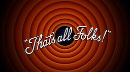

**Academic Methodologies**
  
Prof. Dr. Lena Gieseke \| l.gieseke@filmuniversitaet.de \| Film University Babelsberg KONRAD WOLF

# Session 09 - The Paper

## All information about the paper is given in detail in [Chapter 01 - ACS FUB 2023](../../02_scripts/am_ss23_01_conference_script.md).

## Wrapping Up

* How would you rate the difficulty of this lecture from 1 (far too easy) to 5 (far too difficult)?
* How would you rate the amount of work you had to put into this lecture so far from 1 (no work at all) to 5 (far too much work)?
* Which one was your favorite chapter, which one your least favorite?
* Do you feel well prepared to write your short paper? If not, what was missing?
* Please feel free to add any feedback you want to give!

---

**Happy Papering!**
