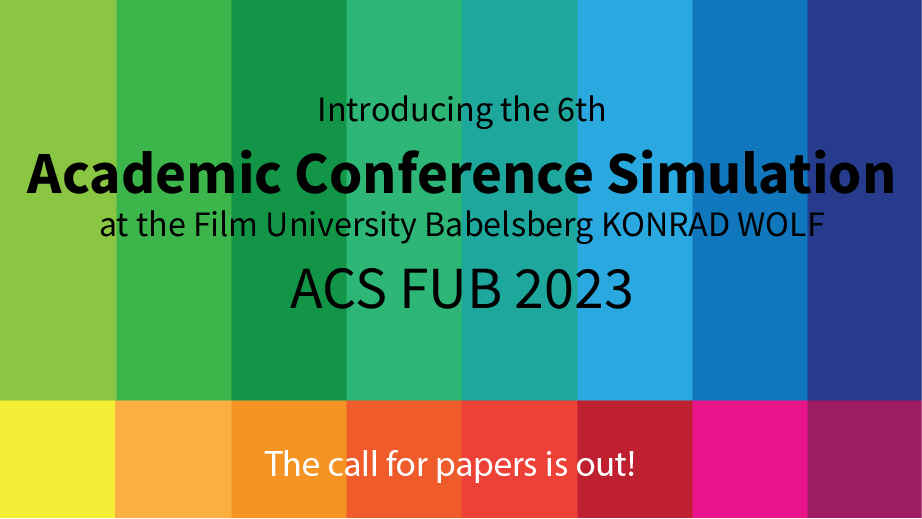

# Academic Methodologies

Prof. Dr. Lena Gieseke \| l.gieseke@filmuniversitaet.de \| Film University Babelsberg KONRAD WOLF

## Chapter 01: ACS FUB 2023

* [Academic Methodologies](#academic-methodologies)
    * [Chapter 01: ACS FUB 2023](#chapter-01-acs-fub-2023)
    * [Introduction](#introduction)
    * [The Paper](#the-paper)
        * [Topic](#topic)
        * [Format](#format)
        * [Submission](#submission)
    * [Reviews](#reviews)
    * [Presentations](#presentations)
        * [Presentation Schedule](#presentation-schedule)
    * [Deadlines](#deadlines)

## Introduction

As a practical exercise for scientific research processes, there will be a conference simulation at the end of this course. This simulation replicates a typical process of submitting a research paper to a conference (or a journal) and presenting your work. Through this conference simulation you apply the lecture topics directly. The simulation includes:

* The submission of a (short-) paper
* Writing and receiving reviews
* The presentation of your work in front of your peers
* A best paper award

## The Paper

The paper must adhere to an academic format (e.g. introduction, contributions, related work, problem statement, solution, future work) and it should make an academic contribution as much as possible. You should aim for a paper that we might later on submit to a real academic venue.

### Topic

You can write about any topic of your choice within the field of Creative Technologies. Research questions can for example relate to your 1st term project or Bachelor thesis. The research itself does not need to be a new task. I highly recommend to try to come up with a topic in the context of your 1st term project as you have already put in a lot of thought and effort into it and it might have a greater chance of publication with an accompanying practical implementation. There are plenty of more practical and / or artistic oriented venues.

### Format

The paper must follow the format guidelines otherwise it is not accepted.

* 4-6 pages (without references)
* In English
* Abstract of <= 1000 characters
* Written with the given LaTeX Template
* Adhere to an academic format (e.g. introduction, contributions, related work, problem statement, solution, future work)

### Submission

*The links in the following guidelines will be added at a later time.*

* You only submit a pdf version of your paper.
* Submissions will be made electronically through the [EasyChair submission system](). As of now, the submission system is still closed. I will let you know as soon as it is open.
* Submissions are anonymous. DO NOT INCLUDE YOUR NAME IN THE SUBMITTED PAPER PDF.
* Submissions are only accepted as pdf from the given [LaTeX template]().
    * The template is a stripped down version of the original conference template of the [Eurographics]() conference, with this [original submission template](). This specific template is fairly complex but it will be a good (and realistic) exercise for you to work with this template.
    * **If you have no experience with working with LaTeX make sure to plan in enough time to get accustomed to the system.**
    * If you know LaTeX feel free to add packages and commands to the template. However make sure that you always adhere to the predefined layout. If in doubt, the layout is explicitly listed in [Eurographics Author’s guidelines]().
    * Here can find an Eurographics [exemplary short paper](https://www.dfki.de/fileadmin/user_upload/import/10356_009-012.pdf) (randomly chosen for demonstrating the layout).

## Reviews

* Reviews evaluate the content but also form and language of your paper
* There will be a review template
* You will receive at least two reviews for your paper
* You will write two reviews for other papers
* Reviews will be made electronically through the EasyChair system. You will be notified by email once the review forms are available to you and you can start the review.
* You are required to use the review template given in the EasyChair system.
    * You will give grades from 0 to 9 and written comments.
    * Categories
        * Originality, Novelty
        * Clarity of presentation
        * Technical and/or methodological soundness
        * Importance, utility
        * Could this approach be re-implemented by a graduate student?
        * Completeness of References
        * Best Paper Award
        * Not all categories are easily applicable to all papers, but try to make use of these categories as best as possible.

The reviews might give revisions and these must be considered in the final camera-ready version. Only the camera-ready version of your paper includes your name.

## Presentations

* Your presentation must be 20 minutes.
* After each presentation there will be about 10 minutes for questions from the audience.

### Presentation Schedule

| Time          | Presenter                | Topic                                                                                                                                                        |
|---------------|--------------------------|--------------------------------------------------------------------------------------------------------------------------------------------------------------|
| |         |                                                         |

## Deadlines

Deadlines still might change.

All deadlines (all dates 20:00 GMT) are hard. Late submissions are not accepted.

* 29.08.23: Abstract Due
* 05.09.23: Paper Due
* 08.09.23: Review Start
* 28.09.23: Review Due
* 30.09.23: Author Notification
* 24.10.23: Camera-ready Paper Due  
* 24., 28.10.23: Conference
  

