# Academic Methodologies

Prof. Dr. Lena Gieseke \| l.gieseke@filmuniversitaet.de \| Film University Babelsberg KONRAD WOLF

## Chapter 02: Research

* [Academic Methodologies](#academic-methodologies)
    * [Chapter 02: Research](#chapter-02-research)
    * [Learning Objectives](#learning-objectives)
    * [Research](#research)
        * [Scientific Consensus](#scientific-consensus)
        * [Goals](#goals)
            * [Novelty](#novelty)
            * [Relevance](#relevance)
            * [Positive Examples](#positive-examples)
            * [Negative Examples](#negative-examples)
    * [Terminology](#terminology)
        * [Research](#research-1)
        * [Science](#science)
        * [Wissenschaft](#wissenschaft)
    * [Types and Disciplines](#types-and-disciplines)
        * [Fundamental Research](#fundamental-research)
        * [Applied Research](#applied-research)
        * [Pure vs. Applied](#pure-vs-applied)
        * [Real vs. Imaginary](#real-vs-imaginary)
        * [Summary](#summary)
    * [Problem Solving](#problem-solving)
    * [Research Methodologies and Methods](#research-methodologies-and-methods)
        * [Methodologies](#methodologies)
        * [Methods](#methods)
        * [Methodology vs. Method](#methodology-vs-method)
    * [References](#references)
    * [Next Session](#next-session)

---

The overall goal of this lecture is to help you to conduct your own research projects. Please keep in mind that we will start small with your projects and papers. In the following, I will explain ideas about research in general. This doesn't mean that your projects must fullfil all these considerations perfectly - after all you are still learning. Also, the research community itself works within a spectrum of "super serious ground breaking research" up to "just for fun" or "somewhat shady".

But before we get into specific methods and tasks, such as statistics or writing, let's start at the very beginning and build a general understanding of what research is and how to think about it (ok, I hear you yawning here but these are necessary fundamentals)(furthermore I promise that you will gain in this chapter some wisdom applicable *to your whole life*! - I'll let you know when we are there). 

After all, research is, among other things, about taking a closer look into something and having a deeper understanding of things. So let's do some research about research 😎

If the following is nothing new to you then even better, skim through chapter and mentally prepare to do some research!

## Learning Objectives

* Understand some underlying principles of research
* Understand common terminology
* Differentiate research types
* Understand the difference and necessity of research methodologies and methods

## Research

So...

*What is research?*

To answer this comprehensively and in general terms is difficult. The specifics highly depend on the research disciplines and differ greatly.  

The difficulty to come up with precise definitions for research and science might also be one of the reasons why it is easy for certain people to disregard science. When someone is asked to listen to "science," the answer is often: science doesn't exist. Robert Habeck also said at the Green Party's digital conference in 2021: "Science doesn't exist any more than politics does."

Well, yes, in a way... What is much easier to tackle are an understanding of scientific consensus (I am not entirely sure if this is a good English term - the German is "wissenschaftlicher Konsens") and to think about the *goal* of conducting research.

[[3]](https://www.zdf.de/show/mai-think-x-die-show/maithink-x-folge-01-100.html)

### Scientific Consensus

Regarding scientific consensus, the most important insight is that is does not mean that all researchers are of one opinion. The scientific consensus is the position held at a given time by the majority of scientists in a given field. It means that research has been conducted in a way that researchers agree upon it being worthwhile to consider. We will come back to this.

Let's first think about research more generally.

> Which goals does research have?

### Goals

The two main goals of a research project, no matter in which discipline, are *novelty* and *relevance*. Overall researchers aim to make novel contributions to the knowledge of the world.

#### Novelty

Research, in the most general sense, aims to come up with something new, something that has not existed before, be it a theory, an algorithm, an engine, an refinement of something existing, or a proof.

#### Relevance

Even though the aspect of relevance might not be the most obvious one to the public, as academia is for example often referred to as 'ivory tower', *relevance* is one of the defining qualities of research. Here, relevance does not mean how applicable or practical results are. It means that research needs to be connected to some underlying truth, to existing knowledge and to previous research and that it should have as much meaningful impact as possible. Of course, what meaningful is, again depends on the discipline, to which it must be connected. But to give you a counter-example: you can come up with the most beautiful explanation for flying pigs - but no one will care as this theory is of no relevance to the world. Previous research has shown (e.g. based on the anatomy of pigs and continuos observations) that pigs can not fly. 

[[tes]](https://www.tes.com/lessons/t7r8HisPgaaW0A/flying-pigs)

With this understanding, we are already touching on a complicated matter in research though. What if someone comes up with something novel and truthful for which the existing knowledge is simply wrong or which no one cares about as of now but might later on? Well, these cases are exceptions, but they do happen. Just think as an example of the Italian astronomer, physicist and engineer Galileo who ended up under house arrest for the rest of his life for supporting the astronomical model that the earth and planets revolve around the sun (this model is called [Heliocentrism](https://en.wikipedia.org/wiki/Heliocentrism)). With the knowledge of today, we believe the heliocentric model to be true. Galileo was ahead of his time.

This said, please don't consider yourself to be a Galileo as of now. Follow the research standards of adhering to the current knowledge of the world and always aim to connect your work to existing research results.

#### Positive Examples

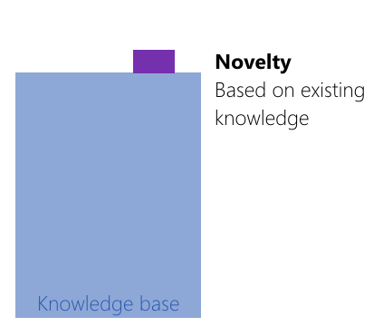

> If I have seen further, it is by standing on the shoulders of giants.” 

[Isaac Newton; Wikipedia: translated into Modern English]

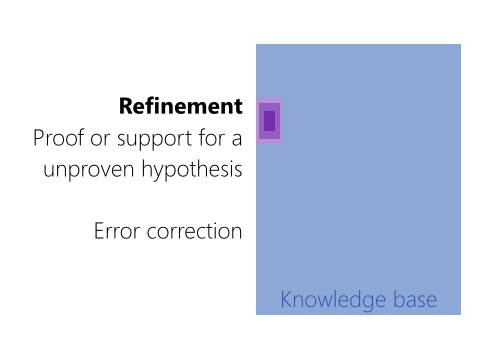

Refinement Example Newton and Einstein:

Isaac Newton developed a number of laws of motion and mechanics that we still use today. For many years the laws of Newton were considered to be absolute fact. Many years later, Albert Einstein noticed that in certain situations Newton's laws were incorrect. Especially in cases where the object under consideration is moving nearing the speed of light. Einstein helped to create a new theory, the theory of relativity, that corrected those errors. Even though Einstein was a brilliant scientist, modern physicists are developing new theories because there are some errors in Einstein's theories. This shows that each new generation of physicists helps to reduce the errors of the previous generations.

In terms of refinement, a lot of research goes into *proofing* what is *believed* to be true in order to turn believe into knowledge:

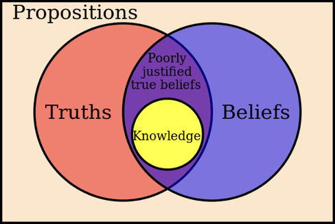[[Wiki]](https://en.wikipedia.org/wiki/Epistemology)

#### Negative Examples

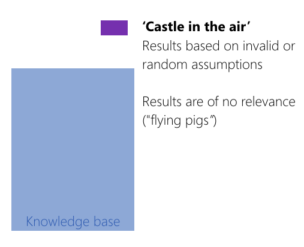
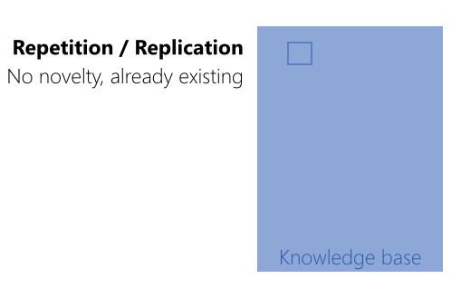

<!-- 
### Level of Contribution

[[S. Demeyer: Research Methods in Computer Science]](http://win.ua.ac.be/~sdemey/Tutorial_ResearchMethods)
 -->

Ok, now we know the goal of research is to come up with something *novel* and *relevant*. 

What else? Maybe a look into a dictionary might help (I really do this in real life all the time: if I try to understand something more deeply, I look up its given definitions - and there is usually more than one; this helps to get a broader context of something)

## Terminology

### Research

Apple Dictionary:

> the systematic investigation into and study of materials and sources in order to establish facts and reach new conclusions

With this definition, we already learn a lot about research. The key points are

* *systematic investigation*
* *establish facts*
* *reach new conclusions*

Sometimes it also helps to broaden the context a little to look for a more intutive understanding.

Faust, or better Goethe said:

> Dass ich erkenne, was die Welt im Innersten zusammenhält,…

> That I may understand whatever binds the world’s innermost core together,…

So, we seem to aim for some *deeper* understanding about the *world*. Please note that a Faust quotation would not count as scientific reference. But wait - what do I mean with *scientific* here? Well, let's have a look into a dictionary...

### Science

Apple Dictionary:

> The intellectual and practical activity encompassing the systematic study of the structure and behavior of the physical and natural world through observation and experiment.

With the key points being

* *systematic study* 
* *through observation and experiment*

For understanding science better, I also really like the German definition in the Duden.

### Wissenschaft

> (ein begründetes, geordnetes, für gesichert erachtetes) Wissen hervorbringende forschende Tätigkeit in einem bestimmten Bereich

With the key points being

* *begründet*
* *geordnet*
* *für gesichert erachtet*

But how do we come up with something like this? How to be *begründet*, *geordnet*, and für *gesichert erachtet*?

Well, if you *really* want to know this, become a philosopher and make the [philosophy of science](https://en.wikipedia.org/wiki/Philosophy_of_science) your topic. The philosophy of science is a sub-field of philosophy and is concerned with the foundations, methods, and implications of science. The central questions concern what qualifies as science, the reliability of scientific theories, and the ultimate purpose of science. 
[[Wikipedia]](https://en.wikipedia.org/wiki/Philosophy_of_science).

As I am not a philosopher, I am going to give you a brief and somewhat superficial overview of different approaches to academic reasoning next week (yes, my researcher heart hurts by just writing *superficial*... )(but one of the really hard practical aspects of research is to actually get results out into the world, meaning getting *relevant* stuff done; so learning when it is ok to be superficial is a crucial skill, with which most researchers have a huge problem as they get lost in details)(knowing when it is ok to be superficial is btw. also an important skill for life - but this is not the inspiring insight I was telling you about in the beginning - stay tuned for that)(ok, where was I...?)...

Anyhow, as I have already mentioned, what we understand as research highly depends on the specific types and disciplines. Nonetheless, there are tendencies within academia to categorize different approaches. Aspects for differentiation are for example how fundamental vs. applied research is, or controlled and measurable vs. interpretative, etc.

## Types and Disciplines

Especially in Germany, we differentiate between *fundamental* and *applied* research. This is reflected by two types of research institutions, namely *universities* and *universities of applied sciences*.  

Almost nowhere else in the world this differentiation on a constitutional level exists. Of course the categorization into fundamental and applied research holds up everywhere, as it make sense and describes different approaches correctly. But other countries, quite sensibly, see no need to put those different research types into separate institutions...

### Fundamental Research

Fundamental research is also called *basic* research.

It investigates basic principles and reasons for occurrence of a particular event or pro­cess or phenomenon. Fundamental research seeks generalization. It has no desire to lead to immediate use or application but aims for originality, fundamental novelty, and overall truth. 

Fundamental research is

* Systematic
* Offers deep insight into a problem
* Facilitates logical explanations and conclusions
* Builds new frontiers of knowledge
* Offers broad base of applications
* Forms the basis for applied research

### Applied Research

Applied research explores a *utility* and em­ploys well known and accepted theories and principles. Its outcome usually has an immediate application. It often studies individual or specific cases without the objective to generalize.

Applied research

* Finds a solution for a practical problem
* Applies a theory in praxis
* Studies complex cases
* Can be interdisciplinary
* Improves and iterates

### Pure vs. Applied

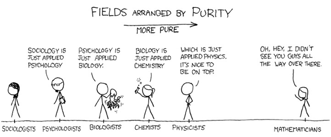[xkcd](http://xkcd.com/435/)

Mathematics is considered a pure (also *fundamental*, see above) science. It leaves no room for interpretation. It is based on axioms and proofs.

* Axiom
    * A statement (an assumption) that is taken to be true, to serve as a premise or starting point for further reasoning
* Proof
    * Logical reasoning from (true) assumptions

Example Proof

* Consider two even integers `x` and `y`
* Since they are even, they can be written as `x = 2a` and `y = 2b`, respectively, for integers `a` and `b`
* Then the sum is `x + y = 2a + 2b = 2(a+b)`
* Therefore `x+y` has `2` as a factor and, by definition, is even.
* Hence the sum of any two even integers is even.

Hard to argue with that, right?

Of course the internet had a field trip with the original xkcd comic above and here some variations of it:

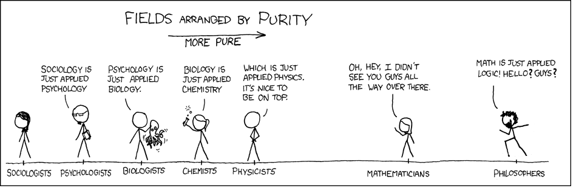 [[philosophyhumor]](https://philosophyhumor.tumblr.com/post/96367693332/fields-arranged-by-purity)

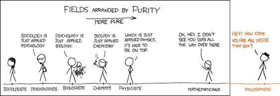 [[xkcd]](http://events.ccc.de/congress/2010/Fahrplan/events/4098.en.html)

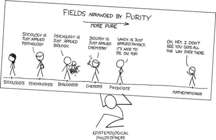[[me.me]](https://me.me/i/fields-arranged-by-purity-more-pure-oh-hey-i-didnt-1227465)

(Epistemology is a branch of philosophy which is concerned with the theory of knowledge)

### Real vs. Imaginary

Examples of “real-life” research are user studies and case studies, which "look at the actual world" and systematically investigate a phenomenon within its real-life context.

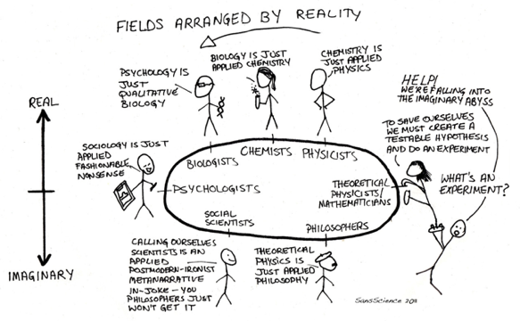[[scienceisbeauty]](https://scienceisbeauty.tumblr.com/)

### Summary

Thinking about the type and discipline of a research problem at hand might help you to chose a suitable methodology and methods (we will come back to this). Different research types and disciplines have different standards, methods, documentation styles, etc.

Also, different publication venues (journal, conferences, etc.) have different expectations and you need to chose the right one for your work. You might come up with the most beautiful fundamental, groundbreaking theory, but when submitting it to a applied research venue, it will be rejected with the question of "where is the application?" or in short "out of scope". That is why it is important to know about these differentiations.

Also, I encourage you not to judge different types and disciplines! This is unfortunately happening quite a bit in academia, as for example the comics above imply. Certain fields or researchers might judge other work unfavorably even though it is just different. Of course there is also a lot of research, which is simply bad but this must be judged by its respective research community.  

Across disciplines, it is indeed hard to understand why and how other research is conducted. But I personally try to approach it with a sense of curiosity and as opportunity to learn instead of dismissing it as not up to my standards, expectations, etc. For example, coming from a scientific point of view, artistic research principles can feel quite foreign but I have already learned a lot from them!

## Problem Solving

In regard to research you might think "well, I am no Einstein" and that you are not qualified to do research. Then, I will reply:

Research, as most problem solving tasks, is a skill and it can be learned! It is not an innate ability. The best researchers are not the smartes ones (whatever that means anyways...) but the most curious, motivated, creative and stress resistant ones.

> The true sign of intelligence is not knowledge but imagination. - [Einstein]

[[creativecreativity]](https://creativecreativity.com/2007/11/11/einstein-on-cre/)

Hence, research is foremost about curiosity, attitude and effort.

Furthermore, an important approach to research is to *like* hard problems and the desire to investigate or to solve them.

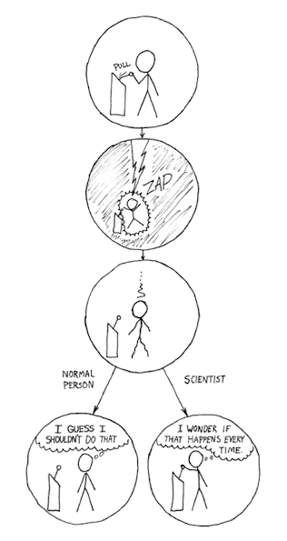

> A pessimist sees the difficulty in every opportunity; an optimist sees the opportunity in every difficulty. - [Churchill]

> No problem can withstand the assault of sustained thinking. - [Voltaire]

<!-- For doing research then, you need to learn

* how to set a context and how to operate overall
* how to apply the right techniques to solve problems, and
* how to reflect your processes

http://courses.cs.vt.edu/cs2104/Summer12/Notes/T01_Introduction.pdf -->

I just now mentioned the aspect of *hard* problems.  

*What makes a problem a hard problem?*

You can categorize problems as

* Easy problems: you can just *see the answer*
* Medium problems: you can see the answer once you *engage*
* Hard problems: you need *strategies* for coming up with a potential solution, sometimes even for just getting started

Hence, to do research, we need strategies.

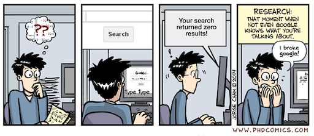  
[[phdcomics]](https://phdcomics.com/comics/archive.php?comicid=1727)

*What do you think are the differences between methods and methodologies?*

## Research Methodologies and Methods

### Methodologies

Overall, research methodologies refer to the science of studying how research is to be carried out. It is a study of methods and their combination by which knowledge is gained.

For us, a research methodology represent the *overall plan* for a research task. A research methodology not only includes a choice of methods, but also their description and discussion, e.g. of their implications. The research methodology decides which method or formula or algorithm to use out of the various existing methods or formulas or algorithms and it also establishes why these choices are the best possible approach for the research task at hand.

### Methods

Research methods help you to find a solution to your research questions. They are the specific tasks you undertake within your project, such as

* Theoretical procedures
* Formulas
* Algorithms
* Studies
* Numerical schemes
* Statistical approaches

Usually, these methods help you to collect samples and data, which are relevant to your research. They can also support analysis, explanations and discussion.

All applied methods must be carefully planned, adhere to academic standards and be value-neutral. Being value-neutral means that methods should not favor any outcome and be as open-ended as possible.

### Methodology vs. Method

<!-- > Any fool can know. The point is to understand.

[Einstein] -->

We are aiming for a deeper understanding in academia and need to not only execute research but also explain it. This is usually done in the *motivation*, *discussion* and *evaluation* sections of a publication. You will need to answer questions, such as:

* Why is a particular research study undertaken?
* How did you formulate the research problem?
* How are you solving the problem and why is that a suitable approach?
* What types of data did you collected, why?
* What particular methods have been used, why?
* How do you validate your methods?
* How do you validate your insights and results?

Consideration of these aspects constitute a research methodology. Ideally, you are able to answer these questions before you start your actual research work.

For example, not only know how to calculate the mean, variance and distribution of a data set but also know why these functions give meaningful results for the chosen problem. Is e.g. the mean at all representative for the data set?

Now comes the universally applicable wisdom - from one of my yoga classes 😊. It might be a bit too esoteric for your taste but still, give the story a chance and think about it!

> Es war einmal ein Holzfäller, der bei einer Holzgesellschaft um Arbeit vorsprach. Das Gehalt war in Ordnung, die Arbeitsbedingungen verlockend, also wollte der Holzfäller einen guten Eindruck hinterlassen. Am ersten Tag meldete er sich beim Vorarbeiter, der ihm eine Axt gab und ihm einen bestimmten Bereich im Wald zuwies. Begeistert machte sich der Holzfäller an die Arbeit. An einem einzigen Tag fällte er achtzehn Bäume. »Herzlichen Glückwunsch«, sagte der Vorarbeiter. »Weiter so.« Angestachelt von den Worten des Vorarbeiters, beschloss der Holzfäller, am nächsten Tag das Ergebnis seiner Arbeit noch zu übertreffen. Also legte er sich in dieser Nacht früh ins Bett. Am nächsten Morgen stand er vor allen anderen auf und ging in den Wald. Trotz aller Anstrengung gelang es ihm aber nicht, mehr als fünfzehn Bäume zu fällen. »Ich muss müde sein«, dachte er. Und beschloss, an diesem Tag gleich nach Sonnenuntergang schlafen zu gehen. Im Morgengrauen erwachte er mit dem festen Entschluss, heute seine Marke von achtzehn Bäumen zu übertreffen. Er schaffte noch nicht einmal die Hälfte. Am nächsten Tag waren es nur sieben Bäume, und am übernächsten fünf, seinen letzten Tag verbrachte er fast vollständig damit, einen zweiten Baum zu fällen. In Sorge darüber, was wohl der Vorarbeiter dazu sagen würde, trat der Holzfäller vor ihn hin, erzählte, was passiert war, und schwor Stein und Bein, dass er geschuftet hatte bis zum Umfallen. Der Vorarbeiter fragte ihn: »Wann hast du denn deine Axt das letzte Mal geschärft?« »Die Axt schärfen? Dazu hatte ich keine Zeit, ich war zu sehr damit beschäftigt, Bäume zu fällen. - [Jorge Bucay]

*What could this story mean in the context of research methodologies and methods?*

## References

* [1] Deininger, M. 2005. Studien-Arbeiten. Zürich, Vdf Hochschulverlag
* [[2] Thesis Hub - All You Need To Know About Research Methodology](https://thesishub.org/all-you-need-to-know-about-research-methodology/#research-methods-and-research-methodology)
* [[3] Dr. Mai Thi Nguyen-Kim, Thema: Meinungsfreiheit](https://www.zdf.de/show/mai-think-x-die-show/maithink-x-folge-01-100.html)

## Next Session

In the next session we will have a look into different methodologies and approaches to reasoning.

---

The End

🔍 🔮 📝
