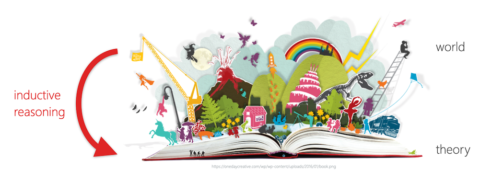
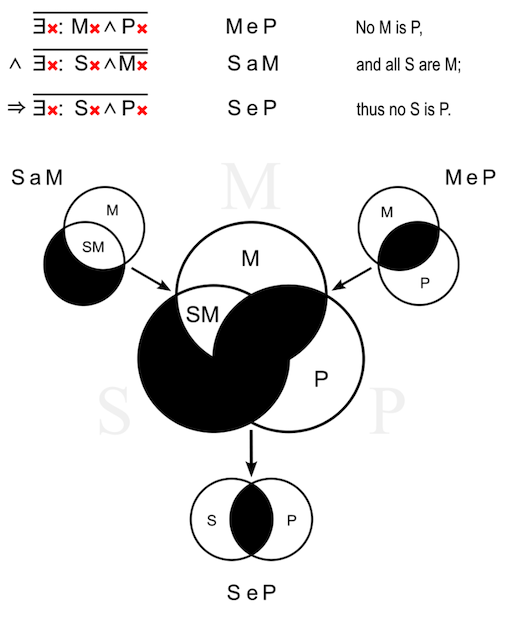
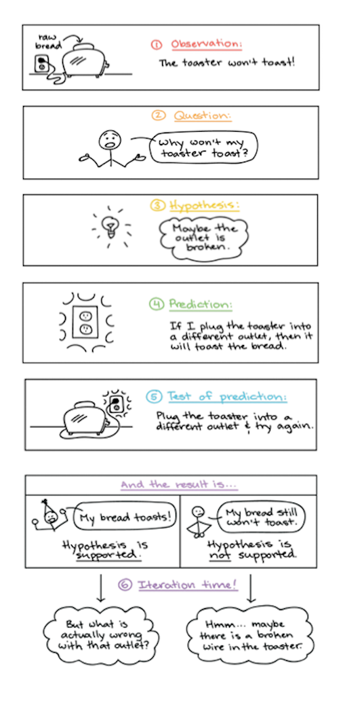

# Academic Methodologies

Prof. Dr. Lena Gieseke \| l.gieseke@filmuniversitaet.de \| Film University Babelsberg KONRAD WOLF

## Chapter 03 - Reasoning

* [Academic Methodologies](#academic-methodologies)
    * [Chapter 03 - Reasoning](#chapter-03---reasoning)
    * [Learning Objectives](#learning-objectives)
    * [Logic](#logic)
    * [Inductive Reasoning](#inductive-reasoning)
        * [Empiricism](#empiricism)
        * [Process](#process)
        * [Critical Rationalism](#critical-rationalism)
        * [Falsification](#falsification)
    * [Deductive Reasoning](#deductive-reasoning)
        * [Rationalism](#rationalism)
        * [Process](#process-1)
        * [Syllogism](#syllogism)
    * [Inductive vs. Deductive Reasoning](#inductive-vs-deductive-reasoning)
        * [Examples](#examples)
    * [Fallacies](#fallacies)
        * [Formal](#formal)
        * [Informal](#informal)
    * [The Scientific Method](#the-scientific-method)
        * [Execution](#execution)
    * [Hermeneutics](#hermeneutics)
    * [Quantitative and Qualitative Methodologies](#quantitative-and-qualitative-methodologies)
        * [Quantitative Research](#quantitative-research)
        * [Qualitative Research](#qualitative-research)
        * [Summary - Quantitative vs. Qualitativ](#summary---quantitative-vs-qualitativ)
    * [Next](#next)
    * [References](#references)

---

> “Contrariwise,” continued Tweedledee, “if it was so, it might be; and if it were so, it would be; but as it isn’t, it ain’t. That’s logic.” — Lewis Carroll, Through the Looking-Glass [[16]](https://fs.blog/2018/05/deductive-inductive-reasoning/)

Last chapter, we learned (*hopefully...*) that research and academic work has something to do with generating novel and impactful insights and that we get them with a *systematic investigation*. In this chapter we are thinking a bit more about how such a systematic investigation could look like. We will think about how knowledge is at all possible, which is the defining question of *[epistemology](https://en.wikipedia.org/wiki/Epistemology)*, the branch of philosophy concerned with the theory of knowledge.

*How can anybody know anything about anything?* 

Of course, this is a problem of vast scope. But we can explore some main ideas about knowledge generation. With that we are gaining a better understanding about how to do research and how to connect theories and assumptions about reality with reality (here an understanding of what reality is exactly would also be discussable, but we are not going down that rabbit hole...). Even if you don't care about academia at all, understanding reasoning and knowing what makes an argument sound is valuable for any type of decisions making and understanding of the world. For example, logic is an incredibly important skill, and because we use it so often in everyday life, we benefit by clarifying the methods we use to draw conclusions. It also helps us to spot people who are deliberately misleading us through unsound argumentation.  [[16]](https://fs.blog/2018/05/deductive-inductive-reasoning/)

*The sleep of reason produces monsters:*

  
[Francisco Goya - *The sleep of reason produces monsters*, 1799.](https://en.wikipedia.org/wiki/File:Francisco_Jos%C3%A9_de_Goya_y_Lucientes_-_The_sleep_of_reason_produces_monsters_(No._43),_from_Los_Caprichos_-_Google_Art_Project.jpg)    

*On a side note*: The following is a really shortened and with that selective presentation of the topic of reasoning. The selection is based on what I think it most valuable to you and the overall goal of writing papers at some point.

*On a side note*: Unfortunately, I do not have enough knowledge about the topic for being able to include any female thought leaders into the discussion. Over centuries the research community not only has been ignorant regarding female representatives in their mids but quite frankly the research community has been plain hostile towards female researchers. And this is not only a problem for the history books, but it is something that is still very much a problem.

For example, in 2012, James Watson, who discovered the double helix structure of DNA along with Francis Crick, Maurice Wilkins, [and Rosalind Franklin (a woman!)](https://www.sciencehistory.org/historical-profile/james-watson-francis-crick-maurice-wilkins-and-rosalind-franklin), said of women in science:
> I think having all these women around makes it more fun for the men but they’re probably less effective.
 
Charming... Watson has also a long history of serious racism.
[[33]](https://www.vox.com/platform/amp/2019/1/15/18182530/james-watson-racist)[[36]](https://www.zdf.de/show/mai-think-x-die-show/maithink-x-folge-11-100.html)

Tim Hunt, a biochemist who was a joint recipient of the 2001 Nobel Prize for physiology or medicine, is under fire for saying women shouldn't work in laboratories because their presence leads to romantic entanglements and thus harms science. Hunt said:

> You fall in love with them, they fall in love with you and when you criticize them, they cry.

He has apologized for his statements by now. You be the judge of that. Some responses on Twitter are:

[[34]](https://www.cbc.ca/news/world/tim-hunt-nobel-prize-winner-apologizes-for-comments-about-women-in-labs-1.3107375)

So, one important take home message (and one of the favorite sayings of Papa Gieseke 😊) can be summarized as follows:

> Intelligenz schützt nicht vor Dummheit.

Meaning
> Intelligence does not protect against stupidity.

―[Ernst Alexander Rauter](https://www.wikiwand.com/en/Ernst_Alexander_Rauter) [[35]](https://gutezitate.com/zitat/106229)

## Learning Objectives

* Understand common terminology within the context of knowledge generation.
* Understand the main movements of research philosophies and how they build the fundaments of modern research methodologies.
* Understand the difference between inductive and deductive reasoning.
* Be able to apply inductive and deductive reasoning.
* Be able to formulate a falsifiable hypothesis.
* Understand the difference between quantitative and qualitative research methodologies.
* Be able to formulate research questions for quantitative and qualitative research.

## Logic

Reasoning can be done well and it can be done badly; it can be done correctly or incorrectly. Logic is the discipline that aims to distinguish good reasoning from bad. In its most basic sense, logic is the study of how ideas reasonably fit together. 

When you apply logic, you must be concerned with analyzing ideas and arguments by using reason and rational thinking, not emotions or mysticism or belief. All academic disciplines employ logic: to evaluate evidence, to analyze arguments, to explain ideas, and to connect evidence to arguments. 

Good reasoning is not necessarily effective reasoning. These days, we live in times where an *attention economy* is manifested in the fact that "Attention is a resource—a person has only so much of it." [[32]](https://archive.org/details/worldbeyondyourh00craw/page/11) Hence, we don't necessary listen to good (with *good* as the most logical) reasoning but to attention grabbing reasoning. Also, good reasoning is not always the most pervasive reasoning. We will also have a look into logical fallacies in this script. 

Bad reasoning might be pervasive and often extremely effective—in the sense that people are often persuaded by it. In logic, the standard of goodness is not effectiveness in the sense of persuasiveness, but rather correctness according to logical rules.

There are a variety of different types of reasoning and methods and there are various diverging views on what constitutes correct reasoning. Hence, there are many approaches to the logical enterprise. 

The common core of logic is that there is a set of rules and techniques for distinguishing good reasoning from bad. A logic must formulate precise standards for evaluating reasoning and develop methods for applying those standards to particular instances.

In the following, we will have a brief look into different standards that follow the core principle of applying logic.

[[37]](https://viva.pressbooks.pub/letsgetwriting/chapter/what-is-logic/) [[38]](https://press.rebus.community/intro-to-phil-logic/chapter/chapter-1/)

## Inductive Reasoning

One could intuitively say, that all our knowledge is based on our experiences in the world. Hence, in order to come up with truth and knowledge, we need to have a closer look into our experiences in the world. That is what the *[Empiricism](https://en.wikipedia.org/wiki/Empiricism)* philosophy of science assumes.

### Empiricism

Empiricism considers knowledge to come only or primarily from (sensory) experience. Historically, empiricism relates to the concept of [tabula rasa](https://en.wikipedia.org/wiki/Tabula_rasa) (*blank slate*), according to which the human mind is *blank* at birth and develops its thoughts only through experience. This theory denies that humans have innate ideas and this image dates back to Aristotle.

In the context of research methodologies, empiricism implies that the cumulation of specific observations allow for the detection of patterns and common characteristics, which then allow the formulation of new theories and generalizations.

Empiricism emphasizes *evidence*, especially as discovered in *experiments*. 

<!-- It is a fundamental part of the *scientific method* that all hypotheses and *theories must be tested against observations* of the natural world rather than resting solely on a priori reasoning, intuition and thought. -->

[[14]](https://en.wikipedia.org/wiki/Empiricism)

### Process

This approach uses reasoning, which is called *inductive reasoning*. Inductive reasoning is a logical method. It is used to formulate general statements or laws based on a number of observations of recurring patterns. It derives novel theories from the world.

Specifically, an inductive argument is an argument whose conclusion is supposed to follow from its premises with a high level of probability, which means that although it is possible that the conclusion doesn’t follow from its premises, it is unlikely that this is the case. [[37]](https://viva.pressbooks.pub/letsgetwriting/chapter/what-is-logic/)

There are also different subtypes of inductive reasoning but for us it is enough to grasp the general concept.

A classic example of inductive reasoning comes from the empiricist [David Hume](https://en.wikipedia.org/wiki/David_Hume):

> Premise: *The sun has risen in the east every morning up until now.*  
> Conclusion: *The sun will also rise in the east tomorrow.*

Hence, you can describe the process of inductive reasoning as

* a collection of related samples (premises),
* theory (or category, concept etc.) formation (induction), and
* transfer of theory to the whole population (conclusion).

The truth of the conclusion of an inductive argument can only ever be *probable* - based upon the evidence given. Hence, an inductive reasoning and its conclusion is either strong or weak, not right or wrong. If an inductive argument is strong, the truth of the premise would mean the conclusion is likely. If an inductive argument is weak, the logic connecting the premise and conclusion is incorrect.

> A very great deal more truth can become known than can be proven. — Richard Feynman

Question: *What is the problem with the following reasoning?*

> Premise: *I saw a black dog.*  
> Conclusion: *All dogs are therefore black.*  
  
> Premise: *Harold is a grandfather. Harold is bald.*  
> Conclusion: *All grandfathers are bald.*

Even if all of the premises are true in a statement, inductive reasoning allows for the conclusion to be false. The above conclusions do not follow logically from the statements as they are referring to *too few samples* and observations from which you could generate a pattern. Inductive reasoning must be based on *repetitive behavior* and *patterns*. 

> Premise Sample 1: *My friend borrowed 100€ last June but he did not pay me back until September as he had promised.*  
> Premise Sample 2: *Then he assured me that he will pay back until Christmas but he didn’t.*  
> Premise Sample 3: *He also failed in to keep his promise to pay back in March.*  
> Conclusion: *I reckon I have to face the facts. My friend is probably not going to pay me back.*

[[15]](http://research-methodology.net/research-methodology/research-approach/#_ftn2)

Or compare

> Premise 1: Susie has walked by Mack the dog every day for ten days.
> Premise 2: Mack the dog has never bitten Susie.
> Conclusion: Thus, when Susie walks by Mack the dog today, he will not bite her.

with

> Premise 1: Susie has walked by Mack the dog every day for five years.
> Premise 2: Mack the dog has never bitten Susie.
> Conclusion: Thus, when Susie walks by Mack the dog today, he will not bite her.

This argument, with more data to consider (five years of information instead of just ten days), is much stronger. An argument also gets stronger when reasons are added:

> Premise 1: Susie has walked by Mack the dog every day for five years.
> Premise 2: Mack the dog has never bitten Susie.
> Premise 3: Mack’s owners trained him to be friendly to people.
> Premise 4: Mack the dog’s breed is not known for aggression.
> Conclusion: Thus, when Susie walks by Mack the dog today, he will not bite her.

This argument is even stronger. Not only does it have more data, but it also has additional reasons for Mack’s gentle nature.

[[37]](https://viva.pressbooks.pub/letsgetwriting/chapter/what-is-logic/)

Inductive reasoning is an integral part of *Empiricism*, but can - as a type of reasoning - be applied in any context.

[[16]](https://fs.blog/2018/05/deductive-inductive-reasoning/)

Back to Empiricism and its focus on (sensory) experiences in the world as fundament for the generation of knowledge.

Question: *What could be arguments against the validity of Empiricism?*

Philosophers such as [David Hume](https://en.wikipedia.org/wiki/David_Hume) argued that truly undirected observations are hardly possible. Human experiences and observations are not necessarily equal to facts in nature but are based on the manner of perception. We can only *interpret* our sensory experiences. Also, humans tend to see *causalities* what in truth are only *correlations* (we will come back to this).

Hard question: *From what kind of observations of the world can we derive absolut truths?*  
(answer follows shortly)  

Addressing these counter arguments to (also called *naïve*) Empiricism, *[Critical Rationalism](https://en.wikipedia.org/wiki/Critical_rationalism)* (or *Neo-positivism*) states that there is no absolute truth, only *hypotheses*.

### Critical Rationalism

One of the 20th century's most influential philosophers of science, [Karl Popper](https://en.wikipedia.org/wiki/Karl_Popper) rejected the empiric principle of induction and stated that you can not derive a general theory from a collection of individual samples, which in number are always limited and which is therefore logically inadmissible. Popper concludes that a theory in the empirical sciences can never be fully proven, but it can be only be *falsified*.  

As an example imagine that you have developed a software and you want to prove that it is bug-free. You conduct a variety of successful tests. But can you really be sure that the software is bug free? Probably not. The validating tests *indicate* the correctness of your software but they can not prove it. However, as soon as you find another error, it is *proven* that your software is not bug-free!

Hence, the answer to *From what kind of observations of the world can we derive absolut truths?* is that only observations that *falsify* a statement are of absolute truth!

Knowledge is then the collection of non-(yet)-falsified hypotheses. Especially in natural sciences knowledge is tentative and probabilistic, subject to continued revision and falsification.

Popper states that while there is no way to prove that the sun will rise, it is possible to formulate the theory that every day the sun will rise; if it does not rise on some particular day, the theory will be falsified and will have to be replaced by a different one. Until that day, there is no need to reject the assumption that the theory is true.

[[30]](https://en.wikipedia.org/wiki/Karl_Popper)

### Falsification

Falsification thus strives for questioning or better for the falsification of hypotheses instead of proving them. In common language, a statement is falsifiable if some observation might contradict it.

Hence, a hypothesis is a falsifiable assumption, which is valid as long as it is not falsified. Unsuccessful falsification *indicates* a correct assumption, however a falsified hypothesis needs to be replaced by an improved version.

*Come up with a falsifiable hypothesis.*

*What is the falsifiability of the following hypotheses? Why might they not be falsifiable?*

> 1. Cows sleep while standing, as they would die otherwise.

> 2. Smarties fly worse than M&Ms.

> 3. The number of transistors on a chip will continue to double approximately every two years in the future.

Answers:

1. Falsifiable - and as there have been cows sleeping while lying and they didn’t die, hence this hypothesis is already falsified.
2. Not falsifiable, as “fly worse” is not well defined.
3. Currently not falsifiable, only in retrospect.

A weakness of Falsificationism is that some theories cannot be ultimately falsified (e.g. gravity). Here, Popper divides falsifiability into logical and practical falsifiability. Logical falsifiability means that there exists an experiment, which can falsify the theory. Practical falsifiability means that the experiment is realizable in practice, too (e.g. impossible for some experiments in astronomy or astrophysics). [[29]](http://wwwmayr.informatik.tu-muenchen.de/personen/baumgart/download/public/presentation_CR.pdf)

Critical Rationalism is based on *[Rationalism](https://en.wikipedia.org/wiki/Rationalism)* and a philosophy of science and a type of reasoning that was for centuries *contrary* to inductive reasoning and Empiricism.

## Deductive Reasoning

### Rationalism

The philosopher Rene Descartes discovered the now well known proposition '*I think, therefore, I am*' (known as *cogito ergo sum*). Descartes unique idea was to start from axiomatic principles that could not be doubted, and proceed to discover truths and certainty from these axioms. He argued that *the mind and rational thought*, not experience, is the source of all knowledge. [[1]](https://en.wikibooks.org/wiki/The_Scientific_Method/Rene_Descartes%27_Method) 

In an old controversy, rationalism was opposed to empiricism, where the rationalists believed that reality has an intrinsically logical structure. Because of this, the rationalists argued that certain truths exist and that the intellect can directly grasp these truths. That is to say, rationalists asserted that certain rational principles exist in logic, mathematics, ethics, and metaphysics that are so fundamentally true that denying them causes one to fall into contradiction. The rationalists had such a high confidence in reason that empirical proof and physical evidence were regarded as unnecessary to ascertain certain truths – in other words, "there are significant ways in which our concepts and knowledge are gained independently of sense experience". [[2]](https://plato.stanford.edu/entries/rationalism-empiricism/)[[3]](https://en.wikipedia.org/wiki/Rationalism)

Rationalism "regards reason as the chief source and test of knowledge" [[4]](https://www.britannica.com/topic/rationalism) and is defined as a methodology "in which the criterion of the truth is not sensory but intellectual and deductive". [5] [[3]](https://en.wikipedia.org/wiki/Rationalism)

This leads us to the second type of reasoning, *deductive reasoning*. Once again, even though it is a fundamental practice within the the philosophy of science of rationalism, deductive reasoning as a type of reasoning is applicable in any context.

### Process

Deductive reasoning goes from a theory to its verification through observations of the world. It tests the validity of existing assumptions in reality.

Deductive reasoning, also deductive logic, is the process of reasoning from one or more statements (premises) to reach logically certain conclusion. [[6]](https://archive.org/details/cognitivepsychol00ster_347/page/1) [[7]](https://en.wikipedia.org/wiki/Deductive_reasoning)

Specifically, a deductive argument is an argument whose conclusion is supposed to follow from its premises with absolute certainty, thus leaving no possibility that the conclusion doesn’t follow from the premises. If a deductive argument fails to guarantee the truth of the conclusion, then the deductive argument can no longer be called a deductive argument. [[37]](https://viva.pressbooks.pub/letsgetwriting/chapter/what-is-logic/)

In common language, deductive reasoning ("top-down logic") goes from the generalization (a theory) to the specific (observations in the world) in contrasts to inductive reasoning ("bottom-up logic"), which goes from the specific (observations in the world) to the generalization (a theory).  

If something is true of a class of things in general, it is also true for all members of that class:

> Premise: *All ravens are black.*  
> Conclusion: *Therefore, when one encounters George the raven, George will be black.*  

> Premise 1: *All men are mortal.*  
> Premise 2: *Socrates is a man.*  
> Conclusion: *Therefore, Socrates is mortal.*  

*What is the problem with the following reasoning?*

> Premise 1: *All bald men are grandfathers.*  
> Premise 2: *Harold is a bald.*  
> Conclusion: *Therefore, Harold is a grandfather.*  

If the generalization is wrong, meaning the premise, the conclusion may be logical, but it may also be untrue. The argument is logically valid but it is untrue because the original statement (the "axiom") is false.  

In deductive reasoning a conclusion is either true or false and cannot be partly true or partly false. We decide whether a deductive statement is true by assessing the correctness of the premises and the validity of the link between the premises and the conclusion (also see the following section about fallacies). Validity relates to how well the premises support the conclusion. A *valid* argument is an argument whose conclusion cannot possibly be false, assuming that the premises are true. 

"If all men are mortal and Socrates is a man," there is no way Socrates can not be mortal, for example. There are no situations in which the premise is not true, so the conclusion is true. However, "George was President of the United States. Therefore, George was elected President of the United States." is an *invalid* argument because it is possible for the premise to be true and yet the conclusion false. A *counterexample* to the argument is that Gerald Ford was President of the United States, but he was never elected president because Ford replaced Richard Nixon when Nixon resigned in the wake of the Watergate scandal. Therefore, it does not follow that just because someone is President of the United States that he was elected President of the United States. This means that the argument is invalid. 

If an argument is invalid, it will always be possible to construct a counterexample to show that it is invalid. A counterexample is simply a description of a scenario in which the premises of the argument are all true while the conclusion of the argument is false.

[[9]](www.livescience.com/21569-deduction-vs-induction.html) [[16]](https://fs.blog/2018/05/deductive-inductive-reasoning/) [[37]](https://viva.pressbooks.pub/letsgetwriting/chapter/what-is-logic/)

A deductive argument which is not only *valid* but for which also all premises are correct is considered a *sound* argument. That means that the conclusion, or claim, of a sound argument will always be true because if an argument is valid, the premises transmit truth to the conclusion on the assumption of the truth of the premises. 

*On a side note*: With a switch of perspective, you can counter another’s argument by questioning firstly the argument's premises and secondly, the validity of the link between the premises and the conclusion.

You can e.g. question the accuracy of a premise by:

* Is there a sufficient amount of data?
* What is the quality of the data?
* Has additional data been missed?
* Is the data relevant?
* Are there additional possible explanations?
* Are the authors identified?
* What are their backgrounds?
* Was the claim something you found on an undocumented website?
* Did you find it in a popular publication or a scholarly one?
* How complete, how recent, and how relevant are the studies or statistics discussed in the source?

To question the validity of an argument, ask, as already explained above, whether you can imagine a scenario in which the premises are true and yet the conclusion is false. Hence, by finding a counterexample for the described argument.

*Bob is a fireman. Therefore, Bob has put out fires.*

vs. 

*Bob is taller than Susan. Susan is taller than Frankie. Therefore, Bob is taller than Frankie.*

[[37]](https://viva.pressbooks.pub/letsgetwriting/chapter/what-is-logic/)

### Syllogism

[Syllogism](https://en.wikipedia.org/wiki/Syllogism) is a common form of deductive reasoning and was in its earliest form defined by [Aristotle](https://en.wikipedia.org/wiki/Aristotle). We have already applied it above for the reasoning examples, but I am mentioning it here again because I want to highlight how academic reasoning - independently of a specific discipline - follows the principles of *logic*.

In Syllogism, arguments are formally structured and take several parts, typically with two statements, which are assumed to be true (or premises) that lead to a conclusion.  

For example, the premise *Every A is B.* could be followed by another premise, *This C is A.* and those two statements would lead to the conclusion *This C is B.*.

Syllogisms are considered a good way to test deductive reasoning to make sure the argument is valid. [[9]](www.livescience.com/21569-deduction-vs-induction.html)

* Major premise: *A general statement*.
* Minor premise: *A specific statement*.
* Conclusion: *Based on the two premises*.

A syllogism takes the form *M – Middle, S – subject, P – predicate*:

* Major premise: *All M are P*.
* Minor premise: *All S are M*.
* Conclusion: *All S are P*.

All mortals die. All men are mortals. All men die.  

The premises and conclusion of a syllogism can be any of four types, which are labeled by letters as follows.  

 [[10]](https://en.wikipedia.org/wiki/Syllogism)

Aristotle’s use of letters as term place holders, rather than giving concrete examples, was truly innovative at the time. Aristotle mostly uses the letters A, B, and C (the Greek letters alpha, beta, and gamma in the original). The following table shows the longer form of the equivalent expressions in predicate logic (the mathematical form):  

 [[10]](https://en.wikipedia.org/wiki/Syllogism)

[[10]](https://en.wikipedia.org/wiki/Syllogism)

So called *Venn diagrams* are often used visualize and to determine the validity of a categorical syllogism. In the Venn diagrams, the black areas indicate no elements, and the red areas indicate at least one element.

  [[wiki]](https://en.wikipedia.org/wiki/Syllogism#/media/File:Square_of_opposition,_set_diagrams.svg)

Example:

  [[wiki]](https://en.wikipedia.org/wiki/Syllogism#/media/File:Modus_Celarent.svg)

## Inductive vs. Deductive Reasoning

|                | Deduction                                                     | Induction                                                                             |
|----------------|---------------------------------------------------------------|---------------------------------------------------------------------------------------|
| Logic          | When the premises are true, the conclusion must also be true. | Known premises are used to generate probable conclusions.                             |
| Generalization | Generalizing from the general to the specific.                | Generalizing from the specific to the general.                                        |
| Use of Data    | Evaluate hypotheses related to an existing theory.            | Explore a phenomenon, identify themes and patterns and create a conceptual framework. |
| Theory         | Theory falsification or verification.                         | Theory generation and building.                                                       |

[[15]](http://research-methodology.net/research-methodology/research-approach/#_ftn2)

### Examples

Determine for the following sentences whether they are inductive or deductive reasoning (independently wether they are correct or not):

1. *Labradors are friendly. Tom is a Labrador. Therefore, Tom is friendly.*
2. *Every time you eat peanuts, your throat swells up. This is a symptom of people who are allergic to peanuts. So, you are allergic to peanuts.*
3. *If A = B and B = C, then A = C.*
4. *Since all squares are rectangles, and all rectangles have four sides, so all squares have four sides.*
5. *I only ever found clover with three leaves. Hence, clover with four leaves does not exist*.

(1. Deductive, 2. Inductive, 3. Deductive, 4. Deductive, 5. Inductive)

## Fallacies

  [[punchdebtintheface]](https://www.punchdebtintheface.com/great-deduction-debate/)

Fallacies are errors or tricks of reasoning. A fallacy is an error of reasoning if it occurs accidentally; it is a trick of reasoning if a speaker or writer uses it to deceive or manipulate his audience. 

However, using logical fallacies can be incredibly tempting. The unfortunate fact is they work. Furthermore, logical fallacies are easy to use. Instead of doing the often difficult work of carefully supporting an argument with facts, logic, and researched evidence, the lazy debater turns routinely to the easy path of tricky reasoning. Human beings too often favor what is easy and effective, even if morally questionable, over what is ethical, particularly if difficult. 

Just to be clear, using faulty reasoning is unethical and irresponsible! In the following, I am not explaining you how to join the Dark Side. The overall goal is to teach you how to write, speak, and argue effectively and ethically. To do so, you must recognize and avoid the logical fallacies.

[[37]](https://viva.pressbooks.pub/letsgetwriting/chapter/what-is-logic/)

### Formal

The following examples are *formal fallacies* or *syllogistic fallacies* and with that errors of logic. The conclusion does not really “follow from” (is not supported by) the premises. Either the premises are untrue, or the argument is invalid. We hear arguments with the following or similar structures in everyday life all the time:

* Affirming the [Consequent](https://www.wikiwand.com/en/Consequent)
    * If A then B. B is true, so A is true.
    * If B follows A, then you wrongly assume you can go back the other way also.
    * *If you are cheating on me, you will be out of the house a lot. You are out of the house a lot, so you must be cheating on me.*
* Denying the Antecedent
    * If A then B. A is false, so B is false.
    * To disprove something, show how it can be caused by something else. Then show that the cause does not happen and then assume that this proves the antecedent is also false.
    * *If you work hard, you will get a good job. If you do not work hard you will not get a good job.*
    * *If I am Japanese, then I am Asian. I am not Japanese. Therefore, I am not Asian.*
* Four Terms
    * All A is B. All C is D. So all A is D.
    * Make two statements and make an unspoken leap that connects these statements to allow a third, conclusive statement to be made.
    * *Man is an intelligent animal. No woman is a man. Therefore no women are intelligent animals.* Notice that 'man' has two different meanings here. That is usually how the fallacy of four terms occurs most frequently. The trick is to use the same word or phrase but with a different meaning each time, creating a fourth term even though only three distinct words are used.
    * *Nothing is better than eternal happiness. A ham sandwich is better than nothing. A ham sandwich is better than eternal happiness.* 
* Illicit Major
    * All A are B. No C are A. Therefore no C are B.
    * Unspoken but incorrect assumption: All B is A. Hence, the error is in assuming that the converse of the first statement is also true. 
    * *All dogs are mammals. No cats are dogs. Therefore, no cats are mammals.* 
    * However, an argument in the following form differs from the above, and is valid: All A are B. No B are C. Therefore, no C are A.
* Illicit Minor
    * All A are B. All A are C. Therefore, all C are B.
    * Unspoken but incorrect assumption: All C are A.
    * *All New Yorkers are beautiful. All New Yorkers are intelligent. Therefore all intelligent people are beautiful.*
    * *Pie is good. Pie is unhealthy. Thus, all good things are unhealthy..*
* Undistributed Middle
    * All A is B. All C is B. Therefore all C is A.
    * B is assumed to cover all items in its category.
    * *All humans are mammals. Mary is a mammal. Therefore, Mary is a human.*
    * *All ghosts are imaginary. All unicorns are imaginary. Therefore, all ghosts are unicorns.*
    * *All fools act stupid. You acted stupid. Therefore you are a fool.*
    * Note that if the terms (A and B) were swapped around in the first co-premise then it would no longer be a fallacy and would be correct. 

[[11]](http://changingminds.org/disciplines/argument/fallacies/a_syllogistic.htm)
[[12]](http://www.fallacyfiles.org/)
[[13]](https://www.logicallyfallacious.com/)
[[39]](https://www.wikiwand.com/en/Fallacy_of_four_terms)
[[40]](https://www.wikiwand.com/en/Formal_fallacy)
[[37]](https://viva.pressbooks.pub/letsgetwriting/chapter/what-is-logic/)

  [[xkcd]](http://xkcd.com/1570/)

### Informal

*Informal fallacies* take many forms and are widespread in everyday discourse. Very often they involve bringing irrelevant information into an argument, or they are based on assumptions that, when examined, prove to be incorrect. Formal fallacies are created when the relationship between premises and conclusion does not hold up or when premises are unsound; informal fallacies are more dependent on misuse of language and of evidence.

Question: *How Can You Check for Logical Fallacies?*

Well, that is not easy. One way is to check the three fundamental concept of rhetorical appeal, namely *ethos*, *logos*, and *pathos*:

* Ethos is an appeal to ethics, authority, and/or credibility.
* Logos is an appeal to logic.
* Pathos is an appeal to emotion.

In the same way that you learn when studying rhetoric how to use ethos, logos and paths to strengthen your speech appropriately, you can use them inappropriately to manipulate an audience through the use of fallacies. Classifying fallacies as fallacies of ethos, logos, or pathos will help you to understand their nature and to recognize them. Please keep in mind, however, that some fallacies may fit into multiple categories. For more details and examples on rhetorical appeals, see, for example [Elizabeth Browning's Chapter 2, “Rhetorical Analysis.”](https://vwcceng111.pressbooks.com/chapter/chapter-2-rhetorical-analysis/)

Fallacies of ethos relate to credibility. These fallacies may unfairly build up the credibility of the author (or his allies) or unfairly attack the credibility of the author’s opponent (or her allies). Some fallacies give an unfair advantage to the claims of the speaker or writer or an unfair disadvantage to his opponent’s claims. These are fallacies of logos. Fallacies of pathos rely excessively upon emotional appeals, attaching positive associations to the author’s argument and negative ones to his opponent’s position.

[[37]](https://viva.pressbooks.pub/letsgetwriting/chapter/what-is-logic/)

## The Scientific Method

Ok, not back to the topic of using correct reasoning. One of the most famous example that researchers agreed upon to ensure good reasoning is the so-called scientific method.

[The scientific method]((https://en.wikipedia.org/wiki/Scientific_method)) started as an empirical method of acquiring knowledge that has characterized the development of science since at least the 17th century. It involves formulating hypotheses, an experimental and measurement-based testing of the hypotheses and the refinement (or elimination) of the hypotheses based on the experimental findings.  

Though diverse models for the scientific method are available, there is in general a continuous process that includes observations about the natural world. The study of this method, and of its long history, is essentially a study of science itself.

The scientific method requires that the scientist tests a theory based on observed or predicted facts. The scientist must formulate a theory or a hypothesis based on what has been observed, then design a test by which the theory may be verified as valid or not.

In modern applications of the scientific method, only falsifiable hypotheses are accepted.

[[31]](https://en.wikipedia.org/wiki/Scientific_method)

### Execution

1. Make an observation.
2. Ask a question.
3. Form a (falsifiable) hypothesis, or testable explanation.
4. Make a prediction based on the hypothesis.
5. Test the prediction.
6. Interpret data and draw conclusions
7. Iterate: use the results to make new hypotheses or predictions.

This should be an on-going process:

  [[wikimedia]](https://commons.wikimedia.org/wiki/File:The_Scientific_Method_as_an_Ongoing_Process.svg)

Example:

  [[Khan Academy]](https://www.khanacademy.org/science/biology/intro-to-biology/science-of-biology/a/the-science-of-biology)

Question: *What are the benefits of defining a commonly process such as the scientific method?*

The scientific method helps to make scientific work easier to reproduce, to compare and to the predict.  

However, to ensure valid processes, researchers must adhere to certain *research ethics*, which are not formally defined processes but overall rules to follow. These rules include for example that you are not allowed to pick and choose certain data, even if it invalidates the hypothesis. Also, you should stick to your original hypothesis. Here certain researchers even call for a publication of an hypothesis in advance to prevent that researchers might make their hypothesis fit to the generated result in retrospect.

To be honest, I only somewhat agree with the above points. As long as you generate novel and truthful insights, projects should always remain adaptable based on the gained insights. Of course, never damper with data or produce results fraudulently. But as long as you can not publish negative results in academia (we will come back to this), I do encourage you to always make use of your results even if they - at first sight - seem to have failed.

Question: *Does the scientific method apply inductive or deductive reasoning?*

One can argue that the scientific method actually brings inductive and deductive reasoning together. Steps 1-3 and the formulation of a hypothesis require inductive reasoning, while step 4-6 follow deductive reasoning.

> In science there is a constant interplay between inductive inference (based on observations) and deductive inference (based on theory), until we get closer and closer to the 'truth,' which we can only approach but not ascertain with complete certainty.  
> Dr. Sylvia Wassertheil-Smoller, Professor emerita at Albert Einstein College of Medicine  [[9]](www.livescience.com/21569-deduction-vs-induction.html)

## Hermeneutics

One inherently different approach to gaining truthful knowledge, which we haven't mentioned at all yet, is the methodology of *interpretation*, also called [hermeneutics](https://en.wikipedia.org/wiki/Hermeneutics). Hermeneutic research emphasizes *subjective* interpretations in the research of finding the meaning of texts, art, culture, social phenomena and thinking. There is an ongoing philosophical study of *subjectivity* but hermeneutic understands subjectivity as crucial part of reality. Hermeneutics forms an opposite to research strategies, which stress objectivity and independence from interpretations in the formation of knowledge. 

This might feel very foreign to you at first sight.

Question: *On which fundamental aspect of western culture might this approach be based on?*

Well, for a long time all aspects of society were strongly influenced - if not controlled - by *one book*, namely the bible and scripture. But western hermeneutics starts as early as in the writings of Aristotle. There has been a highly developed practice of interpretation in Greek antiquity, aiming at oracles, dreams, myths, philosophical and poetical works, but also laws and contracts. The modern discipline of hermeneutics emerged as a response to the questions raised by the reformation debate about the *authentic meaning* of the biblical text. The reformers challenged the Roman catholic understanding that the text could only be interpreted through the lens of tradition and that its true meaning was not immediately evident to the individual reader. Reformers asserted that truth was accessible to the contemporary reader and that the basis for faith and doctrine could be developed without reference to tradition but purely based on the text itself.  

Due to its long history, it is only natural the discipline of hermeneutics has shifted considerably over time.  

Hermeneutics as the methodology of interpretation can provide us guidance for solving problems of interpretation of human actions, texts and other meaningful material.

[[17]](http://www.jmm.org.au/articles/13615.htm) [18] [[19]](https://plato.stanford.edu/entries/hermeneutics/) [[20]](https://en.wikipedia.org/wiki/History_of_hermeneutics)
[[21]](https://koppa.jyu.fi/avoimet/hum/menetelmapolkuja/en/methodmap/strategies/hermeneutic-research)

## Quantitative and Qualitative Methodologies

Why did we need to know this? Well, now we are finally coming full circle and we can get around to two research paradigms (a paradigm refers to a *pattern of thought, an ideal, a model*), which are crucial for conducting modern research projects. These two paradigms are based on the dominant epistemological and methodological movements of critical rationalism and hermeneutics.

The methodologies of *quantitative* and *qualitative* research will guide you through your selection of methods for your *data collection* and *analysis*.

### Quantitative Research

[Quantitative research](https://en.wikipedia.org/wiki/Quantitative_research) is the systematic empirical investigation of observable phenomena via *statistical*, *mathematical*, or *computational techniques*. [23] The *process of measurement* is central to quantitative research because it provides the fundamental connection between empirical observation and mathematical expression of quantitative relationships.

Quantitative research is widely used in psychology, economics, demography, sociology, marketing, community health, health & human development, gender studies, and political science; and less frequently in anthropology and history. Research in mathematical sciences, such as physics, is also "quantitative" by definition, though this use of the term differs in context. In the social sciences, the term relates to empirical methods originating in both philosophical positivism and the history of statistics, in contrast with qualitative research methods.

Within this research paradigm we assume that there is an objective reality, which can be described and which we approach step by step or measure. Quantitative research is generally closely affiliated with ideas from 'the scientific method'. [[22]](https://en.wikipedia.org/wiki/Quantitative_research)

I noticed that in social sciences the term *quantitative* might be used slightly differently. Within a context with strong focus on qualitative methods, a quantitative approach is sometimes understood as a *standardized* approach, which unifies and generalizes the use of certain methods, e.g. when conducting interviews. In this context it does not necessarily mean that you work with numerical data.

### Qualitative Research

[Qualitative research](https://en.wikipedia.org/wiki/Qualitative_research) is a scientific method of observation to gather *non-numerical data*, [28] while focusing on meaning-making. [26] This type of research answers questions related to *why* or *how* a certain phenomenon may occur, rather than how often it occurs. [27]

Qualitative research approaches are employed across many academic disciplines, focusing particularly on the human elements of the social and natural sciences. [23] 

There are various qualitative research methods. A common feature of these methods is an emphasis on points of view of, expressions, and *language*. Qualitative methods include for example interviews, focus groups, ethnographic research (studying people in their naturally occurring environment), case studies, record keeping, the process of observation, participant observation, etc.

Within this research paradigm we assume that reality is a social construct and that we can find its interpretations and context-dependent rules but not a factual structure of reality.

[[25]](https://en.wikipedia.org/wiki/Qualitative_research)

### Summary - Quantitative vs. Qualitativ

Quantitative data is any data that is in *numerical* form such as statistics, percentages, etc. [23] The researcher analyses the data with the help of statistics and hopes the numbers will yield an unbiased result that can be generalized to some larger population. Qualitative research, on the other hand, inquires in-depth specific experiences, with the intention of describing and exploring meaning through text, narrative, visually, or by developing themes exclusive to that set of participants. [24]

|           | Quantitative Methodology | Qualitative Methodology |
|-----------|--------------------------|-------------------------|
| Reasoning | Deduction                | Induction               |
|           | Objectivity              | Subjectivity            |
|           | Causation                | Meaning                 |
| Question  | Pre-specified            | Open-ended              |
|           | Outcome-oriented         | Process-oriented        |
| Analysis  | Numerical estimation     | Narrative description   |
|           | Statistical inference    | Comparative             |

[[15]](http://research-methodology.net/research-methodology/research-approach/#_ftn2)

However, the above is by no means absolute! Quantitative research and qualitative research form a methodological pair. You can use both strategies to complement each other in one research project or to act as separate analyses of a single research topic. For example, qualitative research produces information only on the particular cases studied, and any more general conclusions are only hypotheses. Quantitative methods can be used to verify which of such hypotheses are true.  

While a quantitative or qualitative methodology mainly implies the usage of certain methods, there are also some methods which are somewhat of a mid-way point.  

Whether or not you decide to use and / or combine qualitative and quantitative methods in your research depends on your research question and your philosophical position (this maybe less important for now).

## Next

Next chapter, we are starting to have a look into actual methods, from both qualitative as well as quantitative research methodologies within the context of human computer interaction.

  
[[Beccaluva et al.]](https://re.public.polimi.it/retrieve/handle/11311/1058769/298476/ROMAN17-Sam%20Teo%20Paro-CAMERA%20READY.pdf)[[Paro, the therapeutic robot]](https://en.wikipedia.org/wiki/Paro_(robot))

## References

Parts of this script are inspired by:  
Schlütz, D. (2018). *Vorlesung Grundlagen der Medienforschung WS 18/19 - S1: Grundlagen und Methodologie*. Filmuniversität Babelsberg KONRAD WOLF.

[[1] Wikibooks - Rene Descartes](https://en.wikibooks.org/wiki/The_Scientific_Method/Rene_Descartes%27_Method)  
[[2] Stanford Encyclopedia of Philosophy - Rationalism vs. Empiricism](https://plato.stanford.edu/entries/rationalism-empiricism/)  
[[3] Wiki - Rationalism](https://en.wikipedia.org/wiki/Rationalism)  
[[4] Britannica - Rationalism](https://www.britannica.com/topic/rationalism)  
[5] Bourke, Vernon J. (1962). Rationalism. p. 263 in Runes.  
[[6] Sternberg, R. J. (2009). Cognitive Psychology. Belmont, CA: Wadsworth. pp. 578. ISBN 978-0-495-50629-4.](https://archive.org/details/cognitivepsychol00ster_347/page/1)  
[[7] Wiki - Deductive Reasoning](https://en.wikipedia.org/wiki/Deductive_reasoning)  
[[8] Wikibooks - Reasoning ](https://en.wikibooks.org/wiki/Logic_for_Computer_Science/Reasoning)
[[9] Live Science - Deductive Reasoning vs. Inductive Reasoning](www.livescience.com/21569-deduction-vs-induction.html)  
[[10] Wiki - Syllogism](https://en.wikipedia.org/wiki/Syllogism)  
[[11] Changing Minds](http://changingminds.org/disciplines/argument/fallacies/a_syllogistic.htm)  
[[12] The Fallacy Files](http://www.fallacyfiles.org/)  
[[13] Logically Fallacious](https://www.logicallyfallacious.com/)  
[[14] Wiki - Empiricism](https://en.wikipedia.org/wiki/Empiricism)  
[[15] Research Methodology](http://research-methodology.net/research-methodology/research-approach/#_ftn2)  
[[16] Farnam Street](https://fs.blog/2018/05/deductive-inductive-reasoning/)  
[[17] John Mark Ministries ](http://www.jmm.org.au/articles/13615.htm)  
[18] Bernhard Lohse (1986). Martin Luther: An Introduction to His Life and Work, trans. Robert C. Schulz, pp.159f.  
[[19] Stanford Encyclopedia of Philosophy - Hermeneutics](https://plato.stanford.edu/entries/hermeneutics/)  
[[20] Wiki - History of Hermeneutics](https://en.wikipedia.org/wiki/History_of_hermeneutics)  
[[21] Koppa - Hermeneutic Research](https://koppa.jyu.fi/avoimet/hum/menetelmapolkuja/en/methodmap/strategies/hermeneutic-research)  
[[22] Wiki - Quantitative Research](https://en.wikipedia.org/wiki/Quantitative_research)  
[23] Given, Lisa M. (2008). The SAGE Encyclopedia of Qualitative Research Methods.  
[24] Corrine, Glesne (2011). Becoming Qualitative Researchers: An Introduction (4th ed.).  
[[25] Wiki - Qualitative Research](https://en.wikipedia.org/wiki/Qualitative_research)  
[[26] Krauss, Steven (2005). Research Paradigms and Meaning Making: A Primer. The Qualitative Report. 10 (4): 758–770.](https://nsuworks.nova.edu/cgi/viewcontent.cgi?article=1831&context=tqr)  
[27] Berg, Bruce Lawrence; Lune, Howard (2012). Qualitative Research Methods for the Social Sciences (8th ed.). p. 3.  
[28] Babbie, Earl (2014). The Basics of Social Research (6th ed.). pp. 303–04  
[[29] Critical Rationalism](http://wwwmayr.informatik.tu-muenchen.de/personen/baumgart/download/public/presentation_CR.pdf)  
[[30] Wiki - Karl Popper](https://en.wikipedia.org/wiki/Karl_Popper)
[[31] Wiki - Scientific Method](https://en.wikipedia.org/wiki/Scientific_method)
[[32] Crawford, Matthew B. (March 31, 2015). "Introduction, Attention as a Cultural Problem". The World Beyond Your Head: On Becoming an Individual in an Age of Distraction. Farrar, Straus and Giroux. p. 11.](https://archive.org/details/worldbeyondyourh00craw/page/11)
[[33] Belluz, J. (15.01.2019). DNA scientist James Watson has a remarkably long history of sexist, racist public comments. Vox.](https://www.vox.com/platform/amp/2019/1/15/18182530/james-watson-racist)
[[34] The Associated Press. (01.06.2015). Tim Hunt, Nobel Prize winner, apologizes for comments about women in labs. CBS.](https://www.cbc.ca/news/world/tim-hunt-nobel-prize-winner-apologizes-for-comments-about-women-in-labs-1.3107375)
[[35] Wie eine Meinung in einem Kopf entsteht. Über das Herstellen von Untertanen. Weismann Verlag, München 1971. ISBN 3-921-04004-3, S. 17](https://gutezitate.com/zitat/106229)
[[36] MaiThink X. (03.04.2022). Die Verstopfung der Wissenschaft - Wer ist Hanna?](https://www.zdf.de/show/mai-think-x-die-show/maithink-x-folge-11-100.html)
[[37] Devries, Kirsten. Chapter 25 - What is Logic?](https://viva.pressbooks.pub/letsgetwriting/chapter/what-is-logic/)
[[38] Knachel, Matthew. Chapter 1 - What is Logic? Rebus Community](https://press.rebus.community/intro-to-phil-logic/chapter/chapter-1/)
[[39] Wiki - Fallacy of four terms](https://www.wikiwand.com/en/Fallacy_of_four_terms)
[[40] Wiki - Formal fallacy](https://www.wikiwand.com/en/Formal_fallacy)

---

The End

🧓🏻 📚 🤯