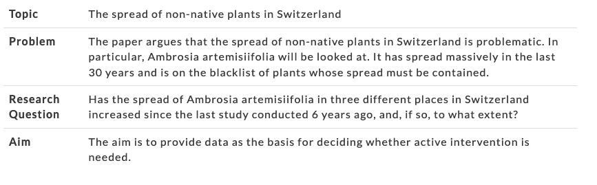

# Academic Methodologies

Prof. Dr. Lena Gieseke \| l.gieseke@filmuniversitaet.de \| Film University Babelsberg KONRAD WOLF

# Chapter 04 - Human-Computer Interaction & Finding a Research Question

* [Academic Methodologies](#academic-methodologies)
* [Chapter 04 - Human-Computer Interaction \& Finding a Research Question](#chapter-04---human-computer-interaction--finding-a-research-question)
    * [Topics](#topics)
    * [Learning Objectives](#learning-objectives)
    * [Computer Science Research](#computer-science-research)
    * [Human-Computer Interaction Research Methodologies](#human-computer-interaction-research-methodologies)
        * [Topics](#topics-1)
        * [Measurements](#measurements)
    * [Selection of a Research Approach](#selection-of-a-research-approach)
        * [Related Work](#related-work)
        * [Example](#example)
        * [Personal Considerations](#personal-considerations)
        * [Research Types \& Environments](#research-types--environments)
    * [The Research Question](#the-research-question)
        * [What Makes A Strong Research Question?](#what-makes-a-strong-research-question)
            * [Focused And Research-Related](#focused-and-research-related)
            * [Feasible and Specific](#feasible-and-specific)
            * [Complex and Arguable](#complex-and-arguable)
            * [Relevant and Original](#relevant-and-original)
        * [Examples](#examples)
            * [Answers](#answers)
        * [Developing a Research Question](#developing-a-research-question)
            * [The Tripod](#the-tripod)
    * [Trade-Offs](#trade-offs)
    * [Next](#next)
    * [References](#references)

---

*On a side note:* In this script two types of citation styles are mixed - which you should never do! Go sue me.  For me it was easiest to keep primary references in the same citation format as used in the secondary reference [1] that I used. That book's style is based on the [APA citation style](https://apastyle.apa.org/). For the scripts overall, I am using a style based on the [IEEE citation style](https://journals.ieeeauthorcenter.ieee.org/your-role-in-article-production/ieee-editorial-style-manual/). I like the IEEE style for the scripts because it is the most compact one for in-text citations. For normal texts however I prefer styles based on the [Harvard citation style](https://en.wikipedia.org/wiki/Parenthetical_referencing). We will come back to this in the chapter about working with literature.

---

As we know by now, research methodologies, or research approaches are plans and the procedures for research that span the steps from broad assumptions to detailed methods of data collection, analysis and interpretations. Such planning involves several decisions but the first decision must be which overall approach to chose in order to study a topic. Based on the chosen approach, a research design and ultimately research methods can be selected. 

As we have seen last week, we distinguish between qualitative and quantitative research. Qualitative research is framed in terms of using words rather than numbers, or better yet, using open-ended questions and responses (e.g. qualitative interview questions) versus closed-ended questions and responses (e.g. quantitative hypothesis). Then there is also always the option to use a so-called mixed-method approach.

Quantitative research designs include mainly experiments and surveys, while qualitative designs focus on interviews, case studies, narrative texts, ethnographies based on [phenomenology](https://en.wikipedia.org/wiki/Phenomenology_(philosophy)).

  
[[Dave Yeats]](https://medium.com/indeed-engineering/qualitative-before-quantitative-how-qualitative-methods-support-better-data-science-d2b01d0c4e64)

Of course, above all stands the research discipline you are working in, such as computer science, physics, sociology, psychology, etc. We have talked about this in the first chapter more broadly and now it is time to position ourselves specifically. As we are excessively working with soft- and hardware let's turn to computer science and see what it has to offer to us.

[2]

## Topics

* Introduction to HCI as research field
* Selection of a research approach
* Developing a research question

## Learning Objectives

* Understand what HCI is about and why it is of interest to us.
* Gain a better intuition for selecting a methodology and ultimately specific methods.
* Know what makes a research question strong and come up with one.

---

## Computer Science Research

Research in computer science followed in its beginnings quite closely methodologies from the sciences (*Naturwissenschaften*), for example with employing formal models, theorem proving, measuring performance, memory, etc. This is no surprise as most computer scientists in the early days were mathematicians, physicist and engineers by training.

But with software and computer science related topics becoming ubiquitous in our society, also the research field had to change. Computer science research is by now truly multi-disciplinary with its topics ranging from algorithms, hardware and software development and engineering, their usability and design, process development, process and data management up to cognitive, political and social considerations. And of course it now also includes the context of creative and artistic developments 🎉

Computer science is by no means a so-called *hard* science anymore with focus exclusively on objective, measurable truth. Modern research includes *soft* sciences such as psychology, design and sociology with focus on subjective realities, which can not be easily measured or proven.  

For example:  

*How would you prove the usability of a software?*

Within computer science, research in human-computer interaction (HCI) is one of the most established multi-disciplinary fields and it is constantly developing methodologies and evaluation strategies further.

For our investigation of research designs and methods, we will use research questions in human-computer interaction (HCI) as guidance and examples. Investigating HCI research principles should help you to understand how to chose a research approach. Disciplines such as Creative Technologies strives to include human aspects such as emotions into the development of new technologies and such a human-centered perspective is also inherent to HCI. Many research topics in the field of Creative Technologies are pretty much human-computer interaction topics. But it is also worthwhile to investigate how the established approaches in HCI research can be transferred to and transformed into more creative-artistic contexts and artistic research.  

Hence, as HCI is for us the most relevant sub-topic of computer science, from here on we will only focus on research designs and methods which refer to the field of HCI.

<!-- The multidisciplinarity of HCI plays a role in both, the research task itself, as well as its evaluation. A study with methods from the *soft* sciences can constitute the research by e.g. investigating the *enjoyment* when using a given interface such as the keyboard in a novel way or investigating the *motivation* to use certain technologies. Equally a study can follow the development of a new formal process definition in order to give first insights on its merit. -->

## Human-Computer Interaction Research Methodologies

  
[[laborange]](https://www.laborange.com/robot-language-robotish/)

  
[[interaction-design]](https://www.interaction-design.org/literature/topics/human-computer-interaction?utm_source=twitter&utm_medium=sm)

Because HCI draws on the work in so many different disciplines, even HCI researchers feel the need to formally discuss what HCI research is considered to be and what types of research contributions there are. Wobbrock and Kientz (2016) (as cited in [1, p.2]) discuss seven types of research contributions:

1. Empirical contributions

    * Data (qualitative or quantitative) collected through various methods such as experimental design, surveys, focus groups, time diaries, sensors and other automated means, ethnography, and other methods.  

2. Artifact contributions

    * The design and development of new artifacts, including interfaces, toolkits, and architectures, mock-ups, and “envisionments.” These artifacts, are often accompanied by empirical data about feedback or usage.

3. Methodological contributions

    * New approaches that influence processes in research or practice, such as a new method, new application of a method, modification of a method, or a new metric or instrument for measurement.  

4. Theoretical contributions

    * Concepts and models, which are vehicles for thought, which may be predictive or descriptive, such as a framework, a design space, or a conceptual model.  

5. Dataset contributions

    * A contribution which provides a corpus for the benefit of the research community, including a repository, benchmark tasks, and actual data.  

6. Survey contributions
  
    * A review and synthesis of work done in a specific area, helping to identify trends and specific topics that need more work. This type of contribution can only occur after research in a certain area has existed for a few years so that there is sufficient work to analyze.  

7. Opinion contributions
  
    * Writings that seek to persuade the readers to change their minds, often utilizing portions of the other contributions listed above, not simply to inform, but to persuade.  
  
The majority of HCI research falls into the first two categories, being either empirical research or artifact contributions. For this class we will focus on empirical research using different data collection methods utilized in empirical research.

The following sections might slightly feel as if there is a need to justify other methods than the quantitative ones. And indeed there still is a bit of that in the research community of computer science and HCI! The old methods of research and measurement are comfortable: hypothesis testing, statistical tests, control groups, and so on. They come from a proud history of scientific research, and they are easily understood across many different academic, scientific, and research communities. Even though these methods are not sufficient approaches to measure all of today's phenomena in HCI, there are still plenty of researchers, who consider anything other than the scientific method to be somewhat flimsy or even hocus pocus.

### Topics

  
[[h2ilab]](http://h2ilab.com/)

Today's HCI *research topics* focus on devices (e.g. mobile, stationary), screens (e.g. multi-touch, large-scale), interface designs, interaction processes, gestures and natural computing, sensors, embedded and wearable computing, sustainability, big data, social and collaborative computing, and accessibility - to only name a few (Liu et al., 2014, as cited in [1, p.4]).

Within those contexts researchers are also interested in topics such as collaboration, connections, emotion, and communication. The focus is not just on efficiency any more, but it also includes questions such as whether people like an interface, have fun with it and want to use it, and in what environment they will be using the technology. Just image the research setup that is needed to evaluate [Paro, the therapeutic robot](https://en.wikipedia.org/wiki/Paro_\(robot):

  
[[Beccaluva et al.]](https://re.public.polimi.it/retrieve/handle/11311/1058769/298476/ROMAN17-Sam%20Teo%20Paro-CAMERA%20READY.pdf))

[Ben Shneiderman](https://www.wikiwand.com/en/Ben_Shneiderman), one of the most influential HCI researchers, said  

>The old computing is about what computers can do, the new computing is about what people can do.   
> (Shneiderman, 2002, as cited in [1, p.7])  

Since HCI focuses on what people can do, it involves the *study of people*, how they think and learn, how they communicate, and how physical objects are designed to meet their needs. Nowadays, HCI researchers additionally need to be aware of the research methods used in the social sciences, psychology and some medical research methods.

  
[[naviedm]](https://www.instagram.com/naviedm/) 

[1, pp.2-7]

### Measurements

As the majority of HCI research topics fall into empirical research, the connected question is here how to carry out *measurements* and what to measure?

In the early days of HCI research, measurement was based on standards for human performance measurements. How fast could someone complete a task? How many tasks were completed successfully, and how many errors were made? These are still the basic foundations for measuring interface usability and are still relevant today. These metrics are very much based on a *task*-centered model, where specific tasks can be separated, quantified, and, hence, measured. These metrics include task such as 

* correctness, 
* time performance, 
* error rate, 
* time to learn, 
* retention over time, and 
* user satisfaction.  

While these metrics are frequently used and very well-accepted, they are only appropriate in situations where the usage of computers can be broken down into specific tasks, which themselves can be measured in a quantitative and discrete way. However, many of the phenomena that interest researchers are broader, such as motivation, collaboration, social participation, trust, and empathy, perhaps having societal-level impacts. These factors are not easy, if not impossible, to measure using existing metrics or methods. 

Question: *How would you measure enjoyment or emotional gain?* 

For example, if you want to examine how people use mobile technology such as smart phones and wearable computing, these research questions can hardly be answered in a short-term laboratory setting. Or, consider Wikipedia, a collaborative, open-source encyclopedia: Currently, more than five million articles exist in English on Wikipedia, with an estimate of 70,000 active contributors, who spend their own time creating and editing Wikipedia entries. 

*What causes them to do so? What do they get out of the experience?*

Here, multi-method approaches may be most appropriate for understanding what makes these new socio-technical systems successful. Such methods could involve

* case studies, 
* observations, 
* interviews, and 
* data logging.

[1, pp.7-9]

## Selection of a Research Approach

Researchers often speak of a *research life cycle*, describing the specific steps in a research project. Depending on whom you ask, the steps can differ. For instance, a research lif cycle could simply be described as (1) designing research, (2) running data collection, and (3) reporting research (Hornbaek, 2011, as cited in [1, p.14]). For all approaches, the selection of a methodology leads to a specific research design and methods. The selection of a methodology comes down to

* the research question itself and its environment,
* the related work and standards, and
* your personal motivation and capabilities.

Always keep in mind though that there is no such thing as a perfect methodology. All methods, all approaches, all projects have a flaw or two 🤷🏽‍♀️. Also, the following sub-chapter is not really specific to HCI anymore but applicable within any research discipline. We will first have a look into the second and third points, meaning related work and personal motivation and then come back to research questions with its own chapter.

### Related Work

When you are newly starting with a specific topic for a research project, first and foremost you should turn to the related work and investigate which methodology and methods related projects apply. Maybe there are even already standards within a certain research field and community, which you should simply follow then.

It could also happen, especially in an up and coming field such as Creative Technologies, that there is very little related work for your specific project.  

### Example

As an example for this from the "traditional" HCI world, two of the three authors of [1] have been involved with performing research to understand how people with Down syndrome (both children and adults) utilize technology and what their interface needs are. 

When the authors decided to do this research, there was no existing HCI research on people with Down syndrome. There was no base of literature to draw from. So they first started with an *exploratory survey* to understand how children and young adults utilize technology. Then they did a series of *observations* of adults with Down syndrome who were expert users about what their skills were, and how they gained those skills. Then they utilized *usability testing* to understand how adults with Down syndrome utilize social networking and touch screens. Once they had a first understanding about the research topic with those three studies, only then did they do a more controlled *experiment* (to understand the effectiveness of different authentication methods for people with Down syndrome).  

It would have been too premature to start with an experiment as method first, when so little was known about the population of users and how they interact with technology. The controls necessary for an experimental study, would have not yet been understood, so there could have been many facets of the topic that were unknown and not controlled for.  

Often, when a research topic is new, it is important to start with a research method that can be utilized in a more exploratory way such as with surveys, interviews, focus groups, and ethnography. Then, with a basis of understanding from a few exploratory studies, research studies utilizing more structured research methods such as experiments, automated data collection, and time diaries, could be performed. That's not to say that such an order must occur — but such an order often does occur, because more background research and pre-structuring is required for certain types of research methods.  

### Personal Considerations

More practically motivated, also think about the audience and venue you want to present your research to.  

Professional researchers need to consider different research communities and with that publication venues. Their jobs depend on how many papers they publish in which venue. But for them, also industry partners and policymakers might be the target audience.  

It is furthermore the hard reality in research that you might want to — or have to —  follow an individual's viewpoint on the correct research design, such as your advisor's and examination committee's. They might have strong opinions influenced by their own individual disciplinary backgrounds. So, for instance, those with engineering backgrounds may lean more naturally towards laboratory experiments compared to those with an anthropology background. If you are studying computer science at the TU Berlin you might chose a different research approach than if you are a student at the FH Potsdam - both institutions active in HCI research but with very different projects. It is also completely fine for you to think about to which venue you want to submit your work to. Then not only look at the directly related publications but at a variety of publications from that venue to get a feel for how different projects are conducted.  

  
[[phdcomics]](https://phdcomics.com/comics/archive.php?comicid=1436)

Similarly, it might be worthwhile to think about your own capabilities and what you are enjoying to do! If you hate statistics, a quantitative approach is probably not the best fit for you as a junior researcher (or let's be honest - it goes more in the direction of a baby researcher 😉). If on the other hand you feel uncomfortable digging into personal stories and motivations of other people and communicating your arguments in text, then, maybe, you might want to stick to the numbers. That being said, I would not put too much emphasis on your background and your strengths and weaknesses. Your main motivation should be your research questions and usually a lot of different approaches can become enjoyable with the right attitude. Furthermore none of the methods are rocket science and all of you are capable of any of them.

Overall, the main and guiding factor to chose a research methodology should always be the research question itself.

### Research Types & Environments

Certain types of research problems call for specific approaches.

Quantitative research is called for, if you aim for

* the identification of factors that influence an outcome,
* the utility of an intervention,
* an understanding of the best predictors of outcomes, or
* testing a theory or explanation.

Qualitative research is called for, if 

* a concept or phenomenon is not understood so far as
* there is little related work, or
* only few samples can be studied.

All in all, quantitative research is based on a well defined task while qualitative research is especially useful when you do not know the important variables to examine.

A mixed methods approach might apply for example when you want to both generalize the findings to a population as well as develop a detailed view of the meaning of a phenomenon or concept for individuals. In this research, you could first explore generally to learn what variables to study and then study those variables with a large sample of individuals as the example in the section about related work described. Alternatively, you might first survey a large number of individuals and then follow up with a few participants to obtain their specific view and their voices about the topics.

A crucial factor in regard to the research question and choosing an approach is the context and environment of that questions. Based on the context you might be able to determine whether a controlled, in-laboratory studies should occur, versus studies *in the wild* (also known as field studies or in-situ studies).  

For instance, some authors argue that field studies are most appropriate for mobile device research, since mobile devices are utilized in the field, with weather, noise, motion, and competing cognitive demands playing an important role in usage (Kjeldskov and Skov, 2014, as cited in [1, p.15]). Controlled environments and precise measurement may simply not be realistic for the usage of certain types of technologies, such as mobile devices. Another argument for the increased use of field studies, is that, as researchers come to understand more about what specific aspects of design lead to increased usability, then the next step is to understand how those technologies fit into the complex work, leisure, and family lives of individuals (Kjeldskov and Skov, 2014, as cited in [1, p.15]). Field studies may present interesting challenges related to informed consent, since the period of data collection, and who participates, in a controlled environment, may be easy to ascertain. But for example, data collection in a public space (in the wild), such as marathon or a rock concert, may pose questions about the inclusion of data from people who are not aware of the data collection and did not consent to participate (Anstead et al., 2014, as cited in [1, p.15]).  

Also, perhaps researchers might first do exploratory research in the wild, before moving to more controlled laboratory settings (as already described in the previous section). Or perhaps researchers might first do controlled laboratory experiments, and then move their research into the wild and do field studies.  

There is not one answer that is right or wrong. Both approaches are useful, and the combination of controlled studies and field studies, often gives you interesting findings that make you rethink your approaches. For instance, from the authors of [1], there were three research studies of a web-based security prototype, in a combination of controlled settings (university lab, workplace, home, and always on a consistent laptop), from three different groups of users, where the average task performance rate on a specific prototype was always over 90%. When that same web-based security prototype was placed on the web, with a much more diverse set of users utilizing the prototype, generally with a lower level of technical experience, and with technical environment being another factor (older browsers, slow download speeds, etc.), the average task performance rate was under 50%, a truly significant drop!  

Again, no research method is ever perfect, and trying out different research methods for your investigation might help you to more fully understand your area of study. 

[1, pp.13-15][2, p.19]

Overall, the main and guiding factor to chose a research methodology should always be the research question itself.

## The Research Question

A research question is the question that a research project sets out to answer.

> The research question is also the question why you should delight the world with another pile of printed paper. [6]

  
A good research question is essential to guide your research paper, project or thesis. It pinpoints exactly what you want to find out and gives your work a clear focus and purpose. Depending on the type of project, you should formulate one (short paper) to three research (dissertation) questions. For now, let's assume, we are looking for one research question. Of course the questions themselves can vary in complexity and their specific formulation depend on the research discipline. By the end of your work, the formulated research questions must be fully answered.

Also, depending on the type or project, research questions are specifically listed or not. In theses, you usually do list your research questions, followed by explaining your approach for answering the questions. In computer science papers you normally do not list the research questions separately but you directly list your found results as *contributions* in the introduction of your paper. We will come back to this topic in the chapter about how to write a paper.

Even if you do not specifically list your research question in paper, you should always start your project with formulating strong research questions. Overall a research question should ideally be

* focused on a single problem,
* as specific and narrow as possible,
* complex enough to develop the answer over the space of a paper or thesis,
* feasible to answer within the time-frame and practical constraints given.

  
[[Chad Flinn]](https://malat-webspace.royalroads.ca/rru0054/what-makes-a-good-research-question/)

  
[[Indiana Wesleyan Uni]](https://indwes.libguides.com/c.php?g=71141&p=458447)

For finding first ideas, you can think in the direction of:

* Description
    * What is the case? 
    * What does reality look like?
    * *What is...like?*
* Explanation
    * Cause-effect relationship: What are the consequences of an action? 
    * *Why do... differ?*
    * *Why ... changed ...?*
* Creation
    * Which measures are useful to solve a particular problem? 
    * *How can we...?*
    * *What strategies can...?*
* Criticism/Evaluation
    * How can one condition be assessed in the light of specific criteria? 
    * *How can ... be assessed in the light of ...?*
    * *Are... more satisfied after...?*
* Outlook
    * What will happen in the future? 
    * What kind of changes are to be expected? 
    * *How will ... change?*

[[5]](https://www.bachelorprint.eu/research/research-question/#1588939182235-74e77297-65ba)

The way you formulate your specific question then depends on what your research aims to achieve as already indicated in the list above. Based on your research question you chose a methodology, meaning an overall approach to answer your question reasonably. Next, you need to narrow your research aims and make them specific.

| Research aims            | Research question formulations                  |
|--------------------------|-------------------------------------------------|
| Describing and exploring | What are the characteristics of X?              |
|                          | How has X changed over time?                    |
|                          | What are the main factors in X?                 |
|                          | How does X experience Y?                        |
|                          | How has X dealt with Y?                         |
| Explaining and testing   | What is the relationship between X and Y?       |
|                          | What is the role of X in Y?                     |
|                          | What is the impact of X on Y?                   |
|                          | How does X influence Y?                         |
|                          | What are the causes of X?                       |
| Evaluating and acting    | What are the advantages and disadvantages of X? |
|                          | How effective is X?                             |
|                          | How can X be achieved?                          |
|                          | What strategies improve X?                      |
|                          | How can X be used in Y?                         |

Depending on the scope of your research, you may identify just one question or several. You may also have one primary research question and several secondary questions or sub-questions that relate to the same problem.

Example research problem: *The teachers at school X do not have the skills to recognize or properly guide gifted children in the classroom.*  
Example research question: *What practical techniques can teachers at school X use to identify and guide gifted children?*  
  
Example research problem: *Under-30s increasingly engage in the “gig economy” instead of traditional full-time employment, but there is little research into young people’s experiences of this type of work.*  
Example research question: *What are the main factors that influence young people’s decisions to engage in the gig economy? What do workers perceive as its advantages and disadvantages? Do age and education level have an effect on how people experience this type of work?*  

[[3]](https://www.scribbr.com/research-process/research-questions/)

Keep in mind that problem, research question, and aim are separate things!

  
[[bachelorprint]](https://www.bachelorprint.eu/research/research-question/#1588939182235-74e77297-65ba)

<!-- * The problem relates to the relevance of the topic and is a larger unit of meaning (political, scientific, ethical, vocational problems, etc.). 
* You can never write about everything (that is, the whole problem), but only about one aspect of the problem – i.e., the research question. 
* It is the aim of your paper to introduce and apply theories, test new methods, interpret sources, etc.  -->

Also, there is a difference between your overall research question and formulating a hypothesis. The research question is derived from the aim of your project and guides the story line of the project. The hypothesis is a preliminary answer to your research question and with that an educated prediction about what you will find during your research. Not all disciplines require the use of a hypothesis, it is mostly relevant in experimental or correlational research. In such projects the hypothesis will be supported or contradicted with the collection and analysis of data.

[[5]](https://www.bachelorprint.eu/research/research-question/#1588939182235-74e77297-65ba)

### What Makes A Strong Research Question?

Research questions anchor your whole project, so it’s important to spend some time refining them. The following exemplary collection of criteria might help you to evaluate the strength of your research question.

#### Focused And Research-Related

* Focuses on a single topic and problem
    * Your central research question should follow from your research problem to keep your work focused. If you have multiple questions, they should all clearly relate to this central aim.
* Answerable using primary or secondary data
    * You must be able to find an answer by collecting quantitative and/or qualitative data, or by reading scholarly sources on the topic to develop an argument. If such data is impossible to access, you will have to rethink your question and ask something more concrete.
* Does not ask for a subjective value judgement
    * Avoid subjective words like good, bad, better and worse, as these do not give clear criteria for answering the question. If your question is evaluating something, use terms with more measurable definitions.
    * Weak: *Is X or Y a better policy?*
    * Stronger: *How much are X and Y policies reducing rates of Z?*

#### Feasible and Specific

* Answerable within practical constraints
    * Make sure you have enough time and resources to do the research required to answer the question. If you think you might struggle to gain access to enough data, consider narrowing down the question to be more specific.
* Uses specific, well-defined concepts
    * All the terms you use in the research question should have clear meanings. Avoid vague language and broad ideas, and be clear about what, who, where and when your question addresses.
    * Weak: *What effect does social media have on people’s minds?*
    * Stronger: *What effect does daily use of Twitter have on the attention span of under-16s?*
* Does not ask for a conclusive solution, policy, or course of action
    * Research is about informing, not instructing. Even if your project is focused on a practical problem, it should aim to improve understanding and suggest possibilities rather than asking for a ready-made solution.
    * Weak: *What should the government do about low voter turnout?*
    * Stronger: *What are effective communication strategies for increasing voter turnout among under-30s?*

#### Complex and Arguable

* Cannot be answered with yes or no
    * Closed yes/no questions are too simple to work as good research questions as they usually don’t provide enough scope for investigation and discussion.
    * Weak: *Has there been an increase in homelessness in the UK in the past ten years?*
    * Stronger: *How have patterns of homelessness in the UK changed over the past ten years?*
* Cannot be answered with easily found facts and figures
    * If you can answer the question through a Google search or by reading a single book or article, it is probably not complex enough. 
* Provides scope for debate and deliberation
    * The answer to the question should not just be a simple statement of fact: there needs to be space for you to discuss what you found. This is especially important in an essay or research paper, where the answer to your question often takes the form of an argumentative statement.

#### Relevant and Original

* Addresses a problem relevant to your field or discipline
    * The research question should be developed based on initial reading around your topic, and it should focus on addressing a problem or gap in the existing knowledge.
* Contributes to a topical social or academic debate
    * The question should aim to contribute to an existing debate — ideally one that is current in your field or in society at large. It should produce knowledge that future researchers or practitioners can build on.
* Has not already been answered
    * You don’t have to ask something groundbreaking that nobody has ever thought of before, but the question should have some aspect of originality (for example, by focusing on a specific location or taking a new angle on a long-running debate).

[[3]](https://www.scribbr.com/research-process/research-questions/)

### Examples

Choose the most *researchable* question:  

1. Does the US or the UK have a better healthcare system?  
2. How do the US and the UK compare in health outcomes and patient satisfaction among low-income people with chronic illnesses?  
3. Should the US switch to single-payer healthcare?  

Choose the research question that is *most feasible* in a limited time frame:

1. How can drunk driving be prevented?
2. What effect do different laws have on the number of people who drive after drinking in European countries?
3. How effective is current UK legislation aimed at preventing alcohol-related car fatalities?

Choose the question that is *complex enough* for a research project:

1. What are the similarities and differences in the experiences of recent Turkish, Polish and Syrian immigrants in Berlin?
2. Where do the majority of immigrants to Germany come from?
3. Do Polish immigrants in western Europe face discrimination?

Choose the *most original* research question:

1. What are the main themes of Shakespeare's Othello?
2. How is race represented in Shakespeare’s Othello?
3. How have modern adaptations of Othello dealt with the theme of racism through casting, staging and allusion to contemporary events?

[[3]](https://www.scribbr.com/research-process/research-questions/)

#### Answers

1. Question 2: It's a good comparative question, using clearly defined terms and focusing on a specific population that can be studied using qualitative or quantitative methods.
2. Question 3: This is a very specific question, focused on a single location and time period, that could feasibly be answered in the space of a research project.
3. Question 1: This comparative question is complex enough for an in-depth research project. It requires data collection and detailed discussion of the results to provide an answer.
4. Question 3: The question takes a specific angle with scope to make an original argument. It requires investigation, selection and discussion of various sources, and it indicates the criteria it will use to answer the question. It also has clearer relevance to current social concerns and debates.

[[3]](https://www.scribbr.com/research-process/research-questions/)

### Developing a Research Question

There are as many approaches to, and methods for, formulating research questions as the universe is vast. Just googling the topic will give you many valuable resources. 

#### The Tripod

The tripod method is an exemplary method that Stefan recently picked up from [Schreiben und Denken – sans souci](www.uni-potsdam.de/zessko/selbstlernen/schreibberatung) at thr Universität Potsdam.

The tripod is a useful method to formulate your research topic, your specific research question or hypothesis, and your research goal in a coherent way.

You can use the tripod method...
* to identify keywords in your topic and create a rough structure for your text
* to write parts of the introduction of your text / to write parts of a research proposal
* as a basis for a consultation with your supervisor
  
Round I – Complete the following three sentences:

1. *I am examining/working on/writing about ...*  
    → What am I writing about? (name your research topic)
2. *... because I want to find out/understand/show ...*  
    → What do I want to know? (name your research question/hypothesis)
3. *... in order to understand/determine/verify...*  
    → Why do I want to gain this knowledge? (state your research goal)

Example:
1. *I am writing about* academic writing in English as a second language ...
2. ... *because I want to find* out which difficulties may arise when writing academic texts in
English as a second language ...
3. ... *in order to determine* how to support students who have to write academic texts in
English as their second language.

Round II – Reformulate what you have written:  

1. Rephrase 3. by finishing the following sentence: *The goal of this module paper is to ...*
2. Reformulate 2. as a question.
3. Formulate a working hypothesis that might answer your research question.

Example:
1. *The goal of this module paper is to* determine how to support students who are writing academic texts in English as their second language.
2. *Research question:* Which difficulties may arise when writing academic texts in English as a second language?
3. *Working hypothesis:* I hypothesize that the specific scientific style and argument structure of English academic texts pose problems to students.

After completing these two phases, you have formulated your research topic, a research goal, your specific research question and a working hypothesis. Afterward, you can keep working on these elements if you feel like they are not precise enough yet, or use them for structuring and writing your term paper.

[4]

## Trade-Offs

There are inherent conflicts in research. Researcher constantly make trade-offs and accept *better solutions* rather than *optimal solutions*. Taking the design of an interface as example, the design task is not simple and it's not an optimization problem. You need an understanding of the various factors at play, which design features may work well for which users, and where there are potential conflicts or trade-offs.  

HCI research can learn how to make interfaces that are far better than our current interfaces. However, users may not prefer those interfaces because they are so different from the current interfaces. So maybe interfaces should be modified gradually, making only minor changes each time, creating a *trade-off* between different aspects.  

Keyboards are a perfect example of this. HCI research has produced knowledge and truth about keyboards that are more ergonomic, with key layouts that allow for much faster typing. However, the keyboard layout predominantly used with the Roman alphabet is still the [QWERTY](https://en.wikipedia.org/wiki/QWERTY) key layout. Why? There are various superior designs. However, people have been comfortable with the QWERTY layout for years and no other key layouts has ever caught on despite their clear superiority from a design and usability point of view. So we still use the QWERTY layout. 

Researchers want to make interfaces better but users want consistency. Just imagine you suddenly had to use a different keyboard... 😱 🤬 🤯! In the short-term, a totally new interface would lower user performance, increase user error, and lower user satisfaction. In the long-term, a modified interface may improve performance and result in higher satisfaction.  

A focus on very minor tweaks can be seen in various products such as in social media tools, where very minor interface changes are tested, usually barely noticeable by the user. If successful, only then noticeable changes are rolled out (Wolfers, 2015, as cited in [1, p.18]). Of course, there are sometimes new interfaces and new devices, that just leap ahead with a totally different design and users love it, such as the Apple iPad did. You shouldn't create a totally new design, apparently, unless it's something so appealing that users want to spend the time to learn how to use it. But also remember what you thought at first of an iPad? Were you already born though when they came out?! Anyways, *I* did think *Why would I need that* and *I am not going to buy this b\*s\*. Well, now I am very happy with my iPad.

There are other examples of trade-offs in HCI worth mentioning. For instance, the intersection of usability and security (Bardram, 2005; DeWitt and Kuljis, 2006, as cited in [1, p.19]). HCI research wants to develop interfaces that are 100% easy to use. Researchers focused on computer security want systems that are 100% secure. By definition, many security features are designed to present a roadblock, to make users stop and think, to be hard. They are designed so that users may not be successful all of the time. The best way to make a 100% usable interface would be to remove all security features. Clearly, we can't do that. From the HCI point of view, the goal is to reduce *unnecessary* difficulty.  

Other inherent trade-offs occur in the area of sustainability. While people working in the field of information technology may often be focused on new and better devices and design, faster machines, and faster processing, this can lead to high energy usage and a lot of waste. Sustainability means e.g., trying to encourage users to limit their energy usage (Chetty et al., 2009, as cited in [1, p.19]), to keep using current devices, and to reduce the amount of technology waste by allowing current devices to be repaired or retrofitted, rather than just throwing the device out (Mankoffet al., 2007a, as cited in [1, p.19]). Millions of current personal computers end up in landfills, poisoning the earth and water.  

Being user centered, as Creative Technologies and HCI tends to be, it also means being concerned about the impact of technology on human life. In the past, this meant for example that HCI researchers were interested in reducing repetitive strain injuries from computer usage, whether spending lots of time on the Internet made you depressed, and whether computer frustration could impact on your health. But now we also need to ask how does all of our technology creation, usage, and disposal impact on the quality of our life and the lives of future generations? Can persuasive devices and social networking be used to encourage us to lower our ecological footprint? (Gustafsson and Gyllenswärd, 2005; Mankoff et al., 2007b, as cited in [1, p.19]).  

Let's go back to our keyboard example: if all keyboards in the English-speaking world were changed over to a different key layout (say, the [DVORAK layout](https://en.wikipedia.org/wiki/Dvorak_keyboard_layout)), there might be some initial resistance by users but, eventually, user performance might improve. However, how would those millions of keyboards in landfills impact on the quality of human life? This is a new point to evaluate when considering how we do research.  

*What is the ecological impact of our research? What is the ecological impact of new technology that we build?*

While it is likely that we won't know in advance what type of ecological impact our research work will lead to, it's an important consideration to include and a tremendous challenge as we do our research.

## Next

Next, we are going to focus on experimental research design and methods, followed by the necessary statistics for evaluations.  

  
[[livescience]](https://www.livescience.com/62807-why-storks-baby-myth.html)  

After that we have a look into surveys, case studies and interviews.

## References
  
[1] J. Lazar, J. Feng and H. Hochheiser, *Research Methods in Human-Computer Interaction*, 2nd ed. Cambridge, MA, USA: Morgan Kaufmann, 2017.    
[2] J. W. Creswell, D. Creswell, *Research Design*, 5th ed. Los Angeles, CA, USA: Sage Publications, 2018.  
[[3] Developing Strong Research Questions | Criteria and Examples](https://www.scribbr.com/research-process/research-questions/)  
[4] Schreibtrainerausbildung Gabi Ruhmann, Schreibzentrum der Ruhruniversität Bochum, complemented by Sven Arnold, Arbeitskreis Schreibdidaktik Berlin-Brandenburg.  
[[5] Research Question – How to-Guide | Definition & Examples](https://www.bachelorprint.eu/research/research-question/#1588939182235-74e77297-65ba)  
[6] Winter, Wolfgang. 2005. **Wissenschaftliche Arbeiten schreiben**. 2nd Ed. Frankfurt: Redline Wirtschaft.  
  
---

The End

📱 🎮 💙