# Academic Methodologies

Prof. Dr. Lena Gieseke \| l.gieseke@filmuniversitaet.de \| Film University Babelsberg KONRAD WOLF


# Chapter 06 - Statistics in a Nutshell

* [Academic Methodologies](#academic-methodologies)
* [Chapter 06 - Statistics in a Nutshell](#chapter-06---statistics-in-a-nutshell)
    * [Learning Objectives](#learning-objectives)
    * [Statistics?](#statistics)
    * [Data](#data)
        * [Pre-Processing](#pre-processing)
        * [Data Coding](#data-coding)
        * [Data Properties](#data-properties)
            * [Nominal Scales](#nominal-scales)
            * [Ordinal Scales](#ordinal-scales)
            * [Interval Scales](#interval-scales)
            * [Ratio Scales](#ratio-scales)
    * [Descriptive Statistics](#descriptive-statistics)
        * [Graphs](#graphs)
        * [Frequency Distributions](#frequency-distributions)
        * [Measures of Central Tendency](#measures-of-central-tendency)
        * [Measures of Spread](#measures-of-spread)
            * [Variance](#variance)
            * [Confidence Interval](#confidence-interval)
        * [Representations](#representations)
            * [Quantiles](#quantiles)
            * [Box and Whisker Plots](#box-and-whisker-plots)
        * [Summary](#summary)
    * [Inferential Statistics](#inferential-statistics)
        * [Hypothesis Testing](#hypothesis-testing)
        * [Lady Tasting Tea](#lady-tasting-tea)
        * [P-Value Approach](#p-value-approach)
            * [Setup](#setup)
            * [Statistical Significance](#statistical-significance)
        * [Parametric Statistics](#parametric-statistics)
            * [Normal Distribution](#normal-distribution)
            * [Test of Normality](#test-of-normality)
            * [Homogeneity of Variance](#homogeneity-of-variance)
        * [t-Test](#t-test)
            * [Example](#example)
        * [Analysis of Variance (ANOVA)](#analysis-of-variance-anova)
            * [*One way* ANOVA](#one-way-anova)
            * [*Two way* ANOVA](#two-way-anova)
        * [Nonparametric Statistics](#nonparametric-statistics)
        * [Choosing a Statistical Test](#choosing-a-statistical-test)
        * [Summary](#summary-1)
    * [Recommended Readings](#recommended-readings)
    * [Next](#next)
    * [References](#references)

---

The appropriate selection of statistical analysis methods and accurate interpretation of the test results are essential for any data producing study. With many studies, the data analysis stage is equally or even more labor intensive than the data collection stage.

Many critical decisions need to be made when analyzing the data, such as the type of statistical method to be used, the communication of the data, as well as the interpretation of the results. Incorrect selection of statistical methods or inappropriate interpretation of the results can let high-quality data go to waste.

This chapter discusses general data analysis procedures and commonly used statistical methods. The focus of this chapter is not on the specific mathematical computation behind each method or on a specific software to conduct each analysis with. When actually needed you will need to dig deeper into the specific method you are using anyways and there are various packages and frameworks for the computation. It is up to you to chose the one you want to work with and figure out how to do so. But using a software is really not the difficult part here - it is the understanding of the contexts of use and the assumptions of each method and that is what we are going to focus on.

Overall, I would like to give you a general understanding of the capabilities of statistically drawn conclusions, discuss their strength and weakness and point out what to look out for when dealing with other people uses of statistics.

[13]

*What do frogs have in common with Rezo?*


## Learning Objectives

* Understand the capabilities of the different statistical methods and results.
* Know what to investigate and to look out for in case a statistical evaluation is needed.
* Know the challenge!

I don't expect you to fully understand the chapter about inferential statistics. It is meant as a first glimpse into that wonderful world and as starting point and reference in case you ever need an inferential statistical analysis.

---

## Statistics?

> The practice or science of collecting and analyzing numerical data in large quantities, especially for the purpose of inferring proportions in a whole from those in a representative sample. - Apple Dictionary

We are currently living in the best and worst of time in regard to data and its evaluation. Both the power and corruption of statistics are daily on display.

The importance of statistics and an awareness about potential problems when using statistics to make general statements is not new. Let's hear what some smart people said about this.

> The numbers have no way of speaking for themselves. We speak for them. We imbue them with meaning. - [Nate Silver](https://en.wikipedia.org/wiki/Nate_Silver)

> Statistical thinking will one day be as necessary for efficient citizenship as the ability to read and write. [H.G. Wells](https://en.wikipedia.org/wiki/H._G._Wells)

> Like dreams, statistics are a form of wish fulfillment. – [Jean Baudrillard](https://en.wikipedia.org/wiki/Jean_Baudrillard)

> There are three kinds of lies: lies, damned lies and statistics. - [Samuel Clemens]((https://en.wikipedia.org/wiki/Mark_Twain)) (alias Mark Twain, 1835 – 1910) attributed this to [Benjamin Disraeli](https://de.wikipedia.org/wiki/Benjamin_Disraeli) (1804 – 1881)

> Figures don't lie, but liars figure. - [Samuel Clemens]((https://en.wikipedia.org/wiki/Mark_Twain)) (alias Mark Twain, 1835 – 1910)

> If your experiment needs statistics, you ought to have done a better experiment.  - [Ernest Rutherford](https://de.wikipedia.org/wiki/Ernest_Rutherford) (1871 – 1937)


[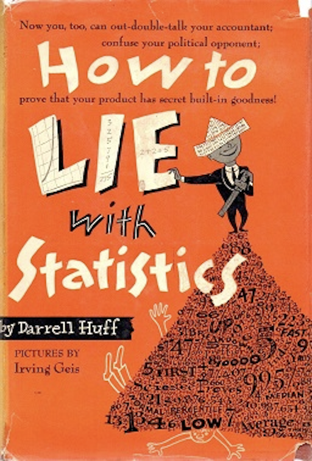](https://www.horace.org/blog/wp-content/uploads/2012/05/How-to-Lie-With-Statistics-1954-Huff.pdf) *From 1954*

In this lecture, however, we aim for an accurate display of information, not to obscure it. 

We differentiate between two types of statistics when analyzing our data, which e.g. we produced with an experiment.

*Do you know the difference between descriptive and inferential statistics?*

In short:

Descriptive statistics summarizes data and helps to describe and to organize data. Information is presented in a manageable form.

Inferential statistics draws conclusions about a population based on samples and helps to analyze data. Inferential statistics is used to generalize and make judgments. For that there are rigid requirements on the data for the maths to work and to allow for such generalizations.

## Data

Let's have a look first on what kind of data we might be working with.

### Pre-Processing

In most cases, the original data collected from lab-based experiments, usability tests, field studies, surveys, and various other channels need to be carefully processed before any statistical analysis can be conducted. The pre-processing depends on the statistical analysis method and the format needed. The first thing that you need to do after data collection is to screen the data for possible errors. This step is necessary for any type of data collected, but is particularly important for data entered manually by participants, which can be highly inconsistent in format, for example. Ideally your setup prevents inconsistencies as much as possible though. For automatically collected data, error checking usually boils down to consistency issues or whether the values are within a reasonable range. Something is obviously wrong if the logged start time of an event is later than the logged end time of the same event. You should also be on alert if any unreasonably high or low values levels are documented.

Once you have identified the errors, you can either fix them e.g. when just converting data into a different format or you will need to remove the data point e.g. if there was a problem with stopping the time and you have know way of retracing how long a task took.

[13]

### Data Coding

Coding of data refers to the process of transforming collected information or observations to a set of meaningful, cohesive categories.

A typical example is the data about the demographic information of your participants:

 [13]  
  
In the above example, the information on age is numerical and does not need to be coded. The information on gender, highest degree earned, and previous software experience needs to be coded so that statistical software can interpret the input.

In various studies such as surveys, interviews, and focus groups, content analysis needs to be conducted in which text reflecting different themes or critical events is coded and counted (Stemler, 2001 as cited in [13]). Event coding is also quite common in usability tests or lab-based studies. For example, Hu and Feng (2015, as cited in [13]) used extensive coding schemes to analyze the causes for failed browsing or search tasks in an online environment.  

Coding can lead to a deeper understanding and the emergence of relationships, patterns, etc. When coding your data, the most important thing to remember is to ensure the coding is consistent.

[13] [[14]](https://methods.sagepub.com/reference/the-sage-encyclopedia-of-communication-research-methods/i2620.xml)  


### Data Properties

Overall, you can differentiate between *discrete* and *continuos* data. For a discrete variable only specific values or outcomes are expected, often including data that is counted, such as integer values. A continuos variable can exist as any value within a possible range (e.g. height, rainfall amounts, temperature) like a function.

Then, you differentiate between *qualitative* and *quantitative* data. Qualitative data is usually discrete and values are non-numerical. Quantitative data can be discrete or continuous and values are numerical.

Lastly, depending on the data type, there are different scales.  

#### Nominal Scales

For nominal or also called categorical data is qualitative and there is no relationship between the values such as trikot numbers in a football team.  

  
[[mymarketresearchmethods]](https://www.mymarketresearchmethods.com/types-of-data-nominal-ordinal-interval-ratio/)

  
[[4]](https://docs.google.com/presentation/d/1cPWa6NqbEot8dBjVC7UKPjF72Q7myYjHqyBYS9HO_qg/edit#slide=id.g5137fefd78_1_153)

#### Ordinal Scales

For ordinal, there is a ordered scale, a ranking for the data such as with marks in school: 1, 2, 3, 4, 5, 6. The operations *A>B*, *A<B*, *A=B* hold true.

  
[[mymarketresearchmethods]](https://www.mymarketresearchmethods.com/types-of-data-nominal-ordinal-interval-ratio/)

#### Interval Scales

For interval scaled data there is a ordered scale and equal intervals represent equal differences in the measured property. However interval scaled data does not have a true zero but the zero point is arbitrary. In temperature measurements (°C/°F) for example there is no such thing as no temperature. Zero does not mean the absence of a value but it is just another number on the scale.

  
[[mymarketresearchmethods]](https://www.mymarketresearchmethods.com/types-of-data-nominal-ordinal-interval-ratio/)

#### Ratio Scales

For ratio scaled data there is an order, there are exact values between units and they have an absolute zero. This allows for a wide range of both descriptive and inferential statistics to be applied as they can be meaningfully added, subtracted, multiplied, divided, etc. Examples are words per minute (wpm), error rates, height, weight, etc.

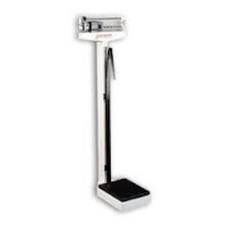  
[[mymarketresearchmethods]](https://www.mymarketresearchmethods.com/types-of-data-nominal-ordinal-interval-ratio/)
  
The usefulness or expressivness goes from nominal as the least useful, over ordinal and interval to ratio scaled data.

[[1]](https://www.mymarketresearchmethods.com/types-of-data-nominal-ordinal-interval-ratio/)


## Descriptive Statistics

Descriptive statistics is the term given to the analysis of data that helps describe, show or summarize data in a meaningful way such that, for example, patterns might emerge from the data. Descriptive statistics do not allow us to make conclusions beyond the data we have analysed or reach conclusions regarding any hypotheses we might have made.  

They are simply a way to describe our data.

Descriptive statistics are very important because if we simply presented our raw data it would be hard to grasp what the data was showing, especially if there was a lot of it. Descriptive statistics therefore enables us to present the data in a more meaningful way, which allows simpler interpretation of the data.

Let's assume the following scenario: we have a population (e.g. all humans) an make some observations. Multiple observations can be grouped further into samples. A sample is a collection of observations. We collect those data points and for a interpretation we have two options: *graphs* or *statistics*.

  


[[2]](https://statistics.laerd.com/statistical-guides/descriptive-inferential-statistics.php)  

### Graphs

Graphs are crucial to summarize and to understand data as they give us a visual representation, which is often more intuitive and easier for humans to understand. However, the intuitive understanding graphs can easily manipulate.

Presumably the following graph shows that there were a bit more than 10 frogs in May and something like 40 frogs in September. 

  
[[?]]()
  
*What might be the problem with the above graph?*

The frog on the right is about three times longer and three times wider than the frog on the left and hence takes up 3<sup>2</sup>=9 times more area. Thus this sort of diagram leaves the viewer with a distorted view of the actual data: the visual change is much larger than the actual factor of three.

  
[[?]]()

Now it is clear that there were something like three times more frogs in September than in May. Of course, it is unlikely to have been exactly three times more frogs. For a decimal number a confusing fractional frog will be required. If your aim is accuracy rather than frog graphics, your proper display choice here would be an good old fashion bar chart.

The following are the most common graph plots

* Frequency Tables
* Bar Charts
* Pie Charts
* Histograms
* Boxplots
* Scatterplots
* Line Graphs

I have tested some options and I personally like Python's [matplotlib](https://matplotlib.org/) module best to render graphs.

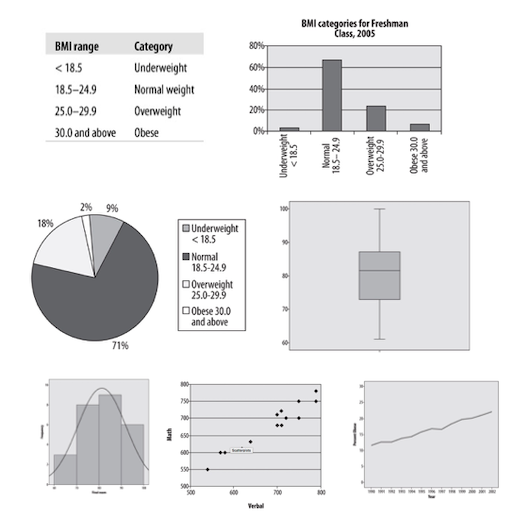  
[[oreilly]](https://www.oreilly.com/library/view/statistics-in-a/9781449361129/ch04.html)


Alternatively, also consider tables to represent your data. Tables are the most precise form of data representation but of course not as immediately comprehensible as graphs. But also the readability of tables can be greatly improved with smart and clean layouts. For example, compare these two layouts of exactly the same data:

  
[[4]](https://docs.google.com/presentation/d/1rgd1_cJvxCemUBuIQhcZV62F4zEgjxIrba6tH_Ieykg/edit#slide=id.g5908fc3346_1_462)

  
[[uxknowledgebase]](https://uxknowledgebase.com/tables-other-charts-data-visualization-part-3-548824fd9ad3)

  
[[xkcd]](https://xkcd.com/)


Unfortunately, also with the most basic forms of graphs it is easy to tamper with.

*What might be the problem with the following bar charts?*

  
[[cellfish]](http://blog.cellfish.se/2014/08/lying-with-statistics.html)

Yes, exactly. One of the most common tricks used is to show small changes as huge by not using zero as the base in a diagram. 

Looking at the Fox News graph it looks like as if there was a huge increase in the enrollment in Obamacare.  But the difference between the two numbers is only 33,000, which is in regard to the start value of 7,066,000 not that much. But as the graphic cuts off the bottom part of the graphs the increase is greatly exaggerated. Don't ask me what the intentions were, I always thought that Fox News was against Obamacare...

  
[[cellfish]](http://blog.cellfish.se/2014/08/lying-with-statistics.html)

Here, two views of the same data. What is again the problem?

  
[[cellfish]](http://blog.cellfish.se/2014/08/lying-with-statistics.html)

But these manipulations are not always made in such a obvious ways and with evil intentions. Sometimes there are just nuances slightly off and it is up to us to judge what to make of it. For example, also in the famous Rezo video [Die Zerstörung der CDU](https://www.youtube.com/watch?v=4Y1lZQsyuSQ), which has been watched millions of times, there was a questionable graph.

In regard to the question of *wealth through inheritance*, Rezo showed the following figure:

  
[[spiegel]](https://www.spiegel.de/politik/deutschland/rezo-video-die-youtube-angriffe-auf-die-cdu-im-spiegel-faktencheck-a-1268973.html) *Figure by Rezo*

The above is an adjustment of the following original publication:

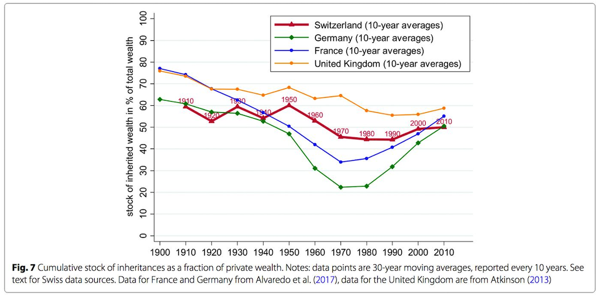  
[[spiegel]](https://www.spiegel.de/politik/deutschland/rezo-video-die-youtube-angriffe-auf-die-cdu-im-spiegel-faktencheck-a-1268973.html) *Original by Alvaredo et al./ Atkinson/ CC BY 4.0*

Not only did Rezo remove the graphs of the other countries in comparison, he also cut the timeline - the oldest and most evil move in regard to graph manipulations! In this case the manipulated figure implies that the historically exceptionally values between the 1960-90 (as it becomes clear from the original figure) were a normal phase. Spiegel calls this in its article about the fact-checking of Rezo's video *ein absolutes No-Go*. This is especially disappointing, as the Spiegel points out, as there is enough valid data to underline the point Rezo was overall trying to make.

[[3]](https://www.spiegel.de/politik/deutschland/rezo-video-die-youtube-angriffe-auf-die-cdu-im-spiegel-faktencheck-a-1268973.html)  

A very creative type of manipulation and an almost unbelievable one shows this graphics from the Florida Department of Law Enforcement. 

*Can you spot the problem?*

  
[[gregstevens]](http://gregstevens.com/2011/02/21/lying-with-statistics-101/)

Most people see in the graphic above a huge fall-off in the number of gun deaths after Stand Your Ground was passed. That is what the law was aiming for but that’s not what the graph shows. A quick look at the vertical axis reveals that the gun deaths are counted from top (0) to bottom (800). The highest peaks are the fewest gun deaths and the lowest ones are the most. A rise in the line, in other words, reveals a reduction in gun deaths. The graph below — flipped both horizontally and vertically — is more intuitive to most: a rising line reflects a rise in the number of gun deaths and a dropping a drop.

  
[[gregstevens]](http://gregstevens.com/2011/02/21/lying-with-statistics-101/)

*What could be the problem with the following visualization?*


3D graphs are also generally considered to be easier to distort and harder to evaluate. Just don't use them. By the way, legends says that the comic Dilbert invented 3D bar graphs as a joke…

  
[[?]]()
  
  
[[?]]() *This figure makes it almost impossible to identify which country in which year how many bananas exports.*

These days also *infographics* are a potentially dangerous method to represent data. Infographics are a visually appealing representations of data aiming for telling *the story of the data*. As beneficial infographics might be to make information easily accessible, as often do they misrepresent data. Infographics tend to merge different data sets and contexts and are highly selective while often still claiming to present absolute truths.  


The following is a cutout of an infographic - follow the [link](https://www.zeit.de/wissen/2011-11/s43-infografik-internet.pdf) to see its full version:

  
[[zeit]](https://www.zeit.de/wissen/2011-11/s43-infografik-internet.pdf)

Don't get me wrong. I like infographics a lot. But when creating one, we need to put even more effort into representing the data correctly and to clearly label what is show and what not. If interested, have a look into this great collection of [The 100 Best Infographics](https://www.siegemedia.com/creation/best-infographics).

### Frequency Distributions

Which one is your favorite cat picture: 1, 2 or 3?

  
[Image sources from left to right [icepop](https://www.icepop.com/amazing-cute-cats/), [thecatniptimes](https://www.thecatniptimes.com/cat-news/featured-cats/gimo/)
[edition](https://edition.cnn.com/2016/01/20/health/your-brain-on-cute/index.html)]

*How is the here collected data scaled?*

If we would collect data for the above example, it would be nominal data. This data can be easily summarized with a *frequency distribution table*, which counts the number of times each score occurs.

| Cat | Frequency (how often chosen as favorite?) | Percentage |
|-----|-------------------------------------------|------------|
| 1   | 4                                         | 40%        |
| 2   | 3                                         | 30%        |
| 3   | 3                                         | 30%        |

Here, we could also use ratio scaled data such as the number of days that I needed to answer a received email. The (fictitious) data would be:

```bash
5 2 2 3 4 4 3 2 0 3 0 3 2 1 5 1 3 1 5 5 2 4 0 0 4 5 4 4 5 5
```

| Days | Frequency | %  |
|------|-----------|----|
| 0    | 4         | 13 |
| 1    | 3         | 10 |
| 2    | 5         | 17 |
| 3    | 5         | 17 |
| 4    | 6         | 20 |
| 5    | 7         | 23 |

Usually such frequency distributions are visualized with a (frequency distribution) histogram.

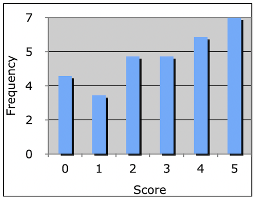

For histograms the chosen number of bins is crucial for the expressivity of the visualization.

Imagine we measured the mass of [sea urchins](https://en.wikipedia.org/wiki/Sea_urchin) (yes, random example but I wanted to use the given diagrams...😁)

For the data of

```bash
1, 3, 7, 3, 9, 1, 1, 4, 3, 10, 24, 13, 15, 18, 12, 10, 4, 5, 2, 9, 7, 6, 22, 10, 19, 11, 26, 7, 3, 2, 7, 2, 1, 4
```

all of the following histograms are valid representations:

  
[[4]](https://docs.google.com/presentation/d/1cPWa6NqbEot8dBjVC7UKPjF72Q7myYjHqyBYS9HO_qg/edit#slide=id.g5137fefd78_1_189)

*Which number of bins and width creates the best visualization?*

Well, it depends on the data and the use case for the visualization. There is no best number of bins, and different bin sizes can reveal different features of the data. There are a [number of approaches](https://en.wikipedia.org/wiki/Histogram#Number_of_bins_and_width) to determine the bin count. One is for example the Rice rule, which states 

*#bins = 2n<sup>1/3</sup>*

For example, for the urchins this means

2(34)<sup>1/3</sup> = ~ 6.5 bins (round to 7)  
Pick range: 0 – 28 g (bin width = 4 g)

  
[[4]](https://docs.google.com/presentation/d/1cPWa6NqbEot8dBjVC7UKPjF72Q7myYjHqyBYS9HO_qg/edit#slide=id.g5137fefd78_1_189)

Frequency distributions can have the following characteristics

  
[[comfsm, dleeling]](http://www.comfsm.fm/~dleeling/statistics/text6.html)

### Measures of Central Tendency

*How can the data be summed up and described with a single value?*  

We could, for example, describe where the bulk of the data is located. In statistical terms, this characteristic is called the *central tendency* and the *centric point* of a distribution. There are a couple of ways to define such a centric point:

  
[[4]](https://docs.google.com/presentation/d/1cPWa6NqbEot8dBjVC7UKPjF72Q7myYjHqyBYS9HO_qg/edit#slide=id.g5137fefd78_1_189)

If data is symmetrically distributed, the mean and median will be close, especially as n increases. If the data is skewed, mean, median and mode can differ greatly. Depending on our question, that might really matter... we will come back to this.

  
[[wiki]](https://en.wikipedia.org/wiki/Mean#/media/File:Comparison_mean_median_mode.svg)

<!-- #### Mode

The mode is most frequent score and describes for example how the most people behave.

Pro

* Easy to calculate and understand
* Can be used with nominal data

Contra

* There can be more than one mode
* Independent of all other data in the set
* One different data points can make a drastic change:

```bash
2, 2, 3, 4, 5, 8, 9, 9, 9, 10
mode = 9
```

vs.

```bash
2, 2, 2, 3, 4, 5, 8, 9, 9, 10
mode = 2
```

#### Median

The median is the middle score of the distribution. 

E.g.

```bash
1 7 3 9 6 9 2
```

Sorted by magnitude:

```bash
9 9 7 6 3 2 1
median = 6
```

Pro

* Relatively unaffected by outliers (very low or high scores) and skewed distributions
* Can be used with ordinal, interval and ratio data

Contra

* Does not consider all scores of the data set
* Not very stable

The median improves as a measure of central tendency as the number of samples increases.


#### Mean

The mean is the sum of all scores divided by the number of scores. This is usually assumed when we speak of an *average*.

Pro

* Considers every score -> most accurate summary of the data
* Resistant to sampling variation: removing one sample changes the mean far less than mode or median

Contra

* Heavily affected by extreme scores and skewed distributions
* Can only be used with interval and ratio data -->


Look at the following two images. They have the same mean value. 

*What makes the two images different?*


[[taniapouli]](http://taniapouli.me/wp-content/uploads/2016/08/s2010_course.pdf)


What makes them different, once again, is the *distribution* of values.


Or, consider these two example distributions

```bash
5 5 5 5 5
mean = 5  
```

```bash
6 8 4 1 6
mean = 5
```

*Which of these data sets would you say is better represented by its mean?*

For the data set of 5 5 5 5 5, the mean of 5 directly represents the actual values and is therefore a good measurement. However the single values of 6 8 4 1 6 differ quite strongly from the mean of 5, which therefore is not the best representation. This characteristic of how much the single values differ to the mean is reflected by the *variance* of a data set.

### Measures of Spread

To better describe how data are situated around the central tendency, we use measures of data spread. 

#### Variance

The variance of a data set measures the mathematical dispersion (*Streuung*) of the data relative to the mean. In other words, variance describes the accuracy of the mean as representation for the data.


Mathematically, the variance is exactly the mean squared distance that values have to the mean. The variance of a set of values can be written as


Therefore, for a population, the variance (s<sup>2</sup><sub>P</sub>) should be the mean squared distance that values are from the population mean. 


However, when using the variance in the context of populations, we need to divide each sample by *(n – 1)* to account for an otherwise existing systematic bias.


Otherwise, the biased sample variance would underestimate the population variance. This is something, you simply need to remember. There is a somewhat complex mathematical explanation for that, which we do not get into, but it can also be understood by simply looking at data. If you take a large enough number of samples, the data simply shows to be biased by a factor of *(n – 1)/n* and that is where the dividing by *(n – 1)* comes from. It accounts for that systematic bias.

  
[[khanacademy]](http://www.khanacademy.org/math/probability/descriptive-statistics/variance_std_deviation/p/unbiased-estimate-of-population-variance)

As the formula for variance shows, the units of variance are the units of the observation *squared*, *x<sub>i</sub><sup>2</sup>* and in a variance's value can not be directly compared to the value range of the collected data. Hence, to get the metric back into units of the variable, we take the square root of the variance, which is called the *standard deviation σ*.

 

Both *variance* and *standard deviation* measure the accuracy of the mean of data set and the variability of the data. Variance and standard deviation only differ in a scaling factor.

A large value means that values are quite different from each other and that the data varies a lot. Hence, the mean is not representative for the data set. A small value means all data points are close to the mean with little variation. Hence, the mean is a valid representation of the data.

  
[[4]](https://docs.google.com/presentation/d/1cPWa6NqbEot8dBjVC7UKPjF72Q7myYjHqyBYS9HO_qg/edit#slide=id.g5137fefd78_1_189) *Smaller σ = taller, narrower distribution
and larger σ = squattier distribution*

[[4]](https://docs.google.com/presentation/d/1cPWa6NqbEot8dBjVC7UKPjF72Q7myYjHqyBYS9HO_qg/edit#slide=id.g5137fefd78_1_0)  

#### Confidence Interval

As the mean is such an important property in statistics, often times there is a range given, called the *confidence interval*, which describes the vallue range that the mean will lie in *n*% of the cases when repeating the test. E.g. if we collect 100 samples, 95 of these samples would have a mean within the boundaries of this interval.

  
[[researchhubs]](http://researchhubs.com/post/ai/data-analysis-and-statistical-inference/confidence-interval-for-a-population-mean.html)

### Representations

As we already know, it is critically important to look at your data. One common way is to group the data and to visualize the mean and median.

#### Quantiles

Quantiles are cut points that divide a sample of data into groups containing (as far as possible) equal numbers of observations. There is one less quantile than the number of groups created.

Thus *quartiles*, for example, are the three cut points that will divide a dataset into four equal-size groups:

  
[[wiki]](https://en.wikipedia.org/wiki/Quantile#/media/File:Iqr_with_quantile.png)

Quartiles are used for box and whisker plot visualizations.

#### Box and Whisker Plots

  
[[whiskerstotailspetsitting]](https://whiskerstotailspetsitting.com/2015/02/hello-world/)

Unfortunately, the above scenario is not meant with box and whisker plots... 

For an overview of the most important values, the core of a box and whisker plot, in short *boxplot*, looks as follows:

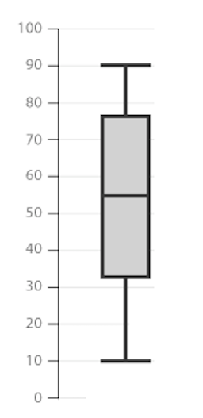  

The box is bounded by the two inner quartiles of the data. This is called the *interquartile range* (IQR). Its middle line shows the median and the whiskers extend to the last observation within 1 step (usually 1.5 * IQR) from the end of the box.

  

Any observations beyond the whiskers are plotted as individual points.

  

In summary:

  
[[wiki]](https://en.wikipedia.org/wiki/File:Boxplot_vs_PDF.svg)

Numeric example:

  

*What do the histogram plots, meaning the frequency distributions, of the following box and whisker plots look like?*

  
[[comfsm]](http://www.comfsm.fm/~dleeling/statistics/text6.html)

As follows:

  
[[comfsm]](http://www.comfsm.fm/~dleeling/statistics/text6.html)

I used boxplots in one of my papers as follow (created with matplotlib):

  

### Summary 

In descriptive statistics we use

* measures of central tendency (mode, median, mean), and
* measures of spread (variance, standard deviation, confidence interval)

to describe and summarize data.

We usually report

* mean and standard deviation values in the accompanying text, and
* a summary of the data as box plots graphically.


Hence, we can summarize a <span style="color:blue">sample</span> (meaning a set of data) using its <span style="color:red">mean</span> and we can access the accuracy of that mean using the standard deviation.

  

But how well does one <span style="color:blue">sample</span> represent the <span style="color:darkorange">population</span>?

  

Probably not too well…  

*What could we do about this?*  

We could take several <span style="color:blue">samples</span> from the same <span style="color:darkorange">population</span>, each with its own <span style="color:red">mean</span>.

  

Here, we now differentiate between the sample and sampling distribution.

  
[[researchhubs]](http://researchhubs.com/post/ai/data-analysis-and-statistical-inference/sampling-distribution.html)

Then, the question becomes whether the <span style="color:blue">sample distribution</span> is representative for the <span style="color:darkorange">population</span>?

This question is answered with *inferential* statistics.

## Inferential Statistics

Whereas descriptive statistics simply describes the data with inferential statistics you can reach to conclusions that extend beyond the immediate data alone but describe a population overall.

### Hypothesis Testing

We already know that hypothese testing is a formalized statistical technique, which results in a likelihood for hypotheses about some parameter value to be true.

Remember, that we work with a null-hypothesis and alternative hypotheses here:

Null hypothesis H<sub>0</sub>

* Assumes that there is no difference between two conditions
* H<sub>0</sub>: 𝜇<sub>1</sub> = 𝜇<sub>2</sub>

Alternative hypothesis H<sub>A</sub>

* Assumes significant differences between the two conditions
* H<sub>A</sub>: 𝜇<sub>1</sub> != 𝜇<sub>2</sub> or 𝜇<sub>1</sub> > 𝜇<sub>1</sub> or 𝜇<sub>1</sub> < 𝜇<sub>2</sub>

In statistics, we always assume the null hypothesis to be true, meaning that there is no effect, until proven otherwise. The data is the evidence and we can make one of two decisions:

* Reject the null hypothesis (proven by the data)
* Fail to reject the null hypothesis

For hypothesis testing there are a variety of test available, each potentially including several steps. 

The first test, we need to have a look into is a test that uses a calculated probability to determine whether there is evidence to reject the null hypothesis, hence ideally showing that we have indeed observed an effect.

There are two common tests for that, the [Critical Value approach](https://online.stat.psu.edu/statprogram/reviews/statistical-concepts/hypothesis-testing/critical-value-approach) and the [p-value approach](https://online.stat.psu.edu/statprogram/reviews/statistical-concepts/hypothesis-testing/p-value-approach). The p-value approach requires only one computation and most statistical software uses it. So let's have a look into that, starting with an example.

### Lady Tasting Tea

[Dr. Muriel Bristol](https://en.wikipedia.org/wiki/Muriel_Bristol), a female colleague of mathematician [Sir Ronald Fisher](https://en.wikipedia.org/wiki/Ronald_Fisher) claimed to be able to tell whether the tea or the milk was added first to a cup. Fisher didn't believe her and claimed that she was just guessing.

  
[[wiki]](http://en.wikipedia.org/wiki/File:Milk_clouds_in_tea.jpeg )

Fisher proposed to test Lady Bristol's ability with a within-group experiment design. He served eight cups, four of each variety, in random order. Dr. Bristol tasted each cup and reported which four she thought had milk added first. 

H<sub>0</sub>: The lady has no ability to distinguish the teas. Hence there is no causality, and we assume she is just guessing!

Now, Fisher investigated - given the outcome of the experiment - what the probability would be of Dr. Bristol performing the way she did by just guessing?

*What are the probabilities for guessed outcomes?*

* n = 8 total cups
* k = 4 cups chosen
* Based on the [combination formula](https://en.wikipedia.org/wiki/Combination), these numbers lead to

  

possible answers.

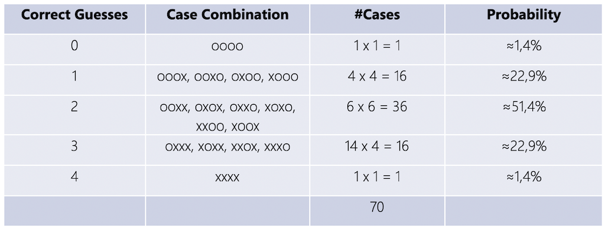  
[[wiki]](https://en.wikipedia.org/wiki/Lady_tasting_tea)

So, if the lady is guessing, there is only a *1.4%* chance that she will get all cups correct.

Fisher decided to accept that Dr. Bristol's has indeed an ability to taste the difference if she identified all four cups correctly. Fisher argued that the probability for guessing this case is just too low. Hence, only with the identification of all four cups, Fisher were willing to reject the null hypothesis that Dr. Bristol is guessing.

Dr. Bristol identified all four cups of tea successfully 😀! Apparently, pouring hot tea into cold milk makes the milk curdle, but not so when pouring cold milk into hot tea.

This experiment is an example of the p-value approach to hypothesis testing. It uses a calculated probability p to determine whether there is evidence to reject the null hypothesis. If the calculated probability is below a certain threshold, also called the *significance level α* (see below), we can reject the null hypothesis. 

[[5]](https://en.wikipedia.org/wiki/Lady_tasting_tea) 

### P-Value Approach

For the p-value approach we take the scores of two samples by different groups or conditions. Both scores are very likely not going to be exactly the same. Now, we investigate whether the difference is caused by chance or whether we have observed a cause and effect. For this we aim to prove statistical significance for a cause and effect!

#### Setup

The setup includes two probabilities:

* p-value
    * The probability of obtaining the test statistic for the current sample under the assumption that the null hypothesis is true.
    * *The probability of obtaining the results by chance.*
* alpha-level
    * The significance level
    * The probability of accepting a Type I error (False Positive)
        * A non-existing effect found.
        * Results are produced by chance.
    * *The risk you’re willing to take of making a wrong decision.*

#### Statistical Significance

We can reject H<sub>0</sub> if the computed p‐value is ≤ α.  

This means that *statistical significance* for the effect exists as the probability that the effect happened by chance is below a certain significance level α. This is what we are aiming for, as we usually want show that an effect exists.

For non-significant results (p >= α) the null hypothesis cannot be rejected. This means, we cannot conclude anything.

In summary, a

* small p-value means that the null hypothesis is very unlikely, and
* large p-value means that the  null hypothesis is very likely.

##### Alpha Values

Typical alpha levels of significance are

* p < .05 (Fisher-Criterion)
* p < .01
* p < .001

The Fisher-Criterion is the most commonly chosen one. It is based on the tea party experiment and it means that the probability for the experiment results to happen as they did is smaller than five correct guesses in a row:

| Number of correct guesses | Probability for consecutive correct guessing |
|---------------------------|----------------------------------------------|
| 1x                        | 0.5                                          |
| 2x                        | 0.25                                         |
| 3x                        | 0.125                                        |
| 4x                        | 0.0625                                       |
| 5x                        | 0.03125                                      |

Which α to chose also depends on the discipline. This shows that what we accept as *proven effect* also simply depends on somewhat arbitrary standards a research community decided on.

### Parametric Statistics

The factor that we want to investigate is called *parameter* or population parameter and is some *numerical characteristics* of interest. Usually, we want to find out whether there is any difference between conditions or groups, e.g. patients that took a new drug vs. patients that didn't, etc. We can do so by comparing the arithmetic means over their sample collection. Then, the mean μ is the parameter. Keep in mind that, we don't — or can't — know the real value of a population parameter; we only ever estimate it with applying statistics!

 <!-- Suppose you are evaluating the effectiveness of two search engines; you may adopt a between-group design, in which case you will recruit two groups of participants and have each group use one of the two search engines to complete a number of search tasks. Similarly, you could also have a within-group design. In either case, you want to compare the performance measures of the two groups or conditions to find out whether there is any difference between the two search engines. -->

<!-- Suppose you want to investigate whether the use of specific word-prediction software has an impact on typing speed. -->

For parametric tests to work, we have to assume some underlying statistical distributions in the data:

1. Normal distribution

The dependent variable must follow a normal distribution in the population. A normal distribution is the most important and widely used distribution in statistics. Many mathematical computations only work when the data is roughly shaped as such a *bell curve* or *Gaussian curve*.

2. Homogeneity of variance

We must show that the mean is representative for the data set that it is an accurate measure.

#### Normal Distribution

The normal distribution is useful because of the *[central limit theorem](https://en.wikipedia.org/wiki/Central_limit_theorem)*. In its most general form, under some conditions, it states that averages of random variables independently drawn from independent distributions converge in being normally distributed when the number of random variables is sufficiently large. 

Properties of a normal distribution are that

* it is symmetric around its mean,
* mean, median, and mode are equal,
* the area under the normal curve is equal to 1.0, and
* it is denser in the center and less dense in the tails.

  
[[6]](https://docs.google.com/presentation/d/17ejVv4SJgpU7fD09By0zCIdb7tnstfH-Yadj8UOGXHQ/edit#slide=id.g56e33918ae_2_283)  

  
[[6]](https://docs.google.com/presentation/d/17ejVv4SJgpU7fD09By0zCIdb7tnstfH-Yadj8UOGXHQ/edit#slide=id.g56e33918ae_2_283)  

A normal distribution is defined by two parameters, the mean (μ) and the standard deviation (σ) of a data set. In a normal distribtuion, 68% of the area of the distribution is within one standard deviation of the mean. Approximately 95% of the area of a normal distribution is within two standard deviations of the mean.

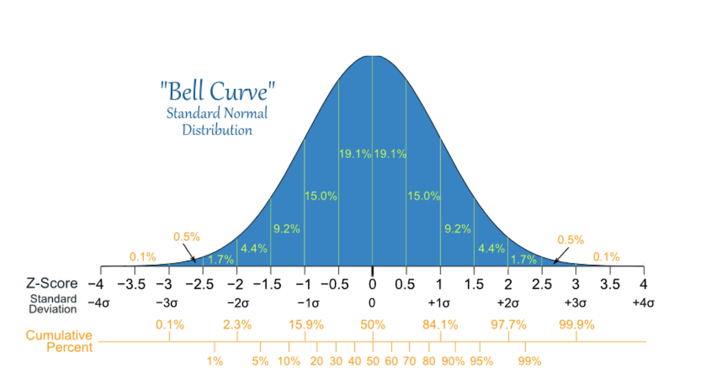  
[[socialresearchmethods]](http://www.socialresearchmethods.net/kb/statinf.php)  

[[6]](https://docs.google.com/presentation/d/17ejVv4SJgpU7fD09By0zCIdb7tnstfH-Yadj8UOGXHQ/edit#slide=id.g56e33918ae_2_283)  


#### Test of Normality

There are several way to figure out whether your data is normal distributed or not.

The first step you should always take it to plot your data. The shape of your plot will tell you quite well, what kind of distribution you are dealing with. The most straight forward plot type is the *cumulative frequency (P-P) plot*, which is simply a frequency distribution plot.

  
[[had2know]](http://www.had2know.com/academics/test-for-normality-statistics.html)  

  
[[had2know]](http://www.had2know.com/academics/test-for-normality-statistics.html)  

In a *quantile-quantile (Q-Q) plot*, for normally distributed data, observations should lie approximately on a straight line. If the data is non-normal, the points form a curve that deviates markedly from a straight line. Possible outliers are points at the ends of the line, distanced from the bulk of the observations.

  
[[ship.edu/pgmarr]](http://webspace.ship.edu/pgmarr/Geo441/Lectures/Lec%205%20-%20Normality%20Testing.pdf)  

[[8]](https://analyse-it.com/docs/user-guide/distribution/continuous/normal-probability-plot#:~:text=Normal%20probability%20(Q%2DQ)%20plot,approximately%20on%20a%20straight%20line.)  

However, graphical methods are typically not very useful when the sample size is small. The data might not look
normal, as in the following example, but it is statistically actually not different from being normal.

  
[[ship.edu/pgmarr]](http://webspace.ship.edu/pgmarr/Geo441/Lectures/Lec%205%20-%20Normality%20Testing.pdf)  

Once you concluded from your plot that it is worthwhile to continue to test for normality, you can prove it with so-called *distribution tests*. Such tests compare a theoretical normal distribution with the same mean and variance to the actual distribution of the data. Then, we want to prove that the actual data ist statistically *not* different from the the computed normal curve.

  
[[ship.edu/pgmarr]](http://webspace.ship.edu/pgmarr/Geo441/Lectures/Lec%205%20-%20Normality%20Testing.pdf)  

Hence, the test of normality is the computation of the probability that the sample was drawn from a normal population, or not:

H<sub>0</sub>: The sample data is not significantly different from a normal population.  
H<sub>A</sub>: The sample data is significantly different from a normal population.

Once again, here we want to accept the null hypothesis! 

* Probabilities > 0.05 mean the data is normal
* Probabilities < 0.05 mean the data is NOT normal

There are several statistical test that assess whether data is normally distributed or not, such as

* [W/S test](http://article.sciencepublishinggroup.com/pdf/10.11648.j.ajtas.s.2017060501.19.pdf)
* [Jarque-Bera test](https://en.wikipedia.org/wiki/Jarque%E2%80%93Bera_test)
* [Shapiro-Wilks test](https://en.wikipedia.org/wiki/Shapiro%E2%80%93Wilk_test)
* [Kolmogorov-Smirnov test](https://en.wikipedia.org/wiki/Kolmogorov%E2%80%93Smirnov_test)
* [D’Agostino test](https://en.wikipedia.org/wiki/D%27Agostino%27s_K-squared_test)

These can then be computed with any tool of your choice. The most common test are the Kolmogorov-Smirnov and the Shapiro-Wilk.

  
[[ship.edu/pgmarr]](http://webspace.ship.edu/pgmarr/Geo441/Lectures/Lec%205%20-%20Normality%20Testing.pdf)  

Again, in the output above (formated as a typical statistical software output, in this case from [SPSS](https://en.wikipedia.org/wiki/SPSS)) the probabilities greater than 0.05 (the typical alpha level) show that the two tested condition are not significantly different, and that is what we want.

In summary, normal distributions are common. But never assume your data is normally distributed without looking at it and thinking critically first. For a publication you usually also report the result of a statistical test (as seen above), which shows statistical significance for the normality of your data.

[[6]](https://docs.google.com/presentation/d/17ejVv4SJgpU7fD09By0zCIdb7tnstfH-Yadj8UOGXHQ/edit#slide=id.g56e33918ae_2_283)
[[7]](http://webspace.ship.edu/pgmarr/Geo441/Lectures/Lec%205%20-%20Normality%20Testing.pdf)  

#### Homogeneity of Variance

Homogeneity of variance is given when all comparison groups have about the same variance, meaning that the data spread is similar enough to make meaningful comparisons between the groups. There are again several statistical tests that can be used. The most common assessment for homogeneity of variance is [Levene’s test](https://en.wikipedia.org/wiki/Levene%27s_test), which tests the null hypothesis that the variance is equal across groups. Again, a p-value above α = .05 shows statistical significance for the homogeneity of variance.

### t-Test

Under the assumptions that the data is normal distributed and the homogeneity of variance is given, we then can use, for example a *t-test* for comparing two populations. The two-sample test analyses two population means 𝜇1 and 𝜇2. The *t* stands for the difference between means in relation to the variation in the data. It describes the degree to which those means differ by chance alone.

There are two different types of t-tests, the paired and the unpaired t-tests. 

An unpaired t-test (also known as an independent t-test) compares the averages of two independent or unrelated groups to determine if there is a significant difference between the two. Here, groups can not have a direct relationship, e.g. with an independent measurement grouping for which one group does only test A, another group does only test B.

A paired t-test (also known as a dependent or correlated t-test) compares the averages and standard deviations of two related groups to determine if there is a significant difference between the two groups. Here, the two groups are paired or connected, e.g. participants before and after a treatment or a repeated-measure grouping, where all participants do all tasks.


#### Example

Suppose you want to investigate the effect of caffeine on muscle metabolism.

You work with 18 male volunteers and randomly assign them to two groups. In one group all men take a capsule containing pure caffeine, the men in the other group receive a placebo capsule. The two groups are independent from each other and the independent-samples t test is appropriate for data analysis.

Now, all men underwent arm exercise tests. During each exercise the subject's respiratory exchange ratio (RER) was measured. 
RER is the ratio of CO2 produced to O2 consumed and is an indicator of whether energy is being obtained from carbohydrates or fats.

The question now is whether, on average, caffeine changes the RER value?

We have two conditions or populations

* men who have not taken caffeine
* men who have taken caffeine

If caffeine has no effect on RER the two sets of data can be regarded as coming from the same population. 

H<sub>0</sub>: The mean of the caffeine treatment equals the mean of the placebo  
H<sub>A</sub>: The mean of caffeine treatment is not equal to the mean of the placebo treatment.  

We collect the following data

  
[[15]](http://learntech.uwe.ac.uk/da/Default.aspx?pageid=1438)  

The independent-samples t-test returns a value for the difference in means of the two conditions, t, with larger t values suggesting higher probability of the null hypothesis being false. In other words, the higher the t value, the more likely the two means are different.

Statistical software generates a summary table for the results, containing both the t-test results, additional test results that examine the data distribution and a p-value. If we run an independent-samples t-test using the data set above, we get a value for the difference in means of ~6.4, meaning there is an estimated change of 6.4%.

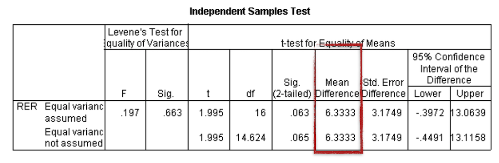  
[[15]](http://learntech.uwe.ac.uk/da/Default.aspx?pageid=1438)  


*But* the p-value is 0.063 and, therefore, the difference between the two means is not statistically significantly different with a 5% level of significance.

  
[[15]](http://learntech.uwe.ac.uk/da/Default.aspx?pageid=1438)  

In this case, we would need to report as result that even though there is a change of 6.4% observed, it is insufficient evidence (p = 0.063) to generally conclude that caffeine does change the mean RER.

The specific values returned from a software computation and how to use and interpret the given values is highly dependent from the specific package. When needed, decide on a software early on and make sure that you know how to input the data (layout, format?) and what to expect as output. This can take some time and effort, so please make sure to have enough time and brain power left to do this.

Again, keep in mind, that the t-test is only applicable for the comparison of two groups. If you want to test three or more parameter, you have to use a different statistical test. 

[[9]](https://www.technologynetworks.com/informatics/articles/paired-vs-unpaired-t-test-differences-assumptions-and-hypotheses-330826) [[15]](http://learntech.uwe.ac.uk/da/Default.aspx?pageid=1438)  


### Analysis of Variance (ANOVA)

Many studies involve three or more conditions that need to be compared. Due to variances in the data, you should not directly compare the means of the multiple conditions and claim that a difference exists as long as the means are different. Instead, you have to use statistical significance tests to evaluate the variances that can be explained by the independent variables and the variances that cannot be explained by them. The significance test will suggest the probability of the observed difference occurring by chance. If the probability that the difference occurs by chance is fairly low (e.g., less than 5%), we can claim with high confidence that the observed difference is due to the difference in the controlled independent variables.

Again, keep in mind that there are various requirements for the data:

* Normally distributed
* Samples are independent
* Population variances are equal

Then we test the following hypothesis

H<sub>0</sub>: All means are equal.  
H<sub>A</sub>: *At least one* of the means is different from the others.

  
[[questionpro]](https://www.questionpro.com/blog/wp-content/uploads/2016/03/rsz_anova-800x444.jpg)  

The ANOVA test is based on the assumption that if the between group variance is much larger than the within group variance, then it seems more likely that the groups are different.  

  
[[11]](https://docs.google.com/presentation/d/1uheomtmWANtL7QhCoZoqWlhMM_1xghuqBs5MR-aORh8/edit#slide=id.g5a7997fa22_2_205) *Dashed arrows indicate within group variances (within group sum of squares). Solid arrows indicate between group variances (between group sum of squares).*

There are different types of ANOVA tests. These types depend on the number of conditions and participants are assigned to them.

[10] [[11]](https://docs.google.com/presentation/d/1uheomtmWANtL7QhCoZoqWlhMM_1xghuqBs5MR-aORh8/edit#slide=id.g5a7997fa22_2_205) 

#### *One way* ANOVA

The one way ANOVA compares more than *two* groups, based on *one* factor. This means that there is only one independent variable.

Examples are

* The the productivity of three or more employees based on working hours.
    * Factor: the productivity in working hours
    * Groups: three or more employees
* Collected soil uranium concentrations at three locations: Site A, Site B, and Site C.
    * Factor: the uranium concentration
    * Groups: three locations
* The hardness of four blends of paint
    * Factor: the hardness of paint
    * Groups: four blends of paint

For the last example, we could get

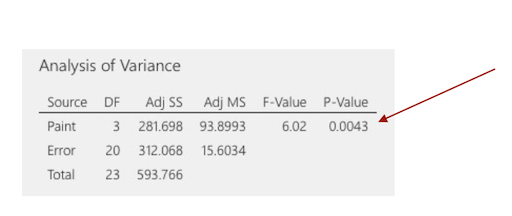  
[[minitab]](http://support.minitab.com/en-us/minitab-express/1/help-and-how-to/modeling-statistics/anova/how-to/one-way-anova/before-you-start/example/)  

Above, the p-value for the paint hardness is less than *0.05*. This result indicates that the mean differences between the hardness of the paint blends is statistically significant. And that's it. This is all an ANOVA can give us. If we'd want to know, for example, for which pairs specifically, the differences are significant, we need to add another test, e.g. the [Tukey comparison test](https://en.wikipedia.org/wiki/Tukey%27s_range_test).

  
[[minitab]](http://support.minitab.com/en-us/minitab-express/1/help-and-how-to/modeling-statistics/anova/how-to/one-way-anova/before-you-start/example/)  


#### *Two way* ANOVA

The [two way ANOVA](https://en.wikipedia.org/wiki/Two-way_analysis_of_variance) can compare more than two groups, based on *two* factors. This means that there are two independent variables, e.g., compare the employee productivity based on the working hours *and* working conditions.

We will not get into this any further. If you need this test at some point, please investigate it properly.

So far, we have only worked with well-behaved data, for which the following assumptions hold true:

* Continuous data (interval/ratio)
* Normality
* Equal Variances
* Independence

But what if our data *does not* satisfy these assumptions?

### Nonparametric Statistics

When the assumptions of parametric tests are not met, you need to consider the use of nonparametric analysis methods. Compared to parametric tests, nonparametric methods make fewer assumptions about the data. Although nonparametric tests are also called *assumption-free* tests, it should be noted that they are not actually free of assumptions. For example, the [Chi-squared test](https://en.wikipedia.org/wiki/Chi-squared_test), one of the most commonly used nonparametric tests, has specific requirements on the sample size and independence of data points. Another important message to note about nonparametric analysis is that information in the data can be lost when the data tested are actually interval or ratio. The reason is that the nonparametric analysis collapses the data into ranks so all that matters is the order of the data while the distance information between the data points is lost. Therefore, nonparametric analysis sacrifices the power to use all available information to reject a false null hypothesis in exchange for less strict assumptions about the data (Mackenzie, 2013, as cited in [13]).

Roughly, for each parametric test, there is a non-parametric equivalent:

  
[[12]](https://docs.google.com/presentation/d/1zuOq7MC9uBC8htIMuMPFmeCSSkuKENCX7a4QSiRMKXg/edit#slide=id.g5858ac2152_1_84)

[[12]](https://docs.google.com/presentation/d/1zuOq7MC9uBC8htIMuMPFmeCSSkuKENCX7a4QSiRMKXg/edit#slide=id.g5858ac2152_1_84) [13]


### Choosing a Statistical Test

Planing the statistical analysis should be an integral part of designing a study. You should answer the following questions in advance:

* What kind of data?
* How many independent variables? 
* Independent measure or repeated measure design?
* Is the data parametric or non-parametric?

Depending on what you already know, you can easily find guidelines on which statistical test to chose, such as the following for example.

  
[13]

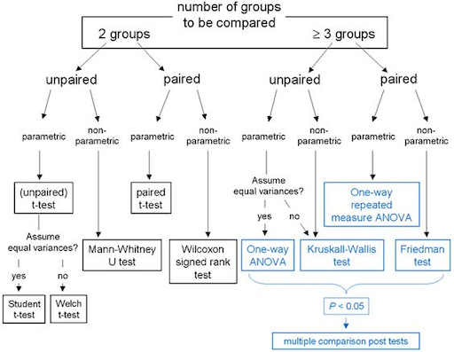  
[[12]](https://www.pinterest.de/pin/129760032996483455/?lp=true)

### Summary

Statistical analysis is a powerful tool that helps us find interesting patterns and differences in the data as well as identify relationships between variables. Before running significance tests, the data needs to be cleaned up, coded, and appropriately organized to meet the needs of the specific statistical software package. The nature of the data collected and the design of the study determine the appropriate significance test that should be used. If the data is normally distributed, parametric tests, such as a t-test or an ANOVA, are appropriate. When the normal distribution requirements are not met, nonparametric tests should be considered.  

This section about inferential statistic left you probably with many open questions and you might now feel a bit scared about inferential statistic. Good 🙃... What I mean with this is that you must be aware of the complexity of inferential statistics and that you need to invest time and effort to use it properly. The topic is, however, absolutely worth it, as it might lead to meaningful results. And ultimately, with this chapter as a starting point, giving you all the important keywords, and with a somewhat structured approach, inferential statistic is quite conquerable after all! 💪🏼

[13]

## Recommended Readings

For getting a deeper insight about general principles (not so much about forumlas):  

[The Art of Statistics: Learning from Data](https://www.amazon.de/Art-Statistics-Learning-Pelican-Books/dp/0241398630/ref=sr_1_1?adgrpid=78898993181&dchild=1&gclid=Cj0KCQjwiYL3BRDVARIsAF9E4Gc3yUP1AnNk8VBz4IyEXZ-rnPIJfmlYSH_vvQTKJSGayJZfz67mIdkaAiprEALw_wcB&hvadid=394642731820&hvdev=c&hvlocphy=9043160&hvnetw=g&hvqmt=e&hvrand=16423771134953733768&hvtargid=kwd-643051317749&hydadcr=24727_1812073&keywords=the+art+of+statistics&qid=1591790457&sr=8-1&tag=googdemozdesk-21) by David Spiegelhalter. Pelican Books. ISBN-13: 978-0241398630  

For a deeper understanding of statistical methods:  

[How to Design and Report Experiments](https://uk.sagepub.com/en-gb/eur/how-to-design-and-report-experiments/book219351) by Andy Field and Graham J. Hole. SAGE Publications. ISBN-13: 9781847872982

## Next

In the next step we will move away from the numbers and have a look into qualitative methods.

  
[[drhartnell]](https://www.drhartnell.com/surveys.html)

## References
  
[[1] My Market Research Methods - Types of Data & Measurement Scales: Nominal, Ordinal, Interval and Ratio](https://www.mymarketresearchmethods.com/types-of-data-nominal-ordinal-interval-ratio/)  
[[2] Laerd Statistics - Descriptive and Inferential Statistics](https://statistics.laerd.com/statistical-guides/descriptive-inferential-statistics.php)  
[[3] Spiegel Online - Die Schwarzen getroffen?](https://www.spiegel.de/politik/deutschland/rezo-video-die-youtube-angriffe-auf-die-cdu-im-spiegel-faktencheck-a-1268973.html)  
[[4] A. Horst, J. Couture, ESM 206 – Data Analysis & Statistics](https://docs.google.com/presentation/d/1cPWa6NqbEot8dBjVC7UKPjF72Q7myYjHqyBYS9HO_qg/edit#slide=id.g5137fefd78_1_0)  
[[5] Wiki - Lady Tasting Tea](https://en.wikipedia.org/wiki/Lady_tasting_tea)  
[[6] A. Horst, J. Couture, ESM 206 – Central Tendency and Data Spread](https://docs.google.com/presentation/d/17ejVv4SJgpU7fD09By0zCIdb7tnstfH-Yadj8UOGXHQ/edit#slide=id.g56e33918ae_2_283)  
[[7] P. Marr – Testing for Normality](http://webspace.ship.edu/pgmarr/Geo441/Lectures/Lec%205%20-%20Normality%20Testing.pdf)  
[[8] analyse-it – Normal probability (Q-Q) plot](https://analyse-it.com/docs/user-guide/distribution/continuous/normal-probability-plot#:~:text=Normal%20probability%20(Q%2DQ)%20plot,approximately%20on%20a%20straight%20line.)  
[[9] N. Gleichmann – Paired vs Unpaired T-Test: Differences, Assumptions and Hypotheses](https://www.technologynetworks.com/informatics/articles/paired-vs-unpaired-t-test-differences-assumptions-and-hypotheses-330826)  
[10] Kim, TK (2017). Understanding one way ANOVA using conceptual figures. Korean Journal of Anesthesiology 70(1): 22-26.  
[[11] A. Horst, J. Couture, ESM 206 – One Way ANOVA](https://docs.google.com/presentation/d/1uheomtmWANtL7QhCoZoqWlhMM_1xghuqBs5MR-aORh8/edit#slide=id.g5a7997fa22_2_205)  
[[12] A. Horst, J. Couture, ESM 206 – Ranked-based Tests](https://docs.google.com/presentation/d/1zuOq7MC9uBC8htIMuMPFmeCSSkuKENCX7a4QSiRMKXg/edit#slide=id.g5858ac2152_1_84)  
[13] J. Lazar, J. Feng and H. Hochheiser, *Research Methods in Human-Computer Interaction*, 2nd ed. Cambridge, MA, USA: Morgan Kaufmann, 2017.  
[[14] Sage Research Methods – Coding of Data](https://methods.sagepub.com/reference/the-sage-encyclopedia-of-communication-research-methods/i2620.xml)  
[[15] HSC Learning Repository –Independent Samples t-test](http://learntech.uwe.ac.uk/da/Default.aspx?pageid=1438)  


---

The End

🐸 💭 🔮
