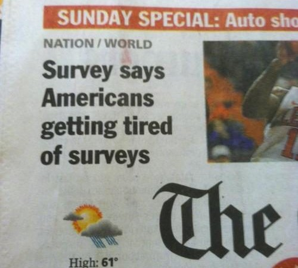

# Academic Methodologies

Prof. Dr. Lena Gieseke \| l.gieseke@filmuniversitaet.de \| Film University Babelsberg KONRAD WOLF


# Chapter 07 - Qualitative Research Methods and Analysis

- [Academic Methodologies](#academic-methodologies)
- [Chapter 07 - Qualitative Research Methods and Analysis](#chapter-07---qualitative-research-methods-and-analysis)
  - [Learning Objectives](#learning-objectives)
  - [Qualitative Research](#qualitative-research)
  - [Surveys](#surveys)
    - [Targeted Users and Inclusion Criteria](#targeted-users-and-inclusion-criteria)
    - [Sampling](#sampling)
      - [Example](#example)
      - [Nonprobabilistic Sampling](#nonprobabilistic-sampling)
    - [Developing Survey Questions](#developing-survey-questions)
      - [Overall Structure](#overall-structure)
      - [Questions](#questions)
        - [Open-Ended Questions](#open-ended-questions)
        - [Closed-ended Questions](#closed-ended-questions)
        - [Common Problems](#common-problems)
      - [Existing Surveys](#existing-surveys)
    - [Pilot Testing](#pilot-testing)
    - [Data Analysis](#data-analysis)
    - [Summary](#summary)
  - [Case Studies](#case-studies)
    - [Case Study Example - Observing Sara](#case-study-example---observing-sara)
    - [Setup](#setup)
      - [Research Question and Hypotheses](#research-question-and-hypotheses)
      - [Choosing Cases](#choosing-cases)
        - [Examples](#examples)
    - [Execution](#execution)
    - [Summary](#summary-1)
  - [Diaries](#diaries)
    - [Example - Time Diaries to Study User Frustration](#example---time-diaries-to-study-user-frustration)
    - [Summary](#summary-2)
  - [Interview and Focus Groups](#interview-and-focus-groups)
    - [Example - Green Living Interviews](#example---green-living-interviews)
    - [Focus Groups](#focus-groups)
    - [Summary](#summary-3)
  - [Ethnographie](#ethnographie)
    - [Example - Modes of Communication](#example---modes-of-communication)
    - [Execution](#execution-1)
      - [Open vs. Closed Settings](#open-vs-closed-settings)
      - [Overt vs. Covert Ethnography](#overt-vs-covert-ethnography)
      - [Active vs. Passive Observation](#active-vs-passive-observation)
    - [A Personal Perspective](#a-personal-perspective)
    - [Example Mobile and Ubiquitous Systems](#example-mobile-and-ubiquitous-systems)
    - [Summary](#summary-4)
  - [Analyzing Qualitative Data](#analyzing-qualitative-data)
    - [Types of Data Analysis](#types-of-data-analysis)
      - [Example -  Grounded Theory](#example----grounded-theory)
    - [Coding](#coding)
      - [Codes](#codes)
        - [Deductive Coding](#deductive-coding)
        - [Inductive Coding](#inductive-coding)
        - [Tipps - Defining Codes](#tipps---defining-codes)
        - [Grouping](#grouping)
        - [Accuracy](#accuracy)
      - [Coding Frames](#coding-frames)
      - [Flat Coding Frame](#flat-coding-frame)
      - [Hierarchical Coding Frame](#hierarchical-coding-frame)
        - [Manual Coding](#manual-coding)
      - [Automatic Coding](#automatic-coding)
      - [Summary](#summary-5)
    - [Analyzing Multimedia Content](#analyzing-multimedia-content)
    - [Writing up A Study](#writing-up-a-study)
    - [Summary](#summary-6)
  - [Next](#next)
  - [References](#references)

---

  
[[Dave Yeats]](https://medium.com/indeed-engineering/qualitative-before-quantitative-how-qualitative-methods-support-better-data-science-d2b01d0c4e64)


## Learning Objectives

With this chapter you gain

* an overall and intuitive understanding of qualitative research methods,
* an overview of the different, most commonly used qualitative methods in HCI, and
* an understanding of the basic principle of coding as analysis method for qualitative research data.

---

If not indicated otherwise, this chapter is based on:

J. Lazar, J. Feng and H. Hochheiser, *Research Methods in Human-Computer Interaction*, 2nd ed. Cambridge, MA, USA: Morgan Kaufmann, 2017.  

---

## Qualitative Research

## Surveys

  

Surveys are one of the most commonly used research methods, across all fields of research.  

Surveys are frequently used to describe populations, to explain behaviors, and to explore uncharted waters (Babbie, 1990, as cited in [1]). Surveys are also one of the most maligned methods. Surveys can be structured, well-tested, robust, and result in data with a high level of validity. However, surveys can be poorly done, resulting in data of questionable validity.  

> A survey is a method of gathering information by asking questions to a subset of people, the results of which can be generalized to the wider target population. 
 
There are many different types of surveys, many ways to sample a population, and many ways to collect data from that population. The Internet has become a popular mode for surveys due to the low cost of gathering data, ease and speed of survey administration, and its broadening reach across a variety of populations worldwide. [6]

A survey should be a well-defined and well-written set of questions to which an individual is asked to respond. Surveys are typically self-administered by an individual, with no researcher present; because of this, the data collected is not as deep and in-depth as with other research methods (such as ethnography or focus groups). The strength of the survey is the ability to get a large number of responses quickly from a population of users that is geographically dispersed. Surveys allow you to capture the *big picture* relatively quickly, e.g., of how individuals are interacting with a certain technology, what problems they are facing, and what actions they are taking. Surveys also allow you to make statistically accurate estimates for a population, when structured using random sampling.  

One of the reasons why surveys may be maligned is that they are often used not because they are the most appropriate method but because they are the easiest method. There are a lot of bad research projects, in which professors or students quickly write a survey, do not do sufficient pilot testing of the survey questions, distribute it to first-year students, and then claim that the survey results can generalize to other populations. Unless the actual focus of the research is university students, then this common research scenario is misguided.

Nonetheless, there are many HCI and CTech research projects possible, in which a survey is the ideal method; in which the survey is well-designed, controlled, and the resulting data has a high level of validity. Survey research may be the most appropriate methodology for measuring parameters such as ([6])

* *attitudes*
* *awareness*
* *intent*
* *user experiences*
* *characteristics of users*
* *over-time comparisons*

Surveys may be less appropriate for precise measurements. Since surveys primarily rely on users to self-administer and to remember data that might have occurred in a previous point in time, there are a lot of background details that must receive attention for the data collected to be valid and useful.

Is a survey the same thing as a questionnaire? Well, many people do use the two terms interchangeably. Others differentiate between the *questionnaire*, which is the list of questions, and the *survey*, which is the complete methodological approach, including sampling, reminders, and incentives. For instance, Dillman states clearly "that the questionnaire is only one element of a well-done survey" (Dillman, 2000, p. 149, as cited in [1]).  

### Targeted Users and Inclusion Criteria

Surveys are appropriate research methods for a number of different research goals. Surveys are good for getting responses from a large numbers of people and they are often used for collecting thousands, or even millions, of responses.  

  [[drhartnell]](https://www.drhartnell.com/surveys.html)

The population of interest is also known as the *target population* (Couper, 2000, as cited in [1]) or the *targeted users*.  For your survey design you will need to state clearly who the targeted respondents for your survey are and why these people are of interest.  

Then, survey responses need to come from only the specific population that is being studied — for instance, people of a certain age, users of a certain software application, people who work in a certain industry or company, or people who have a certain skill or even disability. Such *demographic factors* will decide whether a response from an individual is valid. Such a collection of factors is also called *targeted respondents*, *user population* and *inclusion criteria* (these all mean the same). You will need to clearly state and justify your inclusion criteria and with that who qualifies to be included in your survey study (or in any other type of research study).

### Sampling

Similar to experiment designs you differentiate between *probabilistic* or *random* sampling, *stratified* sampling (dividing your entire population in separate subpopulations and sample those) and *nonprobabilistic* sampling.  

The requirements for proper probabilistic sampling in an academic context are quite strict: you should be able to calculate the probability of getting any particular sample, which is the *population estimate*. For computing the population estimate you chose a [margin of error](https://en.wikipedia.org/wiki/Margin_of_error) and a [confidence level](https://www.statisticshowto.com/confidence-level/). 

A margin of error is a statistic expressing the amount of random sampling error in the results of a survey, meaning it represents how well the survey results reflect the overall population. The smaller the margin of error, the more confidence you may have in your results. The bigger the margin of error, the farther they can stray from the views of the total population. For example, a 60% “yes” response with a margin of error of 5% means that between 55% and 65% of the general population think that the answer is “yes.” [[8]](https://www.surveymonkey.com/mp/margin-of-error-calculator/)

The confidence level gives the probability with which the estimated interval will contain the true value of the parameter you investigate. Hence, the CL tells you how sure you can be of the margin of error. The confidence level is chosen by the researcher and a common value is 95%. 

Furthermore, you have to consider the *response rate* in regard to estimating how many people to *invite*. All of these selected individuals must meet inclusion criteria (characteristics such as being a nonsmoker or male) and not meet exclusion criteria (such as not being a native English speaker) (Sue and Ritter, 2007, as cited in [1]).

Based on these values you can either compute the needed sample size or compute the margin of error for a given sample size. There are numerous tools online for computing these values, such as the [Sample Size Calculator](https://www.checkmarket.com/sample-size-calculator/) or  the [Margin of Error Calculator](https://www.surveymonkey.com/mp/margin-of-error-calculator/).

  
[[semanticscholar]](https://pdfs.semanticscholar.org/d142/c1b2488ea054112187b347e1a5fa83a3d54e.pdf) *The required level of precision is based on the margin of error and confidence level*


#### Example

Let's say we want to make a general statement about all students at the Filmuni. How many students do we have to survey in order to generalize their responses to the whole population of students? We are also taking a response rate from 20% into consideration (a common value), meaning that only 20% of those asked to participate in the survey will do so, we end of with the following numbers:

```
Population size:  800
Margin of error:   5%
Confidence level: 95%

Then the required sample size is: 260

Response rate:      20%
Number to invite:  1300
```

Hence, with a margin of error of 5% and a response rate of 20% it is impossible to get reliable data. We could work on a better response rate, e.g., by adding incentives such as money for participation or we could accept a margin of error and make our results less reliable. For example:

```
Population size:  800
Received results:  150
Confidence level: 95%

Margin of error:   7.22%
```

#### Nonprobabilistic Sampling

Often, a clear, well-defined population of potential respondents is just not possible to define and in return we can not compute a population estimate as required for probability sampling. Then we can use nonprobability sampling. Nonprobabilistic samples include approaches such as convenience sampling (your family, friends and pets), snowball sampling (where respondents recruit other potential respondents), judgmental sampling (the researcher chooses the sample based on who they think would be appropriate), or self-selected surveys (where people themselves decide to participate e.g. by clicingk on links on a website or emails).

It is important to note that different academic communities have different standards in how they apply sampling techniques. For instance, there are many people in the fields of social science and statistics who believe that without strict random sampling, no survey data is valid (Couper, 2000; Sue and Ritter, 2007, as cited in [1]). On the other hand, the HCI community has a long history of using surveys, in many different ways, without random sampling, and this is considered valid and acceptable. Part of this difference may stem from the fact that in HCI, researchers must, typically, collect the data themselves. No large, well-structured data sets exist as for example governmental data for social sciences. The HCI researcher must go out, find users to take part in their research, and collect the data, as well as analyze the data. Because of practical aspects, both probability samples and nonprobability samples are considered valid in HCI research.  

HCI researchers often openly acknowledged that the responses represent a convenience sample. This is quite common, so, for instance, if you look at recent papers from the CHI conference, not only will you find surveys with over 1000 responses (such as Moser et al., 2016; Chilana et al., 2016, as cited in [1]), you will also find papers that combine small surveys with other research methods such as diary studies (Epstein et al., 2016, as cited in [1]), interviews (Dell and Kumar, 2016, as cited in [1]), usability testing (Kosmalla et al., 2016, as cited in [1]), and log analysis (Guy et al., 2016, as cited in [1]). These examples only scratch the surface; clearly, small, nonprobabilistic samples are used throughout HCI research on a regular basis, without concern.

[[2]](https://en.wikipedia.org/wiki/Nonprobability_sampling)  

### Developing Survey Questions

When designing a survey it is important to understand that there are two different structures in a survey: the *overall structure* of a survey, and the *structure of a single question*.

The main challenge is to develop well-written, non-biased questions. Since a majority of surveys are self administered, they must be easy enough to understand that users can fill them out by themselves.

#### Overall Structure

The questions do not exist in a vacuum, rather, they are part of an overall survey structure. Try to create a story-line for the survey so that respondents get a sense of order. Usually a survey, in any format, must begin with instructions. These instructions must make clear how the respondent is to interact with the survey (Babbie, 1990, as cited in [1]). It also helps if you can motivate people to the survey and complete it. Generally, it is a good idea to leave demographic questions until the end of the survey, as these are the least interesting (Babbie, 1990, as cited in [1]). Questions relating to a similar topic or idea should be grouped together (Dillman, 2000, as cited in [1]). You should use sections and a well-balanced layout. This tends to lower the cognitive load on respondents and allows them to think more deeply about the topic, rather than switching gear after every question.

#### Questions

Single questions can be categorized in three types: as 

* open-ended questions, 
* closed-ended questions with ordered response categories, or 
* closed-ended questions with unordered response categories 
 
(Dillman, 2000, as cited in [1]).

##### Open-Ended Questions

Open-ended questions are useful in getting a better understanding of phenomena, because they give respondents complete flexibility in their answers. However, aside from the obvious drawback of more complex data analysis, open-ended questions must be carefully worded. Otherwise, they may lead to responses that either do not really help researchers address the root question, or responses that simply do not provide enough information. Consider the following open-ended question:  

> Why did you stop using the Charleston Software?

This open-ended question provides no information about the possible causes; instead it requires the respondent to think deeply about what the causes might be (Dillman, 2000, as cited in [1]). The respondent may be too busy to come up with a complete response or may simply say something like "I didn't like the software". It is a very broad question. More specific questions might be:  

> How did you feel about the usability (ease of use) of the Charleston software? Did the Charleston software allow you to complete the tasks that you wanted to complete?

These questions address more specific topics: ease of use and task completion. The respondents cannot simply answer "I didn't like it,” although they could just answer “yes” or “no” to the second question. Perhaps another way to reword that second question might be as:  

> What barriers did you face, in attempting to use the Charleston software to complete your tasks?

In that revision, the respondents could simply say, “none” but the question also invites the respondents to think carefully about the problems that they might have faced.

##### Closed-ended Questions

There are two types of closed-ended questions. One type has *ordered* response categories, and the other type does not.  

An ordered response is when a number of choices can be given, which have some logical order (Dillman, 2000, as cited in [1]). For instance, using a scale such as *excellent to poor* or *strongly agree to strongly disagree* would be an ordered response. [Likert scale questions](https://en.wikipedia.org/wiki/Likert_scale), which often take the form of a scale of 1 to 5, 7, or 9, ask users to note where they fall on a scale of, for example, *strongly agree* to *strongly disagree*. Typically, closed-ended questions with an ordered response request respondents to choose only one item.  

  
[[quis]](http://www.lap.umd.edu/quis/) *A closed-ended question with an ordered response.*

Closed-ended questions with an unordered response allow for choices that do not have a logical order. For instance, asking about types of software applications, hardware items, user tasks, or even simple demographic information such as gender. Closed-ended questions can allow for a single or multiple selections.

  
[[1]]() *A closed-ended question with an unordered response.*

##### Common Problems

Researchers should carefully examine their questions to determine if any of these problems are present in their survey questions (Babbie, 1990):

* A *double-barreled question* asks two separate, and possibly related questions (e.g., “How long have you used the Word processing software and which advanced features have you used?”). These questions need to be separated.
* The use of negative words in questions (e.g., “Do you agree that the e-mail software is not easy to use?”) can cause confusion for the respondents.
* Biased wording in questions (such as starting a sentence with “Don't you agree that…”) can lead to biased responses. If a question begins by identifying the position of a well-respected person or organization (e.g., “Angela Merkel [or Rezo] takes the view that…”), this may also lead to a biased response.
* *Hot-button words*, such as “left-winged,” “conservative,” “terrorism,” etc. can lead to biased responses.

#### Existing Surveys

There are many existing surveys that have already been tested and validated in the research literature in HCI. For most research purposes, there will be a need to create a new survey. However, for tasks such as usability testing and evaluation, there are already a number of existing survey tools. Usually, these surveys can be modified in minimal ways. For example the website [User Interface Usability Evaluation with Web-Based Questionnaires](https://garyperlman.com/quest/) gives a summary of existing surveys and tools.

### Pilot Testing

After a survey tool is developed, it is very important to do a pilot study to help ensure that the questions are clear and unambiguous. There are two different areas of interest within a pilot study: the questions themselves and the interface of the survey.

### Data Analysis

There are several ways to analyze survey data. The analysis chosen will depend, in large part, on:

* whether it was a probabilistic or nonprobabilistic survey,
* how many responses were received, and
* whether a majority of questions were open-ended or closed-ended questions.  

Generally, the quantitative and qualitative data is separated for analysis. The data is *cleaned*, meaning that the researcher looks through and makes sure that each survey response is valid, and that none of the responses are either repeats (where the same person submitted more than one response), incomplete, or invalid (due to a respondent not meeting the qualifications). The quantitative data is ready to analyze, whereas the qualitative data must first be coded (see the Section [Analyzing Qualitative Data](#analyzing-qualitative-data)). Often, the goal of quantitative data analysis is here a set of descriptive statistics that simply describe the data collected in a manageable way (Babbie, 1990, as cited in [1]). No one but the researchers will read through every survey response so the descriptive statistics offer a short, high-level summary of the data.

### Summary

To ensure *validity* and *reliability*, survey questions should be pilot tested, to ensure that they are clear, unambiguous, and unbiased. The overall survey design should make it easy for respondents to understand and use the instrument, whether web-based, e-mailed, or on paper. Good introductions, establishing the credibility and importance of the survey, as well as providing ongoing reminders to respond, can increase the likelihood that there will be a sufficient number of responses for the data to be considered valid. Other research methods can also be useful in conjunction with surveys, such as focus groups, interviews, or time diaries.

For more about surveys refer for example to

> H. Müller, A. Sedley, and E. Ferrall-Nunge. *Survey Research in HCI*. In: Olson J, Kellogg W, eds. Ways of Knowing in HCI . New York: Springer; 2014;229–266.
  
> Dillman, D., 2000. Mail and Internet Surveys: The Tailored Design Method. John Wiley & Sons, New York.

  
[[uxknowledgebase]](https://uxknowledgebase.com/online-survey-7b01de40e678)


## Case Studies

For experiments, surveys, etc. it is usually the more the merrier in regard to the number of samples. However, for certain research projects and for certain scenarios a large sample is extremely difficult if not impossible. Fortunately, this is not a cause for despair. Case studies, in which researchers study a small number of participants (possibly as few as one) in depth, can be useful tools for information gathering and evaluation.  

> A case study is an in-depth study of a specific instance (or a small number of instances) *within a specific real-life context*.  

Close examination of individual cases can be used to build understanding, generate theories and hypotheses, present evidence for the existence of certain behavior, or to provide insight that would otherwise be difficult to gather. Case studies often use theoretical frameworks to guide both the collection of data from multiple sources and the analysis of the data (Yin, 2014, as cited in [1]). However, statistical analysis is not the goal! Instead, case studies use careful analysis of intentionally selected subjects to generate interesting and novel insights, ideally with an eye on developing general principles that might facilitate understanding of other cases.  

Case studies present a different set of challenges from studies involving larger numbers of participants. The first question you might face is determining whether or not a case study is appropriate. Given the small sample size, identifying appropriate participants may be even more important than it is for larger studies. The duration, content, and format of the study will depend upon your goals and resources. Finally, data analysis and interpretation are particularly important: you may want to be careful about making broad, sweeping claims based on your study of one case.

### Case Study Example - Observing Sara

Concerns over the limits of narrowly constructed usability studies led Shinohara and Tenenberg to conduct an in-depth examination of a blind person's use of assistive technologies as a case study (Shinohara and Tenenberg, 2007, as cited in [1]). By examining the use of a range of technologies in a user's home, they were able to address several questions that would have been difficult to consider in a lab-based usability study. Specifically, they looked at types of task that were common across multiple technologies, including both digital and physical objects, in order to identify general strategies and understand the trade-offs involved in hardware and software design.  

Shinohara and Tenenberg used a series of semi-structured interviews to collect the observations that form the basis of the case study. In a series of 6, 2-hour sessions in her home, Sara, who is blind, demonstrated how she used technologies such as tactile wristwatches and screen readers. They also discussed early memories of using various objects and her reactions to them and imagined improved designs for various objects or tasks. *Notes*, *audio recordings*, *interviewer reactions*, and *photographs* from these sessions provided the raw data for subsequent analysis. Insights and theories based on early observations were shared with the subject for validation and clarification.  

Analysis and presentation of the case study data took multiple forms. Twelve tasks were recorded in terms of their intentions/goals, limitations, workarounds, and desires for future improvements:  

  
[[1]]()

The above table can be used to compare and group seemingly unrelated tasks in search of *common themes*. Detailed descriptions — complete with representative quotations — of Sara's use of a tactile watch and screen-reader software complement this table with illustrative details. For example, discussion of the tactile watch led to a deeper understanding of the importance that Sara placed on aesthetics and her desire to be unobtrusive, as she preferred the comfortable, silent tactile watch to a talking watch, which was both noisier and larger. Examination of Sara's use of a screen reader led to the observation that she would examine all possible options, possibly even restarting from scratch, in order to achieve a goal (Shinohara and Tenenberg, 2007, as cited in [1]).  

Building upon the insights from the individual tasks, Shinohara and Tenenberg identified several general insights that could guide the design of improved tools. Examples included the importance of designs that would not make users feel self-conscious when interacting with sighted friends or colleagues. Also, the importance of control, efficiency, and portability is stressed and the need for tools that ease the process of distinguishing between similar items (such as CDs) and the need for flexibility and interoperability. Although Sara does not provide a *comprehensive picture* of the needs and concerns of blind people, the investigations of her needs and goals led to valuable in sights that might apply to many other blind people.  

### Setup

A case study is a detailed examination of one or more specific situations. The case study described above helped the researchers to understand how Sara used a variety of technologies to accomplish multiple tasks. They were specifically interested in under standing “what technologies were most valued and used, when they were used and for what purpose” (Shinohara and Tenenberg, 2007). Conducting the research in Sara's home helped the investigators gain insights into how she actually addressed real challenges, as opposed to the more contrived results that might have been seen in the lab. Four key aspects of this design can be used to describe case studies:

* in-depth investigation of a small number of cases,
* examination in context,
* multiple data sources, and
* emphasis on qualitative data and analysis.

Goals of traditional qualitative case studies generally fall into one of three categories (Yin, 2014, as cited in [1]):  

* *exploration*: understanding novel problems or situations, often with the hopes of informing new designs,
* *explanation*: developing models that can be used to understand a context of technology use,
* *description*: documenting a system, a context of technology use, or the process that led to a proposed design, and
* *demonstration*: showing how a new tool was successfully used.

The four classes of a case study are not mutually exclusive. Sara's case study for example has elements of both exploration and explanation.

Even with only one participant, Sara's case study may be more complex than you might initially think. Although only one individual is involved, this case study discusses 12 tasks. Each of these tasks is a *unit of analysis* — a distinct subject of investigation. The inclusion of multiple units of analysis within a single case is referred to as an *embedded* case study, in contrast to *holistic* studies that address only one unit in each case (Yin, 2014, as cited in [1]).

#### Research Question and Hypotheses

As with almost any other form of research, a good case study is built on the foundations of a theoretical model. Although these theories might not be cleanly testable hypotheses that can be easily disproved, they can be used to describe what you are looking for, what you think you might find, and how you will use your data to support your theories.  

Roughly speaking, there are four components of a case study design:

* questions,
* hypotheses or propositions,
* units of analysis, and
* a data analysis plan.  
  
The unit of analysis defines the *granularity* of your study — what exactly you are focusing on. Are you studying an organization, a group of people, an individual, or individual activities? These questions will guide your data collection. The final component — a data analysis plan — is described in Section [Analyzing Qualitative Data](#analyzing-qualitative-data).

Just as in other forms of research, your research questions and hypotheses guide your efforts. Taken together, your research questions and hypotheses form a *preliminary model* that will guide your development of the case study. By mapping out your interests and the range of concerns that you are trying to address, you will gain greater understanding of the criteria that you will use to choose your cases, the data sources that you might need to include, and how you will conduct your analysis.  

In Sara's case study, the researchers were interested in understanding how a blind person might use a variety of assistive technologies to accomplish tasks and to recover from task failures using workarounds. These questions led to several propositions. The investigators expected to see common types of failures and workaround strategies. They also expected that the choice of implementing features in hardware or software might influence user interactions, including failures and responses to those failures.  

A different set of research questions might have led the researchers to a very different case study. If, for example, a preliminary study had led them to believe that education or socioeconomic status might play an important role in determining how blind people use technology, they might have chosen a multiple-case design, including participants with backgrounds that differed in these relevant respects. They might also have asked a broader range of questions about background and included consideration about other aspects of their participants' lives.

#### Choosing Cases

Considerations in your choice of cases will be driven by the details of your research design. Although the analysis tools may be different, this is the same problem faced by quantitative user studies: if the participants in your study are sufficiently different from the group to which you are generalizing the hypothesis you are testing, your findings may not hold up, no matter how strong the analysis.

There are really no rules on what a case can be. You can chose a case as representative as possible, multiple-cases, edgy cases, critical cases and so on.  

If you find yourself trying to choose from a large pool of potential cases, consider expanding your research agenda to include a *screening survey* (Yin, 2011, as cited in [1]). A carefully constructed survey of potential participants can provide data that informs your selection process. Such surveys might assess both the fit between the participants and your criteria and the willingness of the participants to commit their time and energy to the success of the study.

##### Examples

| Research Question | Case Study |
|---|---|
| What are the ecological effects of wolf reintroduction | Case study of wolf reintroduction in Yellowstone National Park
| How do populist politicians use narratives about history to gain support | Case studies of Hungarian prime minister Viktor Orbán and former US president Donald Trump |
| How can teachers implement active learning strategies in mixed-level classrooms | Case study of a local school that promotes active learning |
| What are the main advantages and disadvantages of wind farms for rural communities | Case studies of three rural wind farm development projects in different parts of the country |
| How are viral marketing strategies changing the relationship between companies and consumers | Case study of the iPhone X marketing campaign |
| How do experiences of work in the gig economy (temporary, flexible jobs) differ by gender, race and age | Case studies of Deliveroo and Uber drivers in London |

[[7]](https://www.scribbr.com/methodology/case-study/)  

### Execution

The following description of the execution of a case study holds true to the execution of most qualitative research methods.

Having defined your research questions, the number of cases, the units of analysis, and determined whether your study is embedded or holistic, you are ready to plan your data collection. Specifically, you need to define the types of data you will collect and the specific procedures you will follow for collecting those data. Again, there are no limits to and rules on the data sources. You only need to make sure before hand that you can actually analyse the data you collect. To make sure that data is usable and valid, you should develop protocols for how you will use each of your data sources to collect data.  

You should also develop a protocol for the case study as a whole. In addition to the specific data sources and the procedures that you will use in examining each of these sources, the protocol includes important details that are needed to conduct the case study from start to finish. The case study protocol should start with an introduction, including the questions and hypotheses. It should continue with details of data collection procedures, including criteria for choosing cases, contact information for relevant individuals; and logistical plans for each case, including time requirements, materials, and other necessary preparations. Specific questions and methods for each of the data sources should be included in the protocol. Finally, the protocol should include an outline of the report that will be one of the products of the case study (Yin, 2014, as cited in [1]).

This might seem like an excessive amount of overhead but will help you to clarify your thinking and it makes sure that you can actually use the data you are trying to collect.

A draft outline of your report serves a similar purpose. Constructing a report before you collect any data may seem strange, but it's actually quite constructive. Many of the sections of your report are easy to enumerate. Your report will always contain

* an introduction to the problem,
* a description of your questions and hypotheses
* an explanation of your design and how it addresses those questions
* informative presentations of data and analysis,
* and discussions of results.

Within each of these components there is substantial room for adaptation to meet the needs of each project. An outline that is as specific as possible — even down to the level of describing charts, tables, and figures to be used for presentation of data and analysis — will help guide your design of the questions and methods that you will use to generate the necessary data.

A case study protocol can be a powerful tool for establishing *reliability* (Yin, 2014, as cited in [1]). If your protocol is sufficiently detailed, you should be able to use it to conduct directly comparable investigations of multiple cases — the protocol guarantees that differences in procedures are not the cause of differences in your observations or results. Ideally, a research protocol will be clear enough that it can be used by other researchers to replicate your results. Also, consider running a pilot case study.

### Summary

Close examination of contextual factors can give researchers a rich, detailed understanding of the factors that influence system requirements and determine the success or failure of proposed designs. Unlike controlled experiments, which attempt to find general answers to fairly narrow questions, case studies are deep and narrow, focusing on thorough exploration of a small set of cases.

If your research leads you to a situation that seems to be in some sense notable or perhaps unique, you might find yourself considering a case study.  

Regardless of the context, you should be clear about your goals, as they impact how you design and conduct your study. If you are interested in generalizing from your cases to make broader claims, you should be particularly careful about your research design and analysis, making sure that the data favor your arguments over alternative explanations. Open-ended explorations aimed at generating ideas and descriptions of a unique or unusual situation may not make any broader claims, but they will still benefit from a clearly thought-out design and analysis plan.

Case study research is harder than it may look. Although the small number of participants and the lack of quantitative analysis may be appealing, the studies present substantial analytical and logistical challenges. Selecting cases is often difficult, whether you are identifying the most promising participants from a large pool or worrying about the representativeness of the sole case that you have been able to find. Collecting multiple, corroborating pieces of data may be difficult and teasing interesting insights out of potentially messy and inconsistent data can be tricky.

The case study's focus on deep, narrow investigation leads to inevitable concerns about validity. How can we learn anything general from the study of a small set — sometimes only having one member — of instances of a given phenomenon? Case studies that make broad claims of generality are particularly likely to infuriate critics, who may feel that any generalization from case studies is inappropriate. When conducting and describing case study research, always take care to remember the limits of this approach, and try to avoid making claims that cannot be sustained by a small number of cases.

## Diaries

> A diary is a document created by an individual who maintains regular recordings about events in their life, at the time that those events occur (Alaszewski, 2006).

These recordings can be anything from a simple record of activities (such as a schedule) to an explanation of those activities to personal reflections on the meaning of those activities. When you are asking people to record information that is fluid and changes over time, such as their mood, or about multiple events that occur within the day, diaries are generally more accurate than other research methods (Alaszewski, 2006).

The diary method used in human-computer interaction has been adopted from other fields, primarily sociology and history (Hyldegard, 2006). For instance, diaries in history have been used to understand the feelings, experiences, and stories of both famous and unknown figures. Personal diaries of world leaders give insight to historians, while personal diaries of unknown individuals allow a documentation of the lives of those who are often left out of the official record of history (Alaszewski, 2006). In sociology, diaries are used to understand what individuals experience but otherwise seems ordinary and unremarkable to those individuals, and might be hard to understand by outsiders (Alaszewski, 2006). Other fields, such as medicine, also frequently use the diary method for research. While the focus of much experimental research in medicine is on measuring objective data that can be observed, other data which is not objective, such as the individual's feelings of pain or fatigue, can best be understood through the use of a diary (Alaszewski, 2006).

One form of diary is a *time diary*. A time diary focuses on how individuals utilize their time in different activities. The major difference between a general diary and a time diary is that general diary entries may be on an infrequent or nontemporal basis, whereas time diaries have a time focus. Individuals are asked to record entries on a regular basis, record entries when events occur and note time information, or a combination thereof. Because much of the research in HCI focuses on how long we spend in some software application, how much time we spend on a website, or how much time we lose due to frustrations or task switching, time diaries are often the prevailing type of diary used in HCI research.

Diaries fill the gaps in HCI research methods between observation in naturalistic settings, observation in a fixed lab, and surveys (Hyldegard, 2006). Many say that controlled studies in controlled settings (such as usability labs) are ideal and others say that observing users in their natural settings (such as homes or workplaces) is ideal.

### Example - Time Diaries to Study User Frustration

Time diaries have been frequently used in researching the presence of frustration among users interacting with computers. A series of research studies examined what frustrates users while using computers, how they respond to those frustrations, and how it impacts on the users' time. One study focused on 111 university students and their friends; one study focused on 50 workplace users; and a third on 100 blind users on the web (Ceaparu et al., 2004; Lazar et al., 2006, 2007). The methodology was essentially the same for all three studies: users were asked to fill out a time diary of their computer usage over a given amount of time (such as a few hours). At the beginning and end of their usage session on the computer, the users were asked to record their mood by answering a series of questions. The users were requested to fill out a *frustration experience form* each time during the session that they felt frustrated, with no minimum or maximum number of forms. Throughout the process, the time of day was recorded by users, which helped both to validate the quality of the data and to ascertain how much time was lost due to these frustration experiences. There are a number of different findings from these studies relating to causes of frustration and how users responded to the frustrations. One of the most interesting findings was how much time was lost due to frustrating situations. In the study of the student users, 38%–43% of the time spent on the computer was lost due to frustrating experiences. In the study of workplace users, 42.7% of time on the computer was lost due to frustrating experiences. In the study of blind users, 30.4% of time on the computer was lost due to frustrating experiences.

Below is the Frustration experience form (time diary) from Ceaparu et al. (2004):


### Summary

Diaries are very useful in a number of different research situations. For instance, diaries are appropriate where little is known about the usage patterns of a new technology, and there is not enough background research for an experimental study. Diaries are useful where technology is being used on the go and observation or experimental design would not be appropriate. Diaries are also useful where the research questions lead to data points that cannot easily be observed or measured such as feelings of frustration. Finally, diaries are useful in *triangulation*: using multiple research methods to explore the same phenomenon from different points of view. Diaries can help with the understanding of why something happened, not only in documenting that it did happen.

  
[[uxknowledgebase]](https://uxknowledgebase.com/diary-studies-51f58f1d1bd7)


## Interview and Focus Groups

> Interviews are targeted discussions with carefully selected respondents.
  
Potential users, domain experts and stakeholders as respondents for example can help human-computer interaction researchers understand needs, challenges, reactions to new tools, and uses of tools in practice. Conducting effective interviews requires careful consideration of *who* to involve as participants and *how* the sessions might be structured, with possibilities ranging from completely structured interviews to semi-structured and unstructured interviews.  

> Focus groups are the interview of multiple participants at once, in a group.

Focus groups can be useful for understanding a range of perspectives, but execution and analysis can be complicated by the dynamics of individuals working in a group.

### Example - Green Living Interviews

Environmental concerns have led to an interest in applying HCI techniques and practices to the development of tools and systems that encourage people to make environmentally responsible choices.  

To understand more concretely what this would mean, a group of researchers conducted a qualitative study with people in the United States who had made substantial commitment to the use of environmentally responsible systems or construction in their homes (Woodruff et al., 2008, as cited in [1]). These criteria were used because people who were willing to take the time and money to install solar panels or use salvaged materials to renovate their home were presumed to be deeply concerned about environmental matters. The researchers used green movements, green-home tours, and email lists to find appropriate participants, which led to a diverse group of 56 individuals living in 35 homes in several locations in California, New Mexico, and Oregon. Home visits were used to conduct the bulk of the data collection. Each of the visits included a semi-structured interview, a tour of the house, and other activities aimed at understanding user needs and perspectives, typically over the course of two to three hours. The visits were video recorded and photographed. These visits generated a substantial amount of data. Verbatim transcripts of all visits totaling around 3000 pages were analyzed by *affinity clustering* (Beyer and Holtzblatt, 1998, as cited in [1]). The roughly 5000 photos taken during the visit were analyzed as well. This analysis led to a detailed understanding of participants' motivation, practices, and choices. Motivations ranged from concerns about stewardship of the earth to self-reliant tendencies and a desire to be sustainability trend-setters. Participants tended to be very thoughtful about their choices, which frequently involved an ongoing and gradual process. Many spoke of the continuing effort required to maintain the systems and tools that they used, comparing the effort to living on a ship. Participants were generally highly independent, valuing uniqueness, but they also saw a value in teaching and providing an example to others. The research team used these perspectives to identify a number of implications for design in support of sustainable behavior. Detailed, in-depth learning opportunities, mentoring, and interactive tools that aid in the exploration of the impact of various alternatives might help people make decisions regarding the adoption of green tools. Social networking tools might also be used to help people establish appealing green identities. Noting that broader adoption of sustainable practices might require making these choices more approachable to a broader population, the authors suggest the development of tools that would support broader social change. Interactive technologies in support of digital democracy aimed at changing environmental policy, sharing and distribution of environmental data, and even construction of opportunities for social protest might prove constructive in this effort (Woodruff et al., 2008, as cited in [1]).

### Focus Groups

Interviewing is a powerful, but labor-intensive, data collection technique. To gather input from 20 individuals, an interviewer must meet with each person individually, perhaps for an hour or more. An attractive alternative might be to meet with several participants in focus groups. These group discussions provide a reasonably effective and inexpensive tool for easily gathering a broad range of opinions. Although opinions differ on optimal sizes, focus groups are generally not large. Some suggest between eight and 12 people (Robson, 2002, as cited in [1]), while others argue that smaller groups of five to seven participants might be more appropriate for an in-depth conversation (Krueger, 1994, as cited in [1]). A series of as many as five focus groups (Brown, 1999, as cited in [1]) could be used to engage up to 60 people in a few hours. Relying on a single focus group session is discouraged, as any single group could be unresponsive or unrepresentative. Two or more groups will increase your chances of success (Krueger, 1994, as cited in [1]).

### Summary

It's that simple — if you want to know what people want or what they think, you must ask them 😁. For researchers, this might mean in-depth conversations aimed at building models to explain how systems are used and why. For designers and builders of interfaces, interviews can help build understanding of needs and reactions to interfaces. If you want to know why your last design failed, you can start by interviewing the users.  

The choice of one-to-one interviews or focus groups involves trade-offs in time, expediency, depth, and difficulty. Focus groups let you hear from many people at once but with less depth from any given individual. You should consider the trade-off between this loss of depth and the potentially fuller understanding that may arise from a conversation between participants having multiple perspectives. Unfortunately, there are no guarantees: this intriguing dynamic conversation might not materialize. As the moderator of a focus group, you have a very important role to play: this is where the difficulty comes in. Skillful moderation can keep conversation focused and inclusive, increasing your chances of getting good data.

Interviews and focus groups might best be conducted as complements to other data collection approaches. Empirical studies, usability tests, ethnographic investigations, and case studies are among the methods that might be used alongside interviews. You can use multiple, complementary tactics to confirm findings or identify potential disconnects. Perhaps users prefer one interface design over another, even though it is slower. Why is this? Well-formed interview questions might help you understand the reasons. If you feel intimidated by these challenges, start small. A simple, fully structured interview with closed questions will help you get started. As you become more comfortable with writing questions, talking to interviewees, and analyzing data, you might move on to interviews with less structure and greater challenges.

  
[[uxknowledgebase]](https://uxknowledgebase.com/domain-expert-interview-90c8db4cbaa)


## Ethnographie

[Ethnography](https://en.wikipedia.org/wiki/Ethnography) (from Greek ἔθνος *ethnos* "folk, people, nation" and γράφω *grapho* "I write") is a branch of anthropology and the systematic study of individual cultures. 

> Ethnography is the type of qualitative research that involves immersing yourself in a particular community or organization to observe their behavior and interactions up close. 

As a form of inquiry, ethnography relies heavily on participant observation — on the researcher participating in the setting or with the people being studied, at least in some marginal role, and seeking to document, in detail, patterns of social interaction and the perspectives of participants, and to understand these in their local contexts. The word *ethnography* also refers to the written report of the research that the ethnographer produces afterwards.

Ethnographic research in human-computer interaction is particularly useful for understanding environments where stakeholders interact to complete complex tasks involving the need for coordination and exchange of information. Ethnography is based on the notion that true understanding of complex human practices and contexts requires in-depth, engaged study. Individuals often describe what they do in a way that is not accurate. The proposed solution was to become immersed in the problem, spending significant amounts of time in the working environment, talking with the staff, watching how things are done, and learning from being in the world that is being studied. A core belief in ethnography is that “to gain an understanding of a world that you know little about, you must encounter it firsthand” (Blomberg et al., 2007, as cited in [1]).  

Participation — in some form — is a critical practice in ethnography. Although researchers may not realistically be able to act exactly as if they belong to the group being studied, they try to be as involved as practically and ethically possible. Anthropologists conducting ethnographic studies of traditional societies live in these communities for several years, using participation in the activities of daily life as a means of understanding the dynamics of groups of interest.  

As soon as we start using computing technologies for communication and collaboration, we start forming groups. Whether these groups are real groups that have some physical existence outside the computing environment, such as schools (Wyeth, 2006, as cited in [1]), homes (Crabtree and Rodden, 2004; Taylor and Swan, 2005, as cited in [1]), and workplaces (Newman and Landay, 2000; Su and Mark, 2008, as cited in [1]) , or are groups that would not exist without the technological intermediary, such as virtual worlds (Ducheneaut et al., 2007, as cited in [1]), they have their own norms and dynamics that are legitimate and important subjects of study. But what does the HCI researcher hope to learn about these groups? Often, the goal is just understanding: How is a technology used? How do the features of the design influence how people use the system? HCI researchers can use ethnographic techniques of participating in the group to gain a detailed and nuanced understanding that other methods cannot provide.

[[4]](https://en.wikipedia.org/wiki/Ethnography)  

### Example - Modes of Communication

In a study aimed at understanding the importance of communication to multitasking, researchers *shadowed* 19 workers at a large US corporation, noting all of the workers' activities at their desks and following them around wherever possible. The resulting 550 hours of data, including over 13,000 events, were analyzed and coded to understand how workers switch between tasks, interlocutors, and communication media. The finding that coordinating activities with multiple people was a stressful and difficult activity led the authors to suggest that communication systems might be designed to identify interruptions that might require significant coordination effort (Su and Mark, 2008, as cited in [1]). The detailed records of communication behavior collected in this study would have been difficult, if not impossible, to collect via other means: observing the workers' activities at their desks, analyzing email transcripts, or otherwise observing some subset of their activities would have given an incomplete picture of the activities and interactions between modes of communication.

### Execution

Ethnographic research can be extremely challenging. Ethnographic studies are usually conducted *in the wild*, in homes, workplaces, educational settings, or other places where the *action* of interest takes place. As these studies often involve extended periods of interaction and observation, researchers may find themselves in unfamiliar environments for long periods of time. This time may be spent juggling between two complex and intertwined goals: understanding how to navigate the dynamics of these unfamiliar settings and conducting the observations that provide the data for subsequent analysis. This can be a challenge, to say the least.

There are a few key distinctions in ethnography which help to inform the researcher’s approach: *open* vs. *closed* settings, *overt* vs. *covert* ethnography, and *active* vs. *passive* observation. Each approach has its own advantages and disadvantages.

#### Open vs. Closed Settings

The setting of your ethnography — the environment in which you will observe your chosen community in action — may be open or closed.

An *open* or public setting is one with no formal barriers to entry. For example, you might consider a community of people living in a certain neighborhood, or the fans of a particular baseball team.

* Advantage: Gaining initial access to open groups is not too difficult…
* Disadvantage: …but it may be harder to become immersed in a less clearly defined group.

A *closed* or private setting is harder to access. This may be for example a business, a school, or a cult.

* Advantage: A closed group’s boundaries are clearly defined and the ethnographer can become fully immersed in the setting…
* Disadvantage: …but gaining access is tougher; the ethnographer may have to negotiate their way in or acquire some role in the organization.

#### Overt vs. Covert Ethnography

Most ethnography is overt. In an overt approach, the ethnographer openly states their intentions and acknowledges their role as a researcher to the members of the group being studied.

* Advantage: Overt ethnography is typically preferred for ethical reasons, as participants can provide informed consent…
* Disadvantage: …but people may behave differently with the awareness that they are being studied.

Sometimes ethnography can be *covert*. This means that the researcher does not tell participants about their research, and comes up with some other pretense for being there.

* Advantage: Covert ethnography allows access to environments where the group would not welcome a researcher…
…but hiding the researcher’s role can be considered deceptive and thus unethical.

#### Active vs. Passive Observation

Different levels of immersion in the community may be appropriate in different contexts. The ethnographer may be a more active or passive participant depending on the demands of their research and the nature of the setting.

An *active* role involves trying to fully integrate, carrying out tasks and participating in activities like any other member of the community.

* Advantage: Active participation may encourage the group to feel more comfortable with the ethnographer’s presence…
* Disadvantage: …but runs the risk of disrupting the regular functioning of the community.

A *passive* role is one in which the ethnographer stands back from the activities of others, behaving as a more distant observer and not involving themselves in the community’s activities.

* Advantage: Passive observation allows more space for careful observation and note-taking…
* Disadvantage: …but group members may behave unnaturally due to feeling they are being observed by an outsider.

While ethnographers usually have a preference, they also have to be flexible about their level of participation. For example, access to the community might depend upon engaging in certain activities, or there might be certain practices in which outsiders cannot participate.

### A Personal Perspective

Ethnography tends to take a less impersonal approach than other research methods. Due to the embedded nature of the work, an ethnography often necessarily involves discussion of your personal experiences and feelings during the research.

Example of personal reflection in an ethnography:

> During the second week, I became frustrated with my lack of progress in gaining the confidence of more than just my initial informants. The staff appeared to distrust me as an outsider…

Ethnography is not limited to making observations; it also attempts to explain the phenomena observed in a structured, narrative way. For this, you may draw on theory, but also on your direct experience and intuitions, which may well contradict the assumptions that you brought into the research.

Example of analysis in an ethnography:

> Despite the claims of Griffiths (2019), my own observations indicate that retail workers do not always develop any particular bond with one another in response to the stresses of their work. There are several possible reasons for this discrepancy: It may be that the layout of this particular store discourages such bond-forming interaction, or that my own presence was disruptive…

[[5]](https://www.scribbr.com/methodology/ethnography/)  

### Example Mobile and Ubiquitous Systems

In taking computing beyond the desktop, mobile and ubiquitous systems create context-sensitive environments where computing is part of some other, larger opportunity, instead of a primary focus of its own. Understanding how people make use of these systems while traveling, meeting with friends, or going about their daily lives presents intriguing challenges for ethnographers. A study of the use of in-car global positioning systems (GPS) used ethnographic techniques to understand how the tools changed perceptions of the larger environment and of the tasks of driving and navigating. To address these questions, a team of researchers went along for several rides — some planned and some conducted specifically for research purposes — with GPS users and, in some cases, additional passengers. Data from these rides — which lasted between 1 and 3 hours — included hundreds of pages of notes and transcriptions. Analysis of this data indicated that the GPS systems led users to be both less engaged (they didn't have to worry so much about seeing turns and landmarks) and more engaged (they were able to learn about parks and other attractions that were nearby but not visible from the road) with the surrounding environment (Leshed et al., 2008, as cited in [1]).  

Ethnographic investigations of ubiquitous computing have required some HCI researchers to go into some unexpected places. One project examined the navigation needs of firefighters, in the hopes of identifying opportunities for developing ubiquitous systems that would help firefighters find their way out of hazardous, smoke-filled environments. The research team developed a series of simulations — conducting research in actual fires being, of course, too dangerous — aimed at exploring how a tool might work. Members of the research team then donned firefighting gear and joined in a simulation involving navigational activities commonly used by firefighters. Observations from their participation, and from observing firefighters in other simulations, helped the researchers understand how firefighters use improvisation and collaboration to navigate while fighting fires (Denef et al., 2008, as cited in [1]).

### Summary

Ethnographic methods are very useful in understanding the context of technology usage. By examining the human, social, and organizational contexts of technology, a deeper understanding of who these users are can be developed. In ethnographic traditions, a better understanding of a group of people and their traditions and processes is itself a noble and worthwhile goal. However, in the HCI community, ethnography is often used as a first step, to understand a group of users, their problems, challenges, norms, and processes, with the eventual goal of building some type of technology for them or with them. Currently, ethnographic research methods are used most often in home settings, work settings, educational settings, and online. However, new approaches to ethnographic research are being developed to study, for example, how people use ubiquitous computing in real-world settings anywhere, such as the street, the subway, or a park, for activities including role-playing games, geocaching, and education (Crabtree et al., 2006, as cited in [1]).

## Analyzing Qualitative Data

Our discussions of case studies, interviews, and such introduce markedly different kinds of data associated with research questions and analysis methods that are not quite so clear-cut. Rather than searching for numerical measurements, these qualitative studies attempt to study texts, observations, video, and artifacts to understand *complex situations*. Analysis of these data often raises challenges that rarely raise with quantitative data, as we struggle to interpret ambiguous comments and understand complex situations. To make matters worse, we might never even know what the *truth* is — as multiple researchers might (and often do) have different perspectives on the same situation.  

Acknowledging these challenges, social science researchers have developed research methods designed to increase *rigor* and *validity* in analyzing qualitative data. Qualitative methods do not aim to eliminate *subjectivity* — instead, they accept that subjectivity is inherent to process of interpreting qualitative data, and they strive to show that interpretations are developed methodically to be consistent with all available data, and representative of multiple perspectives.

In terms of qualitative research, *validity* means that we use well-established and well-documented procedures to increase the accuracy of findings (Creswell, 2013, as cited in [1]). More strictly speaking, validity examines the degree to which an instrument measures what it is intended to measure (Wrench et al., 2013, as cited in [1]). *Reliability* refers to the consistency of results (Creswell, 2013, as cited in [1]. If different researchers working on a common data set come to similar conclusions, those conclusions are said to be reliable.

### Types of Data Analysis

Data analysis is the process of examining and interpreting qualitative data to understand what it represents. There are the following overall types of data analysis:

1. *Content analysis*: This is the most common example of qualitative data analysis. It refers to the categorization, tagging and thematic analysis of qualitative data. This can include combining the results of the analysis with behavioral data for deeper insights.
2. *Narrative analysis*: Some qualitative data, such as interviews or field notes may contain a story. For example, the process of choosing a software, using it, evaluating its quality and decision to buy or not buy this software next time. Narrative analysis helps understand the underlying events and their effect on the overall outcome.
3. *Discourse analysis*: This refers to the analysis of what people say in social and cultural context. It’s particularly useful when your focus is on building or strengthening a public representation or a brand.
4. *Framework analysis*: When performing qualitative data analysis, it is useful to have a framework. A code frame (a hierarchical set of themes used in coding qualitative data) is an example of such framework.
5. *Grounded theory*: This method of analysis starts by formulating a theory or is based on a theory. Then the theory can be connected actual data. Then additional cases can be examined to see if they are relevant and can add to the original theory.

#### Example -  Grounded Theory

We might analyze chat logs to study the online behavior of Internet users. Reading these logs, we might notice that three factors, namely personality, education, and computer-related experience are repeatedly found to influence users’ online behavior. We continue to study each of those three factors and how they relate to each other. We study the literature in psychology and sociology to understand the types of personality, how an individual forms and develops a specific personality, and how a specific type of personality affects an individual’s social behavior. Once we have a thorough understanding of the three factors, we can tie the knowledge back to the original texts and examine how each of the components affects a user’s online behavior. Specifically, we might use our literature review to identify specific personality or educational behaviors that might influence online behaviors.

> Such an application of experience and contextual knowledge is critical for the appropriate interpretation of qualitative data and the entire knowledge discovery process.  

### Coding

This section is based on  
[[3] Insights by Thematic - Coding Qualitative Data: How to Code Qualitative Research](https://en.wikipedia.org/wiki/Nonprobability_sampling)  

The goal of qualitative analysis is to turn the unstructured data found in texts and other artifacts into a detailed description about the important aspects of the situation or problem under consideration. This description can take many forms, including textual narratives, graphical diagrams, and summary tables. These items can often be combined to provide the range of perspectives needed for understanding the underlying complexity. One of the main qualitative methods to ensure *reliable* and *valid* data is the process of *coding*, which assigns labels to observation from text or other qualitative data forms.

Imagine, you collected feedback about a developed website with open-ended, free-text questions (from reviews, surveys, complaints, chat messages, interviews, case notes, social media posts, etc.) and you end up with hundreds of free-text responses. How can you turn all of that text into applicable information to improve your system? By coding qualitative data.

> Coding is the process of labeling and organizing your qualitative data to identify different themes and the relationships between them.  

When coding e.g. open-ended text answers, you assign labels to words or phrases that represent important (and recurring) themes in each response. 

Coding qualitative research to find common themes and concepts is part of a *thematic analysis*, which is part of qualitative data analysis. Thematic analysis extracts themes from text by analyzing the word and sentence structure.

  
[[pinimg]](https://i.pinimg.com/564x/4a/dc/45/4adc4569928cdb623f4ba21f788b7102.jpg) *Simple example of coding.*


Once you have established such a coding, you can analyze your data. 

#### Codes

> A code is a label.

These labels can be words, phrases, or numbers; it is recommend to use words or short phrases, since they’re easier to remember, skim, and organize.  

##### Deductive Coding

Deductive coding means you start with a *predefined set of codes*, then assign those codes to the new qualitative data. These codes might come from previous research, or you might already know what themes you’re interested in analyzing. Deductive coding is also called concept-driven coding.  

For example, let’s say you’re conducting a survey on user experience with a web-store. You want to understand the problems that arise from long processing wait times, so you choose to make “processing wait time” one of your codes before you start looking at the data.  

The deductive approach can save time and help guarantee that your areas of interest are coded. But you also need to be careful of bias; when you start with predefined codes, you have a bias as to what the answers will be. Make sure you don’t miss other important themes by focusing too hard on proving your own hypothesis.  

##### Inductive Coding

Inductive coding, also called *open coding*, starts from scratch and creates codes based on the qualitative data itself. You don’t have a set codebook; all codes arise directly from the survey responses.

Here’s how inductive coding works:

1. Break your qualitative dataset into smaller samples.
2. Read a sample of the data.
3. Create codes that will cover the sample.
4. Reread the sample and apply the codes.
5. Read a new sample of data, applying the codes you created for the first sample.
6. Note where codes don’t match or where you need additional codes.
7. Create new codes based on the second sample.
8. Go back and recode all responses again.
9. Repeat from step 5 until you’ve coded all of your data.

If you add a new code, split an existing code into two, or change the description of a code, make sure to review how this change will affect the coding of all responses. Otherwise, the same responses at different points in the survey could end up with different codes.

Sounds like a lot of work, right? Inductive coding is an iterative process, which means it takes longer and is more thorough than deductive coding. But it also gives you a more complete, unbiased look at the themes throughout your data.  

##### Tipps - Defining Codes

1. Cover as many responses as possible. The code should be generic enough to apply to multiple comments, but specific enough to be useful in your analysis. For example, “Product” is a broad code that will cover a variety of responses — but it’s also pretty vague. What about the product? On the other hand, “Product stops working after using it for 3 hours” is very specific and probably won’t apply to many responses. “Poor product quality” or “short product lifespan” might be a happy medium.
2. Avoid commonalities. Having similar codes is okay as long as they serve different purposes. “Customer service” and “Product” are different enough from one another, while “Customer service” and “Customer support” may have subtle differences but should likely be combined into one code.
3. Capture the positive and the negative. Try to create codes that contrast with each other to track both the positive and negative elements of a topic separately. For example, “Useful product features” and “Unnecessary product features” would be two different codes to capture two different themes.
4. Reduce data — to a point. Let’s look at the two extremes: There are as many codes as there are responses, or one code applies to every single response. In both cases, the coding exercise is pointless; you don’t learn anything new about your data or your customers. To make your analysis as useful as possible, try to find a balance between having too many and too few codes.

##### Grouping

Make sure to group responses with the same themes under the same code, even if they don’t use the same exact wording. For example, a code such as *cleanliness* could cover responses including words and phrases like clean, tidy, dirty, dusty, looked like a dump, could eat off the floor, etc.

Having only a few codes and hierarchical framing makes it easier to group different words and phrases under one code. If you have too many codes, especially in a flat frame, your results can become ambiguous and themes can overlap. Manual coding also requires the coder to remember or be able to find all of the relevant codes; the more codes you have, the harder it is to find the ones you need, no matter how organized your codebook is.  

##### Accuracy

One thing to watch out for is *definitional drift*, which occurs when the data at the beginning of the data set is coded differently than the material coded later. Check for definitional drift across the entire dataset and keep notes with descriptions of how the codes vary across the results. If multiple coders are working together on one project, accuracy is especially a problem. Make sure to check each other's coding to help eliminate cognitive biases.

#### Coding Frames

When you create your codes, you need to put them into a *coding frame*. 

> A coding frame represents the organizational structure of the themes in your research. 

There are two types of coding frames: flat and hierarchical.

#### Flat Coding Frame

A flat coding frame assigns the same level of specificity and importance to each code. While this might feel like an easier and faster method for manual coding, it can be difficult to organize and navigate the themes and concepts as you create more and more codes. It also makes it hard to figure out which themes are most important, which can slow down decision making. 

#### Hierarchical Coding Frame

Hierarchical frames help you organize codes based on how they relate to one another. For example, you can organize the codes based on your customers’ feelings on a certain topic:

  
[[thematic]](https://getthematic.com/insights/coding-qualitative-data/)

In this example:

1. The top-level code describes the topic (customer service).
2. The mid-level code specifies whether the sentiment is positive or negative.
3. The third level details the attribute or specific theme associated with the topic.

Hierarchical framing supports a larger code frame and lets you organize codes based on an organizational structure. It also allows for different levels of granularity in your coding.  

Whether your code frames are hierarchical or flat, your code frames should be flexible. Manually analyzing survey data takes a lot of time and effort; make sure you can use your results in different contexts.

For example, if your survey asks customers about customer service, you might only use codes that capture answers about customer service. Then you realize that the same survey responses have a lot of comments about your company’s products. To learn more about what people say about your products, you may have to code all of the responses from scratch! A flexible coding frame covers different topics and insights, which lets you reuse the results later on.  

##### Manual Coding

Different researchers have different processes, but manual coding usually looks something like this:

1. Choose whether you’ll use *deductive* or *inductive* coding.
2. Read through your data to get a sense of what it looks like. Assign your first set of *codes*.
3. Go through your data line-by-line to code as much as possible. Your codes should become more detailed at this step. 
4. Categorize your codes and figure out how they fit into your *coding frame*.
5. Identify which themes come up the most — and start your interpretation of them.

#### Automatic Coding

While manual human analysis is still popular due to its perceived high accuracy, automating the analysis is slowly becoming a valuable option due to advances in natural language processing and machine learning. Unlike manual analysis, which is prone to bias and doesn’t scale to the amount of qualitative data that is generated today, automating analysis is not only more consistent and therefore can be more accurate, but can also save a ton of time.  

  
[[thematic]](https://getthematic.com/insights/coding-qualitative-data/) *The software Thematic categorizes qualitative data into themes.*

#### Summary

Coding is the process of labeling and organizing your qualitative data to identify themes. After you code your qualitative data, you can analyze it just like numerical data. Inductive coding (without a predefined code frame) is more difficult, but less prone to bias, than deductive coding. Code frames can be flat (easier and faster to use) or hierarchical (more powerful and organized). Your code frames need to be flexible enough that you can make the most of your results and use them in different contexts. When creating codes, make sure they cover several responses, contrast one another, and strike a balance between too much and too little information.  

Consistent coding is absolutely necessary for accuracy. Establish coding procedures and guidelines and keep an eye out for definitional drift in your qualitative data analysis.  

[[3]](https://en.wikipedia.org/wiki/Nonprobability_sampling)  

### Analyzing Multimedia Content

Multimedia information such as screen shots, cursor movement tracks, facial expressions, gestures, pictures, sound, and videos provide researchers an amazingly rich pool of data to study how users interact with computers or computer-related devices.  

Multimedia information also presents substantial challenges for data analysis. In order to find interesting patterns in the interactions, the image, audio, and video data need to be coded for specific instances (i.e. a specific gesture, event, or sound). Without the support of automated tools, the researcher would have to manually go through hours of audio or video recordings to identify and code the instances of specific interest. This process can be extremely time-consuming, tedious, and in many cases, impractical.  

The basic guidelines for analyzing text content also apply to multimedia content.  

A recent development in this field is the *partially automated* approach. Human coders manually annotate a subset of the multimedia data. Then the manually coded data is used to train the application to establish the connection between the low-level features and the high-level concept. Once a concept detector is established, the detector can be used to automatically annotate the rest of the data (Rui and Qi, 2007, as cited in [1]). The same approach can be applied to images and video and audio clips. The techniques for multimedia content analysis are built on top of multiple domains including image processing, computer vision, pattern recognition and graphics. One of the commonly adopted approaches used by all those fields is machine learning. The specific algorithms or techniques of multimedia content analysis are still seeing dramatic advances. For more detailed information on those topics, see publications in the related fields (Hanjalic et al., 2006; Sebe et al., 2007; Divakaran, 2009; Ohm, 2016, as cited in [1]). The specific applications that are particularly interesting to the HCI field include action recognition and motion tracking (Zhu et al., 2006; Vondrak et al., 2012, as cited in [1]), body tracking (Li et al., 2006, as cited in [1]), face recognition, facial expression analysis (Wu et al., 2006; Wolf et al., 2016, as cited in [1]), gesture recognition (Argyros and Lourakis, 2006, as cited in [1]), object classification and tracking (Dedeoğlu et al., 2006; Guo et al., 2015, as cited in [1]), and voice activity detection (Xue et al., 2006, as cited in [1]). A substantial number of studies have focused on automatic annotation and management of images. In addition to the automatic annotation applications, a number of other tools have been developed to facilitate the process of multimedia content analysis. Dragicevic et al. (2008) developed a direct manipulation video player that allows a video analyst to directly drag and move the object of interest in the video to specific locations along their visual trajectory. Wilhelm et al. (2004) developed a mobile media metadata framework that enables image annotation on a mobile phone as soon as a picture is taken. The unique feature of this system is that it guesses the content of the picture for the purpose of reducing the amount of text entry needed during the annotation. Kandel et al. (2008) proposed the PhotoSpread system, which allows users to organize and analyze photos and images via an easy-to-use spreadsheet with direct manipulation functions. Applications that support content visualization for easy data sharing and analysis have also been developed (Cristani et al., 2008, as cited in [1]). The ChronoViz tool supports playback and review of multiple, synchronized streams of multimedia data (Fouse et al., 2011, as cited in [1]). Techniques for automatic annotation still need substantial advancements in order to achieve reliable coding. The applications to facilitate manual coding have shown promising results but improvements are also needed to improve the usability and reliability of those systems.

### Writing up A Study

Documenting a qualitative study can be challenging. More so than many other presentations of research results, qualitative studies often read like *descriptive discussions*. Instead of presenting quantitative data or statistical results, you may find yourself trying to construct a *narrative argument* that uses the strength of the organization and writing to construct a convincing argument. In other words, your study may live or die on the strength of your writing.

First of all, you should make your theories, data, methodologies, analytic steps, and models as explicit as possible. Presentation of data and analysis may take many forms. You might present summaries of your data followed by detailed analysis or you might intersperse data with interpretation. Study reports often use analyses of individual observations or incidents to draw attention to noteworthy details. These analyses set the stage for discussions of broader themes that arise from the analysis. Study data are usually presented in one of two forms — either *thematically* (Shinohara and Tenenberg, 2007, as cited in [1]) or *chronologically* (Farooq et al., 2007a, as cited in [1]). Chronological presentation is particularly useful for case studies that describe a project or process. Story-telling is often an important component of a study report. Carefully chosen anecdotes bring concrete details to your discussion, supporting your analytic results.

When appropriate, your study report should also discuss rival explanations. Having taken the time to consider alternative explanations for any of your analytic results, you should document the results of this effort. Introducing the rival theories and explaining why the available evidence better supports your conclusions can bolster the credibility of your report. If you do not find any evidence in favor of the alternatives say so (Yin, 2011, 2014). Your write-up of your study should reflect the limitations of the chosen research method. Any discussions of observations that may apply to the community as a whole should be phrased so as to avoid claims of generality. If you make the same observation for several cases, you might say that your observation appears to apply to a broader population, but you should not claim that your conclusion is definitively general. You might also say that these recurring trends merit further investigation, implying the need for a more rigorously sampled study that would determine whether the findings were generally applicable. Proper attention to the validity of the claims that you are making will help defend you from critics who may feel that you are being overly broad in your interpretation.

Once you have written a draft of your report, you might consider letting your study participants read it (depending on the method chosen). This can be a valuable reality check—if your participants believe that you have the facts wrong, you may have a problem that needs to be revisited.

### Summary

Text, multimedia, and other qualitative data are important sources of information for HCI researchers and practitioners. The procedure and techniques commonly used to analyze qualitative data are quite different from those applied to the analysis of quantitative data. Probably the most unique characteristic of content analysis is that it involves human coding. The absence of numeric data and direct measures makes qualitative data analysis more susceptible to biased interpretation or subjective manipulation. Therefore, it is critical to adopt well established procedures and techniques to ensure high-quality analysis that is both valid and reliable. Although there is disagreement regarding its implementation process and guidelines, grounded theory is widely used for qualitative data analysis. The major difference between grounded theory and other qualitative research strategies is its emphasis on theory development in continuous interplay between data collection and data analysis.

When analyzing text content, we need to develop a set of coding categories that accurately summarizes the data or describes the underlying relationships or patterns buried in the data. The basic guidelines for analyzing text content also apply to multimedia content. Due to the special nature of multimedia data, the analysis can be much more labor-intensive than for text data if a completely manual annotation procedure is adopted. In order to address that challenge, a number of techniques have been developed to assist the annotation of multimedia data. To date, the completely automated annotation techniques are highly error prone. Applications to facilitate manual coding have shown promising results and may serve as a useful tool for analyzing multimedia data.

## Next

There is one more research method left for us to look at: a literature review!  
  
Also, we will have a brief look into how to work with literature in general, e.g. how to find it, how to manage it, etc.

After that chapter we can finally start the writing!

## References
  
[1] J. Lazar, J. Feng and H. Hochheiser, *Research Methods in Human-Computer Interaction*, 2nd ed. Cambridge, MA, USA: Morgan Kaufmann, 2017.  
[[2] Wiki - Nonprobability sampling](https://en.wikipedia.org/wiki/Nonprobability_sampling)  
[[3] Insights by Thematic - Coding Qualitative Data: How to Code Qualitative Research](https://en.wikipedia.org/wiki/Nonprobability_sampling)  
[[4] Wiki - Ethnography](https://en.wikipedia.org/wiki/Ethnography)  
[[5] Scribbr - A Guide to Ethnography](https://www.scribbr.com/methodology/ethnography/)  
[6] H. Müller, A. Sedley, and E. Ferrall-Nunge. *Survey Research in HCI*. In: Olson J, Kellogg W, eds. Ways of Knowing in HCI . New York: Springer; 2014;229–266.  
[[7] Scribbr - How to do a case study](https://www.scribbr.com/methodology/case-study/)  
[[8] Survey Monkey - Margin of error calculator](https://www.surveymonkey.com/mp/margin-of-error-calculator/)  

---

The End

🕵🏼‍♀️ 📝 👁