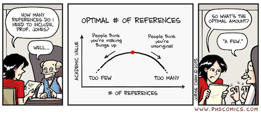
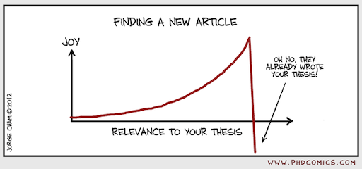
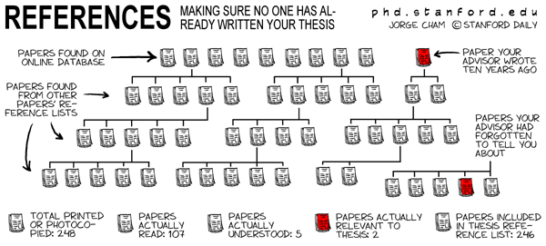
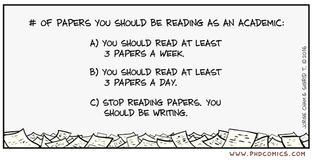
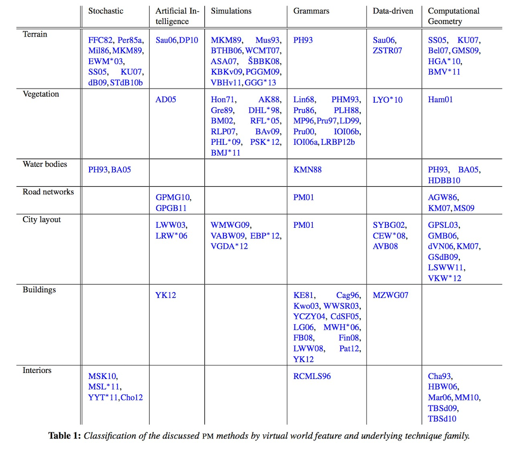
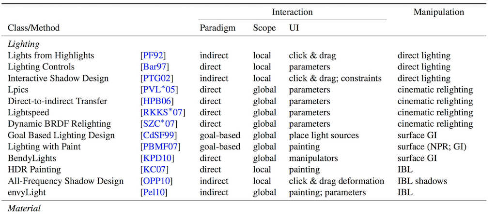
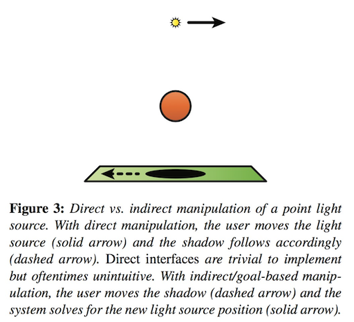
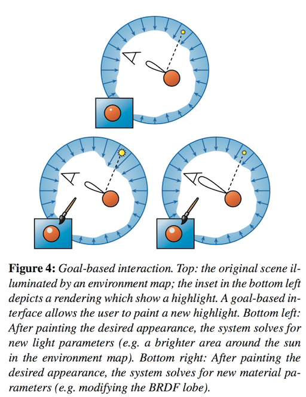
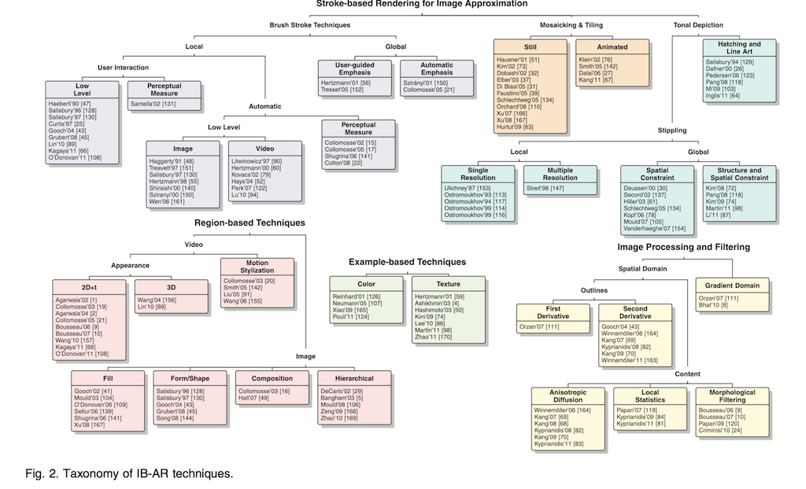
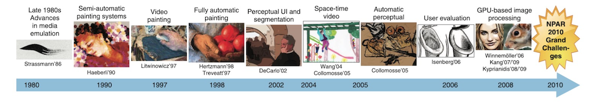

# Academic Methodologies

Prof. Dr. Lena Gieseke \| l.gieseke@filmuniversitaet.de \| Film University Babelsberg KONRAD WOLF

# Chapter 08 - Working With Literature

* [Academic Methodologies](#academic-methodologies)
* [Chapter 08 - Working With Literature](#chapter-08---working-with-literature)
    * [Learning Objectives](#learning-objectives)
    * [When to Start?](#when-to-start)
    * [How To Search?](#how-to-search)
    * [Where to Search?](#where-to-search)
        * [Search Engines](#search-engines)
        * [Digital Libraries](#digital-libraries)
    * [Collection Strategies](#collection-strategies)
    * [Reading Strategies](#reading-strategies)
    * [Management Tools](#management-tools)
    * [Writing About Related Work](#writing-about-related-work)
    * [Literature Survey](#literature-survey)
    * [Next](#next)
    * [References](#references)

---

The review of literature plays a major role for any research project. Remember, research is about *novelty* and *relevance* and both factors you can proof for your work by referring to the suitable related work. This is a difficult balancing act, as on the one hand you want to cite as many and as important literature of the same topic as yours as possible to show that your work is relevant. On the other hand you want to show that all these references are not doing what you are doing and that you are adding novelty to the state of the art with your project.

  
[[phdcomics]](http://phdcomics.com/comics.php?f=1821)

The use of literature of course also depends on the discipline. In text-based humanities research such as philosophy, researchers usually write books as they need a lot of text to elaborate a line of argumentation. Here, other books are the related work. In the natural sciences and computer science, for example, research is communicated through much shorter articles, called *papers*. Hence, also papers are here the relevant literature. In these disciplines you usually only refer to books for fundamental theories and approaches, not for novel insights in research. The system of papers has also something to do with the duration it takes to publish a book vs. a paper. In computer science, once a book is finally published, the technology might have already changed.

As a junior researcher, working with literature can be a quite daunting tasks. There is just sooooo much out there. Also, when working on a new research idea, you will usually always find at some point some work that is too close to your project for your taste. You just need to accept that this is a *normal* state and not the exception. Read the related work closely and usually you will find a spin for your paper to make it different. That being said, for my first attempted paper submission I found a closely related paper a couple of days before the deadline, which made me withdraw my paper. Was that a happy moment in my career? Definitely not. Did I survive? Yes, I did. Also, I published a slightly different version of the work at a later time.  

The aspect that there are just so many relevant papers out there also leads to the fact that you have always an unmanageable number of papers on your todo list to read. And that number never goes down. With every paper you read you find three new papers, which you should read.

For now, there is really no easy solution to handling the at times overwhelming related work. But you will get used to it. Just accept the fact that you can not read all the relevant papers and trust yourself that you are reading and knowing relevant ones. And if not, then what happens? Luckily, if we make mistakes no plane crashes, no patient dies, no economy goes down... good for us. Also, if you make research and writing papers your profession you will eventually come to a state that within a very tiny topic area you do know all the relevant related work as most of it is your own work 😁. 

  
[[phdcomics]](https://researchguides.smu.edu.sg/c.php?g=421745&p=6436277)

*On a side note*: In regard to the term *related work*, when is it *work*, when *works*? This depends on the context of the writing in question. If you want to pluralize work to works it should be in the case of referring to the body of work as multiple discrete items (e.g. works of art). Examples:

*works*

* John had done a great deal of writing for clients in the past on the same topics. His related works included blog posts on Spiegel Online, Zeit and Süddeutsche and a magazine article for Wired.

*work*

* John had done a great deal of related work, writing on these same topics in the past.

[[1]](https://english.stackexchange.com/questions/55898/related-work-or-related-works)

*On a side note*: Arguably, this chapter could have also been the first one of the lecture after the intro as a specific research project usually *starts* with literature work. But because I wanted to give you some more general backgrounds to research, communicate the depth of this topic, and to connect these insights to the methodologies and methods, I chose the current order of topics.

## Learning Objectives

* An understanding of how to work with literature in general.
* Knowledge of where to find related work, search- and collection strategies.
* Knowledge of what a management tool should do and specific options for that.
* An understanding of how to write a literature survey.

---

## When to Start?

There are several approaches to including literature into your research process. It depends on your project and your personal style.

Usually, e.g. when starting a Phd or your master thesis, you only have a rough idea of your topic without any specific research questions. Then you start to read very broadly to get an overview and to feed your brain. At some point you will need to come up with a specific question and solution ideas based on what you have read. In that phase it might be a good idea to stay away from too much outside influences and related work to be creative on your own. Once you have come up with a direction for your work, it is time again to find relevant work for your specific tasks. For all steps you do, you will need to check the literature for. You should add a reference that supports a decision you made whenever possible. Something that is already published is accepted as valid and good and you do not need to proof that all over again. Your task is to *add* to that.

## How To Search?

You can base your search for related work on

* titles and keywords,
* authors,
* references in papers (follow citations)
* topics, and
* venues, auch as journals, conferences that fit topic-wise.

The list above goes approximately from the most narrow search strategy to a broad overview.

  
[[phdcomics]](http://phdcomics.com/comics/archive.php?comicid=286)

## Where to Search?

I already gave you an overview about search engines, digital libraries and venues in the lecture Academic Readings 2. Please refer to [that resource](https://github.com/ctechfilmuniversity/lecture_academic_readings_2/blob/master/libraries_venues.md) for more details. The following are the most important search tools in the context of computer science.

### Search Engines

Search engines are usually non-topic specific. 

* [Google Scholar](https://scholar.google.de/)
    * Best in terms of volume and being up-to-date
    * Shows you where to find the document
    * You can follow who cited that entry

### Digital Libraries

Digital Libraries are usually based on organization, publishers and journals and therefore somewhat topic specific. 

* [ACM Digital Library](https://dl.acm.org/)
    * Association for Computer Machinery
    * Computing society
    * All content is of a certain quality
* [MIT Press](https://www.mitpressjournals.org/action/showPublications)
    * Content is hardly accessible without a subscription
    * Interdisciplinary
* [IEEE Xplore](https://ieeexplore.ieee.org/Xplore/home.jsp)
    * Institute of Electrical and Electronic Engineers 
    * Technical professional organization dedicated to advancing technology
* [Springer Link](https://link.springer.com/)
    * Multiple disciplines
* [Elsevier](https://www.sciencedirect.com/)
    * Multiple disciplines

A personal paper collection site (mainly for computer graphics topics), which is very well made is [Ke-Sen Huang's Home Page](https://kesen.realtimerendering.com).

## Collection Strategies

You will need some collection strategies for avoiding to fall into the rabbit whole that is searching for papers. This is potentially a task that can steal you a lot of time without any meaningful outcome (*but it is all soo interesting...* 🙄).

  
[[theshirtlist]](https://www.theshirtlist.com/down-the-rabbit-hole-t-shirt-2/)

Once again, you will need to come up with your own style here on how to collect papers. Some of my recommendations are:

* Set yourself a time frame, otherwise hours over hours might just pass by.
* Decide on the type of search you want to do: narrow vs. broad. What is it you want to archive with this search? Get an overview? Get specific related work for an algorithm?
* For a more narrow search, be disciplined about staying on track of certain keywords, for example.
* Maybe decide on a number of papers you want to save, which should be connected to the actual time you have to read them.
* Have a setup ready that decides
    * how to decide which papers to save,
    * how (pdf vs. online link?), where and under which name to save papers,
        * E.g. I save paper as `firstauthorlastname_year_firstlettersofthefirstthreewordsofthetitle.pdf`, such as `wong_1998_cgf.pdf`
    * wether to give them directly a prioritization on what to read next, and
    * how to make sure that you come back to these papers and actually read them.

What I usually do, when encountering a potentially relevant paper, is to

* read the title,
* read the abstract,
* look for a list of contributions and if found read them,
* look at the figures one by one and read their captions, and
* look at additional materials such as a project page or supplemental videos.

The more decisions you make about the paper right away (whether to save, read, read first, tags,... ?), the more time you save later on, when you have to once again remember what the paper was about and whether you should read it.

  
[[phdcomics]](http://phdcomics.com/comics.php?f=1901)

## Reading Strategies

Overall, reading as many papers as possible, will make you a better researcher. Also try to read papers from different venues and topics. I, for example had a paper once rejected because something similar was published in a mathematical journal, of which I simply didn't know it existed.

Ideally, you should have a system, which tells you which paper to read next. For this also literature management tools can be helpful (see next section).

The most important aspect about reading a paper is to read with *intention*. Know in advance 

* *Why are you reading this paper?*
* *What is it that you want to know and gain from reading this paper?*

You can gain some insight on how to read computer science publications, with there references [fong_2004_htr](../01_sessions/06_qualitativeresearch_literature/fong_2004_htr.pdf), [keshav_2016_htr](../01_sessions/06_qualitativeresearch_literature/keshav_2016_htr.pdf).

Other possible approaches to reading a paper are the [SQ3R](https://en.wikipedia.org/wiki/SQ3R) or the [PQ4R](https://methodenkompetenz.blogs.uni-hamburg.de/pq4r-methode/) methods, including the steps of:

* **P**review
    * Overview, scanning
* **Q**uestions
    * What do you want to know from the paper?
* **R**ead
* **R**eflect
    * Reflect arguments, are there counter arguments?
* **R**ecite
    * Be able to summarize content in your own words.
* **R**eview
    * Critical questioning of content.

## Management Tools

There are several tools designed for the work with related work, specifically with saving them and to generate citations. The tools differ in aspects such as import/export, annotation and note taking, export of citations and collaboration. Unfortunately, I might not be up to date here on the latest tools (please let me know of you know of a tool worth mentioning)

* [EndNote](https://en.wikipedia.org/wiki/EndNote)
* [Citavi](https://en.wikipedia.org/wiki/Citavi)
* [JabRef](https://en.wikipedia.org/wiki/JabRef) (open-source)
* [Zotero](https://en.wikipedia.org/wiki/Zotero) (open-source) (I used to work with this)
* [Mendeley](https://en.wikipedia.org/wiki/Mendeley)
* [Qiqqa](https://en.wikipedia.org/wiki/Qiqqa)
* [ReadCube](https://en.wikipedia.org/wiki/ReadCube)
* [Researchgate](https://en.wikipedia.org/wiki/ResearchGate) (more of a social network)
* Your own management of [BibTeX](https://en.wikipedia.org/wiki/BibTeX) entries. BibTeX is a text-based data format used by LaTeX. BibTeX can be integrated into markdown files and html renderings of them with [pandoc](https://pandoc.org/). In the end I only worked with this setup as it was lean while giving me the most freedom. 

What I noticed is that I can remember a paper much better with an image than by its title. Hence I usually save one representative preview image, e.g. from their teaser, for each paper.

It is really up to you which tool or setup to use. I could also imagine that there are more novel web-based tools out there. I recommend against downloading every single paper pdf. But of course, you will need some form of copy of a paper, if you want to annotate a paper. However, I had at times an unmanageable amount of pdf files on my machine and had outsource their storage. But that was also back in the day, when we had less storage... 👵🏼. Also, I would like to encourage you not to print out the papers but to get used to reading and annotating them on a screen. I printed out so many papers that I never actually read - what a waste! Please don't repeat this bad behavior. The only thing good about this, was the feeling of throwing all my papers physically into the trash, once I had completed my phd.

Whatever tool you chose, make a choice early on!

## Writing About Related Work

Usually you write in academia about related work specifically in two forms: in your *related work* section of your thesis, paper, etc. or with literature as the research project itself as a *literature survey paper*, which is also called *state of the art report (STAR)*.

I will get into how to write a *related work* section in *Chapter 09 - Academic Writing*.

## Literature Survey

State of the art (STAR) papers are a systematic and comprehensive reflection of the present state of a specific research topic. They investigate what is known and what open questions there still are. They do so on the basis of the currently available literature, e.g. other papers. A STAR is a [meta analysis](https://en.wikipedia.org/wiki/Meta-analysis) of a research topic and you could also consider it a specific type of case study (with the papers as cases). 

A STAR usually goes far beyond a simple collection and summary of the topic and its related work. The most common contributions of STAR papers are a timeline, the development of a common terminology, a classification (usually as a table), a [taxonomy](https://en.wikipedia.org/wiki/Taxonomy_(general)) (usually as a tree) and a comparison based on certain features. But you will see different approaches. 

To write a STAR you should start with the topic and some ideas what your contributions should be. Based on these you define a search strategy (rigor, completeness) and a scope (criteria for inclusion and exclusion). Both should be discussed in the paper.

A classification example from *A Survey on Procedural Modeling for Virtual Worlds* [[Smelik et al. 2014](https://onlinelibrary.wiley.com/doi/abs/10.1111/cgf.12276)]:

  

A classification example from *State of the Art in Artistic Editing of Appearance, Lighting, and Material* ([Schmidt et al. 2016](https://onlinelibrary.wiley.com/doi/abs/10.1111/cgf.12721)):

  

<!-- These are based on their specifically defined interaction paradigms:

  -->

A taxonomy example from *State of the “Art”: A Taxonomy of Artistic Stylization Techniques for Images and Video* [[Kyprianidis et al. 2013](https://ieeexplore.ieee.org/document/6243138)]:

  

In this paper also a timeline is given:

  

Or, more recently, from yours, truly 😎: *A Survey of Control Mechanisms for Creative Pattern Generation* [[Gieseke at al. 2021]](https://diglib.eg.org/handle/10.1111/cgf142658)

For more examples, the Eurographics has each year a section solely dedicated to STARs. Unfortunately I could not find an overview page for all STARs over the years, only [per year](https://diglib.eg.org/handle/10.2312/2632888).

## Next

Now that we have all building blocks for writing a paper in place - meaning the research question, methods and literature - we can actually start the writing, which is the topic of the next chapter.

## References
  
[[1] Stackexchange](https://english.stackexchange.com/questions/55898/related-work-or-related-works)

---

The End

📚 🗂 🧐