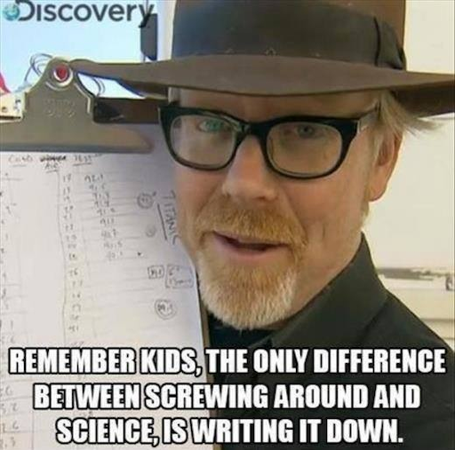
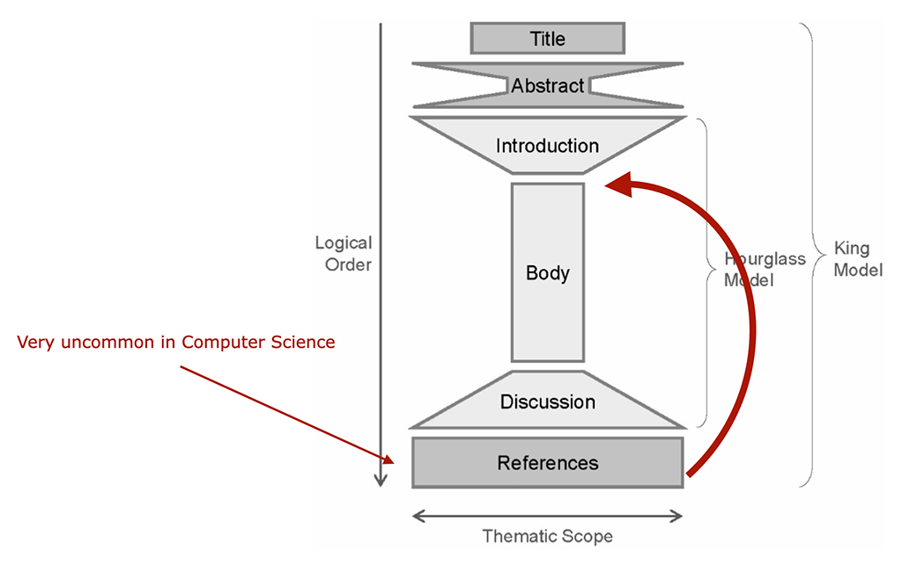
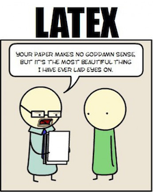

# Academic Methodologies

Prof. Dr. Lena Gieseke \| l.gieseke@filmuniversitaet.de \| Film University Babelsberg KONRAD WOLF


# Chapter 09 - Academic Writing

* [Academic Methodologies](#academic-methodologies)
* [Chapter 09 - Academic Writing](#chapter-09---academic-writing)
    * [Learning Objectives](#learning-objectives)
    * [Academic Writing](#academic-writing)
    * [How To Start Writing](#how-to-start-writing)
    * [The Leitmotif](#the-leitmotif)
    * [Paper Sections](#paper-sections)
        * [The Title](#the-title)
            * [Examples](#examples)
        * [The Abstract](#the-abstract)
        * [The Introduction](#the-introduction)
            * [Examples](#examples-1)
        * [Related Work](#related-work)
            * [Example](#example)
        * [Main Content](#main-content)
            * [Figures](#figures)
            * [Results](#results)
            * [Evaluation](#evaluation)
        * [Discussion](#discussion)
            * [Future Work](#future-work)
        * [Conclusion](#conclusion)
            * [Acknowledgements](#acknowledgements)
        * [Final Thoughts](#final-thoughts)
            * [Redundancies](#redundancies)
            * [Missing Grounding](#missing-grounding)
    * [Layout](#layout)
    * [Language](#language)
        * [Precision](#precision)
        * [I vs. We](#i-vs-we)
        * [Present Tense](#present-tense)
        * [Which vs. That](#which-vs-that)
        * [Gender-Inclusive Language](#gender-inclusive-language)
        * [Final Reminders](#final-reminders)
    * [Style](#style)
    * [Citations](#citations)
    * [LaTex](#latex)
        * [BibTeX](#bibtex)
    * [Master Theses](#master-theses)
    * [Next](#next)
    * [References](#references)

---

Let's assume that we are at a point where we have a clear understanding of our research project, or maybe that the actual research tasks is even finished and that we are ready to write it all down - woohoo!

[Adam Savage](https://en.wikipedia.org/wiki/Adam_Savage) from MythBusters says...

  
[[imgur]](https://imgur.com/gallery/ex4PAUZ)

... and he is right! It is crucial to understand that the writing about, and the presentation of your research project is as important as the actual research tasks. Oftentimes the paper is the only part that your advisor, the reviewers, etc. get to know about your work. Your results can be as exceptional as they might be, if you fail to communicate them clearly, fail to put them in context and to discuss them, the whole project will fail academically.

But fear not. Writing is not an innate talent but can be learned, practiced and mastered by all.

---

## Learning Objectives

* Know how an academic paper in computer science, and with that in HCI and CTech, is structured.
* Have an understanding about how to write a very good paper.
* Understand the requirements for layout, language and style in academic writing.
* Know how to proper cite references.
* Understand what LaTeX is.

## Academic Writing

Overall there are many, many reasons to write. Obviously, our focus here is *academic* writing. Academic writing aims at contributing to a research community with novel and relevant insights. For making sure that your research community can understand your results and compare them, there are various standards of academic writing - as always depending on the discipline. These differences in academic writing are based on the overall distinction of the nature of the academic text. The text can be in itself the research such as in philosophy. The text can also function as reporting the research results such as when you have conducted a study, developed an algorithms, etc., as in the sciences.

One of the overall main differences that I have noticed between academic writing in the humanities and the sciences is the complexity of the language. In the sciences we are always aiming for the simplest, cleanest and easiest to understand type of language. In the humanities you might need to convey only slight nuances of meaning with language to make your argument strong, which in turn can lead to quite complex language. Here, it is my impression that such complex language, which is indeed often enough needed, is also at times misused (both intentionally and unintentionally) in a way that makes simple scenarios appear overly complex and hard to understand. But this is only my impression - which comes from a background of scientific writing. However, we also follow in this chapter the goal of communicating a project as easy and as understandable as possible.

We discuss academic writing on the example of writing a computer science paper. Papers are pretty much a distilled version of a thesis. Most of what I present applies equally to a thesis. In the end of this chapter I also give some notes on theses specifically. Of course, the context of computer science is quite specific but I do think it represents any academic writing project, also within the humanities, well. The overall structure is pretty much the same across disciplines, however there might be important differences in the details. Know what audience you are writing for, in which context, and adjust your work accordingly.

But before we have a look at the language to use, let's reflect on the writing process itself.

## How To Start Writing

In my experience it is tremendously helpful to establish for yourself a routine that gets you into the flow of writing. Writing can feel like a daunting task, but if you break it down it will appear more manageable. According to the author of [PhD: An Uncommon Guide to Research, Writing & PhD Life](https://jameshaytonphd.com/quick-tips/on-writers-block) there are the following eight causes of writer’s block:

* Distraction
* Too many ideas at the same time
* Not knowing what you want to say
* Half-formed ideas
* Missing knowledge
* Problem of expressions, not being firm in the language
* Not knowing what comes next
* Intimidation of the task

However, most of these causes, except maybe the problem of expression, will vanish with a plan.  

As writing is all about getting into a *flow* of writing it is important to be in the right state of mind. Usually I will start with setting a time for how long I am going to write and with blocking all distractions such as emails for that time period. And with blocking, I mean literally blocking. For that I am using the [Focus app](https://heyfocus.com/?utm_source=focus_about) (there are countless similar tools), which prevents the opening of certain apps and websites for the defined time. This helps me to stick to the task and not to give up with the writing if it doesn't go as planned. Also, I personally like to start with having a quite detailed plan about what I am going to write. I define which part I am going to work on and what I hope to finish in that session. Then I will develop bullet points for each sections, which I try to make as detailed as possible. My goal is here *to separate the task of knowing what to write from the actual writing*! Bullet points are much easier to come up with and to structure than continuous text. 

If I am completely stuck and even coming up with structured bullet points feels scary to me, I will start with a e.g. 20 min session to just write down what ever comes to my mind in regard to the tasks, be it text, bullet points, or jibberish. During that session, I try not to go back to anything that I have already written but let it be in which ever form and just continue to get something onto the page. Afterwards I go over everything I wrote and either distill bullet points from it or even already actual text. Of course this approach is quite time intensive. Also, it depends on your way of thinking and writing capabilities. I have met plenty of people that can produce beautiful, coherent text on the first go, starting with an empty page and not doing a detour over bullet points. I am not one of them. But the more I write, the more I am getting there.

The above is just my process and e.g. such an iterative approach might not fit you. I would like to encourage you to figure out your process! You do this ideally before you have to crunch out writings under a tight deadline.

In regard to specifically writing a paper, I recommend the following steps:

* List your contributions
* Define a leitmotif and a story
* Prepare an outline of the paper
    * Section and subsection headings
    * A few sentences about each (sub)section
    * (Plan figures, figure placeholders)
* Do this very, very early

Then start the writing with the most concrete parts about aspects you know well, e.g. your methodology, description of your steps, or your results. These are usually the sections, which are easiest to write because you know exactly what to write. The more abstract parts, such as the discussion, the outlook and the abstract you should write last as with them you generate new content beyond the communication of your practical project.


  
[[phdcomics]](http://phdcomics.com/comics/archive.php?comicid=715)


Now let's dive into what makes a paper a paper.

## The Leitmotif

The importance of storytelling for a presentation applies equally to writing a paper. You need to tell a coherent story and follow that story through out the paper. If something doesn't add to the story: out with it! The story or also called *leitmotif* makes sure that you have a narrative flow.

The narrative flow should evolve as follows:

* Here is a problem
* It is an interesting problem
* It is an unsolved problem
* **Here is my idea**
* My idea works

You are telling the story about your idea and everything in the paper must serve the storyline. You want to infect the mind of your reader with your idea and for that you need to come up with *this one shiny idea*, which can be different from the contributions. Make sure the reader knows what the idea is and make the reader care about your idea, e.g. by clearly pointing out that the paper will generate a *reusable insight*, which will be useful to the reader. Try to give the readers something they didn’t have before.  

Of course these storytelling aspects are completely ignored in many, many papers but I am elaborating here how to write a *very good* paper 🤓

## Paper Sections

Any academic writing follows overall this structure (the reference section is in a weird place, we are coming back to that):

  
[[derntl]](http://dbis.rwth-aachen.de/~derntl/papers/misc/paperwriting.pdf)

In the context of computer science almost all paper follow the same structure, with minor differences in the structure of subsections and in the specific section titles. The structure of a paper is as follows:

* Title
* Teaser Image if possible
* Abstract
* Introduction
* Related Work
* Main Content
    * Algorithm, Setup, Study, etc.
    * Results
    * Evaluation
    * Discussion
* Future Work
* Conclusion
* Acknowledgements

Furthermore, a paper has actually somewhat of a fractal structure (and we do love fractals...). With this I mean that each section, subsection, etc. must follow loosely the above overall structure:

* The document has an introduction, body, conclusion
    * A section has an introduction, body, conclusion
        * A subsection has an introduction, body, conclusion
            * A paragraph has an introduction, body, conclusion

With this fractal structure you make sure that a reader understands your storyline and why that e.g. section is happening. It is a bit like creating a chain, each element must be tried into the previous and the following. To do this gracefully is quite challenging as you also don't want to repeat yourself. But this makes sure that the document flows naturally and is easy to read. As a rule of thumb you can build one paragraph for each thought. Connect paragraphs logically. 

Similar to presentations, also add navigation marks to help the reader getting through the whole paper. Explain where ever necessary,

* where did we come from,
* where are we now,
* where are we going?
  
Example: “In the last section we saw a formal definition of X. In this section we will see some examples of X, in preparation for section 3, which will introduce a special case of X, which we will focus on in the rest of the report.”

Once again, every section, paragraph, sentence and word should serve a purpose. If not, throw it out!

### The Title

A title needs to 

* be precise
* position the topic in the right context, and
* be inviting and creative.

Avoid

* all but the most readily understood abbreviations
* Common phrases like "novel", "performance evaluation”, “architecture", “Towards”… 

For a good title use adjectives that describe the *distinctive features* of your work, e.g., reliable, scalable, high-performance, robust, low-complexity, or low-cost.

Usually finding a good title is an ongoing process spanning over the whole writing process. You should start with some ideas early on and then refine them over the development of the content of the paper. Coming up with a title is actually quite hard, plan enough time for it.

Certain communities such as Siggraph take pride in coming up with creative titles and they like to give their papers ‘names’. This is actually quite smart as catchy names make it easier for others to remember your paper!

#### Examples

Don't:

* A Software…
* A theorem and its proof…
* Wireless networks…
* Partial redundancy elimination in presence of critical edges for practical imperative programs with recursion and large number of functions and calls through function pointers

Do:

* A software-based control system for…
* On XYZ theorem
* Reducing congestion in wireless networks
* Partial redundancy elimination in extreme situations

*Please reflect on the difference of these examples. What is makes the don't-examples bad and what makes the do-examples good?*

##### Siggraph Titles

* **Advanced Drawing Beautification with ShipShape.** Jakub Fišer, Paul Asente, Stephen Schiller, Daniel Sýkora. Computers & Graphics 34(1):46-58, 2016.
* **StyLit: Illumination-Guided Example-Based Stylization of 3D Renderings.** Jakub Fišer, Ondřej Jamriška, Michal Lukáč, Eli Shechtman, Paul Asente, Jingwan Lu, Daniel Sýkora. ACM Transactions on Graphics (Proceedings of SIGGRAPH 2016) 35(4):92, 2016.
* **LazyFluids: Appearance Transfer for Fluid Animations.** Ondřej Jamriška, Jakub Fišer, Paul Asente, Jingwan Lu, Eli Shechtman, Daniel Sýkora. ACM Transactions on Graphics (Proceedings of SIGGRAPH 2015) 34(4):92, 2015.
* **Brushables: Example-based Edge-aware Directional Texture Painting.** Michal Lukáč, Jakub Fišer, Paul Asente, Jingwan Lu, Eli Shechtman, Daniel Sýkora. Computer Graphics Forum (Proceedings of PG 2015) 34(7):257-268, 2015.
* **Color Me Noisy: Example-based Rendering of Hand-colored Animations with Temporal Noise Control.** Jakub Fišer, Michal Lukáč, Ondřej Jamriška, Martin Čadík, Yotam Gingold, Paul Asente, Daniel Sýkora. Computer Graphics Forum (Proceedings of EGSR 2014) 33(4):1-10, 2014.
* **Painting by Feature: Texture Boundaries for Example-based Image Creation.** Michal Lukáč, Jakub Fišer, Jean-Charles Bazin, Ondřej Jamriška, Alexander Sorkine-Hornung, Daniel Sýkora. ACM Transactions on Graphics (Proceedings of SIGGRAPH 2013) 32(4):116, 2013.
* **AppWand: Editing Measured Materials Using Appearance-Driven Optimization.** F. Pellacini, J. Lawrence. ACM Transactions on Graphics (SIGGRAPH 2007), 2007
* **AppProp: All-Pairs Appearance-Space Edit Propagation.** F. Pellacini. ACM Transactions on Graphics (SIGGRAPH 2008), 2008
* **Envylight: An Interface For Editing Natural Illumination.** F. Pellacini. ACM Transactions on Graphics (SIGGRAPH 2010), 2010
* **Appgen: Interactive Material Modeling From A Single Image.** Y. Dong, X. Tong, F. Pellacini, B. Guo. ACM Transactions on Graphics (SIGGRAPH Asia 2011), 2011
* **MeshGit: Diffing And Merging Meshes For Polygonal Modeling.** J. Denning, F. Pellacini. ACM Transactions on Graphics (SIGGRAPH 2013), 2013
* **AppIm: Linear Spaces For Image-Based Appearance Editing.** F. Di Renzo, C. Calabrese, F. Pellacini. ACM Transactions on Graphics (SIGGRAPH Asia 2014), 2014
* **Meshhisto: Collaborative Modeling By Sharing And Retargeting Editing Histories.** G. Salvati, C. Santoni, V. Tibaldo, F. Pellacini. ACM Transaction on Graphics (SIGGRAPH Asia 2015), 2015
* **CSculpt: A System For Collaborative Sculpting.** C. Calabrese, G. Salvati, M. Tarini, F. Pellacini. ACM Transaction on Graphics (SIGGRAPH 2016), 2016
* **GTangle: A Grammar For The Procedural Generation Of Tangle Patterns.** C. Santoni, F. Pellacini. ACM Transaction on Graphics (SIGGRAPH Asia 2016), 2016
* **Vivace: A Practical Gauss-Seidel Method For Stable Soft Body Dynamics.** M. Fratarcangeli, V, Tibaldo, F. Pellacini. ACM Transaction on Graphics (SIGGRAPH Asia 2016), 2016

### The Abstract

A good abstract is critically important due to the following reasons:

* People decide based on the abstract wether to read the paper or not.
* Oftentimes the abstract will be the only thing that one reads from your paper.
* Reviewers decide on the abstract wether to review the paper or not.
* It sets the *mood* for the paper.

An abstract typically consist of 150-200 words and must be a succinct and stand alone description of your work. An abstract is neither a summary nor an outline of the paper but rather a tiny paper in itself. Notice, how the thematic scope of an abstract is similarly shaped as the paper itself.

  
[[derntl]](http://dbis.rwth-aachen.de/~derntl/papers/misc/paperwriting.pdf)

A good abstract is *informative* and

* provides details about the substance,
* let's readers remember the key findings,
* let's reviewers find the claims/contributions, and
* contains all claims and supporting evidence in paragraph form.

A bad abstract is only *descriptive* by simply outlining the topics covered. A bad abstract feels like a table of contents in paragraph form.  

Since abstracts will also be used by search engines, ideally use terms that identify your work. For that there are also usually key words and classifications given from the venue that you can set for your paper but these might not offer the terms you want.

For coming up with the abstract you can follow these questions by Kent Beck:

* State the problem
    * Who is suffering the problem?
    * Connect with your target audience
* Why is it a problem and why is it interesting?
    * Your solution and achievements
* What achieves your solution
    * Say something catchy
    * Should be falsifiable
* What follows from your solution
    * Where or how to use
    * Implications for society, community, other researchers, …

A good example:

> The rejection rate for OOPSLA papers is near 90%. Most papers are rejected not because of a lack of good ideas, but because they are poorly structured. Following four simple steps in writing a paper will dramatically increase your chances of acceptance. If everyone followed these steps, the amount of communication in the object community would increase, improving the rate of progress.

*Where and how do you find the four questions reflected in the above abstract?*

Common mistakes when writing an abstract are:

* Too verbose
* Too long
* Too short
* Omitting essential steps of the solution
    * Rule of thumb: one sentence for each chapter
* Not in line with the paper
* Use of "in this paper"
* Containing references
    * Ok if a reference is absolutely crucial to mention (but then again, if that is so, your whole paper might be in trouble)

Ideally, the abstract should be the last thing you touch. However, I also always write a first version of the abstract early on as it helps me to structure my thoughts and the paper. However, this first abstract version has usually no resemblance to the final version that I write as last thing 😊

[[1]](https://plg.uwaterloo.ca/~migod/research/beckOOPSLA.html)

### The Introduction

The introduction is the chance of making a positive impression in terms of writing style, overall quality, analytical skills, confidence in ideas and dramaturgy. It is also the last chance of making the reader want to read your paper in detail. The introduction is the section where you can focus on the storytelling. The introduction makes claims, to which the body of the paper provides the evidence for. You need to make sure that the claims you make are actually in line with the rest of the paper.

The introduction goes from the general to the specific and you can understand it as the zooming in into the topic. You need to contextualize your problem and give details about the motivation of your work and the specific problem statement. This can be supported by concrete examples, puzzles, mysteries and anecdotes.

In the introduction you should convey the importance of the problem, the significance of the outcome, which challenges the problem brings and explain why simpler approaches would not work.

Furthermore, you need to give an overview of the proposed approach, e.g. by roughly sketching out the main proof, algorithm, key idea, etc. You can understand this as the description of the methodology. Here, you must also highlight the novelty of the proposed approach.

The introduction should then come together in a **list of contributions**, which is the most important aspect of the introduction. Contributions can be given as bullet points and as rule of thumb you should have at least three points.

Sometimes it is possible to merge an outline of the paper into the list of contributions, which is much more elegant than outlining the paper as last paragraph. Opinions differ on having such a separate outline or not:

> The rest of the paper is structured as follows. Section 2 introduced the problem. Section 3 … Finally, Section 8 concludes.

If you ask me: don’t do it! I find it superfluous. Instead, use forward references from the narrative in the introduction and the contributions. But rather have a separated outline paragraph as the one above than no description of the structure of the paper at all.

As before the introduction comes yet again down to

* What is the problem?
* Why is the problem important?
* What has so far been done on the problem?
* What is the contribution of the paper on the problem?
* Is the contribution original? Explain why…
* Is the contribution non-trivial? Explain why…

Even though of course similar in content, avoid repetitions to the abstract.

#### Examples

Don't:

* We describe the Foo system. It is novel and works well.
* We study its properties.
* We used the Foo system in practice.

Do:

* We give the syntax and semantics of a language that supports concurrent processes (Section 3). Its innovative features are…
* We prove that the type system is sound, and that type checking is decidable (Section 4).
* We have built a GUI toolkit in Foo, and used it to implement a text editor (Section 5). The result is half the length of the Java version.

### Related Work

When writing about the related work, you have two competing goals:

1. Show that you are working on a ‘hot topic’ with a lot of related work.
2. Show that, and why you are different to all of them.

In computer science the related work comes after the introduction.



Why would you postpone the related work section? Well, there are actually good reasons for that. After the introduction, the reader knows very little detail about the problem yet; so your carefully trimmed description of various technical tradeoffs in the related work might be incomprehensible. Also, starting with describing alternative approaches gets between the reader and your idea.

The related work section is a broad and shallow account of the field and needs to place the contribution of the paper into context. You need to answer the following questions

* What are the rival approaches?
* What are the drawbacks of each?
* How have the different approaches progressed?
* What are the major outstanding problems? 

Subsections are also often based on applied techniques/ideas. Usually you use 1-2 sentenced for one idea or related paper.

With this section you need to clearly distinguish your work and answer the question of how you are different from everybody else. At the same time the related work is not about describing your own work. It is once again a balancing act to compare your work and make it stand out without really getting into the details of your approach.

The standard within most research communities is to never make other people’s work look bad. You never openly criticize a paper in your related work section even if you might think the other paper is rubbish. Critical discussions usually happen during conferences in person. Equally, it is common practice to be quite generous in your statements. Giving credit to others will not diminish your contributions and it might help to show the relevance of your work. It is common to say something like “In the inspiring paper…”, for example.

Reviewers carefully check or just know out of the top of their heads as they are chosen as experts in the field, if the related work is complete. Missing related work is the first step towards rejection and claiming something that is not yours is the first step towards unemployment.

When writing related work, keep in mind:

* List not only just what what was done but also why?, why not?, how?, how else? Related work is not just a list of summaries.
* Keeping the correct tense can be tricky. Algorithms, techniques, etc. are still valid and must be in present tense. But e.g. the topic was introduced or studies are done in the past.

#### Example

> […] None of the work discussed so far integrates artist control on an element and connection level once the pattern is computed. There are procedural techniques that enable low-level control on the results themselves, developed in the context of architectural designs [LWW08], tree modeling [PSK∗12] and the creation of natural scenes [EVC∗15]. The move operator from the latter is similar to ours but their system is optimized for chaotic arrangements, which contrasts to our organized design goals for ornaments. 

### Main Content

The main content must provide all evidence for your claims. Make sure the overall idea of your project is completely clear before going into details. For the structure of the sections do not recapitulate your personal journey of discovery. The report order is usually different from the order of the investigation. Choose the most direct route to the idea. 

The specific design of the main content is completely flexible and depends on the type of problem and solution. In one form or the other the main content must include:

* Theory
    * Describe the underlying theory of techniques or the system.
    * Where appropriate, use a mathematical style of definitions, theorems, …
* Specifications
    * Formally specify techniques that underlie the implementation.
    * State the *requirements* of the implementation. Are there any constraints for it to work?
    * Describe any assumptions you might make, any needed input data, etc.
* Implementation / Method
    * Consider a figure for the pipeline/method.
    * Describe only the final state of the implementation.
    * Identify the major design decisions and give their reasons.
    * Describe the overall structure of the system and key algorithms in abstract form.
    * Illustrate the main algorithms with simple but meaningful examples.
* Result
* Evaluation

Overall treat the main content as if explaining your work with a whiteboard. Conveying an intuition is primary and once the readers have the intuition, they can follow the details. Of course, you can use formalisms and formulas but don’t hide behind it. Carefully balance between showing that you know stuff and being pompous. Don't forget to introduce notations and terminologies first wherever required.

#### Figures

Well understandable papers, no matter the complexity of their work, make extensive use of figures such as diagrams, a system overview and visual explanations (in all sections, not just in the main content). All figures must be tied into the text and must be referenced in the text at least once. For good venues the quality of figures is very high, going as far as research teams hiring professional designers. A good figure has a clean layout and is ideally understandable on its own. If that is not possible (and often it is simply so) it must be understandable with the caption though. Captions are allowed to be a bit longer and need to put the figure into the context of the project and need to give all details needed to understand the figure. Remember, when reading a paper, it is common to make a first pass just by looking at the figures and reading the captions.

If a figure is not by you, you must properly cite it. For publication you must have the correct copyrights for any image you use. The publication venue will make you sign that you have all necessary rights. 

*On a Side Note*: My way of giving credits for the used images in my scripts does not match any academic format but it is my own style 😎. As you are reading the scripts online and I provide links as reference, I think it is still a valid representation. Also, copyrights are overall different in an educational context. But in any more official context than lecture scripts my reference style is incorrect! 

#### Results

The presentation of your results must collect a broad spectrum of *possible* results not just the best ones. Be careful here to balance result quality. You need to show some convincing drawbacks or issues as nothing is ever perfect but of course you also don't want to unnecessarily highlight issues. It is completely fine to reference the results in a previous section, e.g. when describing the technique.

#### Evaluation

You must in one form or the other evaluate your results. Clearly describe your evaluation technique and give reasons why it is valid. Try to use as many objective measurements as possible such as benchmarks, performance, error count. If you can, compare your work with these with the results of other projects.

The evaluation can go as far as conducting a formal study, a survey, interviews, etc. Depending on the scope and size of the evaluation it is common to entitle the evaluation itself as a contribution of the paper.

### Discussion

The discussion is usually the hardest to write as you need to generated insights that go beyond the execution of your research project. This might not come naturally and needs a lot of brain power. A good start to discussing your work is to try to anticipate what reviewers/advisors might say and answer to that. Explain or mention everything that is noticeable in your results and evaluations. Are there any outliers, strange behaviors, etc.? Is the evaluation correct?

Reflect on the project as detailed and openly as possible - in regard to both, the good and the bad. Ideally you have nothing to hide. Again, no one expects a perfect project and also some drawbacks can give valuable novel insights.

The discussion often also represents some form of zoom out and discusses how the presented work is generalizable and what its different applications are. Here, you can also describe what overall impact the project might have.

#### Future Work

The future work section is somewhat flexible. You should include it but it can also be integrated into the discussion or even conclusion. Sometimes this section is also called outlook. Again, try to anticipate what reviewers might say, e.g. "why didn't you try/do...?" and here you can brush that of as describing it as next step.

Overall think about which improvements are possible and how to generalize the work. Do not however state to clearly anything you want to write the next paper about as then other researchers might do it for you...

  
[[phdcomics]](http://phdcomics.com/comics/archive.php?comicid=286)

### Conclusion

Conclusions are short and bring the story back to the most general level. Remember, the storyline of the paper goes 

* Abstract → Introduction → Details
    * Journey from general to specific
* Details → Conclusions
    * Return journey from specific to general

Conclusions should not just be a summary, and also be different from the abstract and the introduction. Think about it as the *moral of the story*. It is a short, high level description of the significance of the ideas and what they could further lead to. Yes, say it all again… The conclusion is the last chance to highlight the importance of the project. It should emphasize what the readers should remember after they have forgotten the details.

#### Acknowledgements

If you have received external funding for the work beyond the institution you are accredited with, you must attribute the funding in the acknowledgments. This is also the place to say thank you, e.g.

* if reviewers were helpful (then you can say e.g. "we thank the reviewers for their helpful feedback"),
* if you used artwork, mention the artists here, and
* to colleagues e.g. for extensive discussions, help to set things up.

Again, be generous with your thank yous.

### Final Thoughts

#### Redundancies

You have to constantly repeat yourself while never repeating text... You have to bring up your main points over and over again e.g. to lead the reader through your paper. However, it is a very common mistake is to repeat the same phrases, sentences etc. over and over again. As rule of thumb, use a specific phase only once!
  

#### Missing Grounding

In academic writing, everything you say must directly be proofed in some form. This is something that students who are new to academic writing often do incorrectly. Some problematic examples might look like as follows:

* "The problem is difficult."
    * *Difficult for whom? Believed by you? Believed by others? Proven by someone? Difficult in what sense? Difficult when done blindly? Difficult when done without a brain? Difficult for your cat?*
* "The method is fast."
    * *Fast in comparison to what? Faster than a snail? Faster than the speed of light? Faster than your cat?*
* "The high quality of the results..."
* "The results look good."
* "As it can be seen…", "It has been shown..."

Question all your statements and see if the text answers to everything. For this also see the section about citations.

  
[[weheartit]](https://weheartit.com/entry/222849135)

It is quite common to include many people in the list of authors. Everybody who somehow contributed should be offered an authorship. In computer science a high number of authors is not a bad thing at all. The first author is the one responsible for the project and its execution. The last author is the advisor and / or department head (the person who made the paper possible in terms of position and money). Wether to put advisors as authors even if they have not even read the paper (they should have!) is a discussed practice but also the standard. Also, if it is a big name it will make look your paper better.


  
[[phdcomics]](http://phdcomics.com/comics/archive.php?comicid=562)

---

Now, that we know what to write, let's talk about the look, meaning the layout of a paper. As we all know, looks are important - that is just human nature. Unfortunately the world of paper writing is not as progressive as our world is (hopefully) slowly changing to the appreciation of all shapes, sizes and colors, moving away from standards, appreciating diversity and individuality. A beautiful paper, however, very much needs to follow standards. But of course - as in real life - the real beauty of a paper comes from within, and if the content of the paper is rubbish, the layout can not fix that.

## Layout

  
[[xkcd]](https://xkcd.com/1847/)

A paper should have a strong visual structure. Use section, sub-sections and bullet points. If in doubt, rather use a subsection to many than to few. Good layout gives a reader an intuitive understanding of the paper on first glance. My thesis advisor said to me for example that he can approximate a rough grade of a thesis, just by looking at its layout. And I think there is some truth to that. Also, I had it happened to me more than once that I thought I had structured my document well and it was given back to me with the comment that it needs more structure in the layout... A strong structure also helps to convey your content if there is a slight change that someone will only skim your text, e.g. for an application or expose where there are many submissions and some people are only superficially involved in the selection process.

I really can not give you any rules here to follow for structuring your text. It just depends on the content and its context. The only rule is: structure your text well with sections, subsections, bullet points and figures.  

As already mentioned, figures such as drawings, diagrams, tables and graphs are in the context of computer science and with that of course also HCI and CTech, crucially important for academic writing. Use figures excessively. Ideally your whole paper is understandable just by going through the figures. There are a couple of aspects to consider when working with figures:

* They are numbered.
* They have a descriptive caption and a long description in the paragraph, where they are referenced. Keep in mind that good captions are not easy to write.
* If a figure is not discussed in the text, cut it.
* Try to match a figure's position to the flow of the text. The figure should be put close to the text, where it is references. This might be especially tricky in LaTeX (we are coming back to LaTeX).  

Using italics or bold font for emphasis are problematic in academic writing. I am struggling with that a little as I think they help to visually structure a text (and I use italics for emphasis in the scripts for example). But the rule in academic writing is to only use italics once for introducing a new term and to never use bold, except for header and titles and such.

For most paper submissions the venue will provide a set of rules for the text format and usually also a template for that. You must stay within the given format, your paper might otherwise be rejected for just the wrong layout. Minor cheats, or let's call them tweaks, are ok as long as they are not really noticeable.

  
[[phdcomics]](http://phdcomics.com/comics/archive.php?comicid=926)

Last but not least, make sure that everything in your paper is readable printed on paper! I always have problems with this because I like to use grays for figures and layout and grays that look super nice on screen oftentimes are not distinguishable printed out. The same problem applies when preparing a presentations and the difference between the slides on your screen and the slides on the projector.

Now that we have reflected on the beauty of the layout, let's think about the beauty of the language itself.

## Language

Of course, correct spelling and grammar is a must in academic writing. If you want to improve your grammar (and yes, I know, I myself have still some issues here - did someone say commata?!) there is a universe of resources for that from our friend, the internet. I particularly like to check in with grammar test, such as the [grammar book](http://www.grammarbook.com/interactive_quizzes_exercises.asp).

### Precision

One of the golden rules for the language of academic writing is - in all disciplines - to be precise. However, what precision or preciseness means differs from discipline to discipline. In our context is means clean, somewhat simple language. The language must not give a reader any extra thinking to do - the content is difficult enough on its own. The value of the work is in your research project contributions and the language should make those aspects clear, not obscure what you did with complicated language. You will notice for yourself that some writings try to hide weak results, thoughts, etc. behind complex language.

When working with native English speakers as a native German speaker the aspect of simple language is especially difficult. Simple German is in comparison to simple English still ten times more complex. Whenever I work with native English speakers they still simplify my sentences... 🤬 (the learning never stops...).

The website [daily writing tips](https://www.dailywritingtips.com/) describes the following helpful [techniques for more precise writing](https://www.dailywritingtips.com/10-techniques-for-more-precise-writing/)

1. Use Active Voice  
When a sentence includes *be* or any other copulative verb, such as *is* or *are*, recast the sentence to omit the verb.

    Don't: “The meeting was seen by us as a ploy to delay the project.” 
    Do: “We saw the meeting as a ploy to delay the project.”

2. Avoid Vague Nouns  
Phrases formed around general nouns such as *aspect*, *degree*, and *situation* clutter sentences.  

    Don't: “She is an expert in the area of international relations.” 
    Do: “She is an expert in international relations.” 

3. Use Words, Not Their Definitions  
Replace explanatory phrases with a single word that encapsulates that explanation.  

    Don't: “The crops also needed to be marketable so that families would be able to sell any yields that exceeded what they personally required.” 
    Do: “The crops also needed to be marketable so that families would be able to sell any surplus.”

4. Avoid Noun Strings  
Reorganize sentences to eliminate series of nouns used as adjectives.  

    Don't: “The lack of a secure transfer may hamper computer security incident response efforts.” 
    Do: “The lack of a secure transfer may hamper responses to computer-security incidents.”

5. Convert Nouns to Verbs  
When a sentence includes a noun ending in *-tion*, change the noun to a verb to simplify the sentence.  

    Don't: “They will collaborate in the creation of new guidelines.” 
    Do: “They will collaborate to create new guidelines.”

    or en example without a *-tion*:

    Don't: “This paragraph provides a conclusion of the description” 
    Do: “This paragraph concludes the description”

6. Reduce Verb Phrases to Simple Verbs  
Identify the verb buried in a verb phrase and omit the rest of the phrase.  

    Don't: “The results are suggestive of the fact that tampering has occurred.” 
    Do: “The results suggest that tampering has occurred.”

7. Replace Complex Words with Simple Ones  
Choose simpler synonyms for multisyllabic words. I am not sure I agree with this - it is up to your personal style.

    Don't: “The department will disseminate the forms soon.” 
    Do: “The department will pass out the forms soon.”

8. Avoid Expletives  
Don’t start sentences with “There is,” “There are,” or “It is.”

    Don't: “There are many factors in the product’s failure.” 
    Do: “Many factors contributed to the product’s failure.”

9. Eliminate Prepositional Phrases
Replace “(noun1) of the (noun2)” phrasing with “(noun2)’s (noun1)” phrasing.

    Don't: “The decision of the committee is final.” 
    Do: “The committee’s decision is final.”

10. Reduce Wordy Phrases to Single Words  
Replace phrases that signal a transition with simple conjunctions, verbs, or other linking words.  

    Don't: Due to the fact that the project is behind schedule, today’s meeting has been postponed.  
    Do: Because the project is behind schedule, today’s meeting has been postponed.

From that list I want to emphasize the first point one more time: try to avoid passive at all costs! The active voice tells what a person or thing does, while the passive voice tells what is done to someone or something. And of course, you want to be seen as the great protagonist of your research project and the results did not just happen (to you).  

[3]

### I vs. We

For some reason there is this weird grand rule in academic writing of never using *I*. I guess this is taught to students to make them understand that research results have nothing to do with oneself but aim for an overall truth. Why if that is given, we still can not use I in certain disciplines is not clear to me. In Computer Science it is commonly allowed to use *we*, e.g., to avoid passive voice. Also, there are very, very few papers from just one author anyways.

Don't: “The meeting was seen as a ploy to delay the project.” 
Do: “We saw the meeting as a ploy to delay the project.”

But don’t do this: “We then sort the vertices by height…”. Unless you are manually doing the sorting yourself, and not the algorithm. 

Some papers from a single author also don't use *I* but *we* ([I checked](https://dl.acm.org/doi/epdf/10.1145/566654.566636)). I think this is silly. You are allowed to use *I* in a master thesis for which I am the main advisor 🙂. 

### Present Tense

In a paper everything you do is in present tense, also things that come later in the paper.

Don't: "In Section 3 we are going to show…"  
Do: “In Section 3 we are showing…"

### Which vs. That

One of my personal pet peeves is the incorrect use of *which* vs. *that*.

*That* 

* Introduces what is called an essential clause. Essential clauses add information that is vital to the point of the sentence and can not be left out.  
* Example: I do not trust products that claim "all natural ingredients" because this phrase can mean almost anything.  
    * We would not know the type of products being discussed without the *that* clause.

*Which* 

* Introduces a nonessential clause, which adds supplementary information.  
* Example: The product claiming "all natural ingredients," which appeared in the Sunday newspaper, is on sale.  
    * The product is already identified. Therefore, which appeared in the Sunday newspaper is a nonessential clause containing additional, but not essential, information.

Essential clauses (that) do not have comma introducing or surrounding them, whereas nonessential clauses (which) are introduced or surrounded by commata!

### Gender-Inclusive Language

Gender inclusive language is in my opinion an essential step for a progressive society and is fully embraced in the academic world.

> [Generic pronouns and sexist language: The oxymoronic character of masculine generics](https://link.springer.com/article/10.1007/BF00289252)

Even if you don't agree on the importance of this, you will repel the people who do care about it, if you do not use it.  

The previous iteration of these developments assumed binary genders and favored to use both pronouns. You also see texts that simply use *she* or that alternate genders and pronouns.

Examples  

* When the winner has been selected, she or he will be advanced to the next round of the competition.
* Our agreement is that the first person who picks up his or her cell phone must treat the rest of the group to dinner.

The Chicago Manual of Style (as cited in [4]) says:

* See 5.220: “He or she. To avoid sexist language, many writers use this alternative phrasing (in place of the generic he). Use it sparingly—preferably after exhausting all the less obtrusive methods of achieving gender neutrality. In any event, he or she is much preferable to he/she, s/he, (s)he, and the like.”
* A good writer can usually recast the sentence to eliminate the need for any personal pronoun at all (p. 157)

As we as a society finally start to accept that genders are much less binary than we used to believe and that gender is in fact a fluid concept, the simple differentiation of *he* or *she* is not enough anymore.

The best solution is here to make the nouns and pronouns plural.  

Don't: A student who loses too much sleep may have trouble focusing during [his/her] exams.  
Do: Students who lose too much sleep may have trouble focusing during their exams.

You think this is complicated? Yes, it is, and it is rightfully so! The greatest burdens of knowledge in our modern times are *complexity* and *ambiguity*. Kids, we have to deal with it - it is as simple as that.

### Final Reminders

* Can't, isn't ... -> cannot, is not, ...
* First, Secondly, Thirdly
* Use the correct [hyphen](https://en.wikipedia.org/wiki/Hyphen#:~:text=The%20hyphen%20%E2%80%90%20is%20a%20punctuation,example%20of%20a%20hyphenated%20word.). This is a pet peeve of many academic nerds. However, I simply can not get the correct usage into my head and probably do it unintentionally wrong half of the time.

Last but not least: Don’t use emojis in academic writing! 😱 😰 😡

[[2]](http://www.dailywritingtips.com/10-techniques-for-more-precise-writing/)
[[3]](https://writingcenter.unc.edu/tips-and-tools/gender-inclusive-language/)
[[4]](https://english.stackexchange.com/questions/256062/is-gender-neutral-language-the-norm-for-academic-writing-if-so-when-did-this)

## Style

In academic writing you must avoid

* emotional language,
* flowery language, and
* superlatives.

Overall though, writing style simply is subjective. If you give your paper to experienced writers they will be affected by their personal style and will give you many, many corrections. These corrections might not improve errors but might just try to make the text match more the personal writing style of the corrector. Take in the feedback, reflect on it but also stand your ground if your personal writing style is different.

  
[[phdcomics]](http://www.phdcomics.com/comics/archive.php?comicid=1576)

## Citations

For documenting the research goals of novelty and relevance we need to put our work into context. In academia, ideally everything you do must be based on something that has already been published. For that we reference other papers and now we have a look onto the formal style of citing other work.

  
[[phdcomics]](http://phdcomics.com/comics/archive.php?comicid=1820)

When referring to other work, we differentiate between

* Direct citations
    * Exact words are copied and put into “”
    * Very uncommon in Computer Science, only used with definitions, e.g. 
        * Standard Y defines X as „…“ [5]
* Citing the meaning 
    * Summarising, paraphrasing, …
    * This basically means that you re-write the content
        * Smith et al. [2] found …
    * [In an ideal world...](https://jameshaytonphd.com/quick-tips/how-to-avoid-plagiarism-when-summarizing-other-peoples-research-video) but the described process is timeintensive.
* Short reference
    * List of related work and/or used techniques
        * We applied approach X [2] to …


What is called a *citation style* defines the syntax for citing your sources. A citation style defines

* which information is necessary,
* how to order the information, and
* punctuation and formatting.

Citation styles make reference lists and bibliographies consistent and easy to read across different papers.
Correct and clean citations are a must-have in academia. The golden rule here is *consistency* and not so much which style to use (I personally don't care which style you use as long as you follow one).  

Which citation style to prefer highly depends on the academic discipline:

* [MLA (Modern Language Association)](https://www.mla.org/MLA-Style)
    * Most popular
    * English, Humanities
* [APA (American Psychological Association)](https://apastyle.apa.org/)
    * Education, Psychology, and Sciences
* [Harvard](https://en.wikipedia.org/wiki/Parenthetical_referencing) 
    * Similar to APA
    * More common in the UK and Australia
* [Vancouver](https://en.wikipedia.org/wiki/Vancouver_system)
    * Medicine and sciences
* [Chicago/Turabian](https://www.chicagomanualofstyle.org/tools_citationguide.html)
    * Economics, History, and the Fine Arts

Computer Science mainly uses the following [collection of styles](https://dal.ca.libguides.com/c.php?g=257109&p=1717772):

* ACM (Association of Computing Machinery)
    * Citation: `[Phillips 2001]`
    * Reference entry:  
    O'BRIEN, H.L. AND TOMS, E.G. 2008. What is user engagement? A conceptual framework for defining user engagement with technology. Journal of the American Society for Information Science and Technology, 59, 6, 938-955.
    * List references alphabetically, using the author's last name
* APA (American Psychology Association)
    * Citation: `(Raskin, 2002)`
    * Reference entry:  
    O'Brien, H.L., & Toms, E.G. (2008). What is user engagement? A conceptual framework for defining user engagement with technology. Journal of the American Society for Information Science and Technology, 59(6), 938-955. doi:10.1002/asi.20801
    * List References alphabetically, using the author's last name
* IEEE (Institute of Electrical and Electronics Engineers)
    * Citation: `[1] or [8, 10]`
    * Reference entry:  
    [6]  H.L. O'Brien and E.G. Toms, "What is user engagement? A conceptual framework for defining user engagement with technology," Journal of the American Society for Information Science and Technology, vol. 59, no. 6, pp. 938-955, Apr. 2008.
    * List References numerically, in the order that you have cited them

It is up to you to decide where in the text to spell out authors names as reference as in-text citation and where to use shorter citation tags:

* Smith et al. [SJT12] demonstrate in their work about...
* ... developed in the context of architectural designs [LWW08], tree modeling [PSK∗12] and the creation of natural scenes [EVC∗15].

For in text citations and author-based references, the list of authors is shortened:

* ‘Smith and Jones’ for up to two authors
* ‘et al.’ for ‘and others’ for more
    * Smith and Jones [SJ12]
    * Smith et al. [SJT12], [SJT*12] (for more than three authors)


You will often see a DOI included in a references auch as `DOI: 10.1002/asi.20801`. The DOI (Digital Object Identifier) is a unique number used to identify a specific article.

It takes a lot of time to clean the information for a reference so that it shows up correctly. Different document types need different information. Sometimes your will need to collect the required information manually. I find the [tool](http://www.citethisforme.com) and the information on [cite this for me](http://www.citethisforme.com/guides) helpful.

If you are using a LaTeX template given out by the publication venue, the style comes with the template as `\bibliographystyle{style_name}`. You still need to setup your references accordingly, meaning the bibtex entries must be correct and complete.

## LaTex

  
[[inzaneresearch]](https://inzaneresearch.com/2018/07/06/grad-school-tools-latex-basics/)


LaTeX, which is pronounced "Lah-tech" or "Lay-tech" (to rhyme with «blech» or «Bertolt Brecht» as the X is the greek letter chi), is a document preparation system for high-quality typesetting. It is most often used for medium-to-large technical or scientific documents but it can be used for almost any form of publishing.

LaTeX is not a word processor! Instead, LaTeX encourages authors not to worry too much about the appearance of their documents but to concentrate on getting the right content.

*LaTeX follows the philosophy of separating presentation from content.*

LaTeX is based on the idea that it is better to leave document design to document designers, and to let authors get on with writing documents. So, in LaTeX you would input this document as:

```latex
\documentclass{article}
\title{Cat Preferences for Different Box Sizes}
\author{Jane Doe}
\date{September 2020}
\begin{document}
   \maketitle
   Hello cats!
\end{document}
```

Or, in English:

* This document is an article.
* Its title is Cat Preferences for Different Box Sizes.
* Its author is Jane Doe.
* It was written in September 2020.
* The document consists of a title followed by the text Hello world!

The output looks like:


[[11] The LaTeX Project](https://www.latex-project.org/about/)

The underlying TEX computer program, created by Donald E. Knuth, is aimed at typesetting text and mathematical formulae. TEX as we use it today is still pretty much the same as the release version in 1982, with some slight enhancements added in 1989 to better support 8-bit characters and multiple languages. TEX is renowned for being extremely stable, for running on many different kinds of computers, and for being virtually bug free. The version number of TEX is converging to π and is now at 3.141592653.

LaTeX uses TeX as its formatting engine and enables authors to typeset and print their work with high typographical quality, using a predefined layout. In a LaTeX environment, LaTeX takes the role of the book designer and uses TEX as its typesetter. But LaTeX is only a program and the author has to provide additional information to describe the logical structure of the work. This information is written into the text as LaTeX commands.

Hence, LaTeX is a markup language and not WYSIWYG (what you see is what you get). You need to compile the pdf. Tags define the general structure of a document (such as article, book, and letter), to stylize text throughout a document (such as bold and italic), and to add citations and cross-references.


[wikipedia](https://en.wikipedia.org/wiki/LaTeX)

LaTeX is the standard in the Computer Science research community. I personally much prefer it over any other tool such as Word. But also LaTeX comes with a lot of heartache to make it work. At times it can be a bit unwieldy and hard to control. My recommendation is that if you need to use formulas you must use LaTeX. The insertion of beautiful formulas is simply the most powerful and easiest in LaTeX. If you have many references and citations, I would also recommend LaTeX. If these two aspects do not apply, other tools might be just as suitable.

Valuable resources are:

* www.latex-project.org
* http://tex.stackexchange.com
* Software
    * LaTeX: MiKTeX (Win), TeX Live (Linux), MacTeX (Mac)
* Write with the text editor of your liking or specific LaTeX editors
    * TeXstudio, TeXnicCenter
    * I used VSCode for LaTeX
* Just recently coming up: web based editors
    * ShareLatex, Overleaf, Papeeria, …
* Help with formulas, e.g. the [LaTex equation editor](https://www.tutorialspoint.com/latex_equation_editor.htm)

   
[[xkcd]](https://xkcd.com/1301/) [[icancode]](http://icancode.de/1480/latex-comic)

### BibTeX

With LaTeX comes BibTeX. BibTeX is a reference management software for formatting lists of references. The BibTeX tool is typically used together with the LaTeX document preparation system. [[12]](https://en.wikipedia.org/wiki/BibTeX). 

BibTeX offers a text-based format for literature references for LaTeX. A BibTeX database of references is stored as a `.bib` file, which you write as plain text file. References and citations are then automatically created and formatted based on the `.bib` file. Most literature management tools import/export BibTeX entries.

  
*On the left you see the .bib file and on the right the automatically produced reference list.*

Once again, you still have to take care of the bib entries in the `.bib` file yourself. To create a consistent and complete BibTeX list of references for a paper takes forever… be aware!

LaTeX and BibTeX files have the advantage that they are simple text files, which fit well to version control systems such as GitHub. In comparison, such version control system often have problems with the tracking of changes in `.docx` files, for example. As with other coding projects, you only commit the source files not their build.

  
[[github]](https://github.com/captn3m0/awesome-vcs)  

[[5]](https://www.slideshare.net/rsamurti/introduction-totexandlatex)
[[6]](https://tobi.oetiker.ch/lshort/lshort.pdf)

## Master Theses

I hope it is clear that pretty much all of the above points also apply just in longer form to e.g. a master thesis.

Nonetheless I want to mention the following potential differences:

The structure of a master thesis is more flexible. For a paper you should pretty much follow the structure mentioned above with the same or similar section titles. For your thesis it might make sense to have chapters individually named depending on the topic such as *Goal-Oriented Control for Interactive Parameter Retrieval* or for more detailed elaborations such as *research questions* and *technical reflection*, depending on your project. The theoretical master thesis in CTech must refer to the practical part so you will need to add at least one chapter referring to that. Hence, you also might need chapters or sections such as *artist position* and *conceptual reflection*, again depending on your project!

For your master thesis you will need to discuss more explicitly the research questions and your methodology. Both aspects are in a paper only indirectly discussed as it focuses on the final contribution. In a master thesis you could, for example, have a chapter after the introduction that introduces the research questions, then describes the chosen methodology for answering them, leading at the end of the chapter to the contributions archived by the answering the research questions. You could also move a discussion of the contributions to the end of the thesis. You see, you have a much greater freedom here. And we all know freedom can be a blessing and a curse at the same time 😉.

## Next

Assuming now that we have written a shiny paper, we are looking next into submitting and publishing a paper.

## References

[[1] K. Beck, How to Get a Paper Accepted at OOPSLA](https://plg.uwaterloo.ca/~migod/research/beckOOPSLA.html)  
[[2] Daily Writing Tips - 10 Techniques for More Precise Writing](http://www.dailywritingtips.com/10-techniques-for-more-precise-writing/)  
[[3] The Writing Center, University of North Carolina at Chapel Hill - Gender-Inclusive Language](https://writingcenter.unc.edu/tips-and-tools/gender-inclusive-language/)  
[[4] StackExchange - Is gender-neutral language the norm for academic writing ? If so, when did this start?](https://english.stackexchange.com/questions/256062/is-gender-neutral-language-the-norm-for-academic-writing-if-so-when-did-this)  
[[5] R.S. Ananda Murthy, Introduction to TeX and LaTex](https://www.slideshare.net/rsamurti/introduction-totexandlatex)  
[[6] T. Oetiker, H. Partl, I. Hyna and E. Schlegl, The Not So Short Introduction to LATEX 2ε, 2018](https://tobi.oetiker.ch/lshort/lshort.pdf)  
[[7] E. Kraemer, How to: Read a Research Paper, Write a Research Paper, 2010](http://slideplayer.com/slide/5993694/)  
[[8] M. Derntl (2014), Basics of research paper writing and publishing, International Journal of Technology Enhanced Learning 6(2): 105-123.](http://dbis.rwth-aachen.de/~derntl/papers/misc/paperwriting.pdf)  
[[9] U. Khedker, How to Write a Good Paper?, Indian Institute of Technology, Bombay, 2009](https://www.cse.iitb.ac.in/~uday/soft-copies/writing-a-good-paper.pdf)  
[[10] Columbia University in the City of New York - Writing Technical Articles](http://www.cs.columbia.edu/~hgs/etc/writing-style.html)  
[[11] The LaTeX Project](https://www.latex-project.org/about/)  
[[12] Wiki - BibTeX](https://en.wikipedia.org/wiki/BibTeX)

---

The End

👩🏻‍🎤 👨🏽‍🏫 📝
