# Academic Methodologies

Prof. Dr. Lena Gieseke \| l.gieseke@filmuniversitaet.de \| Film University Babelsberg KONRAD WOLF

# Chapter 10 - Academic Publishing

* [Academic Methodologies](#academic-methodologies)
* [Chapter 10 - Academic Publishing](#chapter-10---academic-publishing)
    * [Learning Objectives](#learning-objectives)
    * [Academic Publishing](#academic-publishing)
    * [The Process](#the-process)
    * [The Peer Review](#the-peer-review)
        * [The Process](#the-process-1)
        * [The Review Report](#the-review-report)
            * [Quality Assessment](#quality-assessment)
            * [Tipps For Submitting a Paper](#tipps-for-submitting-a-paper)
            * [Real Life](#real-life)
    * [Publications Types](#publications-types)
    * [Bibliometrics](#bibliometrics)
        * [Short Story](#short-story)
        * [Journal Quality Assessment](#journal-quality-assessment)
        * [Conference Quality Assessment](#conference-quality-assessment)
    * [Where to Publish?](#where-to-publish)
    * [Researcher Quality Assessment](#researcher-quality-assessment)
    * [Problems With The Current Publication System](#problems-with-the-current-publication-system)
        * [Accessibility](#accessibility)
        * [Quality](#quality)
        * [Cultural Change Needed?](#cultural-change-needed)
    * [Next](#next)
    * [References](#references)

---

Let's assume you are done writing and hold a beautiful new paper in your arms. What to do with it? Submit it to a publication venue such as a journal, a conference or a workshop and hope that it will be accepted and at some point actually published!

However, the path to a published paper can be long and stony.

## Learning Objectives

An understanding 

* about the process of publishing a paper at an academic venue,
* of what a peer review is,
* of bibliometrics, and
* of the problems with the current publication system. 

## Academic Publishing

A collected publishing of research results has a long tradition. The [Journal des sçavans](https://www.persee.fr/collection/jds) was the earliest academic journal published in Europe in 1665 by Denis de Sallo. Its content included obituaries of famous men, church history, and legal reports. Shortly after  the [Philosophical Transactions of the Royal Society](https://royalsocietypublishing.org/journal/rstl) were published for the first time in 1665.

At that time, the act of publishing academic inquiry was controversial and widely ridiculed. It was not at all unusual for a new discovery to be announced as an anagram, reserving priority for the discoverer, but indecipherable for anyone not in on the secret: both Isaac Newton and Leibniz used this approach. However, this method did not work well. Robert K. Merton, a sociologist, found that 92% of cases of simultaneous discovery in the 17th century ended in dispute. The number of disputes dropped to 72% in the 18th century, 59% by the latter half of the 19th century, and 33% by the first half of the 20th century [10, as cited in [9](https://en.wikipedia.org/wiki/Academic_publishing)
]. The decline in contested claims for priority in research discoveries can be credited to the increasing acceptance of the publication of papers in modern academic journals, with estimates suggesting that around 50 million journal articles [11, as cited in [9](https://en.wikipedia.org/wiki/Academic_publishing)] have been published since the first appearance of the Philosophical Transactions. The Royal Society was steadfast in its not-yet-popular belief that science could only move forward through a transparent and open exchange of ideas backed by experimental evidence.

Early scientific journals embraced several models: some were run by a single individual who exerted editorial control over the contents, often simply publishing extracts from colleagues' letters, while others employed a group decision making process, more closely aligned to modern peer review. It wasn't until the middle of the 20th century that peer review became the standard [12, as cited in [9](https://en.wikipedia.org/wiki/Academic_publishing)].

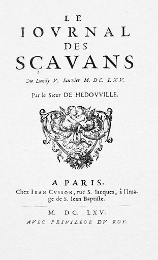 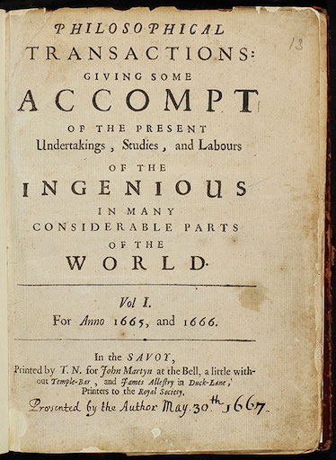  
[[wikipedia]](https://en.wikipedia.org/wiki/Journal_des_s%C3%A7avans#/media/File:1665_journal_des_scavans_title.jpg) [[wikipedia]](https://en.wikipedia.org/wiki/Philosophical_Transactions_of_the_Royal_Society#/media/File:Philosophical_Transactions_Volume_1_frontispiece.jpg)

[[9]](https://en.wikipedia.org/wiki/Academic_publishing)

The goals of academic publishing are:

* Documentation of research results
* Quality Assessment
* Reproducibility
    * Complete and correct documentation
    * Supplemental materials such as proofs, further explanations, code, data
* Contextual integration

It is estimated that there have been about 50 Million scholarly articles published so far. Hence, one can say that the current knowledge is described and archived in publications. These publications are accessible through common libraries and are semantically structured.

You might ask yourself *why should I care*? Well, you are completing a master program at an university and academically that is a first step towards a potentially research career. Your degree will allow you to apply for a PhD program and you should know the basics of the system. Currently publications are the currency in academia and academic careers depend on it. Publications are required for

* Scholarships
* Grants
* Jobs in academia
* Research positions

Research, including e.g. potentially your master thesis, should be shared. Otherwise it pretty much happened simply for your own private amusement.

[[10]](https://www.elsevier.com/reviewers/what-is-peer-review)

## The Process

The publication process comes down to:

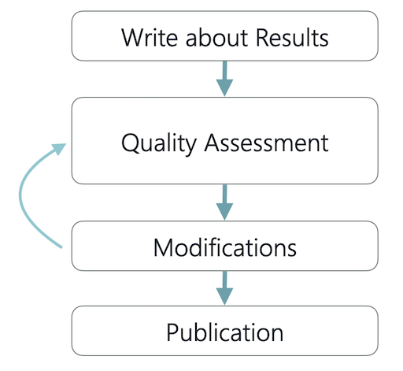  

The quality assessment is most commonly done with a peer review, which I explain in the next section.

## The Peer Review

Peer review is based on the technique that people from the same research community with similar competencies and expertise evaluate the work of a peer. It functions as a form of self-regulation by qualified members of the community.  

Usually, there are 2-5 experts writing reports for each submission. After each reviewer has written an individual report, there will be discussions with the group. It is very common that senior researchers give review tasks to their PhD students. PhD students can learn a lot through that but it is questionable that this ensures the best quality for reviews. Depending on the venue, reviewers are international, meaning, ideally, you get the worldwide experts of your topic to asses your work.

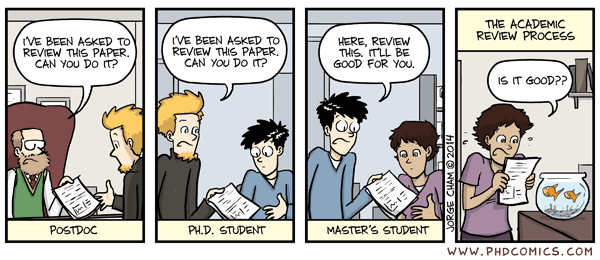  
[[phdcomics]](http://phdcomics.com/comics/archive.php?comicid=1760)

Reviewers play a pivotal role in scholarly publishing. Despite criticisms, peer review is still the only widely accepted method for research validation and has continued successfully with relatively minor changes for some 350 years.

<!-- A common review process looks as follows:

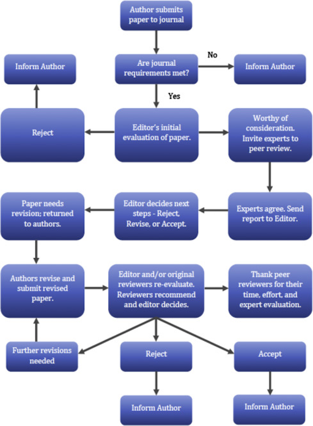  
[[elsevier]](https://www.elsevier.com/reviewers/what-is-peer-review) -->

Peer review comes in different flavours: 

* Single blind review
    * In this type of review, the names of the reviewers are hidden from the authors but the reviewers know the authors names.
* Double-blind review
    * Both the reviewers and the authors are anonymous to each other. This is the most common form of review and considered best practice. However, it is often an illusion that reviewers do not know the authors as aspects such as topic, graphics, used equipment, personal contact, etc. can make it obvious who the authors are.
* Triple-blind review
    * With triple-blind review, reviewers are anonymous and the authors' identity is unknown to both the reviewers and the editor. This is a highly complex process and usually not feasible.
* Open review
    * Open peer review is an umbrella term for many different models aiming at greater transparency during and after the peer review process. The most common definition of open review is when both the reviewer and author are known to each other during the peer review process. Many believe this is the best way to prevent malicious comments, stop plagiarism, prevent reviewers from following their own agenda, and encourage open, honest reviewing. Others see open reviews as a less honest process, in which politeness or fear of retribution may cause a reviewer to withhold or tone down criticism.

[[10]](https://www.elsevier.com/reviewers/what-is-peer-review)

### The Process

In computer science a typical submission looks as follow. Here, the chair is the the conference chair, which would be the editor for a journal. A conference also usually has a program committee, meaning a group is together responsible for the selection process of that conference, headed by the chair.

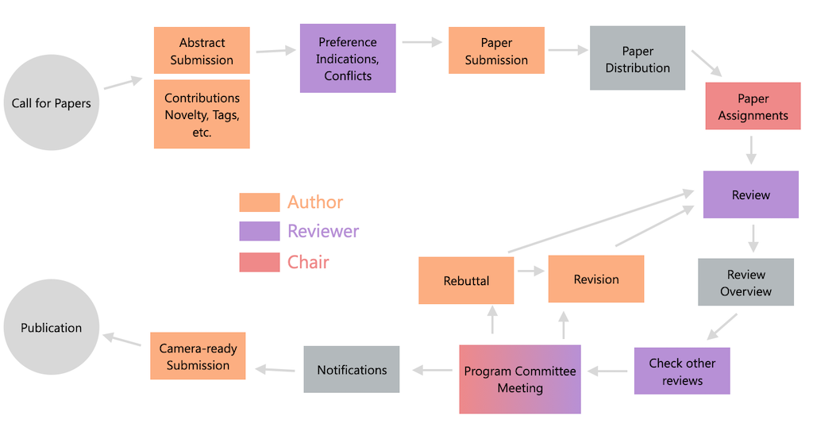  

For submitting the paper there is usually a submission tool. Make sure to check that early and e.g. make an account for yourself and know the requirements. Also check the timezones of the deadlines! The submission of a paper is often split into two deadlines: the first deadline is for submitting the abstract only, usually a week before the deadline for submitting the paper. Keep in mind that next to the abstract you often also have to submit a preview image, keywords, a list of your contributes etc.. You must check this in advance otherwise it will be a bad surprise when you want to submit your abstract 5 minutes before the deadline and suddenly you also need all that additional information. The programm committee and/or the reviewers will make a first *bidding* (saying which paper they want to review) based on the abstract. 

For a conferences there is often a first round of notifications and revisions before the final decision:

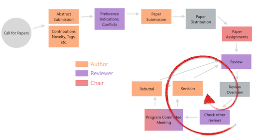  

For the first round, after the programm meeting, the authors get all review reports and their grading. Authors have then the chance to react to the reviews by writing a *rebuttal*. This is usually a short text, with e.g. 1000 characters. 

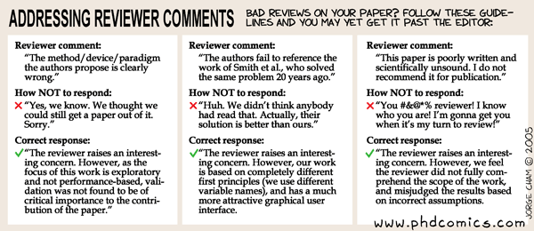  
[[phdcomics]](http://phdcomics.com/comics/archive.php?comicid=581)

The rebuttal is given to the reviewers and then they make their final decision. The decision can be *accept*, *minor revision required*, *major revision required*, and *reject*. These options depend on the venue.  

Most of the time all papers, also the accepted ones, will get some notes about some minor required changes. These must be done for the final publication. The final version is called *camera ready*.

### The Review Report

The most important aspect a review is accessing is wether the submission presents sufficient novel and relevant contributions. The quantity and quality of these depend on the standards of the venue. Overall reviews categorize contributions as follows:

* Major results; very significant
    * Fewer than 1 % of all papers
* Good, solid, interesting work
    * A definite contribution (≤ 10 %)
* Minor, but positive, contribution to knowledge
    * Perhaps 10-30 %
* Elegant and technically correct but useless
    * This category includes sophisticated analyses of flying pigs
* Neither elegant nor useful, but not actually wrong
* Wrong and misleading
* So badly written that technical evaluation is impossible

Next to the contributions, reviewers need to answer

* What is the purpose of this paper?
* Is the paper appropriate? (for the topic scope of the venue)
* Is the goal significant?
* Is the method of approach valid?
* Is the actual execution of research correct?
* Are the correct conclusions drawn from the results?
* Is the presentation satisfactory?
* What did you learn?

The review report then consist of

* Summary
    * The submission in your own words, 1 paragraph
* Quality Assessment
    * Template to answer the above mentioned questions in some form
    * Constructive, 1-3 pages
    * There is a strong etiquette
* Additional Comments
    * For the authors e.g. formalities
    * For the committee (not visible for the authors e.g. suspected plagiarism)
* Recommendation (grade) summary
    * Conference: reject, borderline, accept
    * Journal: reject, major revision, minor revision, accept
* Evaluation confidence
    * Passing knowledge, knowledgeable, expert

#### Quality Assessment

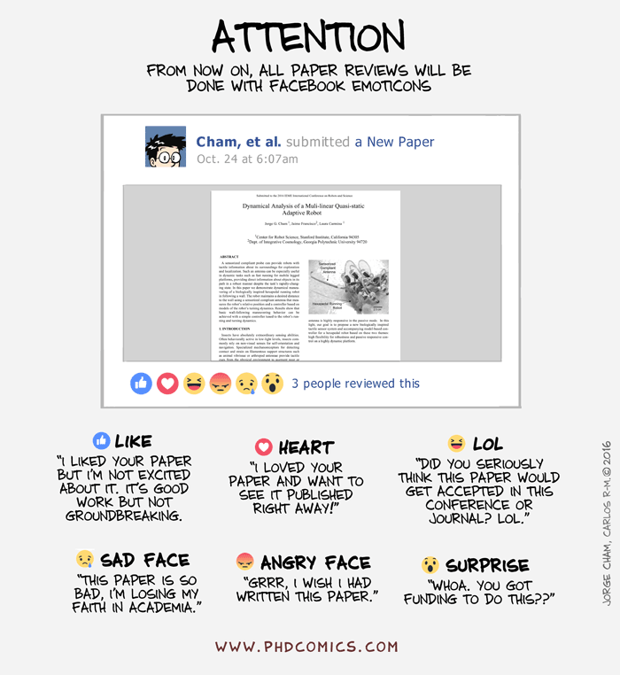  
[[phdcomics]](http://phdcomics.com/comics/archive.php?comicid=538)

For the quality assessment the reviewers get a form. These forms contain a set of questions the reviewer has to answer and give a score for. In the end the review will be a written report, scores for each questions and a final, average score. The form depends on the venue but usually refer to:

* Originality, Novelty
* Clarity of presentation
* Technical soundness
* Importance, utility
* Suitable for event
* Could this approach be implemented by a graduate student?
* Completeness of References

Grades also depend on the venue.

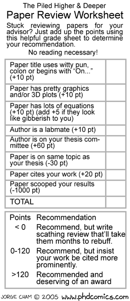  
[[phdcomics]](http://phdcomics.com/comics/archive.php?comicid=538)

[Siggraph](https://s2021.siggraph.org/) scores are, for example:

1 -    Definitely reject. I would protest strongly if it's accepted.  
2 -    Probably reject. I would argue against this paper.  
3 -    Possibly accept, but only if others champion it.  
4 -    Probably accept. I would argue for this paper.  
5 -    Definitely accept. I would protest strongly if it's not accepted.  

[Eurographic](https://conferences.eg.org/eg2021/) scores:

0-    totally unacceptable  
1-    very poor  
2-    poor  
3-    clearly below EG standard  
4-    dubious; not quite acceptable  
5-    marginal; only just acceptable  
6-    acceptable  
7-    good  
8-    very good  
9-    excellent  

The scores in the submission tool will give the chair a first sorting of all submissions:

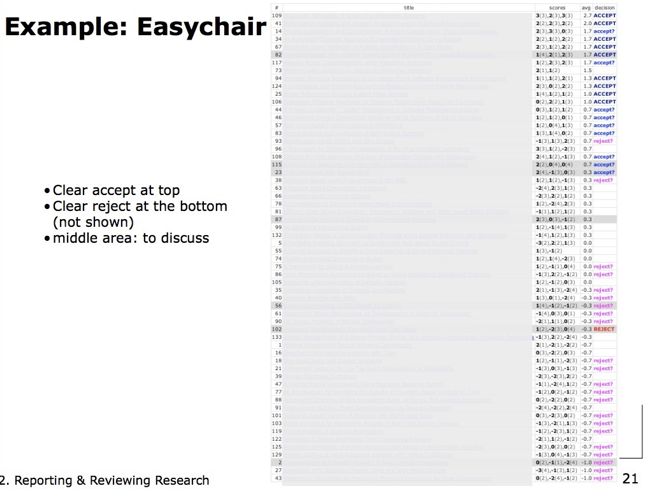  
[[4]](http://win.ua.ac.be/~sdemey/Tutorial_ResearchMethods)  

Then the the final decision will be made through discussion in the program commitee meeting. Opinions about a paper are sorted into:

A: “Good paper. I will champion it at the PC meeting.”  
B: “OK paper, but I will not champion it.”  
C: “Weak paper, though I will not fight strongly against it.”  
D: “Serious problems. I will argue to reject this paper.”  

Then conflicts are identified:

AA, AB: All reviews are positive, at least one champion  
AC: Likely accept; at least one champion, and no strong detractor  
AD: This is a serious conflict, and will certainly lead to debate  
BC: Borderline papers, no strong advocate nor a detractor  
BD: Likely to be rejected  
CC, CD, DD: Almost certain rejects  

Another aspect that is considered is the evaluation confidence of each review:

X: I am an expert in the subject area of this paper.  
Y: I am knowledgeable in the area, though not an expert.  
Z: My evaluation is that of an informed outsider.  

An negative expert opinion is not necessarily more influential though. The program commitee needs to evaluate wether the expert might have been overly critical, such experts are called *fence-sitters*. 

[[4]](http://win.ua.ac.be/~sdemey/Tutorial_ResearchMethods)  

#### Tipps For Submitting a Paper

* Make sure to create the best possible first impression for your submission. The abstract and whatever is asked for the first submission deadline is kind of the *first date* of your work with its reviewers. Make it memorable 😊
* When writing the rebuttal try to identify your champion and give her new arguments or try to turn the maybes into champions. If someone is clearly against your work, let them be, there is usually nothing you can do about that.
* Write yourself a review for your paper in advance or ask a colleague to do it for you. What comes up? Fix it!
* Get as much experience as possible in reviewing other papers. This will help you tremendously in writing better papers.
* Read reviews
    * https://openreview.net/
    * https://distill.pub/about/
    * Ask colleagues for reviews they got for their paper. This is a bit of a touchy situation as reviews are considered to be quite private, maybe because they can be painful and some colleagues might not give them to you.
* Reviews are always extremely insightful and helpful in the development of a project. If you have a finished and polished paper, always submit it, even if you think it has very little chance of acceptance. Of course, don't wast everybody's time with a b\*s\* submission. But if the paper is somewhat good, the reviewers will take it seriously and help you to improve the project.

#### Real Life

My PhD had the following, mediocre but quite normal, submission history:

* SG 2013 - CANCELLED
* PG 2013 - REJECT
* EG 2014 - REJECT
* EGSR 2014 - ACCEPT
* CVMP 2014 (short) - ACCEPT
* BIG DATA 2014  (short) - ACCEPT
* CA 2015 (short) - ACCEPT
* SG 2016 - REJECT
* UIST 2016 - REJECT
* PATENT  P6060-US - ACCEPT
* EG 2017 - REJECT
* CA 2017 - ACCEPT
* DFG Sachbeihilfeantrag 2014 - ACCEPT

By now, to me the most important skill for a Phd student is to not to be easily discouraged and to always keep on trying. Or as Dori would say: *just keep swimming* 🐟 🐠 🐟.

Some excerpts of the reviews I got over time:

* I was completely **disappointed by** […]
* The results of this paper are **not reasonable**.
* This paper is disappointing as it **lacks novelty**.
* […] the paper describes a longer list of minor changes to an existing algorithm. […] reuses a lot of established concepts […] **does not seem to lead to fundamental new insights** or **significant technical challenges**.
* This paper does not seem to advance the state-of-the-art in any way. 
*  […] would **not** consider the paper **a major practical break-through**.
* I'm not very enthusiastic about the paper […]
* […] make the results **hardly meaningful**.
* I am **skeptical of the value** of the presented studies.
The problem addressed in the paper **does not seem very new** and the proposed algorithms also **do not offer any particular insights**. Therefore, I think this paper **is not significant enough**.
* The manuscript also fails to present the (rather simple) technique in a concise (and correct) way. 
* […] **makes no sense**.

Ouch! 😔 

Also, I had it happen to me that one reviewer criticized the bad presentation of the paper while another one praised it as very well presented. That is how getting reviews is like...

## Publications Types

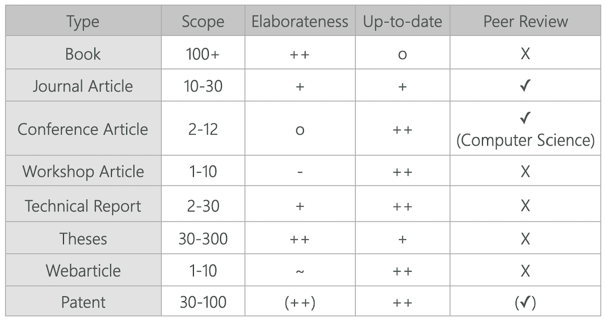

Journals

* Quality assessment with peer review
    * *Editors* oversee the reviewing
    * Reviewers are the members of the Editorial Boards and externals
* No deadlines
* Multiple review circles
    * Minor revision, major revision,...
    * Revisions can be given multiple times and then a paper can still be rejected in the end
* Slow process that takes between 6 months - 2 years
* In most sciences journal publications are the only venue that counts

Conferences

* Quality assessment usually with peer review
    * *Program Chairs* oversee the reviewing
    * Reviewers are the members of the Program Committee and externals
* Fixed deadlines
    * Check time zones
    * The big conferences are once a year
* Usually only one review circle, sometimes two
    * Highly structured process
* Fast process
    * 2 months - 6 months
* Output are *Proceedings*, which is a collection of all papers from the conference
    * Proceedings might go straight into a journal, as for example with Siggraph
* One of the authors *must* be present at the conference and give a presentation
    * Usually the first author
* Conferences might include additional tracks such as short papers, posters and workshops
    * These might have no or limited reviewing
* Conference publications, hence proceedings, are well respected in computer science
    * In other disciplines conferences are of no importance and influence

## Bibliometrics

Bibliometrics is the use of statistical methods for quality measures to to analyse  

* Journals
* Conferences
* Authors

Its goal is to make research comparable and to help to answer questions such as

* What to read?
* Where to publish?
* Whom to hire?

### Short Story

The short story is that the number of *how often the journal itself or a paper are cited* in other publications is the most important quality measurement.

### Journal Quality Assessment

Journals have *impact factors*. The impact factor (IF) or journal impact factor is an index that reflects the yearly average number of citations that articles published in the last two years in a given journal received. It is frequently used as a proxy for the relative importance of a journal within its field; journals with higher impact factors are often deemed to be more important than those with lower ones. Impact factors are calculated yearly starting from 1975 for journals listed in the Journal Citation Reports (JCR). [[11]](https://en.wikipedia.org/wiki/Impact_factor)

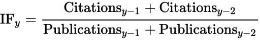  
[[wikipedia]](https://en.wikipedia.org/wiki/Impact_factor)

For example, Nature had an impact score of 41.456 in 2017:

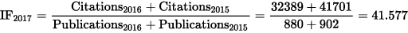  
[[wikipedia]](https://en.wikipedia.org/wiki/Impact_factor)

This means that, on average, its papers published in 2015 and 2016 received roughly 42 citations each in 2017. Note that 2017 impact factors are reported in 2018; they cannot be calculated until all of the 2017 publications have been processed by the indexing agency.

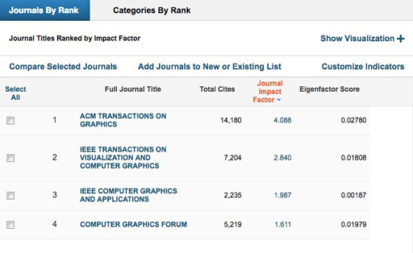

There are several other methods to calculate the quality of a journal, e.g.

* [Eigenfactor](www.eigenfactor.org)
* [Scimago](https://www.scimagojr.com/index.php)
* Google gives you several sites, e.g. [Guide 2 Research](www.guide2research.com/journals/)

[xkcd](https://xkcd.com/927/)

[[1]](http://guides.library.cornell.edu/c.php?g=32272&p=203394) [[11]](https://en.wikipedia.org/wiki/Impact_factor)

There are several problems with the impact factor and similar quality measurements and those standards are fiercely discussed in academia. For example, nobel laureate [Peter Doherty](https://en.wikipedia.org/wiki/Peter_C._Doherty) says in [this talk](http://www.nobelprizeii.org/videos/important-journals-impact-factor/) that impact factors are skewing science. Some of the issues are

* Journals are edited - which role do the editors play in the selections and modification of work?
* Journal subscription should sell - are publications chosen by their popularity?
* Research, especially basic and fundamental work, often needs more time to be cited.

### Conference Quality Assessment

The quality of conferences is mainly measured by their *acceptance rate* (submissions vs. acceptance). The numbers are approximately

* A-Conferences: 15–25%
* B-Conferences: 25–35%
* C-Conferences/Workshops: > 35%

Additional factors are

* if the proceedings go into a journal,
* if the best articles are invited to submit an extended version to a journal and are reviewed on a fast-track, and
* which database the proceedings (best ones: ACM, IEEE, Springer,…) lists.

This also depends on the community.

[[3]](https://en.wikipedia.org/wiki/Impact_factor) [[4]](http://win.ua.ac.be/~sdemey/Tutorial_ResearchMethods)

## Where to Publish?

Ok, now that you know how judge how good the different publication venues are, the question is where to submit your work to? For example, if you think you have a very good paper, should you submit it to a top-level conference or a journal? Both require about the same level of scientific content and polishing. However, there is a page limit in conferences, which is usually not as strict in journals. So if your paper has more than 10 pages, a journal will be the better choice. Other than that also the time you have to publish could be a decision factor. For conferences there are fixed deadlines you have to meet but journals might take much longer in the decision process.

In terms of quality, researchers often submit first to a top-level venue and then progressively downgrade depending on the reviews they got. Sometimes the reviews give hope that with some modifications a top-level venue is still possible, sometimes they make clear that there is no chance in the world that the paper is ever accepted at a certain venue quality level. Then you downgrade.

## Researcher Quality Assessment

In the same way the quality of publication venues is measured, the researches themselves are evaluated. You might have heard of the saying *publish or perish*, which means that if you do not publish enough your career will vanish. The most important quality measurements for researchers are *how many papers they have published* and *how often their papers are cited*. However, these are also not as simple as that. Do you, for example, need to count a publication differently for the first and the co-authors? Do you need to weight that number with the impact factor of the venue where it is published? Should the citation count be absolute or per paper?

As researchers are somewhat human beings they also have a so called *academic age*. For how long have they been researchers and over what time do the publication count span? Do the researchers have children, did they work in the industry, etc.?

In regard to citation counts the standards are the *h-index* and the *i10 index*.

The h-index is an author-level metric that attempts to measure both the productivity and citation impact of the publications of a scientist or scholar. The h-index correlates with obvious success indicators such as winning the Nobel Prize, being accepted for research fellowships and holding positions at top universities [1, as cited in [12]((https://en.wikipedia.org/wiki/H-index))]. The index is based on the set of the scientist's most cited papers and the number of citations that they have received in other publications. [[12]](https://en.wikipedia.org/wiki/H-index)

A scientist has index h if h papers have at least h citations each, and the other papers have at most h citations each.

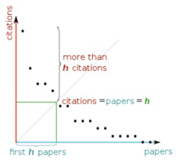

E.g. [Google scholar](https://scholar.google.com/citations?view_op=top_venues&hl=en) gives you the h-index for a researcher.

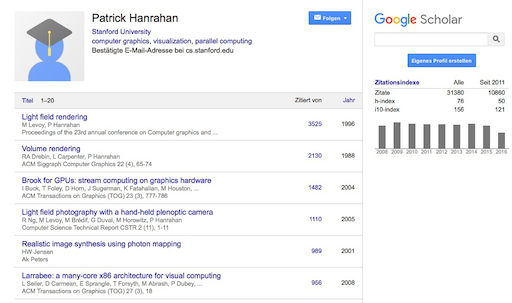

The good aspects about the h index are that it is a measurement of actual citations, not just according to journal impact factors and that it is robust. Bad aspects are that citation counts do not necessarily mirror the impact and the quality of a paper and that the number of authors and the order of authors is not represented.

The sum of the h-indices of all authors is also used to access the quality of a journal.

Overall:

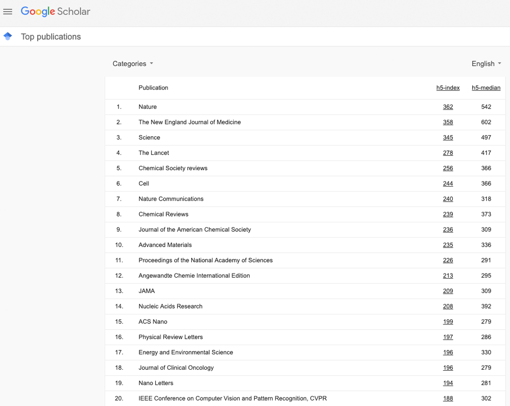  
[[google scholar]](https://scholar.google.com/citations?view_op=top_venues&hl=en)

Computer Graphics:

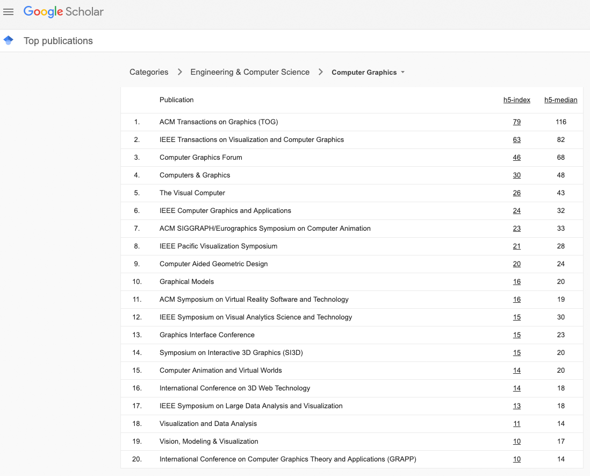 
[[google scholar]](https://scholar.google.com/citations?view_op=top_venues&hl=en&vq=eng_computergraphics)

[[4]](http://win.ua.ac.be/~sdemey/Tutorial_ResearchMethods)

## Problems With The Current Publication System

The above described publication system and peer reviews are constantly discussed in the academic community. 

The main points of criticism refer to the *accessibility* and the *quality* of publications.

### Accessibility

Journal publishing

* Researchers write and review articles financed with public funds that pay for their university positions
* Private publishing houses sell those articles and earn money with it
    * Usually through database access fees
    * But have almost no costs anymore through digital publishing

Problems

* Database access fees are high and continue to rise
* Smaller institutions can not afford them
* Publishing houses have no costs and large returns

A possible solution are so called *open access* venues. The general idea is that the authors themselves pay for publications and to access those papers is free.  

However, the new open access venues are still not as accepted in the community and have at times dubious quality control. A study submitted an article about cancer research with obvious errors to 304 open access journals. After 10 months 255 journals were still taking the submission seriously. In the end 62% of the venues accepted the submission (with errors!), 60% had no peer review.

The good news are that also the established publishing houses integrate more and more open access strategies, with having the authors pay a fee for publication and having the papers accessible for free. We are currently in a transiontal phase with different modes of publishing being around and we need to see what the new standrads will be.

[[5]](http://www.sciencemag.org/content/342/6154/60.full) [[6]](https://www.theguardian.com/higher-education-network/2013/oct/04/open-access-journals-fake-paper)

### Quality

The Neural Information Processing Systems 2014 (NIPS 2014) conference conducted a study to evaluate its own quality. The NIPS is overall a good venue with ~2400 participants each year and a ~22% acceptance rate.

The conference set up two different program committees and sent 10% of all submissions to both committees. As result, 57% of the papers where accepted from one committee and were rejected from the other one! This is a horrible quota. A random decision making process would have had only 77% of the submissions with difference decisions, which is not that far of from 57%.

Another constantly discussed aspect in regard to quality is the fact that only positive results are publishable. This means that if your experiment failed or a new algorithms doesn't lead to the improvements you expected, you can not publish your results. This is unfortunate as describing something that did not work is also worth knowing for other researchers and helps other them not to follow the same misleading research idea/setup.

Also, this culture of only publishing successful results greatly diminishes the chance to produce actual truth as this following figure indicates:

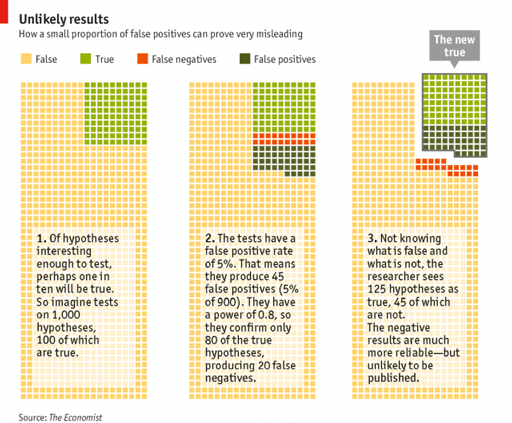  
[[economist]](http://www.economist.com/news/briefing/21588057-scientists-think-science-self-correcting-alarming-degree-it-not-trouble)

[[7]](http://blog.mrtz.org/2014/12/15/the-nips-experiment.html)

### Cultural Change Needed?

Some of the discussed possible changes are 

* More elaborate reviews
    * More reviewers
    * Reviewer ratings
    * More reviewing cycles
    * Higher standards
* Accept the randomness of the process
    * Less emphasis on publication metrics
* Higher standards
    * Statistical Standards
        * Publish hypotheses before the experiment
        * Stronger statistical criteria
    * Publication of failed experiments/negative results
    * Reproducibility
        * Repeat experiments, run code, etc.
        * Make reproduction valuable 
            * Currently you get nothing for checking someone elses work
    * Focus on quality, not quantity

## Next

Well kids, there is no next. Now you know it all: from coming up with a research idea, over developing a suitable methodology, executing the chosen methods correctly, evaluating your work, to writing about it in an academic fashion and publishing it at an academic venue for the world to see.

Now, little birds fly...

## References

This script is inspired by

* F. Beck, D. Weiskopf, M. Mehl: Ringvorlesung Informatik, Stuttgart
* S. Demeyer: [Research Methods in Computer Science](http://win.ua.ac.be/~sdemey/Tutorial_ResearchMethods/), Tutorial, ICSM 2011 Conference, 2011 

[[1] LibGuides at Cornell University - Measuring your research impact: Journal Impact](http://guides.library.cornell.edu/c.php?g=32272&p=203394)  
[[2] Wikipedia - Academic publishing](https://en.wikipedia.org/wiki/Academic_publishing)  
[[3] Wikipedia - Impact factor](https://en.wikipedia.org/wiki/Impact_factor)  
[[4] S. Demeyer, Research Methods in Computer Science, Tutorial at ICSM 2011 Conference](http://win.ua.ac.be/~sdemey/Tutorial_ResearchMethods)  
[[5] J. Bohannon (2013), Who's Afraid of Peer Review?, Science 342 (6154): 60-65.](http://www.sciencemag.org/content/342/6154/60.full)  
[[6] C. Shaw (2013): Hundreds of open access journals accept fake science paper, The Guardian](https://www.theguardian.com/higher-education-network/2013/oct/04/open-access-journals-fake-paper)  
[[7] E. Price (2014): The NIPS experiment, Moody Rd](http://blog.mrtz.org/2014/12/15/the-nips-experiment.html)  
[8] F. Beck, D. Weiskopf, M. Mehl: Ringvorlesung Informatik, Stuttgart  
[[9] Wiki - Academic Publishing](https://en.wikipedia.org/wiki/Academic_publishing)  
[[10] Elsevier - What is peer review?](https://www.elsevier.com/reviewers/what-is-peer-review)
[[11] Wiki - Impact Factor](https://en.wikipedia.org/wiki/Impact_factor)
[[12] Wiki - H-Index](https://en.wikipedia.org/wiki/H-index)

---

The End

🏆 📊 🍀
