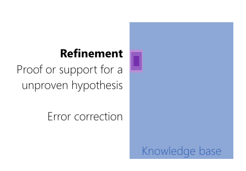
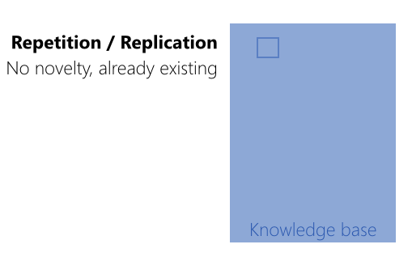

name: inverse
layout: true
class: center, middle, inverse
---

# Academic Methodologies

### Prof. Dr. Lena Gieseke | l.gieseke@filmuniversitaet.de  

#### Film University Babelsberg KONRAD WOLF

---
layout: false

## Today

--
* ACS FUB 2023

--
* Course setup

--
* What is research?

---
template:inverse

### Chapter 01

### Academic Conference Simulation at the Film University Babelsberg KONRAD WOLF

# ACS FUB 2023

???
.task[COMMENT:]  

* The overall goal of this lecture is to help you to conduct your own research projects. Please keep in mind that we will start small with your projects and papers. 

---
## ACS FUB 2023

--
* Practical exercise for academic research processes

--
* Replication of a typical process of submitting a research paper

--
* Application of all lecture topics

--

The simulation includes

--
* The submission of a (short-) paper

--
* Writing and receiving reviews

--
* The presentation of your work in front of your peers

--
* A best paper award

---
.header[ACS FUB 2023]

## The Paper

--
* Must adhere to an academic format
    * E.g. introduction, contributions, related work, problem statement, solution, future work)
--
* Must tell an "academic story"
    * In real life: should make an academic contribution

---
.header[ACS FUB 2023 | The Paper]

## Topic

--
* Any topic of your choice within the field of Creative Technologies

--
* The research itself does not need to be a new task

--
* The paper can relate to your 1st term project or Bachelor thesis 

???
.task[COMMENT:]  

* I highly recommend to try to come up with a topic in the context of your 1st term project as you have already put in a lot of thought and effort into it and it might have a greater chance of publication with an accompanying practical implementation. There are plenty of more practical and / or artistic oriented venues.

---
.header[ACS FUB 2023 | The Paper]

## Format

The paper must follow the format guidelines otherwise it is not accepted.

--
* 4-6 pages (without references)
* In English
* Abstract of <= 1000 characters
* Written with the given LaTeX Template

--

Submission

* As pdf
* Through the conference management system [EasyChair](https://easychair.org/)

???
.task[COMMENT:]  

* https://easychair.org/conferences/submissions?a=26977916

---
.header[ACS FUB 2023]

## Reviews

--
* You will write and receive two reviews for your paper from your fellow students

--
* Reviews evaluate the content but also form and language of your paper

--
* There will be a review template

--
* If there are revision requests, these must be worked in for the final version of the paper

---
.header[ACS FUB 2023]

## Deadlines

--
All deadlines (all dates 20:00 GMT) are hard. Late submissions are not accepted.

--
* 29.08.23: Abstract Due
* 05.09.23: Paper Due
* 08.09.23: Review Start
* 28.09.23: Review Due
* 30.09.23: Author Notification
* October 23 (tba): Camera-ready Paper Due
* October 23 (tba): Conference presentation

---
template: inverse

# Course Setup

???
.task[COMMENT:]  

* [text](https://github.com/ctechfilmuniversity/lecture_academic_methodologies)

---
template: inverse

### Chapter 02

# Research

???
.task[COMMENT:]  

* But before we get into specific methods and tasks, such as statistics or writing, let's start at the very beginning and build a general understanding of what research is and how to think about it.
* After all, research is, among other things, about taking a closer look into something and having a deeper understanding of things. So let's do some research about research 😎

---
.header[Research]

## Learning Objectives

--
* Understand some underlying principles of research

--
* Understand common terminology

--
* Differentiate research types

--
* Understand the difference and necessity of research methodologies and methods

---
## Research?

> What is research?  

???
.task[COMMENT:]  

* To answer this comprehensively and in general terms is difficult. The specifics highly depend on the research disciplines and differ greatly.

* It is much easier to think about the *goal* of conducting research.

---
## Research?

  
> Which goals does research have?

---
.header[Research]

## Goals

--
* Novelty

???
.task[COMMENT:]  

* Research, in the most general sense, aims to come up with something new, something that has not existed before, be it a theory, an algorithm, an engine, an refinement of something existing, or a proof.

--
* Relevance

???
.task[COMMENT:]  

* Here, relevance does not mean how applicable or practical results are. It means that research needs to be connected to some underlying truth, to existing knowledge and to previous research and that it should have as much meaningful impact as possible. 
* Of course, what meaningful is, again depends on the discipline, to which it must be connected. 
*  But to give you a counter-example: you can come up with the most beautiful explanation for flying pigs - but no one will care as this theory is of no relevance to the world. Previous research has shown (e.g. based on the anatomy of pigs and continuos observations) that pigs can not fly. 

--
Researchers aim to make novel contributions that are of relevance to the knowledge of the world.

???
.task[COMMENT:]  

* With this understanding, we are already touching on a complicated matter in research though. What if someone comes up with something novel and truthful for which the existing knowledge is simply wrong or which no one cares about as of now but might later on? Well, these cases are exceptions, but they do happen. Just think as an example of the Italian astronomer, physicist and engineer Galileo who ended up under house arrest for the rest of his life for supporting the astronomical model that the earth and planets revolve around the sun (this model is called [Heliocentrism](https://en.wikipedia.org/wiki/Heliocentrism)). With the knowledge of today, we believe the heliocentric model to be true. Galileo was ahead of his time
* This said, please don't consider yourself to be a Galileo as of now. Follow the research standards of adhering to the current knowledge of the world and always aim to connect your work to existing research results.

---
.header[Research | Goals]

## Positive Examples

--

---
.header[Research | Goals]

## Positive Examples

--
> If I have seen further, it is by standing on the shoulders of giants. - Isaac Newton

---
.header[Research | Goals]

## Positive Examples

--

---

.header[Research | Goals]

## Positive Examples

???
.task[COMMENT:]  

* Refinement Example Newton and Einstein:
* Isaac Newton developed a number of laws of motion and mechanics that we still use today. For many years the laws of Newton were considered to be absolute fact. 
* Many years later, Albert Einstein noticed that in certain situations Newton's laws were incorrect. Especially in cases where the object under consideration is moving nearing the speed of light. Einstein helped to create a new theory, the theory of relativity, that corrected those errors. Even though Einstein was a brilliant scientist, modern physicists are developing new theories because there are some errors in Einstein's theories. This shows that each new generation of physicists helps to reduce the errors of the previous generations.
* In terms of refinement, a lot of research goes into *proofing* what is *believed* to be true in order to turn believe into knowledge.

---
.header[Research | Goals]

## Negative Examples

--

---
.header[Research | Goals]

## Negative Examples

---
.header[Research | Goals]

## Negative Examples

--

---
.header[Research | Goals]

## Negative Examples

---
.header[Research]

## Terminology

???
.task[COMMENT:]  

* What else? Maybe a look into a dictionary might help (I really do this in real life all the time: if I try to understand something more deeply, I look up its given definitions - and there is usually more than one; this helps to get a broader context of something)

--

Apple Dictionary:

> ...the systematic investigation into and study of materials and sources in order to establish facts and reach new conclusions.  
  
  
--
Hence, the key points are

--
* *systematic investigation*

--
* *establish facts*

--
* *reach new conclusions*

???
.task[COMMENT:]  

* Show: https://www.wikiwand.com/en/Research
* Faust, or better Goethe said:

> Dass ich erkenne, was die Welt im Innersten zusammenhält,…

> That I may understand whatever binds the world’s innermost core together,…

So, we seem to aim for some *deeper* understanding about the *world*. Please note that a Faust quotation would not count as scientific reference. But wait - what do I mean with *scientific* here? Well, let's have a look into a dictionary...

---
.header[Research | Terminology]

## Science

Apple Dictionary:

> The intellectual and practical activity encompassing the systematic study of the structure and behavior of the physical and natural world through observation and experiment.
  
  
--
With the key points being

--
* *systematic study* 

--
* *through observation and experiment*

---
template:inverse

## Fundamental vs. Applied Research

???
.task[COMMENT:]  

* Anyhow, as I have already mentioned, what we understand as research highly depends on the specific types and disciplines. Nonetheless, there are tendencies within academia to categorize different approaches. Aspects for differentiation are for example how fundamental vs. applied research is, or controlled and measurable vs. interpretative, etc.
* Especially in Germany, we differentiate between *fundamental* and *applied* research. This is reflected by two types of research institutions, namely *universities* and *universities of applied sciences*.  
* Almost nowhere else in the world this differentiation on a constitutional level exists. Of course the categorization into fundamental and applied research holds up everywhere, as it make sense and describes different approaches correctly. But other countries, quite sensibly, see no need to put those different research types into separate institutions...

---
.header[Research]

## Fundamental Research

--

* *Basic research* or *Grundlagenforschung*
* Novel, builds new frontiers of knowledge
* Systematic, often explanations and conclusions based on logic
* Enables a broad base of applications
* Forms the basis for applied research

???
.task[COMMENT:]  

* It investigates basic principles and reasons for occurrence of a particular event or pro­cess or phenomenon. Fundamental research seeks generalization. It has no desire to lead to immediate use or application but aims for originality, fundamental novelty, and overall truth. 

---
.header[Research]

## Applied Research

* Finds a solution for a practical problem
* Applies a theory in praxis
* Studies complex cases
* Can be interdisciplinary
* Improves and iterates

???
.task[COMMENT:]  

* Applied research explores a *utility* and em­ploys well known and accepted theories and principles. Its outcome usually has an immediate application. It often studies individual or specific cases without the objective to generalize.

---
.header[Research]

### Fundamental vs. Applied Research

Name one possible research problem 

* for an applied research task and one 
* for a fundamental one each, 
 
from the context of creative technologies.

???
.task[COMMENT:]  

* Applied research: an experiment which aims at creating the smoothest transition between a room in which a virtual experience is to be experienced in an exhibition and the exhibition piece itself. Should there be a door through which you enter? Should you be alone in the room? Is there somebody helping you with putting on the VR headset?
* Fundamental perspective: the same problem should be researched by comparing multiple of such experiences and exhibition venues. By looking at what all of them had in common and where they differed from eachother and then comparing these properties to the user's experience, one might find out broader rules for smoothly transitioning into a virtual world. Maybe it's not about doors or people, but about using the same lighting for both "worlds". Or maybe it actually simply is about the fact that there was a door.

---
.header[Research]

## Pure vs. Applied

--

.center[[[xkcd]](http://xkcd.com/435/)]

---
.header[Research]

## Pure vs. Applied

Mathematics is considered a pure (also *fundamental*) science. It leaves no room for interpretation. It is based on axioms and proofs.

???
.task[COMMENT:]  

* Axiom
    * A statement (an assumption) that is taken to be true, to serve as a premise or starting point for further reasoning
* Proof
    * Logical reasoning from (true) assumptions

--

Example Proof

* Consider two even integers `x` and `y`
* Since they are even, they can be written as `x = 2a` and `y = 2b`, respectively, for integers `a` and `b`
* Then the sum is `x + y = 2a + 2b = 2(a+b)`
* Therefore `x+y` has `2` as a factor and, by definition, is even.
* Hence the sum of any two even integers is even.

???
.task[COMMENT:]  

* Hard to argue with that, right?

---

## Real vs. Imaginary

Examples of “real-life” research are user studies and case studies, which "look at the actual world" and systematically investigate a phenomenon within its real-life context.

.center[[[scienceisbeauty]](https://scienceisbeauty.tumblr.com/)]

---
.header[Research]

## Summary

Thinking about the type and discipline of a research problem at hand might help you to chose a suitable methodology and methods (we will come back to this).  
  
--
  
Different research types, disciplines and venues have different standards, methods, documentation styles, etc.

???
.task[COMMENT:]  

* Also, different publication venues (journal, conferences, etc.) have different expectations and you need to chose the right one for your work. You might come up with the most beautiful fundamental, groundbreaking theory, but when submitting it to a applied research venue, it will be rejected with the question of "where is the application?" or in short "out of scope". That is why it is important to know about these differentiations.
* Also, I encourage you not to judge different types and disciplines! This is unfortunately happening quite a bit in academia, as for example the comics above imply. Certain fields or researchers might judge other work unfavorably even though it is just different. Of course there is also a lot of research, which is simply bad but this must be judged by its respective research community.  
* Across disciplines, it is indeed hard to understand why and how other research is conducted. But I personally try to approach it with a sense of curiosity and as opportunity to learn instead of dismissing it as not up to my standards, expectations, etc. For example, coming from a scientific point of view, artistic research principles can feel quite foreign but I have already learned a lot from them!

---
template:inverse

## Problem Solving

---
## Research

--
* Research is a skill and it can be learned

--
* You have to be curious, motivated, creative, and 

--
* stress resistant.

--
  
Hence, research is foremost about attitude and effort.

???
.task[COMMENT:]  

* Furthermore, an important approach to research is to *like* hard problems and the desire to investigate or to solve them.

--

> No problem can withstand the assault of sustained thinking. - Voltaire

???
.task[COMMENT:]  

* Furthermore, an important approach to research is to *like* hard problems and the desire to investigate or to solve them.

---

.center[]

---
.header[Research]

## Hard Problems

> What makes a problem a hard problem?

--

You can categorize problems as

--
* Easy problems: you can just *see the answer*

--
* Medium problems: you can see the answer once you *engage*

--
* Hard problems: you need *strategies* for coming up with a potential solution, sometimes even for just getting started

--

Hence, to do research, we need strategies.

---
.header[Research]

## Strategies

> What are the differences between methods and methodologies?

---
.header[Research]

## Method

--

Methods are the specific tasks you undertake within your project, such as

--
* Theoretical procedures
* Formulas
* Algorithms
* Studies
* Numerical schemes
* Statistical approaches  

--
  
All applied methods must be carefully planned, adhere to academic standards and be value-neutral.  

--

Being value-neutral means that methods should not favor any outcome and be as open-ended as possible.

???
.task[COMMENT:]  

* Usually, these methods help you to collect samples and data, which are relevant to your research. They can also support analysis, explanations and discussion.

---
.header[Research]

## Methodology

--

We are aiming for a deeper understanding in academia and need to not only execute research but also explain it. 

--

This is usually done in the *motivation*, *discussion* and *evaluation* sections of a publication.  

--

You will need to answer questions, such as:

* Why is a particular research study undertaken?
* How did you formulate the research problem?
* How are you solving the problem and why is that a suitable approach?
* What types of data did you collected, why?
* What particular methods have been used, why?
* How do you validate your methods?
* How do you validate your insights and results?

???
.task[COMMENT:]  

* Consideration of these aspects constitute a research methodology. Ideally, you are able to answer these questions before you start your actual research work.

* For example, not only know how to calculate the mean, variance and distribution of a data set but also know why these functions give meaningful results for the chosen problem. Is e.g. the mean at all representative for the data set?

---
template:inverse

# Next Session

---
## Next Session

In the next session we will have a look into different methodologies and approaches to reasoning.

--

.center[]

---
template:inverse

### The End

# 👋🏻
