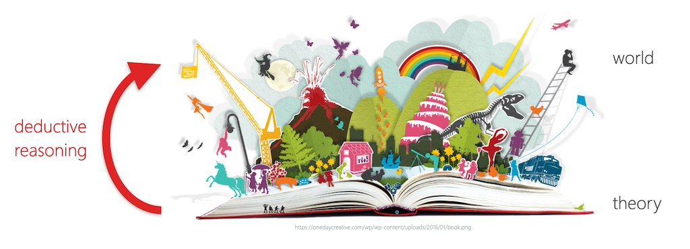

name: inverse
layout: true
class: center, middle, inverse
---

# Academic Methodologies

### Prof. Dr. Lena Gieseke | l.gieseke@filmuniversitaet.de  

#### Film University Babelsberg KONRAD WOLF

---
layout: false

# Today

--
* Re-Cap Last Session

--
* Logic

--
* Inductive and Deductive Reasoning

--
* Scientific Method

--
* Quantitative and Qualitative Methodologies

---
template: inverse

# Chapter 02: Research

---
template: inverse

## What Is Research?

???
.task[COMMENT:]  

* The goals of research?

---

## Research

* Novelty
* Relevance

>Researchers aim to make novel contributions that are of relevance to the knowledge of the world.

--

* *Systematic investigation*
* *Establish facts*

???
.task[COMMENT:]  

* Show: https://www.wikiwand.com/en/Research

## Fundamental vs. Applied Research

Fundamental research

* Basic research (*Grundlagenforschung*)
* Seeks generalization and offers a broad base for various applications
* Forms the basis for applied research

Applied research

* Finds a solution for a practical problem or has an immediate application
* Studies complex cases
* Improves and iterates

---
.header[Research]

## Problem Solving

--

What do you need to be a successful researcher?  

--

Attitude, effort... and curiosity!

.center[]

???
.task[COMMENT:]  

## What Are Hard Problems?

You can categorize problems as

* Easy problems: you can just *see the answer*.
* Medium problems: you can see the answer once you *engage*.
* **Hard problems: you need *strategies* for coming up with a potential solution, sometimes even for just getting started.**

---

## Research

What are the differences between research method(s) and methodology?

*Method*

* Various procedures, schemes, algorithms, etc.
* Planned, scientific and value-neutral

*Methodology*

* A science of studying how research is to be carried out.
* Study of methods by which knowledge is gained.

--

> The work plan for a research project and its justification.

???
.task[COMMENT:]  

* Systematic way to solve a problem

---

## Research

> Any fool can know. The point is to understand.  
  
 — Einstein

--

We are aiming for a deeper understanding in academia and need to not only execute research but also explain and contextualize it. 

--

This is usually done in the *motivation*, *discussion* and *evaluation* sections of a publication.  

???
.task[COMMENT:]  

You will need to answer questions, such as:

* Why is a particular research study undertaken?
* How did you formulate the research problem?
* How are you solving the problem and why is that a suitable approach?
* What types of data did you collected, why?
* What particular methods have been used, why?
* How do you validate your methods?
* How do you validate your insights and results?

---

## Research

> Computers Are Useless. They Can Only Give You Answers.  
>  —Picasso

---
template:inverse

# Chapter 03 - Reasoning

???
.task[COMMENT:]  

Learning Objectives

* Understand the difference between inductive and deductive reasoning.
* Be able to apply inductive and deductive reasoning.
* Be able to formulate a falsifiable hypothesis.
* Understand the difference between quantitative and qualitative research methodologies.

---
## Reasoning

Reasoning can be done well and it can be done badly...

--

... and it can be done correctly or incorrectly. 

???
.task[COMMENT:]  

* What is the difference between good and bad reasoning. What is the spectrum?

---
.header[Reasoning]

## Logic

--

Logic is the discipline that aims to distinguish good reasoning from bad. 

--

> Logic is the study of how ideas reasonably fit together. 

???
.task[COMMENT:]  

* When you apply logic, you must be concerned with analyzing ideas and arguments by using reason and rational thinking, not emotions or mysticism or belief.

All academic disciplines employ logic

* to evaluate evidence, 
* to analyze arguments, 
* to explain ideas, and 
* to connect evidence to arguments. 

There are a variety of different types of logical reasoning and methods for it. 
  
Hence, there are many approaches to the logical enterprise. 

--

* Set of rules and techniques

???
.task[COMMENT:]  

* A logic must formulate precise standards for evaluating reasoning and develop methods for applying those standards to particular instances.
* We will have a brief look into different standards that follow the core principle of applying logic.

---
template:inverse

## Inductive Reasoning

???
.task[COMMENT:]  

* What is inductive reasoning?

---
.header[Reasoning | Inductive Reasoning]

## Empiricism

--

.center[]
  

> All our knowledge is based on our experiences in the world.

???
.task[COMMENT:]  

* One could intuitively say, that all our knowledge is based on our experiences in the world. 
* Hence, in order to come up with truth and knowledge, we need to have a closer look into our experiences in the world. That is what the *[Empiricism](https://en.wikipedia.org/wiki/Empiricism)* philosophy of science assumes.
* Empiricism considers knowledge to come only or primarily from (sensory) experience. 
* Historically, empiricism relates to the concept of [tabula rasa](https://en.wikipedia.org/wiki/Tabula_rasa) (*blank slate*), according to which the human mind is *blank* at birth and develops its thoughts only through experience. This theory denies that humans have innate ideas and this image dates back to Aristotle.

---
.header[Reasoning]

## Inductive Reasoning

.center[]

???
.task[COMMENT:]  

* Formulate general statements or laws based on a number of observations of recurring patterns.
* It derives novel theories from the world.
* Specifically...

--

An inductive argument is an argument whose conclusion is supposed to follow from its premises with a high level of probability. 

???
.task[COMMENT:]  

* which means that although it is possible that the conclusion doesn’t follow from its premises, it is unlikely that this is the case. [[37]](https://viva.pressbooks.pub/letsgetwriting/chapter/what-is-logic/)
* There are also different subtypes of inductive reasoning but for us it is enough to grasp the general concept.

---
.header[Reasoning]

## Inductive Reasoning

A classic example of inductive reasoning comes from the empiricist [David Hume](https://en.wikipedia.org/wiki/David_Hume):

> Premise: *The sun has risen in the east every morning up until now.*  

--
> Conclusion: *The sun will also rise in the east tomorrow.*

---
.header[Reasoning]

## Inductive Reasoning

Hence, you can describe the process of inductive reasoning as

--
* a collection of related samples (premises),

--
* theory formation (induction), and

???
.task[COMMENT:]  

* or category, concept etc.

--
* transfer of theory to the whole population (conclusion).  

--
  
The truth of the conclusion of an inductive argument **can only ever be *probable*** - based upon the evidence given. 

???
.task[COMMENT:]  

* Hence, an inductive reasoning and its conclusion is either strong or weak, not right or wrong. 
* If an inductive argument is strong, the truth of the premise would mean the conclusion is likely. If an inductive argument is weak, the logic connecting the premise and conclusion is incorrect.
  
What is the problem with the following reasoning?

---
.header[Reasoning]

## Inductive Reasoning

Premise: *I saw a black dog.*  
Conclusion: *All dogs are therefore black.*  

Premise: *Harold is a grandfather. Harold is bald.*  
Conclusion: *All grandfathers are bald.*  

--
  
The above conclusions do not follow logically from the statements as they are referring to *too few samples* and observations from which you could generate a pattern.   

---
.header[Reasoning]

## Inductive Reasoning

> Even if all of the premises are true in a statement, inductive reasoning allows for the conclusion to be false. 
  
--
  
Inductive reasoning must be based on *repetitive behavior* and *patterns*. 

???
.task[COMMENT:]  

* Premise Sample 1: *My friend borrowed 100€ last June but he did not pay me back until September as he had promised.*  
* Premise Sample 2: *Then he assured me that he will pay back until Christmas but he didn’t.*  
* Premise Sample 3: *He also failed in to keep his promise to pay back in March.*  
* Conclusion: *I reckon I have to face the facts. My friend is probably not going to pay me back.*

[[15]](http://research-methodology.net/research-methodology/research-approach/#_ftn2)

---
.header[Reasoning]

## Inductive Reasoning

Inductive arguments might be correct but differ in quality.

---
.header[Reasoning]

## Inductive Reasoning

* Premise 1: Susie has walked by Mack the dog every day for ten days.
* Premise 2: Mack the dog has never bitten Susie.
* Conclusion: Thus, when Susie walks by Mack the dog today, he will not bite her.

???
.task[COMMENT:]  

* How can we make this argument stronger?

--
vs.
  
* Premise 1: Susie has walked by Mack the dog every day for five years.
* Premise 2: Mack the dog has never bitten Susie.
* Conclusion: Thus, when Susie walks by Mack the dog today, he will not bite her.

???
.task[COMMENT:]  

* This argument, with more data to consider (five years of information instead of just ten days), is much stronger. An argument also gets stronger when reasons are added:

--
vs.
  
* Premise 1: Susie has walked by Mack the dog every day for five years.
* Premise 2: Mack the dog has never bitten Susie.
* Premise 3: Mack’s owners trained him to be friendly to people.
* Premise 4: Mack the dog’s breed is not known for aggression.
* Conclusion: Thus, when Susie walks by Mack the dog today, he will not bite her.

???
.task[COMMENT:]  

* This argument is even stronger. Not only does it have more data, but it also has additional reasons for Mack’s gentle nature.
* Inductive reasoning is an integral part of *Empiricism*, but can - as a type of reasoning - be applied in any context.
* Question: *What could be arguments against the validity of Empiricism?*
* Philosophers such as [David Hume](https://en.wikipedia.org/wiki/David_Hume) argued that truly undirected observations are hardly possible. Human experiences and observations are not necessarily equal to facts in nature but are based on the manner of perception. We can only *interpret* our sensory experiences. Also, humans tend to see *causalities* what in truth are only *correlations* (we will come back to this).

---
.header[Reasoning]

## Inductive Reasoning

Within the context of Creative Technologies:

* Give a specific example for inductive reasoning.

???
.task[COMMENT:]  

* Every time I click a button on a midi keyboard, it has generated a certain tone. With a high probability, if I press this button again, it will generate the same tone
* We didn't have to do homework the last two sessions, so we will not have to do homework this session either.

---
.header[Reasoning]

## Absolut Truths

*From what kind of observations of the world can we derive absolut truths?*  

???
.task[COMMENT:]  

* Addressing these counter arguments to (also called *naïve*) Empiricism, *[Critical Rationalism](https://en.wikipedia.org/wiki/Critical_rationalism)* (or *Neo-positivism*) states that there is no absolute truth, only *hypotheses*.
* One of the 20th century's most influential philosophers of science, [Karl Popper](https://en.wikipedia.org/wiki/Karl_Popper) rejected the empiric principle of induction and stated that you can not derive a general theory from a collection of individual samples, which in number are always limited and which is therefore logically inadmissible. Popper concludes that a theory in the empirical sciences can never be fully proven, but it can be only be *falsified*.  
* As an example imagine that you have developed a software and you want to prove that it is bug-free. You conduct a variety of successful tests. But can you really be sure that the software is bug free? Probably not. The validating tests *indicate* the correctness of your software but they can not prove it. However, as soon as you find another error, it is *proven* that your software is not bug-free!

--
**Only observations that *falsify* a statement are of absolute truth!**

???
.task[COMMENT:]  

* In common language, a statement is falsifiable if some observation might contradict it.

--

Knowledge is then the collection of non-(yet)-falsified hypotheses. 

???
.task[COMMENT:]  

> Falsification strives for the falsification of hypotheses instead of proving them. 

A hypothesis is a falsifiable assumption, which is valid as long as it is not falsified. 
  
Unsuccessful falsification *indicates* a correct assumption.

* Especially in natural sciences knowledge is tentative and probabilistic, subject to continued revision and falsification.
* Popper states that while there is no way to prove that the sun will rise, it is possible to formulate the theory that every day the sun will rise; if it does not rise on some particular day, the theory will be falsified and will have to be replaced by a different one. Until that day, there is no need to reject the assumption that the theory is true.

[[30]](https://en.wikipedia.org/wiki/Karl_Popper)

 

--

???
.task[COMMENT:]  

*What is the falsifiability of the following hypotheses?*  
*Why might they not be falsifiable?*

* Cows sleep while standing, as they would die otherwise.
    * Falsifiable - and as there have been cows sleeping while lying and they didn’t die, hence this hypothesis is already falsified.
* Smarties fly worse than M&Ms. 
    * Not falsifiable, as “fly worse” is not well defined.
* The number of transistors on a chip will continue to double approximately every two years in the future.
    * Currently not falsifiable, only in retrospect.

* A weakness of Falsificationism is that some theories cannot be ultimately falsified (e.g. gravity). Here, Popper divides falsifiability into logical and practical falsifiability. Logical falsifiability means that there exists an experiment, which can falsify the theory. Practical falsifiability means that the experiment is realizable in practice, too (e.g. impossible for some experiments in astronomy or astrophysics). [[29]](http://wwwmayr.informatik.tu-muenchen.de/personen/baumgart/download/public/presentation_CR.pdf)

---
.header[Reasoning]

## Falsification

Within the context of Creative Technologies:

* Come up with a falsifiable hypothesis.
* Come up with a non-falsifiable hypothesis.

???
.task[COMMENT:]  

* Come up with a falsifiable hypothesis.
    * All people experience nausea when in VR.
* Come up with a non-falsifiable hypothesis.
    * All households will have VR glasses in the future.
    * Bastian Pastewka is funny.

---
.header[Reasoning]

## Deductive Reasoning

???
.task[COMMENT:]  

* A similar line of thought and a movement that Critical Rationalism and Falsificationism is based on is Rationalism. 
* Rationalism "regards reason as the chief source and test of knowledge" [[4]](https://www.britannica.com/topic/rationalism) and is defined as a methodology "in which the criterion of the truth is not sensory but intellectual and deductive". [5] [[3]](https://en.wikipedia.org/wiki/Rationalism)
* This leads us to the second type of reasoning, *deductive reasoning*. 
* Do you know what that is?

--
Deductive reasoning goes from a theory to its verification through observations of the world.  

--
  
It tests the validity of existing assumptions in reality.

---
.header[Reasoning]

## Deductive Reasoning

.center[]

--

Specifically, a deductive argument is an argument whose conclusion is supposed to follow from its premises with absolute certainty, thus leaving no possibility that the conclusion doesn’t follow from the premises.  

???
.task[COMMENT:]  

* also deductive logic
* Deductive reasoning is the process of reasoning from one or more statements (premises) to reach logically certain conclusion. 
  
If a deductive argument fails to guarantee the truth of the conclusion, then the deductive argument can no longer be called a deductive argument.
  
* In common language, deductive reasoning ("top-down logic") goes from the generalization (a theory) to the specific (observations in the world) in contrasts to inductive reasoning ("bottom-up logic"), which goes from the specific (observations in the world) to the generalization (a theory).  

---
.header[Reasoning]

## Deductive Reasoning

If something is true of a class of things in general, it is also true for all members of that class:

--
* Premise 1: *All men are mortal.*  
* Premise 2: *Socrates is a man.*  
* Conclusion: *Therefore, Socrates is mortal.*  

???
.task[COMMENT:]  

* Premise: *All ravens are black.*  
* Conclusion: *Therefore, when one encounters George the raven, George will be black.*  

---
.header[Reasoning]

## Deductive Reasoning

*What is the problem with the following reasoning?*

--
* Premise 1: *All bald men are grandfathers.*  
* Premise 2: *Harold is a bald.*  
* Conclusion: *Therefore, Harold is a grandfather.*  

--
  
If the generalization is wrong, meaning the premise, the conclusion may be logical, but it may also be untrue.  

The argument is logically valid but it is untrue because the premise is false.  

???
.task[COMMENT:]  

* In deductive reasoning a conclusion is either true or false and cannot be partly true or partly false. 

We decide whether a deductive statement is true by assessing 

1. the correctness of the premises, and
2. the validity of the link between the premises and the conclusion.  

Validity relates to how well the premises support the conclusion.  
  

* A *valid* argument is an argument whose conclusion cannot possibly be false, assuming that the premises are true. 
* "If all men are mortal and Socrates is a man," there is no way Socrates can not be mortal, for example. There are no situations in which the premise is not true, so the conclusion is true. 
* However, "George was President of the United States. Therefore, George was elected President of the United States." is an *invalid* argument because it is possible for the premise to be true and yet the conclusion false. 
* A *counterexample* to the argument is that Gerald Ford was President of the United States, but he was never elected president because Ford replaced Richard Nixon when Nixon resigned in the wake of the Watergate scandal. Therefore, it does not follow that just because someone is President of the United States that he was elected President of the United States. This means that the argument is invalid. 

--
If an argument is invalid, it will always be possible to construct a *counterexample* to show that it is invalid. 
  

???
.task[COMMENT:]  

*A deductive argument which is not only *valid* but for which also all premises are correct is considered a *sound* argument. That means that the conclusion, or claim, of a sound argument will always be true because if an argument is valid, the premises transmit truth to the conclusion on the assumption of the truth of the premises. 

A counterexample is simply a description of a scenario in which the premises of the argument are all true while the conclusion of the argument is false.
  
*Bob is a fireman. Therefore, Bob has put out fires.*

*Bob is taller than Susan. Susan is taller than Frankie. Therefore, Bob is taller than Frankie.*

---
.header[Reasoning]

## Deductive Reasoning

Within the context of Creative Technologies:

* Give a specific example for deductive reasoning.

???
.task[COMMENT:]  

* All software runs on hardware. If Houdini is a type of software, it runs on hardware.
* My Laptop is heavier than Tillman's. Your's is lighter than Tillman's. Therefore, my Laptop is heavier than your's.

## Inductive vs. Deductive Reasoning

|                | Deduction                                                     | Induction                                                                             |
|----------------|---------------------------------------------------------------|---------------------------------------------------------------------------------------|
| Logic          | When the premises are true, the conclusion must also be true. | Known premises are used to generate probable conclusions.                             |
| Generalization | Generalizing from the general to the specific.                | Generalizing from the specific to the general.                                        |
| Use of Data    | Evaluate hypotheses related to an existing theory.            | Explore a phenomenon, identify themes and patterns and create a conceptual framework. |
| Theory         | Theory falsification or verification.                         | Theory generation and building.                                                       |

---
.header[Reasoning]

## Fallacies

.center[[[punchdebtintheface]](https://www.punchdebtintheface.com/great-deduction-debate/)]

--
Fallacies are errors or tricks of reasoning.  

???
.task[COMMENT:]  

* A fallacy is an error of reasoning if it occurs accidentally; it is a trick of reasoning if a speaker or writer uses it to deceive or manipulate his audience. 

???
.task[COMMENT:]  

* See the script for more on this topic.

---
.header[Reasoning]

## The Scientific Method

???
.task[COMMENT:]  

* What is it?
* One of the most famous example that researchers agreed upon to ensure good reasoning is the so-called *scientific method*.
* [The scientific method]((https://en.wikipedia.org/wiki/Scientific_method)) started as an empirical method of acquiring knowledge that has characterized the development of science since at least the 17th century. It involves formulating hypotheses, an experimental and measurement-based testing of the hypotheses and the refinement (or elimination) of the hypotheses based on the experimental findings.  
* Though diverse models for the scientific method are available, there is in general a continuous process that includes observations about the natural world. The study of this method, and of its long history, is essentially a study of science itself.

--

A process by which new scientific knowledge can be gained and verified.

???
.task[COMMENT:]  

* The scientific method requires that a scientist test a theory based on observed or predicted facts. 
* The scientist must formulate a theory or a hypothesis based on what has been observed, and then 
* design a test by which the theory may be verified as valid or not. 

---
.header[Reasoning]

## The Scientific Method

.center[[[Khan Academy]](https://www.khanacademy.org/science/biology/intro-to-biology/science-of-biology/a/the-science-of-biology)]

???
.task[COMMENT:]  

* Question: *What are the benefits of defining a commonly process such as the scientific method?*

1. Make an observation.
2. Ask a question.
3. Form a (falsifiable) hypothesis, or testable explanation.
4. Make a prediction based on the hypothesis.
5. Test the prediction.
6. Interpret data and draw conclusions
7. Iterate: use the results to make new hypotheses or predictions.

* However, to ensure valid processes, researchers must adhere to certain *research ethics*, which are not formally defined processes but overall rules to follow. These rules include for example that you are not allowed to pick and choose certain data, even if it invalidates the hypothesis. Also, you should stick to your original hypothesis. Here certain researchers even call for a publication of an hypothesis in advance to prevent that researchers might make their hypothesis fit to the generated result in retrospect.

To be honest, I only somewhat agree with the above points. As long as you generate novel and truthful insights, projects should always remain adaptable based on the gained insights. Of course, never damper with data or produce results fraudulently. But as long as you can not publish negative results in academia (we will come back to this), I do encourage you to always make use of your results even if they - at first sight - seem to have failed.

---
.header[Reasoning | The Scientific Method]

## Motivation

--

* Reproducibility
* Comparability
* Predictability
    * Of future events
    * The precision of these predictions is a measure of the strength of the theory
* Falsifiability  

--
  
In modern applications of the scientific method, only falsifiable hypotheses are accepted.

???
.task[COMMENT:]  

*Does the scientific method apply inductive or deductive reasoning?*

One can argue that the scientific method actually brings inductive and deductive reasoning together. 

* Steps 1-3 and the formulation of a hypothesis require inductive reasoning, while step 4-6 follow deductive reasoning.
* In science there is a constant interplay between inductive inference (based on observations) and deductive inference (based on theory), until we get closer and closer to the 'truth,' which we can only approach but not ascertain with complete certainty.  —Dr. Sylvia Wassertheil-Smoller

---
.header[Reasoning]

## The Scientific Method

Within the context of Creative Technologies:

* Describe briefly a possible research project following the scientific method.

???
.task[COMMENT:]  

 * a research project might be to look into the effects of motion sickness on users in VR, and test whether or not a vignette during motion can help alleviate the effects of motion. You might start with the observation that when some users put on a headset, they report feeling nauseous during the experience. From that observation, we might ask "what causes the effect of nausea during VR use?" The hypothesis you could generate from that question might be "Human's peripheral vision causes motion sickness during VR movement, so limiting the width of the field of vision during motion will mitigate the effects of nausea." The prediction is integrated into the hypothesis, but rephrased: "if we limit the peripheral vision during movement, it will limit nausea in VR users." We would then build a test application, and gather users to take part in a study (if possible, a lot of testers). Once the testers have gone through the experience, we can ask them questions about their perception, and use that data to either falsify or not to falsify our hypothesis. From that conclusion, we can come up with the next experiment to conduct.

- _Observation: my white laundry turned pink after I washed it with a red sock._
- _Questions: Why is my white laundry pink now?_
- _(First) Hypothesis: Maybe the red sock leaked color and tinted my white laundry._
- _Prediction: When I wash another white laundry with the red sock it will turn pink too._
- _Testing: Wash the white laundry once without the red sock, then wash it with the red sock._
- _Interpetation & Conclusion: When I washed the the laundry with red sock again, it got pink again, but with a lighter tint_
- _Iteration: Will this happen with another red sock too? Will it get less and less pinkish when I wash it always with the same red sock?_

---
.header[Reasoning]

## Hermeneutics

--
One inherently different approach to gaining truthful knowledge.

--
* The methodology of *interpretation*
* Emphasizes *subjectivity* as crucial part of reality.

???
.task[COMMENT:]  

* e.g. in interpretations in the research of finding the meaning of texts, art, culture, social phenomena and thinking. There is an ongoing philosophical study of *subjectivity* but hermeneutic understands subjectivity as crucial part of reality. 
* Question: *On which fundamental aspect of western culture might this approach be based on?*

Well, for a long time all aspects of society were strongly influenced - if not controlled - by *one book*, namely the bible and scripture. But western hermeneutics starts as early as in the writings of Aristotle. There has been a highly developed practice of interpretation in Greek antiquity, aiming at oracles, dreams, myths, philosophical and poetical works, but also laws and contracts. The modern discipline of hermeneutics emerged as a response to the questions raised by the reformation debate about the *authentic meaning* of the biblical text. The reformers challenged the Roman catholic understanding that the text could only be interpreted through the lens of tradition and that its true meaning was not immediately evident to the individual reader. Reformers asserted that truth was accessible to the contemporary reader and that the basis for faith and doctrine could be developed without reference to tradition but purely based on the text itself.  

--
  
Hermeneutics forms an opposite to research strategies, which stress objectivity and independence from interpretations in the formation of knowledge.  

???
.task[COMMENT:]  

Due to its long history, it is only natural the discipline of hermeneutics has shifted considerably over time.  
  
This methodology can provide us guidance for solving problems of interpretation of human actions, texts and other meaningful material.

---
template:inverse

## Quantitative and Qualitative Methodologies

???
.task[COMMENT:]  

* 

---
## Quantitative and Qualitative Methodologies

The methodologies of *quantitative* and *qualitative* research can guide you through your selection of methods for your *data collection* and *analysis*.

---
## Quantitative Research

???
.task[COMMENT:]  

* Means what?
--

Quantitative research is the systematic empirical investigation of observable phenomena via *statistical*, *mathematical*, or *computational techniques*.  

--

> The process of measurement is central.

???
.task[COMMENT:]  

* Connection between empirical observation and mathematical expression of quantitative relationships
* In humanities / social sciences often understood as an *standardised approach*
    * Unification and generalisation of certain methods, e.g. conducting interviews
--

There is an objective reality, which can be described and which we approach step by step or measure.

???
.task[COMMENT:]  

* Quantitative research is widely used in psychology, economics, demography, sociology, marketing, community health, health & human development, gender studies, and political science; and less frequently in anthropology and history. 
* Research in mathematical sciences, such as physics, is also "quantitative" by definition, though this use of the term differs in context. In the social sciences, the term relates to empirical methods originating in both philosophical positivism and the history of statistics, in contrast with qualitative research methods.
* Quantitative research is generally closely affiliated with ideas from 'the scientific method'. [[22]](https://en.wikipedia.org/wiki/Quantitative_research)
* I noticed that in social sciences the term *quantitative* might be used slightly differently. Within a context with strong focus on qualitative methods, a quantitative approach is sometimes understood as a *standardized* approach, which unifies and generalizes the use of certain methods, e.g. when conducting interviews. In this context it does not necessarily mean that you work with numerical data.

---
## Quantitative Research

Within the context of Creative Technologies:

* Come up with a research question, which should be answered with a quantitative approach.

???
.task[COMMENT:]  

* Which color button are users most likely to click on a landing page of our website?
* Do people get excited to see art work X?

---
## Qualitative Research

???
.task[COMMENT:]  

* Means what?
--

Qualitative research is a scientific method of observation to gather *non-numerical data*, while focusing on meaning-making.  

???
.task[COMMENT:]  

* Refers to the meanings, concepts definitions, characteristics, metaphors, symbols, and description of things" and not to their "counts or measures".

--

> Is interested in the *why* and *how* as opposite to *how often*.

???
.task[COMMENT:]  

* Qualitative research approaches are employed across many academic disciplines, focusing particularly on the human elements of the social and natural sciences. [23] 

There are various qualitative research methods. A common feature of these methods is an emphasis on points of view of, expressions, and *language*. Qualitative methods include for example interviews, focus groups, ethnographic research (studying people in their naturally occurring environment), case studies, record keeping, the process of observation, participant observation, etc.

--
  
Reality is a social construct and we can find its interpretations but not a factual structure of reality.

???
.task[COMMENT:]  

## Quantitative vs. Qualitativ

* Quantitative data is any data that is in *numerical* form such as statistics, percentages, etc. [23] The researcher analyses the data with the help of statistics and hopes the numbers will yield an unbiased result that can be generalized to some larger population. 
* Qualitative research, on the other hand, inquires in-depth specific experiences, with the intention of describing and exploring meaning through text, narrative, visually, or by developing themes exclusive to that set of participants. [24]

|           | Quantitative Methodology | Qualitative Methodology |
|-----------|--------------------------|-------------------------|
| Reasoning | Deduction                | Induction               |
|           | Objectivity              | Subjectivity            |
|           | Causation                | Meaning                 |
| Question  | Pre-specified            | Open-ended              |
|           | Outcome-oriented         | Process-oriented        |
| Analysis  | Numerical estimation     | Narrative description   |
|           | Statistical inference    | Comparative             |

This categorization is by no means absolute!  

You can use both strategies to complement each other in one research project.
* However, the above is by no means absolute! Quantitative research and qualitative research form a methodological pair. You can use both strategies to complement each other in one research project or to act as separate analyses of a single research topic. For example, qualitative research produces information only on the particular cases studied, and any more general conclusions are only hypotheses. Quantitative methods can be used to verify which of such hypotheses are true.  
* While a quantitative or qualitative methodology mainly implies the usage of certain methods, there are also some methods which are somewhat of a mid-way point.  
* Whether or not you decide to use and / or combine qualitative and quantitative methods in your research depends on your research question and your philosophical position (this maybe less important for now).

---
## Qualitativ Research

Within the context of Creative Technologies:

* Come up with a research question, which should be answered with a qualitative approach.

???
.task[COMMENT:]  

* What does people excite about art work X?
* What kinds of barriers do people with disabilities face when trying to access VR experiences?

---
template:inverse

# Next Session

---

## Next

Next week we are starting to have a look into actual methods, from both qualitative as well as quantitative research methodologies within the context of human computer interaction.

.center[[[Beccaluva et al.]](https://re.public.polimi.it/retrieve/handle/11311/1058769/298476/ROMAN17-Sam%20Teo%20Paro-CAMERA%20READY.pdf)]

---

## Your Paper

--

### Topic Brainstorming & Selection

From your brainstorming output select three topics that you want to consider for your paper. 

Further think about on them, e.g. 

* What specifically interests you within that topic? 
* What further characteristics does the topic have? 
* What questions could you ask within that topic? 
* How could you solve those questions? 

---
template:inverse

### The End

# 👋🏻
