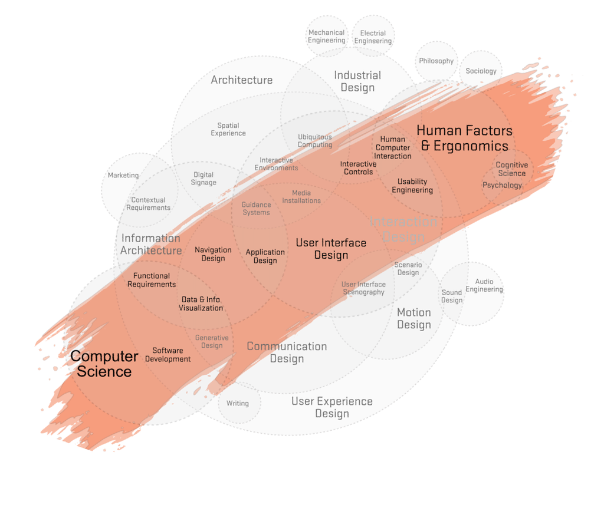
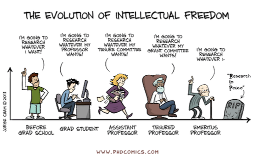
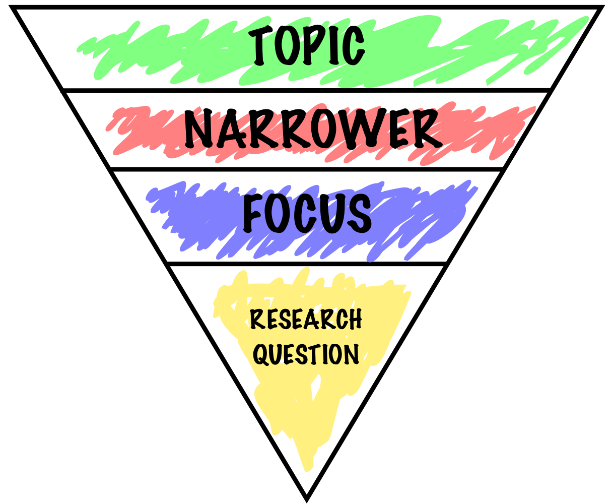
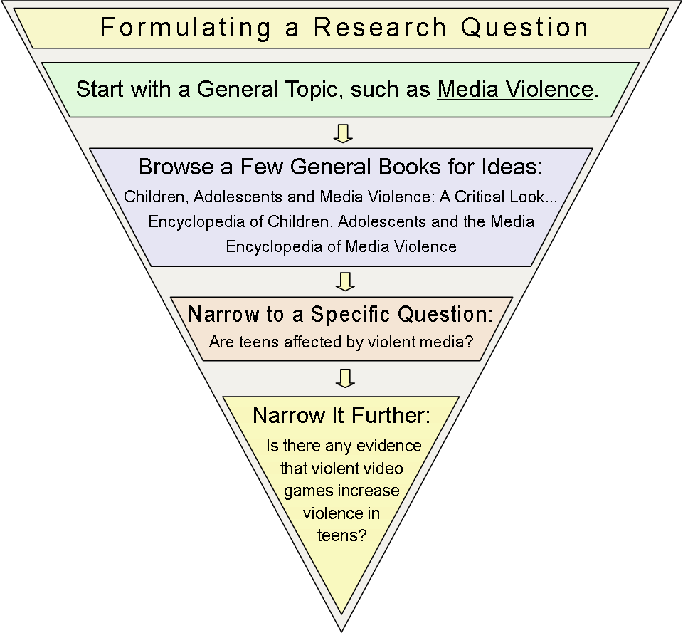
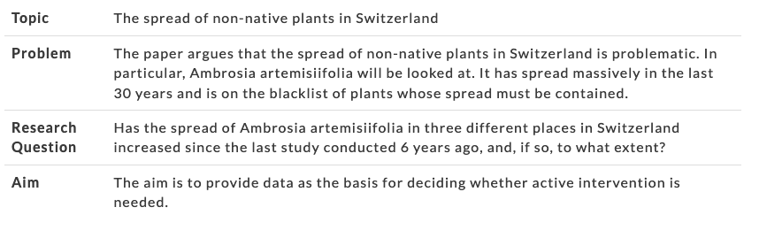

name: inverse
layout: true
class: center, middle, inverse
---

# Academic Methodologies

### Prof. Dr. Lena Gieseke | l.gieseke@filmuniversitaet.de  

#### Film University Babelsberg KONRAD WOLF

---
layout: false

# Today

--
* HCI

--
* Research Questions

--
* Hands-On Exercise

---
template:inverse

### Chapter 04

# Human-Computer Interaction

---
layout:false

## Human-Computer Interaction

???
.task[COMMENT:]  

* Research in computer science followed traditionally methodologies from the sciences (*Naturwissenschaften*), e.g. with 
    * employing formal models, 
    * theorem proving, 
    * measuring performance, memory, etc.
* This is no surprise as most computer scientists in the early days were mathematicians, physicist and engineers by training.
* 
*How would you prove the usability of a software?*

But with digitalization being ubiquitous in our society, also the research field had to change.

By now computer science research is by now truly multi-disciplinary, with e.g.

* algorithms, 
* hardware and software development and engineering, 
* usability and design, 
* process development, 
* process and data management,
* cognitive and psychology, 
* political, 
* social considerations, and
* creative and artistic practices.

* Computer science is by no means a so-called *hard* science anymore with focus exclusively on objective, measurable truth. 
* Modern research includes *soft* sciences such as psychology, design and sociology with focus on subjective realities, which can not be easily measured or proven.  

--

.center[ [h2ilab](http://h2ilab.com/)]

???
.task[COMMENT:]  

*Why is research in Creative Technologies closely connected to HCI?*   

*Which aspects do they have in common?*

* Disciplines such as Creative Technologies strives to include human aspects such as emotions into the development of new technologies and such a human-centered perspective is also inherent to HCI.
* Many research topics in the field of Creative Technologies are pretty much human-computer interaction topics. But it is also worthwhile to investigate how the established approaches in HCI research can be transferred to and transformed into more creative-artistic contexts and artistic research.  
* Hence, as HCI is for us the most relevant sub-topic of computer science, from here on we will only focus on research designs and methods which refer to the field of HCI.

In 2016 two HCI researchers summarized 7 types of HCI research contributions:

* Empirical contributions
    * Data (qualitative or quantitative) collected through various methods such as experimental design, surveys, focus groups, time diaries, sensors and other automated means, ethnography, and other methods.  
* Artifact contributions
    * The design and development of new artifacts, including interfaces, toolkits, and architectures, mock-ups, and “envisionments.” These artifacts, are often accompanied by empirical data about feedback or usage.
* Methodological contributions
    * New approaches that influence processes in research or practice, such as a new method, new application of a method, modification of a method, or a new metric or instrument for measurement.  
* Theoretical contributions
    * Concepts and models, which are vehicles for thought, which may be predictive or descriptive, such as a framework, a design space, or a conceptual model.  
* Dataset contributions
    * A contribution which provides a corpus for the benefit of the research community, including a repository, benchmark tasks, and actual data.  
* Survey contributions  
    * A review and synthesis of work done in a specific area, helping to identify trends and specific topics that need more work. This type of contribution can only occur after research in a certain area has existed for a few years so that there is sufficient work to analyze.  
* Opinion contributions
    * Writings that seek to persuade the readers to change their minds, often utilizing portions of the other contributions listed above, not simply to inform, but to persuade.  

The majority of HCI research falls into the first two categories.

## Selection of a Research Approach

The selection of a methodology comes down to

* the research question itself and its environment,
* the related work and standards, and
* your personal motivation and capabilities.

  
[[phdcomics]](https://phdcomics.com/comics/archive.php?comicid=1436)

* When you are newly starting with a specific topic for a research project, first and foremost you should turn to the related work and investigate which methodology and methods related projects apply. Maybe there are even already standards within a certain research field and community, which you should simply follow then.

It could also happen, especially in an up and coming field such as Creative Technologies, that there is very little related work for your specific project.

---

## Selection of a Research Approach

Which research conflicts or trade-offs are relevant for Creative Technologies? Give at least one example.

???
.task[COMMENT:]  

* One trade-off for research in Creative Technology might be the trade-off between innovation and usability - for example, a web experience might be totally new and innovative, but if users don't know how to navigate it, then they might not be able to interact with it and see the full experience. A concrete example was in Markus' presentation of Farvel's user experience - even though it was a new and innovative web experience for visiting a funeral, older users or users who weren't familiar with video games had a hard time navigating the space and therefore might not be able to fully appreciate the experience.
* One trade-off that is not only relevant for Creative Technologies but for all designers and content creators is the the weighing between innovation and convention. A new product could be improving things but may not be accapted by the users that are unfamiliar with the new approach. Thus it is good to pick up on something people already know to achieve easy access and also lessen frustration. But sometimes that way you can only make small steps. 
A good example is the design of icons. Some icons don't make that much sense in the the digital realms ( a phone book for contacts, a old phone for calls etc.) but since we are used to them from other areas of our life we know exactely what they stand for. Trying to come up with a new icon should be carefully considered. 
Another example is interfaces in VR. Most of them are just 2d planes floating in space. That doesn't really make sense for the medium but simply is what we are used to.*

---
template:inverse

# Research Questions 

---
## Research Question

--

.left-even[
.center[]

.footnote[Images left-right: [Chad Flinn](https://malat-webspace.royalroads.ca/rru0054/what-makes-a-good-research-question/), [Indiana Wesleyan Uni](https://indwes.libguides.com/c.php?g=71141&p=458447)]]

--

.right-even[
.center[]]

---
## Research Question

> A research question is 'a question that a research project sets out to answer'.  
  
--

Overall a research question should ideally be

--
* focused on a single problem,

--
* as specific and narrow as possible,

--
* complex enough to develop the answer over the space of a paper or thesis,

--
* feasible to answer within the time-frame and practical constraints given.

---
## Research Question 

> The research question is also the question why you should delight the world with another pile of printed paper.  
  
.caps[Winter, Wolfgang]. 2005. **Wissenschaftliche Arbeiten schreiben**. 2nd Ed. Frankfurt: Redline Wirtschaft.

???
.task[COMMENT:]  

* Description
    * What is the case? 
    * What does reality look like?
    * *What is...like?*
    * What is teacher training at university XYZ like? 
* Explanation
    * Cause-effect relationship: What are the consequences of an action? 
    * *Why do... differ?*
    * *Why ... changed ...?*
    * Why do companies differ in terms of staff development?
    * Why hasn’t labor mobility in the EU changed since 1990?
* Creation
    * Which measures are useful to solve a particular problem? 
    * *How can we...?*
    * *What strategies can...?*
    * How can we ensure population balance in the future?
    * What strategies can companies use to be successful in the Chinese market?
* Criticism/Evaluation
    * How can one condition be assessed in the light of specific criteria? 
    * *How can ... be assessed regarding to ...?*
    * *Are... more satisfied after...?*
    * How can pupil-centered teaching in English be assessed in the light of formal performance dimensions?
    * Are teachers more satisfied after having developed school profiles?
* Outlook
    * What will happen in the future? 
    * What kind of changes are to be expected? 
    * *How will ... change?*
    * How will staff development in a particular line of business change over time?
    * How will labor mobility in the EU change in the next 5 years?

---
## Research Question
  
Problem, research question, and aim are separate things.

--

.footnote[[Bachelor Print](https://www.bachelorprint.eu/research/research-question/#1588939182235-74e77297-65ba)]

???
.task[COMMENT:]  

* The problem relates to the relevance of the topic and is a larger unit of meaning (political, scientific, ethical, vocational problems, etc.). 
* You can never write about everything (that is, the whole problem), but only about one aspect of the problem – i.e., the research question. 
* It is the aim of your paper to introduce and apply theories, test new methods, interpret sources, etc. 

---
## Research Question

 Next, you need to narrow your research aims and make them specific.

| Research aims         | Research question formulations                  |
|-----------------------|-------------------------------------------------|
| Describing            | What are the characteristics of X?              |
| and exploring         | How has X changed over time?                    |
|                       | What are the main factors in X?                 |
|                       | How does X experience Y?                        |
|                       | How has X dealt with Y?                         |
| Explaining            | What is the relationship between X and Y?       |
| and testing           | What is the role of X in Y?                     |
|                       | What is the impact of X on Y?                   |
|                       | How does X influence Y?                         |
|                       | What are the causes of X?                       |
| Evaluating and acting | What are the advantages and disadvantages of X? |
|                       | How effective is X?                             |
|                       | How can X be achieved?                          |
|                       | What strategies improve X?                      |
|                       | How can X be used in Y?                         |

---
## Research Question

In my experience, the most common problems with student papers are:

--
* The question / storyline is **too general**.

--
* The question includes **poorly defined** aspects.

???
.task[COMMENT:]  

*  Unfocused and too broad: What are the effects of childhood obesity in the United States?
This question is so broad that research methodology would be very difficult. 
* More focused: How does childhood obesity correlate with academic performance in elementary school children?
This question has a very clear focus for which data can be collected, analyzed, and discussed.

---
template:inverse

### Hands-On

## Finding a Question / Storyline for Your Paper

---

## Finding a Question / Storyline for Your Paper

In pairs, 30 min talks, 15 min for each topic.

Afterwards

* everybody presents one question / storyline, and
* can explain the choice. 

---
template:inverse

# Next Session

---

## Next

Next, we are going to focus on experimental research design and methods, followed by the necessary statistics for evaluations.  

  
[[Beccaluva et al.]](https://re.public.polimi.it/retrieve/handle/11311/1058769/298476/ROMAN17-Sam%20Teo%20Paro-CAMERA%20READY.pdf)  

---
template:inverse

### The End

# 👋🏻
