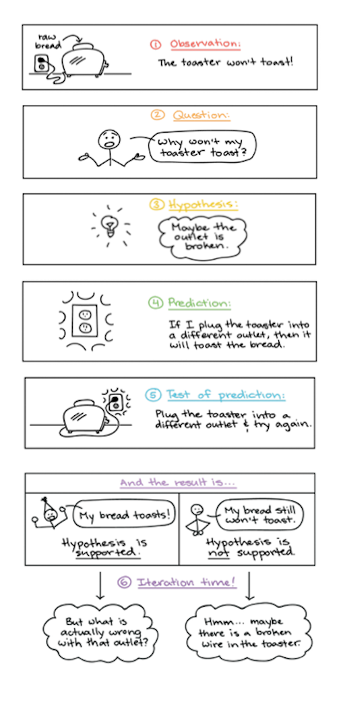

name: inverse
layout: true
class: center, middle, inverse
---

# Academic Methodologies

### Prof. Dr. Lena Gieseke | l.gieseke@filmuniversitaet.de  

#### Film University Babelsberg KONRAD WOLF

---
layout: false

# Today

--
* Re-Cap Last Session

--
* Exercise

--
* HCI

--
* Research Questions

---
template:inverse

# Chapter 03: Reasoning

---
## Inductive Reasoning

--

.center[]

--

The process of inductive reasoning is

* a collection of related samples (premises),
* theory (or category, concept etc.) formation (induction), and
* transfer of theory to the whole population (conclusion).

--

Give a specific example for inductive reasoning within the context of Creative Technologies.

---
## Reasoning

*From what kind of observations of the world can we derive absolut truths?*  

--

Only from observations that *falsify* a statement are of absolute truth!

???
.task[COMMENT:]  

* In common language, a statement is falsifiable if some observation might contradict it.
* Dijkstra once said, “Testing shows the presence, not the absence, of bugs.” In other words, a program can be proven incorrect by a test, but it cannot be proven correct. All that tests can do, after sufficient testing effort, is allow us to deem a program to be correct enough for our purposes. The implications of this fact are stunning. Software development is not a mathematical endeavor, even though it seems to manipulate mathematical constructs. Rather, software is like a science. We show correctness by failing to prove incorrectness, despite our best efforts

--

* We falsify hypotheses instead of proving them. 
* A hypothesis is a falsifiable assumption, which is valid as long as it is not falsified. 
* Unsuccessful falsification *indicates* a correct assumption.

--

Within the context of Creative Technologies:

* Come up with a falsifiable hypothesis.
* Come up with a non-falsifiable hypothesis.

---
## Deductive Reasoning

--

.center[]

--

Deductive reasoning ("top-down logic") goes from the generalization (a theory) to the specific (observations in the world).  

--

Give a specific example for deductive reasoning within the context of Creative Technologies.

---
.header[Reasoning]

## The Scientific Method

--

The scientist must formulate a theory or a hypothesis based on what has been observed, then design a test by which the theory may be verified as valid or not.

--

1. Make an observation.
2. Ask a question.
3. Form a (falsifiable) hypothesis, or testable explanation.
4. Make a prediction based on the hypothesis.
5. Test the prediction.
6. Interpret data and draw conclusions
7. Iterate: use the results to make new hypotheses or predictions.

???
.task[COMMENT:]  

.center[]
* https://github.com/ctechfilmuniversity/lecture_academic_methodologies/blob/master/02_scripts/am_ss21_03_reasoning_script.md#the-scientific-method

---
.header[Reasoning]

## The Scientific Method

Describe a possible research project following the scientific method within the context of Creative Technologies.

---
.header[Reasoning]

## Quantitative vs. Qualitativ

--

.center[[[Dave Yeats]](https://medium.com/indeed-engineering/qualitative-before-quantitative-how-qualitative-methods-support-better-data-science-d2b01d0c4e64)
]

---
.header[Reasoning]

## Quantitative vs. Qualitativ Methodology

|           | Quantitative          | Qualitative           |
|-----------|-----------------------|-----------------------|
| Reasoning | Deduction             | Induction             |
|           | Objectivity           | Subjectivity          |
|           | Causation             | Meaning               |
| Question  | Pre-specified         | Open-ended            |
|           | Outcome-oriented      | Process-oriented      |
| Analysis  | Numerical estimation  | Narrative description |
|           | Statistical inference | Comparative           |

The above is by no means absolute. Quantitative research and qualitative research form a methodological pair. You can use both strategies to complement each other.  

???
.task[COMMENT:]  

* Quantitative data is any data that is in *numerical* form such as statistics, percentages, etc. [23] The researcher analyses the data with the help of statistics and hopes the numbers will yield an unbiased result that can be generalized to some larger population. 
* Qualitative research, on the other hand, inquires deeply into specific experiences, with the intention of describing and exploring meaning through text, narrative, or visual-based data, by developing themes exclusive to that set of participants. [24]
* For example, qualitative research produces information only on the particular cases studied, and any more general conclusions are only hypotheses. Quantitative methods can be used to verify which of such hypotheses are true.

---
.header[Reasoning]

## Quantitative vs. Qualitativ

Come up with a research question, which should be answered 

* with a quantitative approach, and
* qualitative approach
 
within the context of Creative Technologies.

--

*What type of research questions does big data help us understand, what type of questions does big data not help us understand?*

---
template:inverse

### Hands-On

## Topic Brainstorming

---

## Topic Brainstorming

The goal is to collect ideas for the research topic and maybe even question for your AM paper.

--

* Write down a question or a problem statement for which you want to get input for.  
    * If necessary also describe briefly the context / topic / idea / art piece
    * The more specific e.g. a question is you formulate the more targeted the input from your peers will be
    * 10 minutes

--

* 6-3-5 Brainstroming
    * Everybody brainstorms every topic for 5 minutes and writes down three ideas / thoughts / research questions... that might help to develop the paper.

???
.task[COMMENT:]  

1. Dreamer: Anything is possible
2. Realist: How to make it happen
3. Critic: What problems to consider?

---
template:inverse

## Chapter 04

# Human-Computer Interaction

---
## Computer Science

Research in computer science followed traditionally methodologies from the sciences (*Naturwissenschaften*), e.g. with 

--
* employing formal models, 
* theorem proving, 
* measuring performance, memory, etc.

???
.task[COMMENT:]  

* This is no surprise as most computer scientists in the early days were mathematicians, physicist and engineers by training.

---
## Computer Science

*How would you prove the usability of a software?*

--

But with digitalization being ubiquitous in our society, also the research field had to change.

---
## Computer Science

By now computer science research is by now truly multi-disciplinary, with e.g.

--
* algorithms, 
* hardware and software development and engineering, 
* usability and design, 
* process development, 
* process and data management,
* cognitive and psychology, 
* political, 
* social considerations, and
* creative and artistic practices.

???
.task[COMMENT:]  

* Computer science is by no means a so-called *hard* science anymore with focus exclusively on objective, measurable truth. 
* Modern research includes *soft* sciences such as psychology, design and sociology with focus on subjective realities, which can not be easily measured or proven.  

---
## Human-Computer Interaction

--

.center[ [h2ilab](http://h2ilab.com/)]

---
## Human-Computer Interaction

*Why is research in Creative Technologies closely connected to HCI?*   

*Which aspects do they have in common?*

???
.task[COMMENT:]  

* Disciplines such as Creative Technologies strives to include human aspects such as emotions into the development of new technologies and such a human-centered perspective is also inherent to HCI.
* Many research topics in the field of Creative Technologies are pretty much human-computer interaction topics. But it is also worthwhile to investigate how the established approaches in HCI research can be transferred to and transformed into more creative-artistic contexts and artistic research.  
* Hence, as HCI is for us the most relevant sub-topic of computer science, from here on we will only focus on research designs and methods which refer to the field of HCI.

---
## Human-Computer Interaction

In 2016 two HCI researchers summarized 7 types of HCI research contributions:

--
* Empirical contributions

???
.task[COMMENT:]  

* Data (qualitative or quantitative) collected through various methods such as experimental design, surveys, focus groups, time diaries, sensors and other automated means, ethnography, and other methods.  

--
* Artifact contributions

???
.task[COMMENT:]  

* The design and development of new artifacts, including interfaces, toolkits, and architectures, mock-ups, and “envisionments.” These artifacts, are often accompanied by empirical data about feedback or usage.

--
* Methodological contributions

???
.task[COMMENT:]  

* New approaches that influence processes in research or practice, such as a new method, new application of a method, modification of a method, or a new metric or instrument for measurement.  

--
* Theoretical contributions

???
.task[COMMENT:]  

* Concepts and models, which are vehicles for thought, which may be predictive or descriptive, such as a framework, a design space, or a conceptual model.  

--
* Dataset contributions

???
.task[COMMENT:]  

* A contribution which provides a corpus for the benefit of the research community, including a repository, benchmark tasks, and actual data.  

--
* Survey contributions

???
.task[COMMENT:]  

* A review and synthesis of work done in a specific area, helping to identify trends and specific topics that need more work. This type of contribution can only occur after research in a certain area has existed for a few years so that there is sufficient work to analyze.  

--
* Opinion contributions

???
.task[COMMENT:]  

* Writings that seek to persuade the readers to change their minds, often utilizing portions of the other contributions listed above, not simply to inform, but to persuade.  

--
  
The majority of HCI research falls into the first two categories.

---
## Selection of a Research Approach

--

The selection of a methodology comes down to

--
* the research question itself and its environment,

--
* the related work and standards, and

???
.task[COMMENT:]  

* When you are newly starting with a specific topic for a research project, first and foremost you should turn to the related work and investigate which methodology and methods related projects apply. Maybe there are even already standards within a certain research field and community, which you should simply follow then.

It could also happen, especially in an up and coming field such as Creative Technologies, that there is very little related work for your specific project.  

--
* your personal motivation and capabilities.

--

  
[[phdcomics]](https://phdcomics.com/comics/archive.php?comicid=1436)

---
template:inverse

# Research Questions 

---
## Research Question

--

.left-even[
.center[]

.footnote[Images left-right: [Chad Flinn](https://malat-webspace.royalroads.ca/rru0054/what-makes-a-good-research-question/), [Indiana Wesleyan Uni](https://indwes.libguides.com/c.php?g=71141&p=458447)]]

--

.right-even[
.center[]]

---
## Research Question

> A research question is 'a question that a research project sets out to answer'.  
  
--

Overall a research question should ideally be

--
* focused on a single problem,

--
* as specific and narrow as possible,

--
* complex enough to develop the answer over the space of a paper or thesis,

--
* feasible to answer within the time-frame and practical constraints given.

---
## Research Question 

> The research question is also the question why you should delight the world with another pile of printed paper.  
  
.caps[Winter, Wolfgang]. 2005. **Wissenschaftliche Arbeiten schreiben**. 2nd Ed. Frankfurt: Redline Wirtschaft.

---
## Research Question Types

* Description
    * What is the case? 
    * What does reality look like?
    * *What is...like?*

.footnote[[Bachelor Print](https://www.bachelorprint.eu/research/research-question/#1588939182235-74e77297-65ba)]

???
.task[COMMENT:]  

* What is teacher training at university XYZ like? 

---
## Research Question Types
* Description
* Explanation
    * Cause-effect relationship: What are the consequences of an action? 
    * *Why do... differ?*
    * *Why ... changed ...?*

.footnote[[Bachelor Print](https://www.bachelorprint.eu/research/research-question/#1588939182235-74e77297-65ba)]

???
.task[COMMENT:]  

* Why do companies differ in terms of staff development?
* Why hasn’t labor mobility in the EU changed since 1990?

---
## Research Question Types
* Description
* Explanation
* Creation
    * Which measures are useful to solve a particular problem? 
    * *How can we...?*
    * *What strategies can...?*

.footnote[[Bachelor Print](https://www.bachelorprint.eu/research/research-question/#1588939182235-74e77297-65ba)]

???
.task[COMMENT:]  

* How can we ensure population balance in the future?
* What strategies can companies use to be successful in the Chinese market?

---
## Research Question Types
* Description
* Explanation
* Creation
* Criticism/Evaluation
    * How can one condition be assessed in the light of specific criteria? 
    * *How can ... be assessed regarding to ...?*
    * *Are... more satisfied after...?*

.footnote[[Bachelor Print](https://www.bachelorprint.eu/research/research-question/#1588939182235-74e77297-65ba)]

???
.task[COMMENT:]  

* How can pupil-centered teaching in English be assessed in the light of formal performance dimensions?
* Are teachers more satisfied after having developed school profiles?

---
## Research Question Types
* Description
* Explanation
* Creation
* Criticism/Evaluation
* Outlook
    * What will happen in the future? 
    * What kind of changes are to be expected? 
    * *How will ... change?*

.footnote[[Bachelor Print](https://www.bachelorprint.eu/research/research-question/#1588939182235-74e77297-65ba)]

???
.task[COMMENT:]  

* How will staff development in a particular line of business change over time?
* How will labor mobility in the EU change in the next 5 years?

---
## Research Question
  
Problem, research question, and aim are separate things!

--

.footnote[[Bachelor Print](https://www.bachelorprint.eu/research/research-question/#1588939182235-74e77297-65ba)]

???
.task[COMMENT:]  

* The problem relates to the relevance of the topic and is a larger unit of meaning (political, scientific, ethical, vocational problems, etc.). 
* You can never write about everything (that is, the whole problem), but only about one aspect of the problem – i.e., the research question. 
* It is the aim of your paper to introduce and apply theories, test new methods, interpret sources, etc. 

---
## Research Question

 Next, you need to narrow your research aims and make them specific.

| Research aims         | Research question formulations                  |
|-----------------------|-------------------------------------------------|
| Describing            | What are the characteristics of X?              |
| and exploring         | How has X changed over time?                    |
|                       | What are the main factors in X?                 |
|                       | How does X experience Y?                        |
|                       | How has X dealt with Y?                         |
| Explaining            | What is the relationship between X and Y?       |
| and testing           | What is the role of X in Y?                     |
|                       | What is the impact of X on Y?                   |
|                       | How does X influence Y?                         |
|                       | What are the causes of X?                       |
| Evaluating and acting | What are the advantages and disadvantages of X? |
|                       | How effective is X?                             |
|                       | How can X be achieved?                          |
|                       | What strategies improve X?                      |
|                       | How can X be used in Y?                         |

---
## Research Question

In my experience, the most common problems with research questions are:

--
* The research question is too general.

--
* The research question includes poorly defined aspects.

???
.task[COMMENT:]  

*  Unfocused and too broad: What are the effects of childhood obesity in the United States?
This question is so broad that research methodology would be very difficult. 
* More focused: How does childhood obesity correlate with academic performance in elementary school children?
This question has a very clear focus for which data can be collected, analyzed, and discussed.

---
template:inverse

# Next Session

---

## Next

Next, we are going to focus on experimental research design and methods, followed by the necessary statistics for evaluations.  

  
[[Beccaluva et al.]](https://re.public.polimi.it/retrieve/handle/11311/1058769/298476/ROMAN17-Sam%20Teo%20Paro-CAMERA%20READY.pdf)  

---
template:inverse

### The End

# 👋🏻
