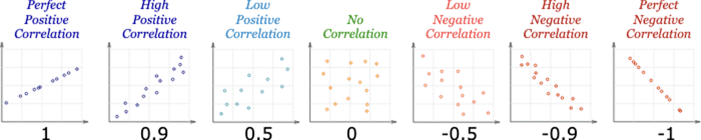

name: inverse
layout: true
class: center, middle, inverse
---

# Academic Methodologies

### Prof. Dr. Lena Gieseke | l.gieseke@filmuniversitaet.de  

#### Film University Babelsberg KONRAD WOLF

---
layout: false

# Today

*  Experimental studies  

--
    * Variables
    * Hypothesis Testing
    * Control Conditions
    * Sampling
    * Significance Tests
    * Grouping
    * Reliability
    * Design & Execution Steps

---
template:inverse

#### Chapter 05

# Experimental Research

---
## Experimental Research

With experiments researchers aim to understand understand *cause* and *effect*.

???
.task[COMMENT:]  

* Examples for cause and effect?

--

Cause and effect examples might look like:

* I flipped the light switch on, so the light came on.
* Tsunamis happen when tectonic plates shift.
* Maria didn't follow the recipe correctly, so the cake did not come out as expected.
* I have been smoking cigarettes for ten years, so I got lung cancer.
* As the wind speed increases, the sail boat moves faster.
* When the ocean is extremely polluted, coral reefs die.

You get the idea.

???
.task[COMMENT:]  

*How can we detect such cause and effect relationships?*

Well, we can make *observations* of the world. 

Let's say we want to investigate whether a novel keyboard is easy to use. We have a number of participants use the keyboard for a while and ask them afterwards "Is the keyboard easy to use?" and have the following answers

---
## Experimental Research

*Is this keyboard easy to use?*

--

--

*Does this proof that the keyboard is easy to use?*

---
## Experimental Research

How do we know that participants rated the keyboard easy to use because the keyboard was actually easy to use or because

--
* They want to support us in our research?

--
* They were impressed by the system’s novelty?

--
* They liked the colors of the system?

--
* They were in a really good mood because the German football team won the world cup yesterday and everything in the world is great?
* …

--

> Mere observation will not help us to find an valid answer!

???
.task[COMMENT:]  

* Or, imagine a researcher may observe that 8 out of 10 teenagers in a class who frequently play a specific computer game can touch type (typing without looking at the keyboard) while only 2 out of 12 teenagers in the same class who do not play the game can touch type. This is an interesting observation. But it does not allow the establishment of a relationship between the two factors: playing the game and typing. Neither does it enable the researcher to explain why this happens.
* For example, the researcher may collect data on the number of hours that the teenagers play the computer game per week and measure their typing speed. This will help to identify a relationship between multiple factors, e.g. playing the game and typing. This is called a relational investigation. Let's say the recorded numbers show that and the more a teenager plays, the more the typing speed increases.

---
## Experimental Research

Observation can tell us how things are **related**, **not** cause and effect.

--

In statistics *correlation* is any relationship between two random variables. 

???
.task[COMMENT:]  

* In statistics *correlation* (dependence or association) is any statistical relationship, whether causal or not, between two random variables. 

---
## Experimental Research

Have a look at this table about stork populations and birthrates:

.center[  [[brixtonhealth]](http://www.brixtonhealth.com/storksBabies.pdf)]

---
## Experimental Research

.center[[[brixtonhealth]](http://www.brixtonhealth.com/storksBabies.pdf)]

The higher the number of stork breeding pairs, the higher the birth rate.

???
.task[COMMENT:]  

* Based on statistical operations (we will come back to this), one can claim (there is statistical significance) that the higher the number of stork breeding pairs, the higher the birth rate, hence there is a correlation between those variables. 

---
## Experimental Research

*Can we now claim that storks cause babies?*

  
[[livescience]](https://www.livescience.com/62807-why-storks-baby-myth.html)

--

Well, no, not all all! We have only established that there is a relationship between the numbers, but we know nothing about a *causation*. 

???
.task[COMMENT:]  

* How do we call this relationship?

## Correlation

.center[  [[mathsisfun]](https://www.mathsisfun.com/data/correlation.html)]

???
.task[COMMENT:]  

* A positive correlation indicates the extent to which those variables increase or decrease in parallel
* A negative correlation indicates the extent to which one variable increases as the other decreases
* [(Pearson’s) Correlation Coefficient](https://en.wikipedia.org/wiki/Pearson_correlation_coefficient) is a statistical measure of the *degree* to which changes to the value of one variable predict change to the value of another. This value is often called *r* and indicates *direction* and *strength* of a relationship between two variables. The closer it is to +1 or -1, the stronger there is a linear relationship between variables. 0 means there is no correlation, meaning no relationship.

---
## Experimental Research

There are the following causation scenarios possible:

* Explanation 1: children cause storks
    * For example, the crying of babies attract storks.
--
* Explanation 2: storks cause children
    * For example, the myth is true and storks bring babies.
--
* Explanation 3: a third unknown variable causes both
    * For example, the village environment is more friendly to storks and families that desire children.
    * In this case the number of storks has no impact on the number of babies or vice versa.

--
Explanation 3 is also called a *[tertium quid](https://en.wikipedia.org/wiki/Tertium_quid)*, meaning that there is a an unidentified third element to a relationship of two knowns.

???
.task[COMMENT:]  

* With stating interpretations of such results, we have to be equally careful:
    * If I want more babies should I move to an area with many storks?
        * We can say for sure: No! Storks do not cause babies.
    * If I want more babies should I move to a rural area?
        * Well, even though rural areas are a proven cause for a higher birth rate there are still many more factors that influence whether you are having babies or not...
* That there is simply a correlation and no cause and effect, could be similar true for the example of playing a video game and typing capabilities. It might possible that teenagers who read well tend to type faster and that teenagers who read well tend to like the game more and spend more time on it. Here, the the relationship of values can be due to the hidden factor of reading (this is a bit far fetched - just to give you an example). Also, it might be possible that teenagers who type well tend to like the game more, as they already type well and because of that spend more time on it.
* A famous real-world example refers to a report, issued in 1964 from the United States’ Surgeon General, claiming that cigarette smoking causes lung cancer. Unfortunately, the evidence in the report was based primarily on correlations between cigarette smoking and lung cancer. The report came under attack not just by tobacco companies, but also by some prominent (probably smoking) statisticians. They claimed that there could be a hidden factor – maybe some kind of genetic factor – which caused both lung cancer and people to want to smoke (i.e., nicotine craving). If that was true, then while smoking and lung cancer would be correlated, the decision to smoke or not smoke would have no impact on whether you got lung cancer, a claim of great popularity at that time. [[6]](https://outsmartstatistics.weebly.com/examples--explanations.html)

---
## Experimental Research

In summary, *correlation does not imply causation*. A correlation only proofs a relationship between the values of variables - which might be caused by any other factor or number of factors.

--

*So, what could we do to learn about cause and effect?*

--

> The only legitimate way to try to establish a causal connection statistically is through the use of randomized experiments.  
  
Utts, Jessica (2005) Seeing Through Statistics, Brooks/Cole (Thompson), p. 211.

???
.task[COMMENT:]  

* *How could such an experiment look like?*
* For example, for the study about video game and typing we, could assign the teenagers randomly to two groups. One group will spend a certain amount of time playing the computer game every week and the other group will not. After a period of time (e.g., 3 months or longer), we measure each teenager's typing speed. If the teenagers who play the computer game type significantly (and here we have to prove significance - we will come back to this) faster than the teenagers who do not play the game, we can draw conclusions that playing this computer game improves the typing skills of teenagers.

---
## Experimental Research

A well-designed, carefully analyzed experiment (or, better yet, series of experiments) isolates cause and effect. 

--

  

---
## Experimental Research

A well-designed, carefully analyzed experiment (or, better yet, series of experiments) isolates cause and effect. 

  

---
## Experimental Research

A well-designed, carefully analyzed experiment (or, better yet, series of experiments) isolates cause and effect. 

  

???
.task[COMMENT:]  

* However, already keep in mind that the result of an experiment establishes a *likelihood of causality*. Interpretations are based on statistics and do not give evidence to a deterministic causation. They do not prove that *If this is done, then this will be the result in all cases.*  Instead, what they say is, *If this is done, under these circumstances, then on average this will be the result.*.

---
.header[Experimental Research]

## Variables

Experiments are based on *dependent* on *independent* variables.

  

---
.header[Experimental Research]

## Variables

Experiments are based on *dependent* on *independent* variables.

  

---
.header[Experimental Research]

## Independent Variable(s)

*What we change…*

--

*...meaning the cause of the effect.*  

???
.task[COMMENT:]  

* Independent variables refer to the factors that the researchers are interested in studying or the possible *cause* of the change. Hence, the independent variables describe the aspects that we change during an experiment, e.g. the hours the teenagers play the game in the previously mentioned example about playing a video game and typing capabilities. The term *independent* is used to suggest that the variable is independent of a participant's particular behavior or result.

--
  
How to manipulate a single aspect only?

???
.task[COMMENT:]  

* Here it is crucial to aim for manipulating a single aspect only, meaning in theory by keeping all other factors stable, such as environments and setups. In praxis, this is hard to archive, e.g. participants, meaning humans, are never identical.

--
* In theory: by keeping all other factors stable
    * Environment, weather, intelligence, mood, …
    * BUT, people, situations, … are never identical!

---
.header[Experimental Research]

## Independent Variable(s)

Related to

* Technology
    * different types of technology or devices, such as typing versus speech-based dictation, mouse versus joystick, touch pad, and other pointing devices; 
    * different types of design, such as pull-down menu versus pop-up menu, font sizes, contrast, background colors, and website architecture.
* Users
    * age, gender, computer experience, professional domain, education, culture, motivation, mood, and disabilities.
* Use of technologies
    * Both physical factors, such as environmental noise, lighting, temperature, vibration, users' status (e.g., seated, walking or jogging), and social factors, such as the number of people surrounding the user and their relation to the user.

---
.header[Experimental Research]

## Dependent Variable(s)

*What we measure…*

--

*...meaning the outcome or effect.*

???
.task[COMMENT:]  

* Dependent variables refer to the outcome or effect that the researchers are interested in. Hence, dependent variables describe the aspects that derive from the controlled change of the independent variable, e.g. speed of typing in the previously mentioned example.  
* The term *dependent* is used to suggest that the variable is dependent on a participant's particular behavior. 

--
Dependent variables are commonly referred to as *scores* and can be measured in different scales such as categorial (red, blue, green) vs. ratio scale data (time in ms).

---
.header[Experimental Research]

## Dependent Variable(s)

Dependent variables frequently measured can be categorized into five groups: 

* efficiency,
* accuracy,
* subjective satisfaction,
* ease of learning and retention rate, and
* physical or cognitive demand.

???
.task[COMMENT:]  

* Efficiency describes how fast a task can be completed. Typical measures include time to complete a task and speed (e.g., words per minute, number of targets selected per minute).  
* Accuracy describes the states in which the system or the user makes errors.  
* Satisfaction experience. The data is normally collected using Likert scale ratings (e.g., numeric scales from 1 to 5) through questionnaires.  
* Ease of learning and retention rate describe how quickly and how easily an indi vidual can learn to use a new application or complete a new task and how long they retain the learned skills (Feng et al., 2005, as cited in [1]).
* Variables in the fifth category describe the cognitive and physical demand that an application or a task exerts on an individual or how long an individual can interact with an application without significant fatigue.

---
.header[Experimental Research]

## Hypothesis

An experiment normally starts with a research hypothesis. 

???
.task[COMMENT:]  

* What is that?

--

A hypothesis is a precise problem statement that can be directly tested through an empirical investigation. 

???
.task[COMMENT:]  

* Compared with a theory, a hypothesis is a smaller, more focused statement that can be examined by a single experiment (Rosenthal and Rosnow, 2008, as cited in [1]).

In order to conduct a successful experiment, it is crucial to start with one or more good hypotheses (Durbin, 2004, as cited in [1]).

--

Then, the experiment can accept or reject the hypothesis. 

???
.task[COMMENT:]  

* There is no limit on the number of hypotheses that can be investigated in one experiment. However, it is generally recommended that researchers should not attempt to study too many hypotheses in a single experiment. Normally, the more hypotheses to be tested, the more factors that need to be controlled and the more variables that need to be measured. This results in very complicated experiments, subject to a higher risk of design flaws.

---
.header[Experimental Research]

## Hypothesis Testing

Hypothese testing is a formalized statistical technique and gives the likelihood of your hypotheses to be true. 

--

For the experiment you state a so-called *null-hypothesis*, which assumes that there is **no** effect of the change in the independent variable on the measured variable.  

--

Then the experiment aims to *disprove* the null-hypothesis using statistical measures. These statistical tests also aim to prove that the perceived effect is not random.

---
.header[Experimental Research]

## Hypothesis Testing

Null hypothesis H0

* Assumes that there is no difference between two values (e.g. the means of the different experiment groups)
* H0: 𝜇1 = 𝜇2

Alternative hypothesis HA (or also often called H1 )

* Assumes significant differences
* HA: 𝜇1 != 𝜇2 or 𝜇1 > 𝜇2 or 𝜇1 < 𝜇2

---
.header[Experimental Research]

## Hypothesis Testing

A helpful example is here the criminal trial analogy:

* The defendant is innocent until proven guilty
    * H0: Defendant is not guilty (innocent)
    * HA: Defendant is guilty
* There is no effect until proven otherwise

--

> In statistics, we always assume the null hypothesis is true, meaning that there is no cause and effect - until proven otherwise. Data is the evidence.

???
.task[COMMENT:]  

* As another example, suppose the developers of a website are trying to figure out whether to use a pull-down menu or a pop-up menu in the home page of the website. For this research case, the null and alternative hypotheses can be stated in classical statistical terms as follows:
    * HA: There is no difference between the pull-down menu and the pop-up menu in the time spent locating pages.
    * HA: There is a difference between the pull-down menu and the pop-up menu in the time spent locating pages.
* This might feel foreign to you. We will come back to this in the chapter about statistics.

---
.header[Experimental Research | Hypothesis Testing]

## Control Conditions

???
.task[COMMENT:]  

* Hypotheses are often based on *control conditions*.

--

The idea is to compare two situations where in one the supposed cause is present (the *experimental condition*) to one where it is absent (the *control condition*).

--

Hence, the control condition isolates the suspected effect on the dependent variable.

???
.task[COMMENT:]  

* For example, let's talk about storks and babies again. Let's say we are still considering that storks do, in fact, cause babies.

*How could the experimental and controls conditions look like to test our hypothesis?*

* The experimental condition is a group of couples residing on a stork farm.
* The control condition are a group of couples residing on a chicken farm.
    * Extra-long artificial beaks would have to be fitted to the chickens and they would need to wear red stilts to make the subjects *blind* to their respective group.

Hypothesis testing

* H0: There is no effect of living on a stork farm on the birthrate.
* HA: There is an effect of living on a stork farm on the birthrate.

---
.header[Experimental Research]

## Sampling

*Which specific entities to test?*

???
.task[COMMENT:]  

* In a true experimental design, the researcher can fully control or manipulate the experimental conditions so that a direct comparison can be made between two or more conditions while other factors are, ideally, kept the same. One aspect of the full control of factors is complete *randomization*, which means that the researcher can randomly assign participants to different conditions. The capability to effectively control for variables not of interest, therefore limiting the effects to the variables being studied, is the feature that most differentiates experimental research.

--

Sampling refers to the decision of specific entities to test and how to select individuals from a population.

--

> Correct sampling is crucial to any type of study and an incorrect sample frame can destroy a study, regardless of the sample size.

???
.task[COMMENT:]  

* A famous example is the president election in the US in 1936. The candidates were the Republican Landon vs. the Democrat Roosevelt. Before the election there was a telephone survey by „Literary Digest“ with as many as 10,000,000 phone calls and
2,300,000 participants (45,600,000 voters). The prediction was clear, there would be a landslide victory for Landon.

However, the election results turned out to be as follows (red republican, blue democratic wins)

---
.header[Experimental Research]

## Sampling

.center[]

???
.task[COMMENT:]  

* A famous example is the president election in the US in 1936. The candidates were the Republican Landon vs. the Democrat Roosevelt. Before the election there was a telephone survey by „Literary Digest“ with as many as 10,000,000 phone calls and
2,300,000 participants (45,600,000 voters). The prediction was clear, there would be a landslide victory for Landon.

However, the election results turned out to be as follows (red republican, blue democratic wins)

--

*Why did the survey go so wrong?*

???
.task[COMMENT:]  

* Think about the year 1936 and who would own a telephone at that time...

---
.header[Experimental Research | Sampling]

## Randomization

> A simple random sample (SRS) of size n consists of n individuals from the population chosen in such a way that every set of n individuals has an equal chance to be the sample actually selected.  
  
Moore, David S. and George P. McCabe (2006), Introduction to the Practice of Statistics, fifth edition, Freeman, p. 219

--

In a well-designed experiment, you try to randomize all factors possible, such as the assignment of participants and the order of tasks. 

???
.task[COMMENT:]  

* For example, you assign participants randomly into groups in order to spread factors such as intelligence, motivtation, tiredness, physical capabilities and such. Similarly, you want to run conditions and tasks in random order to avoid sequence effects, such as learning or training influences or tiredness for the last tasks.
* Nowadays, software-driven randomization is commonly used for tasks like this. A large number of randomization software resources are available online, such as https://www.randomizer.org/. Randomization functions are also available in most of the commercial statistical software packages.  

## Randomization

.center[]  
[[researchhubs]](researchhubs.com/post/ai/data-analysis-and-statistical-inference/observational-studies-and-experiments-sampling-and-source-bias.html)

???
.task[COMMENT:]  

### Stratified Sampling

.center[]  
[[researchhubs]](researchhubs.com/post/ai/data-analysis-and-statistical-inference/observational-studies-and-experiments-sampling-and-source-bias.html)

???
.task[COMMENT:]  

* When subpopulations within an overall population vary, it could be advantageous to sample each subpopulation (stratum) or group independently in order to reduce sample variation. For this the population is divided into homogeneous groups (strata), and then a sample is randomly drawn from each strata. For example the study population is divided into 3 groups based on age and then you take a random sample from each group. 

### Cluster Sampling 

.center[]  
[[researchhubs]](researchhubs.com/post/ai/data-analysis-and-statistical-inference/observational-studies-and-experiments-sampling-and-source-bias.html)

???
.task[COMMENT:]  

* This is also known as block sampling. Here, the population is first divided into subgroups of a certain meaning and you randomly select members from some of the clusters. For example, the study population is divided into 5 clusters based on the hospital in which they received treatment. Then, only two of the clusters are randomly chosen to be included in the sample.

---
.header[Experimental Research | Sampling]

## Participants

Choosing participants is the sampling.

???
.task[COMMENT:]  

*  As you cannot test the whole population, you chose some people from the population as sample and assume that these samples reflect the whole population.

--

When writing about your research, keep in mind that you have to report on the formal aspects of your sampling process, such as

* Average age and gender split
* Recruitment process
* Participants’ background
* Aspect that are relevant for specific study such as eyesight, colorblindness for example

???
.task[COMMENT:]  

* There are no fixed rules in place on how many participants you need for a valid experiment. The number depends on the project and the goals and your the set-up. As a rule of thumb you should plan with at least 10 participants. Depending on your chosen evaluation techniques there also might be statistical guidelines on the required number of participants.
* Of course, if there is a specific user group for your task you need to choose participants accordingly. Sometimes, it makes life much easier to limit a research task to a certain group. Then your results are less generalizable but at least you get things done. As a rule of thumb, other people on the team are usually NOT AT ALL representative (however it is common practice in CS research to recruit department members as study participants...). 

There are countless way to recruit participants such as in specific forums or students from lectures that fit topic-wise. Another options in modern times is Amazon turk. From their [website](https://www.mturk.com/):

> Amazon Mechanical Turk (MTurk) is a crowdsourcing marketplace that makes it easier for individuals and businesses to outsource their processes and jobs to a distributed workforce who can perform these tasks virtually. This could include anything from conducting simple data validation and research to more subjective tasks like survey participation, content moderation, and more. MTurk enables companies to harness the collective intelligence, skills, and insights from a global workforce to streamline business processes, augment data collection and analysis, and accelerate machine learning development.

  
[[mturk]](https://www.mturk.com/)

The validity of research conducted with the Mechanical Turk worker pool has been questioned in multiple research communities. Problems address include, for example:

* Amazon doesn't share the method of selecting participants with researchers.
* Demographics of the pool of participants are not known.
* It is unclear if Mechanical Turk uses fiscal, political, or educational limiters in their selection process.
* It is ‘bought' research.

In 2013, for example, the Siggraph paper 

Sean Bell, Paul Upchurch, Noah Snavely, Kavita Bala. [OpenSurfaces: A Richly Annotated Catalog of Surface Appearance](http://opensurfaces.cs.cornell.edu/). ACM Transactions on Graphics (SIGGRAPH 2013).

was criticized, as it is mainly a database of photographs with different surface material characteristics segmented and tagged in each image, which was done with mechanical turk tasks. But if you assume the minimal cost of $0.01 per task and the image database included 385,362 assigned tasks, this projected did cost less than $4000, which is not that much if you consider what certain hardware might costs, for example. If a database is enough contribution for a research paper is up to the reviewers to decided, which they did. So, my humble opinion is that I don't see much of a problem here, especially because I think such databases are of great value to a research community.

However, if the mechanical turk workers are treated and paid fairly is a different story. This questions of for example investigated in the project [The Laboring Self](https://www.utdallas.edu/magazine/5984/professors-collaboration-highlights-plight-of-invisible-workers/), which is
> a participatory visual arts project that drew parallels between unregulated labor and its effect on workers' bodies in the Industrial Revolution and Amazon.com's Mechanical Turk online job platform.

## Informed Consent

???
.task[COMMENT:]  

* When working with humans, you are usually required to collect an informed consent formally. The standards differ here from discipline to discipline and from country to country. E.g. at an north american university all studies including humans usually must be officially registered and approved from the ethics committee of that university. In Germany it is less strict.

A consent form is a must-have if personally identifiable information is collected.

???
.task[COMMENT:]  

* which is information that can

* uniquely identify, contact, or locate a single person, or
* uniquely identify a single individual with other sources.

Informed consent implies to inform the participants about

* The background of the experiment
    * Context in which the research takes place?
    * What do participants have to expect?
* The form of data collection applied
    * What kind of data will be logged?
    * Who has access and how will it be secured?
    * What is going to be reported?
* Information participants that
    * they do not have to e.g. answer questions if they don’t want to, and
    * they can cancel the experiment at any time without explanation.

???
.task[COMMENT:]  

* Then, all participants should sign a form such as the following:

---
.header[Experimental Research | Participants]

## Informed Consent

.center[]

???
.task[COMMENT:]  

## Participants

Further ethical considerations when working with human refer to aspects of

* Deception
    * Consider whether it is ethical to not inform participants about the real context of the experiment
* Debriefing
    * After the experiment, answer the participants questions
* Confidentially
    * Keep information confidential at any time!
    * Make sure that your system is sufficiently secured.
* Do not physically or psychologically harm your participants and protect them from any harm

## Significance Tests

???
.task[COMMENT:]  

* Almost all experimental investigations are analyzed and reported through *significance* tests.
* These are statistical test to which we will come back in the chapter about statistics. But as this aspect is crucial to understand for the use and interpretation of experiments, I am already introducing the general concept of significance tests here.

In study reports and their publications you will read something like

* On average, participants performed significantly better (F(1,25) = 20.83, p < 0.01) ...
* A t-test showed that there was a significant difference in ... (t(11) = 6.28, p < 0.001) ...

*Why do you need to run significance tests on your data?*

???
.task[COMMENT:]  

* What is for example wrong with comparing two mean values of error rate and then claiming that the application with the lower mean value is more accurate than the other application?

## Significance Tests

Consider the following statement:  

*The average height of three males (Mike, John, and Ted) is 165cm. The average height of three females (Mary, Rose, and Jessica) is 178cm. So females are taller than males.*

???
.task[COMMENT:]  

* It should not be difficult for you to tell that the first statement is correct while the second one is not. In the first statement, the targets being compared are the heights of two individuals, both known numbers. Based on the two numbers, we know that Mike is taller than Mary. When the values of the members of the comparison groups are all known, you can directly compare them and draw a conclusion. No significance test is needed since there is no uncertainty involved. 
* So, what is wrong with the second statement? The claim that females are taller than males is wrong due to inappropriate sampling. 

The distribution of the heights of the human population (and many other things in our life) follows a pattern called *normal distribution*. Data sets that follow normal distribution can be illustrated by a bell-shaped curve, with the majority of the data points falling in the central area surrounding the mean of the population (μ). The further a value is from the population mean, the fewer data points would fall in the area around that value. 

 [1]

When you compare two large populations, such as males and females, there is no way to collect the data from every individual in the population. Therefore, you select a smaller group from the large population and use that smaller group to represent the entire population. As you know by now, this process is called sampling. In the situation described in statement 2 above, the three males selected as the sample population happened to be shorter than average males, while the three females selected as samples happened to be taller than average females, thus resulting in a misleading conclusion. Randomization methods and large sample sizes can greatly reduce the possibility of making this kind of error in research. Since we are not able to measure the heights of all males and females, we can only sample a subgroup of people from the entire population. 

Significance tests allow us to determine how confident we are that the results observed from the sampling population can be generalized to the entire population. 

For example, a *t*-test that is significant at *P < 0.05* suggests that we are confident that 95% of the time the test result correctly applies to the entire population. 

## Type I and Type II Errors

???
.task[COMMENT:]  

* In technical terms, significance testing is a process in which a null hypothesis (H0) is contrasted with an alternative hypothesis (HA) to determine the likelihood that the null hypothesis is true.
* All significance tests are subject to the risk of Type I and Type II errors. 
* A Type I error (also called an α error or a *false positive*) refers to the mistake of rejecting the null hypothesis when it is true and should not be rejected. 
* A Type II error (also called a β error or a *false negative*) refers to the mistake of not rejecting the null hypothesis when it is false and should be rejected (Rosenthal and Rosnow, 2008, as cited in [1]).

.center[  [[flowingdata]](https://flowingdata.com/2014/05/09/type-i-and-ii-errors-simplified/)]

???
.task[COMMENT:]  

  

* The criminal trail analogy of [Hypothesis Testing](#hypothesis-testing) is once again helpful here to understand the problem. Of course, in the ideal case, a trail should always reach the decision that the defendant is guilty when he is actually guilty and vice versa.
* But in reality, mistakes happen occasionally. Each type of error has costs. When a Type I error occurs, an innocent person would be sent to prison or in the US that person may even lose his or her life; when a Type II error occurs, a criminal is set free and may commit another crime. Which error are we more willing to accept as a society?

It is generally believed that Type I errors are worse than Type II errors. Statisticians call Type I errors a mistake that involves *gullibility* (*Leichtgläubigkeit*). A Type I error may result in a condition worse than the current state. For example, if a new medication is mistakenly found to be more effective than the medication that patients are currently taking, the patients may switch to new medication that is less effective than their current treatment. Type II errors are mistakes that involve *blindness* and can cost the opportunity to improve the current state. In the medication example, a Type II error means the test does not reveal that the new medication is more effective than the existing treatment; the patients stick with the existing treatment and miss the opportunity of a better treatment.

[1]

## Experiment Design

???
.task[COMMENT:]  

* Now we have discussed all basic components needed to put together an experiment.  

An experiment with multiple conditions and random assignments of participants and tasks is considered a *true* experiments. 

???
.task[COMMENT:]  

* Quasi-experiments refer to experiments with non-random assignments.

True experiments possess the following characteristics:

* A true experiment is based on at least one testable research hypothesis and aims to validate it.

* There are usually at least two conditions (a treatment condition and a control condition) or groups (a treatment group and a control group).

* The dependent variables are normally measured through quantitative measurements.

* The results are analyzed through various statistical significance tests.

* A true experiment should be designed and conducted with the goal of removing potential biases.

* A true experiment should be replicable with different participant samples, at different times, in different locations, and by different experimenters.

---
.header[Experimental Research]

## Experiment Design: Basic Structure

???
.task[COMMENT:]  

* The basic structure of an experiment can be determined by answering two questions:

--

* How many independent variables do we want to investigate in the experiment?
* How many different values does each independent variable have?

???
.task[COMMENT:]  

The answer to the first question determines whether we need a *basic* design or a *factorial* design. If there is one independent variable, we need only a basic one-level design. If there are two or more independent variables, factorial design is the way to go. The answer to the second question determines the number of conditions needed in the experiment. 

  

[1]

---
.header[Experimental Research | Basic Structure]

## A Single Independent Variable

???
.task[COMMENT:]  

* When we study a single independent variable, the design of the experiment is simpler than cases in which multiple variables are involved. The following hypotheses all lead to experiments that investigate a single independent variable:

--

H0: There is no difference in typing speed when using a QWERTY keyboard, a DVORAK keyboard, or an alphabetically ordered keyboard.

???
.task[COMMENT:]  

* H2: There is no difference in the time required to locate an item in an online store between novice users and experienced users.
* H3: There is no difference in the perceived trust toward an online agent among customers who are from the United States, Russia, China, and Nigeria.

--

Hypothesis H0 would involve three conditions:

* the QWERTY keyboard,
* the DVORAK keyboard, and
* the alphabetically ordered keyboard.

???
.task[COMMENT:]  

* The number of conditions in each experiment is determined by the possible values of the independent variable. 

The experiment conducted to investigate hypothesis H2 would involve two conditions:

* novice users and
* experienced users.

And the experiment conducted to investigate hypothesis H3 would involve four conditions: customers from

* the United States,
* Russia,
* China, and
* Nigeria.

Once the conditions are set, we need to determine the number of conditions to which we would allow each participant to be exposed to by selecting either a grouping (see the grouping section).

[1]

---
.header[Experimental Research | Basic Structure]

## More Than One Independent Variable

???
.task[COMMENT:]  

* Factorial designs are widely adopted when an experiment investigates more than one independent variable. Using this method, we divide the experiment groups or conditions into multiple subsets according to the independent variables. It allows us to simultaneously investigate the impact of all independent variables as well as the interaction effects between multiple variables. The number of conditions in a factorial design is determined by the total number of independent variables and the level of each independent variable. 
* As an example consider again to run an experiment to compare the typing speed when using three types of keyboard (QWERTY, DVORAK, and Alphabetic). 
* Now we are also interested in examining the effect of different tasks, e.g. composition vs transcription, on the typing speed. 

--
Two independent variables can be investigated in one experiment: 

--

* type of keyboards, and
* type of tasks.

--

The variable *type of keyboards* has three levels:

* QWERTY
* DVORAK, and
* Alphabetic.

The variable *type of tasks* has two levels:

* transcription and
* composition.

---
.header[Experimental Research | Basic Structure]

## More Than One Independent Variable

``Number of conditions = 3 * 2 = 6``

???
.task[COMMENT:]  

* Therefore, the total number of conditions in this experiment is calculated according to the following equation: 

--

|               | QWERT | DVORAK | Alphabetic |
|---------------|-------|--------|------------|
| Composition   | C1    | C2     | C3         |
| Transcription | C4    | C5     | C6         |

???
.task[COMMENT:]  

* In the first three conditions, the participants would all complete composition tasks using different kinds of keyboard. In the other three conditions, the participants would all complete transcription tasks using different keyboards. When analyzing the data, we can compare conditions in the same row to examine the impact of keyboards. The effect of the tasks can be examined through comparing conditions in the same column. As a result, the effect of both independent variables can be examined simultaneously through a single experiment.

As another example, consider designing an experiment to investigate the following hypothesis:

> There is no difference between the target selection speed when using a mouse, a joystick, or a trackball to select icons of different sizes (small, medium, and large). 

There are two independent variables in this hypothesis: the type of pointing device and the size of icon. Three different pointing devices will be examined: a mouse, a joystick, and a trackball, suggesting three conditions under this independent variable. Three different target sizes will be examined: small, medium, and large, suggesting three conditions under this independent variable as well. Since we need to test each combination of values of the two independent variables, combining the two independent variables results in a total of nine (3×3=9) conditions in the experiment. The identification of dependent variables will allow us to further consider the appropriate metric for measuring the dependent variables, such as speed, number of errors. Here, we need to consider the objective of the experiment to determine which dependent variable and which measure is more appropriate.

[1]

---
.header[Experimental Research]

## Grouping

*Which participants should do tasks to which condition?*

???
.task[COMMENT:]  

* This is a critical step in experimental design and the decision made has a direct impact on the quality of the data collected as well as the statistical methods that should be used to analyze the data.

---
.header[Experimental Research | Grouping]

## Between-group Design

In a between group design, also called *independent measure* design, participants are assigned to *one* condition only.

???
.task[COMMENT:]  

* For example:

  
[[1]]

Advantages of this grouping are the simplicity of the setups, that there is less chance of learning or fatigue effects and that is is sometimes practically impossible for an individual to participate in all conditions, e.g. due to time constraints. Also from a statistical perspective, between-group design is a cleaner design.

Disadvantages are that between-groupings are usually more laborious and costly as you need a higher number of participants and therefore more time, effort, etc. Also, overall, this setup is less robust and more prone to outliers as individual differences are more influential. This adds to the need of a comparatively larger number of participants under each condition.

For example, if an experiment has 4 conditions and 16 participants are needed under each condition, the total number of participants needed is 64.

[1]

---
.header[Experimental Research | Grouping]

## Within-Group Design

In a within-group design, also called *repeated-measure* design, participants are assigned to *all* conditions. For this type of grouping it is important to also randomize task orders.

???
.task[COMMENT:]  

* For example:

  
[[1]]

Advantages of this grouping are that it is more economic and individual differences are canceled out better. If we change the design of the experiment with 4 conditions and 16 participants from a between-group design into a within-group design, the total number of participants needed would be 16, rather than 64.

A disadvantage is that within-groupings are prone to side-effects. E.g. previous conditions might influence the behavior of participants in the following conditions, e.g. with learning or fatigue effects. Since the participants complete the same types of task under multiple conditions, they are very likely to learn from the experience and may get better in completing the tasks. Similarly, participants may get tired or bored during the process.

---
.header[Experimental Research]

## Grouping

| Between-Group Design                                                | Within-Group Design                             |
|---------------------------------------------------------------------|-------------------------------------------------|
| + Cleaner                                                           | + Smaller sample size                           |
| + Better control of confounding such as fatigue and learning effect | + Effective isolation of individual differences |
| - Large sample size                                                 | - Hard to control learning effects              |
| - Large impact of individual differences                            | - Large impact of fatigue                       |
| - Harder to get statistically significant results                   |                                                 |

[1]

???
.task[COMMENT:]  

Generally speaking, between-group design should be adopted when the experiment investigates

* simple tasks with limited individual differences
* tasks that would be greatly influenced by the learning effect or
* problems that cannot be investigated through a within-group design.
  
After choosing a between-group design for an experiment, we need to take special caution to control potential confounding factors. Participants should be randomly assigned to different conditions whenever possible. When assigning participants, we need to try our best to counterbalance potential confounding factors, such as gender, age, computing experience, and internet experience, across conditions. In other words, we need to make sure that the groups are as similar as possible, except for the personal characteristics that are experimental variables under investigation.

Within-group design is more appropriate when the experiment investigates

* tasks with large individual differences,
* tasks that are less susceptible to the learning effect, or
* when the target participant pool is very small.
  
Having decided to adopt a within-group design, you need to consider how to control the negative impact of learning effects, fatigue, and other potential problems associated with a within-group design.  

An effective approach to reduce the impact of the learning effect is for example to provide sufficient time for training, which reduces the learning effect during the actual task sessions. To address the problem of fatigue caused by multiple experimental tasks, we need to design experiment tasks frugally, reducing the required number of tasks and shortening the experiment time whenever possible. It is generally suggested that the appropriate length of a single experiment session should be 60 to 90 minutes or shorter (Nielsen, 2005, as cited in [1]).
  
[1]

---
.header[Experimental Research]

## Reliability

All research tasks should always strive for high reliability, meaning that the tasks can be replicated by other teams, in other locations, etc.

???
.task[COMMENT:]  

* Measurements of human behavior and social interaction however, are normally subject to higher fluctuations and, therefore, are less replicable in contrast to the hard sciences, such as physics, chemistry, and biology.

--

The fluctuations in experimental results are referred to as *errors*.

---
.header[Experimental Research]

## Reliability

* Random Errors

???
.task[COMMENT:]  

* Random errors are also called *noise*. They occur by chance and are not correlated with the actual value. There is no way to eliminate or control random errors but we can reduce the impact of random errors by enlarging the observed sample size. When a sample size is small, the random errors may have significant impact on the observed mean and the observed mean may be far from the actual value. When a sample size is large enough, the random errors should offset each other and the observed mean should be very close to the actual value.

--
* Systematic Errors

???
.task[COMMENT:]  

* To disproportionately weight in favor of or against an idea or thing is called [bias](https://en.wikipedia.org/wiki/Bias).  

Systematic errors are also called *biases* and they are completely different in nature from random errors. While random errors cause variations in observed values in both directions around the actual value, systematic errors always push the observed values in the same direction. As a result, systematic errors never offset each other in the way that random errors do and they cause the observed mean to be either too high or too low.

Systematic errors can greatly reduce the reliability of experimental results. They are the true enemy of experimental research. We can counter systematic errors in two stages: we should try to eliminate or *control biases* during the experiment when biases are inevitable, and we need to *isolate the impact* of them from the main effect when analyzing the data. 

There are five major sources of systematic errors:

--
    * measurement instruments
    * experimental procedures
    * participants
    * experimenter behavior
    * experimental environment

???
.task[COMMENT:]  

* Bias Caused by Measurement Instruments
    * When the measurement instruments used are not appropriate, not accurate, or not configured correctly, they may introduce systematic errors. For example when the stop button of a timer is broken and it takes a moment to stop the time, we have a systematic addition of time to the actual task. If now another research team would reproduce the experiment, they would get different timings with a properly working stop watch.
* Bias Caused by Experimental Procedures
    * Inappropriate or unclear experimental procedures may introduce biases. As discussed previously, if the order of task conditions is not randomized in an experiment with a within-group design, the observed results will be subject to the impact of the learning effect and fatigue.  
    * Also, the instructions that participants receive play a crucial role in an experiment and the wording of the experiment instructions should be carefully scrutinized before a study. Slightly different wording in instructions may lead to different participant responses. In a reported HCI study (Wallace et al., 1993, as cited in [1]), participants were instructed to complete the task “as quickly as possible” under one condition. Under the other condition, participants were instructed to “take your time, there is no rush.” Interestingly, participants working under the no-time-stress condition completed the tasks faster than those under the time-stress condition. This suggests the importance and complexity of finding a suitable wording in instructions. It also implies that the instructions that participants receive must be highly consistent.
    * One approach to avoid biases attributed to experimental procedures, are *pilot studies*. A pilot study is a test run of the experiment and are critical for experiments to identify potential biases. No matter how well you think you have planned the study, there are always things that you overlook. A pilot study is the only chance you have to fix your mistakes before you run the main study.
* Bias Caused by Participants (Sampling)
    * Bias in sampling is sometimes called *ascertainment bias* (especially in biological fields). E.g. the above mentioned telephone survey about the presidential election in 1936 systematically favored rich peoples' opinions as at that time only rich people could be reached by telephone.
    * Bias in the selection of participants is often due to *convenience*, e.g. selecting members of the same department, students from the university, etc. For example, an analysis of leading psychology journals in the US found out that a random American undergraduate is about 4,000 times more likely than an average human being to be the subject of national academic study.
    * Make sure to recruit carefully and make sure that the participant pool is representative of the target population.
* Bias Due to Experimenter Behavior
    * Experimenter behavior is one of the major sources of bias. Experimenters may intentionally or unintentionally influence the experiment results. Any intentional action to influence participants' performance or preference is unethical in research and should be strictly avoided. However, experimenters may unknowingly influence the observed data. Spoken language, body language, and facial expressions frequently serve as triggers for bias. Just imagine an experimenter is introducing an interface to a participant. Then experimenter says, “Now you get to the pull-down menus. I think you will really like them.… I designed them myself!”. Or consider how it might influence a performance, if the experimenter arrives late and the participant had been waiting for 45 minutes...
* Bias Due to Environmental Factors
    * Environmental factors can be categorized into two groups: physical environmental factors and social environmental factors. Examples of physical environmental factors include noise, temperature, lighting, vibration, and humidity. Examples of social environmental factors include the number of people in the surrounding environment and the relationship between those people and the participant.

---
.header[Experimental Research]

## Reliability

All in all, how to overcome bias depends on your experiment. You have to think about what you are doing and what the, maybe invisible on first sight, effects of your methods are.

> […], bias cannot be assessed without external knowledge of the world.  
  
Herbert I. Weisberg (2010), Bias and Causation: Models and Judgment for Valid Comparisons, p. 26

???
.task[COMMENT:]  

* However, to overcome bias e.g. in experimental procedures and experimenter behavior, you should always have a checklist with all the steps of an experiment, starting with the welcoming words, ending with saying goodbye. Then you must use that checklist every single run and check off every single step.

--

Finally, it is important to realize that, no matter how hard you try to avoid biases, they can never be completely eliminated. 

???
.task[COMMENT:]  

* Therefore, we should be careful when reporting the findings, even when the study results are statistically significant.

---
.header[Experimental Research]

## Design & Execution Steps

???
.task[COMMENT:]  

* In summary, the steps to set up an experiment are:

--
.left-even[
* Identify a research hypothesis
* Specify the design of the study
    * Independent Variable
        * The suspected cause
        * Isolate through randomization
    * Dependent Variable
        * The suspected effect
        * Isolate through a control condition
    * Method to use
        * Between-groups / within-groups
    * Plan the statistical analysis
]
.right-even[
* Run a pilot study to test the design, the system, and the study instruments
* Recruit participants
    * Are they representative for the experiment?
    * Is the group large enough?
* Run the actual data collection sessions
* Analyze the data
* Report the results
]

???
.task[COMMENT:]  

## Design & Execution Steps

Within a specific experiment session, go through the following steps:

1. Ensure that the systems or devices being evaluated are functioning properly, the related instruments are ready for the experiment.
2. Greet the participants.
3. Introduce the purpose of the study and the procedures.
4. Get the consent of the participants.
5. Assign the participants to a specific experimental condition according to the predefined randomization method.
6. Participants complete training tasks.
7. Participants complete actual tasks.
8. Participants answer questionnaires (if any).
9. Debriefing session.
10. Payment (if any).

Some words of advice based on my experiences

* Do not underestimate the time it takes to complete an experiment and the amount of planning involved. The administrative side of working with participants, e.g. when scheduling their time slots, etc. is an overhead to your research of which you must be sure that it is worth it. Never do an experiment under time pressure, e.g. two weeks before the paper deadline.
* Plan in enough time for each participant to ask questions after they have completed their tasks. In my experience they always have plenty of questions and it is simply rude not to take the time to answer them due to a too tight scheduling.
* There is no way around the maths (this is what reviewers check first) and planning the statistical analysis must be part of the design of the study *before* executing the experiment. Collecting data and then thinking about what to do with the data is doomed to fail (I have been there and it caused me a couple of sleepless nights because my experiment's data didn't fit into any standard statistical tests...).

---

## Experimental Research

Experiments help us to answer questions and identify *causal* relationships.  

--

Successful experimental research depends on well-defined research *hypotheses* that specify the *dependent variables to be observed* and the *independent variables to be controlled*. 

???
.task[COMMENT:]  

* Usually a pair of null and alternative hypotheses is proposed and the goal of the experiment is to test whether the null hypothesis can be rejected or the alternative hypothesis can be accepted. Good research hypotheses should have a reasonable scope that can be tested within an experiment; clearly defined independent variables that can be strictly controlled; and clearly defined dependent variables that can be accurately measured.  

--

*Significance testing* allows us to judge whether the observed group means are truly different. 

???
.task[COMMENT:]  

* All significance tests are subject to two types of error. *Type I errors* refer to the situation in which the null hypothesis is mistakenly rejected when it is actually true. *Type II errors* refer to the situation of not rejecting the null hypothesis when it is actually false. It is generally believed that Type I errors are worse than Type II errors, meaning it is worse to accept an causal relationship when there is none.

Hence, the *design of an experiment* starts with a clearly defined, testable research hypothesis. During the design process, we need to answer the following questions:

* How many dependent variables are investigated in the experiment and how are they measured?
* How many independent variables are investigated in the experiment and how are they controlled?
* How many conditions are involved in the experiment?
* Which grouping to use, a between-grouping or within-grouping?
* What potential bias may occur and how can we avoid or control those biases?
  
All experiments strive for clean, accurate, and unbiased results. In reality, experiment results are highly susceptible to bias. Biases can be attributed to five major sources: the measurement instruments, the experiment procedure, the participants, the experimenters, and the physical and social environment. We should try to avoid or control biases through accurate and appropriate measurement devices and scales; clearly defined and detailed experimental procedures; carefully recruited participants; well-trained, professional, and unbiased experimenters; and well-controlled environments.

With its notable strengths, experimental research also has notable limitations when applied in fields such as HCI or CTech: difficulty in identifying a testable hypothesis, difficulty in controlling potential confounding factors, and changes in observed behavior as compared to behavior in a more realistic setting. Therefore, experimental research methods should only be adopted when appropriate.

## Limitations of Experimental Research

To date, experimental research remains one of the most effective approaches to making findings that can be generalized to larger populations. On the other hand, experimental research also has notable limitations.  

It requires well-defined, testable hypotheses that consist of a limited number of dependent and independent variables. However, many problem, for example in in HCI research, are not clearly defined or involve a large number of potentially influential factors. As a result, it is often very hard to construct a well-defined and testable hypothesis. This is especially true when studying an innovative interaction technique or a new user population and in the early development stage of a product.  

Experimental research also requires strict control of factors that may influence the dependent variables. That is, except the independent variables, any factor that may have an impact on the dependent variables, often called potential confounding variables, needs to be kept the same under different experiment conditions. This requirement can hardly be satisfied in many HCI / CTech studies. For example, when studying how older users and young users interact with computer-related devices, there are many factors besides age that are different between the two age groups, such as educational and knowledge background, computer experience, frequency of use, living conditions, and so on. If an experiment is conducted to study the two age groups, all those factors will all a significant impact on the observed results. This problem can be partially addressed in the data collection and data analysis stages. In the data collection stage, extra caution should be taken when there are known various influencing factors. Increasing the sample size may reduce the impact of the side factors. When recruiting participants, prescreening should be conducted to make the participants in different groups as homogeneous as possible.  

Lab-based experiments may not be a good representation of users' typical interaction behavior. It has been reported that participants may behave differently in lab-based experiments due to the stress of being observed, the different environment, or the rewards offered for participation. This phenomenon, called the *Hawthorne effect*, was documented around 60 years ago (Landsberger, 1958, as cited in [1]). The *Hawthorne effect* has by now be challenged and its effects were further refined. But still, we should keep this potential risk in mind and take precautions to avoid or alleviate the impact of the possible Hawthorne effect.

---
template:inverse

# Next Session

---

## Next

In the next step we will have a look into statistics for analyzing the data generated by an experiment.

.center[]  
[[gregstevens]](http://gregstevens.com/2011/02/21/lying-with-statistics-101/)

---
template:inverse

## The End

# 👋🏻
