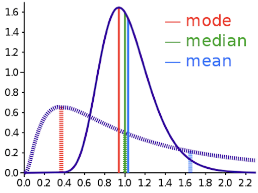
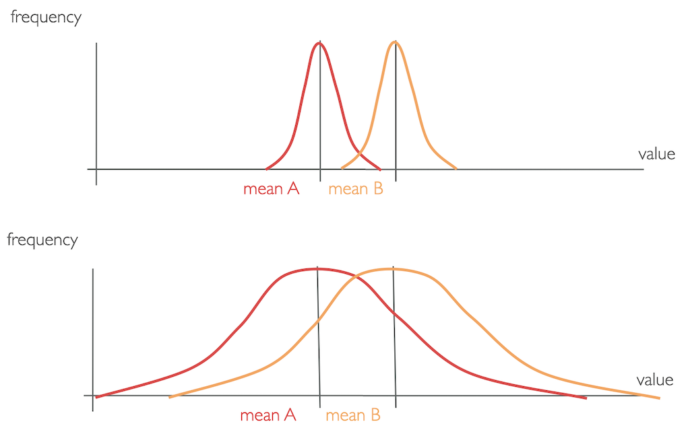
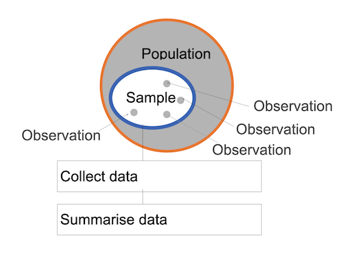

name: inverse
layout: true
class: center, middle, inverse
---

# Academic Methodologies

### Prof. Dr. Lena Gieseke | l.gieseke@filmuniversitaet.de  

#### Film University Babelsberg KONRAD WOLF

---
layout: false

# Today

--
* Statistics in a Nutshell

--
    * Descriptive Statistics
        * Graphs
        * Frequency Distributions
            * Measures of Central Tendency
            * Measures of Spread
        * Box and Whisker Plots
    * Inferential Statistics
        * P-Value
        * Lady Tasting Tea
        * Parametric Statistics
            * Normal Distribution
            * t-Test
            * ANOVA
            * Non-Parametric Statistics
    * Choosing a Statistical Test

---
template:inverse

## Chapter 06

# Statistics in a Nutshell

---
## Statistics?

???
.task[COMMENT:]  

* Is what?

--

> The practice or science of collecting and analyzing numerical data in large quantities, especially for the purpose of **inferring proportions in a whole from those in a representative sample**.  
  
\- Apple Dictionary

--

We are currently living in the best and worst of time in regard to data and its evaluation. 

???
.task[COMMENT:]  

* The importance of statistics and an awareness about potential problems when using statistics to make general statements is not new. Let's hear what some smart people said about this.

???
.task[COMMENT:]  

* Both the power and corruption of statistics are daily on display.
* Machine Learning is a statistical model

---
## Statistics

> The numbers have no way of speaking for themselves. We speak for them. We imbue them with meaning. 

\- [Nate Silver](https://en.wikipedia.org/wiki/Nate_Silver)
  
--

> Like dreams, statistics are a form of wish fulfillment.  
  
\- [Jean Baudrillard](https://en.wikipedia.org/wiki/Jean_Baudrillard)

--

> Figures don't lie, but liars figure.  
  
\- [Samuel Clemens](https://en.wikipedia.org/wiki/Mark_Twain) (alias Mark Twain, 1835 – 1910)

???
.task[COMMENT:]  

> If your experiment needs statistics, you ought to have done a better experiment.  
  
  
\- [Ernest Rutherford](https://de.wikipedia.org/wiki/Ernest_Rutherford) (1871 – 1937)

* In this lecture, however, we aim for an accurate display of information, not to obscure it. 
* Let's have a look first on what kind of data we might be working with.
* The process of transforming collected information or observations to a set of meaningful, cohesive categories.
* In the above example, the information on age is numerical and does not need to be coded. The information on gender, highest degree earned, and previous software experience needs to be coded so that statistical software can interpret the input.
* Coding can lead to a deeper understanding and the emergence of relationships, patterns, etc. When coding your data, the most important thing to remember is to ensure the coding is consistent.

---
## Statistics (Machine Learning)

.center[  [[solutions.ait.ac.th]](http://solutions.ait.ac.th/garbage-in-garbage-out/)]

---
## Statistics

> What is the difference between descriptive and inferential statistics?

--

Descriptive statistics 

* *Summarizes* data 
* Helps to describe and to organize data
* Information is presented in a manageable form  

???
.task[COMMENT:]  

* Descriptive statistics *summarizes* data and helps to describe and to organize data. Information is presented in a manageable form.  
* An example for descriptive statistics?

--

Inferential statistics 

* *Draws conclusions* about a population based on samples
* Helps to analyze data 
* Generalizes and makes judgments
    * Based on rigid requirements on the data for the maths to work

???
.task[COMMENT:]  

* Inferential statistics *draws conclusions* about a population based on samples and helps to analyze data. Inferential statistics is used to generalize and make judgments. For that there are rigid requirements on the data for the maths to work and to allow for such generalizations.

---
## Descriptive Statistics

.center[]

---
.header[Descriptive Statistics]

## Graphs

  
[[oreilly]](https://www.oreilly.com/library/view/statistics-in-a/9781449361129/ch04.html)

---
.header[Descriptive Statistics]

## Graphs

  
[[cellfish]](http://blog.cellfish.se/2014/08/lying-with-statistics.html)

???
.task[COMMENT:]  

* *What might be the problem with the following bar charts?*
* Yes, exactly. One of the most common tricks used is to show small changes as huge by not using zero as the base in a diagram. 
* Looking at the Fox News graph it looks like as if there was a huge increase in the enrollment in Obamacare.  But the difference between the two numbers is only 33,000, which is in regard to the start value of 7,066,000 not that much. But as the graphic cuts off the bottom part of the graphs the increase is greatly exaggerated. Don't ask me what the intentions were, I always thought that Fox News was against Obamacare...

---
.header[Descriptive Statistics]

## Graphs

.center[]
  
[[spiegel]](https://www.spiegel.de/politik/deutschland/rezo-video-die-youtube-angriffe-auf-die-cdu-im-spiegel-faktencheck-a-1268973.html) *Figure by Rezo*

???
.task[COMMENT:]  

* In regard to the question of *wealth through inheritance*, Rezo showed the following figure:

---
.header[Descriptive Statistics]

## Graphs

.center[]  
[[spiegel]](https://www.spiegel.de/politik/deutschland/rezo-video-die-youtube-angriffe-auf-die-cdu-im-spiegel-faktencheck-a-1268973.html) *Original by Alvaredo et al./ Atkinson/ CC BY 4.0*

???
.task[COMMENT:]  

* Not only did Rezo remove the graphs of the other countries in comparison, he also cut the timeline - the oldest and most evil move in regard to graph manipulations! In this case the manipulated figure implies that the historically exceptionally values between the 1960-90 (as it becomes clear from the original figure) were a normal phase. Spiegel calls this in its article about the fact-checking of Rezo's video *ein absolutes No-Go*. This is especially disappointing, as the Spiegel points out, as there is enough valid data to underline the point Rezo was overall trying to make.

---
.header[Descriptive Statistics]

## Graphs

.center[  [[gregstevens]](http://gregstevens.com/2011/02/21/lying-with-statistics-101/)]  

???
.task[COMMENT:]  

* Most people see in the graphic above a huge fall-off in the number of gun deaths after Stand Your Ground was passed. That is what the law was aiming for but that’s not what the graph shows. A quick look at the vertical axis reveals that the gun deaths are counted from top (0) to bottom (800). The highest peaks are the fewest gun deaths and the lowest ones are the most. A rise in the line, in other words, reveals a reduction in gun deaths. The graph below — flipped both horizontally and vertically — is more intuitive to most: a rising line reflects a rise in the number of gun deaths and a dropping a drop.

---
.header[Descriptive Statistics]

## Graphs

.center[  [[gregstevens]](http://gregstevens.com/2011/02/21/lying-with-statistics-101/)]  

---
.header[Descriptive Statistics]

## Frequency Distributions

--

Counts the number of times each score occurs.

--

*How can the data be summed up and described with a single value?*  

---
.header[Descriptive Statistics | Frequency Distributions]

## Measures of Central Tendency

A summarizing characteristic is called the *central tendency* and the *centric point* of a distribution. 

???
.task[COMMENT:]  

* Any examples?

---
.header[Descriptive Statistics | Frequency Distributions]

## Measures of Central Tendency

A summarizing characteristic is called the *central tendency* and the *centric point* of a distribution. 

.center[]  
[[4]](https://docs.google.com/presentation/d/1cPWa6NqbEot8dBjVC7UKPjF72Q7myYjHqyBYS9HO_qg/edit#slide=id.g5137fefd78_1_189)

---
.header[Descriptive Statistics | Frequency Distributions]

## Measures of Central Tendency

A summarizing characteristic is called the *central tendency* and the *centric point* of a distribution. 

.center[]  
[[4]](https://docs.google.com/presentation/d/1cPWa6NqbEot8dBjVC7UKPjF72Q7myYjHqyBYS9HO_qg/edit#slide=id.g5137fefd78_1_189)

---
.header[Descriptive Statistics | Frequency Distributions]

## Measures of Central Tendency

A summarizing characteristic is called the *central tendency* and the *centric point* of a distribution. 

.center[]  
[[4]](https://docs.google.com/presentation/d/1cPWa6NqbEot8dBjVC7UKPjF72Q7myYjHqyBYS9HO_qg/edit#slide=id.g5137fefd78_1_189)

---
.header[Descriptive Statistics | Frequency Distributions]

## Measures of Central Tendency

.center[]  
[[taniapouli]](http://taniapouli.me/wp-content/uploads/2016/08/s2010_course.pdf)

???
.task[COMMENT:]  

* What makes the two images different?

---
.header[Descriptive Statistics | Frequency Distributions]

## Measures of Central Tendency

  
[[wiki]](https://en.wikipedia.org/wiki/Mean#/media/File:Comparison_mean_median_mode.svg)

???
.task[COMMENT:]  

* If data is symmetrically distributed, the mean and median will be close, especially as n increases. If the data is skewed, mean, median and mode can differ greatly. Depending on our question, that might really matter... we will come back to this.

---
.header[Descriptive Statistics | Frequency Distributions]

## Measures of Central Tendency

> When is the mean not representative for a data set and why?

???
.task[COMMENT:]  

* For the data set of 5 5 5 5 5, the mean of 5 directly represents the actual values and is therefore a good measurement. However the single values of 6 8 4 1 6 differ quite strongly from the mean of 5, which therefore is not the best representation. This characteristic of how much the single values differ to the mean is reflected by the *variance* of a data set.

---
.header[Descriptive Statistics | Frequency Distributions]

## Measures of Spread

To describe how data are situated around the central tendency, we use measures of data spread. 

.center[]

???
.task[COMMENT:]  

* What makes them different, once again, is the *distribution* of values.

---
.header[Descriptive Statistics | Frequency Distributions]

## Measures of Spread

???
.task[COMMENT:]  

* Do you know one?

--

Mathematically, the variance is exactly the mean squared distance that values have to the mean. 

--

.center[]

.center[]

???
.task[COMMENT:]  

* What is the standard variation?
* As the formula for variance shows, the units of variance are the units of the observation *squared*, *xi2* and in a variance's value can not be directly compared to the value range of the collected data. Hence, to get the metric back into units of the variable, we take the square root of the variance, which is called the *standard deviation σ*.
* A large value means that values are quite different from each other and that the data varies a lot. Hence, the mean is not representative for the data set. A small value means all data points are close to the mean with little variation. Hence, the mean is a valid representation of the data.
* Both *variance* and *standard deviation* measure the accuracy of the mean of data set and the variability of the data. Variance and standard deviation only differ in a scaling factor.

---
.header[Descriptive Statistics]

## Box and Whisker Plots

.center[]

???
.task[COMMENT:]  

* For an overview of the most important values, the core of a box and whisker plot, in short *boxplot*, looks as follows:
    * The box is bounded by the two inner quartiles of the data. This is called the *interquartile range* (IQR). Its middle line shows the median and the whiskers extend to the last observation within 1 step (usually 1.5 * IQR) from the end of the box.
* Quantiles are cut points that divide a sample of data into groups containing (as far as possible) equal numbers of observations. 

---
.header[Descriptive Statistics]

## Box and Whisker Plots

.center[]

---
.header[Descriptive Statistics]

## Box and Whisker Plots

.center[]

???
.task[COMMENT:]  

* Any observations beyond the whiskers are plotted as individual points.

---
.header[Descriptive Statistics]

## Box and Whisker Plots

.center[]

???
.task[COMMENT:]  

* What do the histogram plots, meaning the frequency distributions, of the following box and whisker plots look like?

---
.header[Descriptive Statistics]

## Box and Whisker Plots

.center[]

---
## Descriptive Statistics

--

In descriptive statistics we use

* measures of central tendency (mode, median, mean), and
* measures of spread (variance, standard deviation)

to describe and summarize data.

We usually report

* mean and standard deviation values in the accompanying text, and
* a summary of the data as box plots graphically.

---
## Descriptive Statistics

Hence, we can summarize a sample (meaning a set of data) using its mean and we can access the accuracy of that mean using the standard deviation.

  

---
## Descriptive Statistics

But how well does one sample represent the population?

  

--

Probably not too well…  

???
.task[COMMENT:]  

* What could we do about this?*

---
## Descriptive Statistics

We could take several samples from the same population, each with its own mean.

.center[]

--

Then, the question becomes whether the sample distribution is representative for the population?

???
.task[COMMENT:]  

* This question is answered with *inferential* statistics.

---
template:inverse

# Inferential Statistics

---
## Inferential Statistics

With inferential statistics you can reach to conclusions that extend beyond the immediate data alone but describe a population overall.

---
.header[Inferential Statistics]

## Hypothesis Testing

A formalized statistical technique, which results in a likelihood for hypotheses about some parameter value to be true. 

???
.task[COMMENT:]  

* What is the approach here, key word: null hypothesis

--

Null hypothesis H0

* Assumes that there is no difference between two conditions
* H0: 𝜇1 = 𝜇2

Alternative hypothesis HA

* Assumes significant differences between the two conditions
* HA: 𝜇1 != 𝜇2 or 𝜇1 > 𝜇1 or 𝜇1 < 𝜇2

???
.task[COMMENT:]  

* Mü

---
.header[Inferential Statistics]

## Hypothesis Testing

We assume the null hypothesis to be true until proven otherwise.  

--

The data is the evidence and we can make one of two decisions:

* Reject the null hypothesis (proven by the data)
* Fail to reject the null hypothesis

---
.header[Inferential Statistics]

## Hypothesis Testing

There are a variety of test available, each potentially including several steps.

???
.task[COMMENT:]  

* The first test, we need to have a look into is a test that uses a calculated probability to determine whether there is evidence to reject the null hypothesis, hence ideally showing that we have indeed observed an effect.
* There are two common tests for that, the [Critical Value approach](https://online.stat.psu.edu/statprogram/reviews/statistical-concepts/hypothesis-testing/critical-value-approach) and the [p-value approach](https://online.stat.psu.edu/statprogram/reviews/statistical-concepts/hypothesis-testing/p-value-approach). The p-value approach requires only one computation and most statistical software uses it. So let's have a look into that, starting with an example.

---
.header[Inferential Statistics]

## P-Value

--

> The probability of obtaining the results by chance.
  
--

It aims to prove statistical significance for a cause and effect!

--

* A small p-value means that the null hypothesis is very unlikely.
* A large p-value means that the  null hypothesis is very likely.

---
.header[Inferential Statistics | P-Value]

## Lady Tasting Tea

  
[[wiki]](http://en.wikipedia.org/wiki/File:Milk_clouds_in_tea.jpeg )

???
.task[COMMENT:]  

* [Dr. Muriel Bristol](https://en.wikipedia.org/wiki/Muriel_Bristol), a female colleague of mathematician [Sir Ronald Fisher](https://en.wikipedia.org/wiki/Ronald_Fisher) claimed to be able to tell whether the tea or the milk was added first to a cup. Fisher didn't believe her and claimed that she was just guessing.
* Fisher proposed to test Lady Bristol's ability with a within-group experiment design. 
* In a within-group design, also called *repeated-measure* design, participants are assigned to *all* conditions. For this type of grouping it is important to also randomize task orders.

---
.header[Inferential Statistics | P-Value]

## Lady Tasting Tea

* Eight cups, four of each variety, in random order
* Dr. Bristol tasted each cup and reported which four she thought had milk added first

--

H0: The lady has no ability to distinguish the teas. Hence there is no causality, and we assume she is just guessing!

???
.task[COMMENT:]  

* Now, Fisher investigated - given the outcome of the experiment - what the probability would be of Dr. Bristol performing the way she did by just guessing?

---
.header[Inferential Statistics | P-Value]

## Lady Tasting Tea

> What are the probabilities for guessed outcomes?

--

* n = 8 total cups
* k = 4 cups chosen
  
Based on the [combination formula](https://en.wikipedia.org/wiki/Combination), these numbers lead to

  

possible answers.

---
.header[Inferential Statistics | P-Value]

## Lady Tasting Tea

.center[]

???
.task[COMMENT:]  

* The frequencies of the possible numbers of successes, given in the final column of this table, are derived as follows. For 0 successes, there is clearly only one set of four choices (namely, choosing all four incorrect cups) giving this result. For one success and three failures, there are four correct cups of which one is selected, which by the combination formula can occur in {\displaystyle {\binom {4}{1))=4} different ways (as shown in column 2, with x denoting a correct cup that is chosen and o denoting a correct cup that is not chosen); and independently of that, there are four incorrect cups of which three are selected, which can occur in {\displaystyle {\binom {4}{3))=4} ways (as shown in the second column, this time with x interpreted as an incorrect cup which is not chosen, and o indicating an incorrect cup which is chosen). Thus a selection of any one correct cup and any three incorrect cups can occur in any of 4×4 = 16 ways. The frequencies of the other possible numbers of successes are calculated correspondingly. Thus the number of successes is distributed according to the hypergeometric distribution. The distribution of combinations for making k selections out of the 2k available selections corresponds to the kth row of Pascal's triangle, such that each integer in the row is squared. In this case, k=4 because 4 teacups are selected from the 8 available teacups.

The critical region for rejection of the null of no ability to distinguish was the single case of 4 successes of 4 possible, based on the conventional probability criterion < 5%. This is the critical region because under the null of no ability to distinguish, 4 successes has 1 chance out of 70 (≈ 1.4% < 5%) of occurring, whereas at least 3 of 4 successes has a probability of (16+1)/70 (≈ 24.3% > 5%). 

--

If the lady is guessing, there is only a *1.4%* chance that she will get all cups correct.

---
.header[Inferential Statistics | P-Value]

## Lady Tasting Tea

Fisher decided to accept that Dr. Bristol's has indeed an ability to taste the difference if she identified all four cups correctly. 

???
.task[COMMENT:]  

* Fisher argued that the probability for guessing this case is just too low. Hence, only with the identification of all four cups, Fisher were willing to reject the null hypothesis that Dr. Bristol is guessing.

Dr. Bristol identified all four cups of tea successfully 😀! Apparently, pouring hot tea into cold milk makes the milk curdle, but not so when pouring cold milk into hot tea.

--

This experiment is an example of the p-value approach to hypothesis testing.  
  
It uses a calculated probability p to determine whether there is evidence to reject the null hypothesis.  

--

> If the calculated **probability for randomness** is below a certain threshold, also called the *significance level α*, we can reject the null hypothesis. 

---
.header[Inferential Statistics]

## P-Value

We can reject H0 if the computed p‐value is ≤ α. Typical alpha levels of significance are

* p < .05 (Fisher-Criterion)
* p < .01
* p < .001

Which α to chose also depends on the discipline.  

???
.task[COMMENT:]  

* The Fisher-Criterion is the most commonly chosen one. It means th experiment results hav the same probability of five correct guesses in a row:

| Number of correct guesses | Probability for consecutive correct guessing |
|---------------------------|----------------------------------------------|
| 1x                        | 0.5                                          |
| 2x                        | 0.25                                         |
| 3x                        | 0.125                                        |
| 4x                        | 0.0625                                       |
| 5x                        | 0.03125                                      |

--

This shows that what we accept as *proven effect* also simply depends on somewhat arbitrary standards a research community decided on.

---
template: inverse

# Parametric Statistics

---
.header[Inferential Statistics]

## Parametric Statistics

The factor that we want to investigate is called *parameter* and is some *numerical characteristics* of interest.  

Is any difference between conditions or groups?
  
> Compare the arithmetic means over the collection of samples.

???
.task[COMMENT:]  

Usually, we want to find out whether there is any difference between conditions or groups and do so by comparing the arithmetic means over their sample collection.  

--

Then, the mean μ is the parameter. 

???
.task[COMMENT:]  

* e.g. patients that took a new drug vs. patients that didn't, etc. 
* Keep in mind that, we don't — or can't — know the real value of a population parameter; we only ever estimate it with applying statistics!

---
.header[Inferential Statistics]

## Parametric Statistics

For parametric tests to work, we have to assume some underlying statistical distributions in the data:

--
1. Normal distribution

--
2. Homogeneity of variance

???
.task[COMMENT:]  

* Shows that the mean is representative for the data set.
* Homogeneity of variance is given when all comparison groups have about the same variance, meaning that the data spread is similar enough to make meaningful comparisons between the groups. 

---
.header[Inferential Statistic | Parametric Statistics]

## Normal Distribution

> What is a normal distribution? Why is it important to test whether a data sample is normally distributed?

--

Many statistical computations only work when the data is roughly shaped as such a *bell curve* or *Gaussian curve*.

???
.task[COMMENT:]  

* The dependent variable must follow a normal distribution in the population.
* A normal distribution is the most important and widely used distribution in statistics.

--

.center[]  
[[socialresearchmethods]](http://www.socialresearchmethods.net/kb/statinf.php)  

???
.task[COMMENT:]  

* The sampled data is roughly shaped as a bell curve or Gaussian curve. In other words, it is symmetric around its mean, median and mode (which are all equal). The area under the normal curve is equal to 1.0.
* It is important because we have to choose the right significance test and it can only be a parametric tests when the data is normally distributed. The significance test is necessary, so we know wether two or more samples are representative for the population.
* Their importance is partly due to the central limit theorem. It states that, under some conditions, the average of many samples (observations) of a random variable with finite mean and variance is itself a random variable—whose distribution converges to a normal distribution as the number of samples increases. Therefore, physical quantities that are expected to be the sum of many independent processes, such as measurement errors, often have distributions that are nearly normal.[4]
* In probability theory, the central limit theorem (CLT) establishes that, in many situations, for identically distributed independent samples, the standardized sample mean tends towards the standard normal distribution even if the original variables themselves are not normally distributed. 

---
.header[Inferential Statistics]

## Parametric Statistics

For parametric tests to work, we have to assume some underlying statistical distributions in the data:

* Normal distribution
    * [W/S test](http://article.sciencepublishinggroup.com/pdf/10.11648.j.ajtas.s.2017060501.19.pdf)
    * [Jarque-Bera test](https://en.wikipedia.org/wiki/Jarque%E2%80%93Bera_test)
    * [Shapiro-Wilks test](https://en.wikipedia.org/wiki/Shapiro%E2%80%93Wilk_test)
    * [Kolmogorov-Smirnov test](https://en.wikipedia.org/wiki/Kolmogorov%E2%80%93Smirnov_test)
    * [D’Agostino test](https://en.wikipedia.org/wiki/D%27Agostino%27s_K-squared_test)
* Homogeneity of variance
    * [Levene’s test](https://en.wikipedia.org/wiki/Levene%27s_test)

---
.header[Inferential Statistics]

## Parametric Statistics

> How can we compare two group means contributed by two independent groups?

---
.header[Inferential Statistics | Parametric Statistics]

## t-Test

The two-sample test analyses two population means 𝜇1 and 𝜇2.  

???
.task[COMMENT:]  

* Under the assumptions that the data is normal distributed and the homogeneity of variance is given, we then can use, for example a t-test for comparing two populations. The two-sample test analyses two population means 𝜇1 and 𝜇2. The t stands for the difference between means in relation to the variation in the data. It describes the degree to which those means differ by chance alone.

--

> It describes the *degree* to which those means differ by chance alone.  
  
--
  
There are two different types of t-tests, the paired and the unpaired t-tests. 

* The unpaired t-test can be used to compare two group means contributed by two independent groupsd
* The paired t-test can be used to compare two group means from groups that are dependent

???
.task[COMMENT:] 
* A paired t-test (also known as a dependent or correlated t-test) compares the averages and standard deviations of two related groups to determine if there is a significant difference between the two groups. 
* Here, the two groups are paired or connected, e.g. participants before and after a treatment or a repeated-measure grouping, where all participants do all tasks.
* https://askanydifference.com/difference-between-t-test-and-p-value/
* An unpaired t-test (also known as an independent t-test) compares the averages of two independent or unrelated groups to determine if there is a significant difference between the two. 
* Here, groups can not have a direct relationship, e.g. with an independent measurement grouping for which one group does only test A, another group does only test B.

---
.header[Inferential Statistics | Parametric Statistics]

## t-Test

???
.task[COMMENT:]  

* Suppose you want to investigate the effect of caffeine on muscle metabolism.
* You work with 18 male volunteers and randomly assign them to two groups. In one group all men take a capsule containing pure caffeine, the men in the other group receive a placebo capsule. 
* The two groups are independent from each other and the independent-samples t test is appropriate for data analysis.

--

H0: The mean of the caffeine treatment equals the mean of the placebo  
HA: The mean of caffeine treatment is not equal to the mean of the placebo treatment.  

--

.center[]

???
.task[COMMENT:]  

* Now, all men underwent arm exercise tests. During each exercise the subject's respiratory exchange ratio (RER) was measured. RER is the ratio of CO2 produced to O2 consumed and is an indicator of whether energy is being obtained from carbohydrates or fats.

---
.header[Inferential Statistics | Parametric Statistics]

## t-Test

The independent t-test returns a value for the difference in means of the two conditions, t, with larger t values suggesting higher probability of the null hypothesis being false.  

--

In other words, the higher the t value, the more likely the two means are different.

---
.header[Inferential Statistics | Parametric Statistics]

## t-Test

Statistical software generates a summary table for the results, containing both the t-test results, additional test results that examine the data distribution and a p-value. 

.center[]  [[15]](http://learntech.uwe.ac.uk/da/Default.aspx?pageid=1438)  

???
.task[COMMENT:]  

* If we run an independent-samples t-test using the data set above, we get a value for the difference in means of ~6.4, meaning there is an estimated change of 6.4%.

--

*But* the p-value is 0.063 and, therefore, the difference between the two means is not statistically significantly different with a 5% level of significance.

???
.task[COMMENT:]  

* In this case, we would need to report as result that even though there is a change of 6.4% observed, it is insufficient evidence (p = 0.063) to generally conclude that caffeine does change the mean RER.
* The specific values returned from a software computation and how to use and interpret the given values is highly dependent from the specific package. When needed, decide on a software early on and make sure that you know how to input the data (layout, format?) and what to expect as output. This can take some time and effort, so please make sure to have enough time and brain power left to do this
* Again, keep in mind, that the t-test is only applicable for the comparison of two groups. If you want to test three or more parameter, you have to use a different statistical test.

---
.header[Inferential Statistics | Parametric Statistics]

## One-way ANOVA

???
.task[COMMENT:]  

* Many studies involve three or more conditions that need to be compared. Due to variances in the data, you should not directly compare the means of the multiple conditions and claim that a difference exists as long as the means are different. Instead, you have to use statistical significance tests to evaluate the variances that can be explained by the independent variables and the variances that cannot be explained by them. The significance test will suggest the probability of the observed difference occurring by chance. If the probability that the difference occurs by chance is fairly low (e.g., less than 5%), we can claim with high confidence that the observed difference is due to the difference in the controlled independent variables.

--

The one way Analysis of Variance (ANOVA) compares more than *two* groups, based on *one* factor. This means that there is only one independent variable.

* The the productivity of three or more employees based on working hours.
    * Factor: the productivity in working hours
    * Groups: three or more employees

???
.task[COMMENT:]  

* Collected soil uranium concentrations at three locations: Site A, Site B, and Site C.
    * Factor: the uranium concentration
    * Groups: three locations
* The hardness of four blends of paint
    * Factor: the hardness of paint
    * Groups: four blends of paint

---
.header[Inferential Statistics | Parametric Statistics]

## One-way ANOVA

Again, keep in mind that there are various requirements for the data:

* Normally distributed
* Homogeneity of variance
* Samples are independent

--

Then we test the following hypotheses:

H0: All means are equal.  
HA: *At least one* of the means is different from the others.

---
.header[Inferential Statistics | Parametric Statistics]

## One-way ANOVA

.center[]  

???
.task[COMMENT:]  

* The ANOVA test is based on the assumption that if the between group variance is much larger than the within group variance, then it seems more likely that the groups are different.  

---
.header[Inferential Statistics | Parametric Statistics]

## Two-way ANOVA

The [two way ANOVA](https://en.wikipedia.org/wiki/Two-way_analysis_of_variance) can compare more than two groups, based on *two* factors. 
  
This means that there are two independent variables, e.g., compare the employee productivity based on the working hours *and* some quality measure of their results.

???
.task[COMMENT:]  

* We will not get into this any further. If you need this test at some point, please investigate it properly.

---
.header[Inferential Statistics]

## Non-Parametric Statistics

--

Non-parametric methods make fewer assumptions about the data. They are also called *assumption-free* tests.

???
.task[COMMENT:]  

* E.g. if your data is not distributed normally.
* Although nonparametric tests are also called *assumption-free* tests, it should be noted that they are not actually free of assumptions. For example, the [Chi-squared test](https://en.wikipedia.org/wiki/Chi-squared_test), one of the most commonly used nonparametric tests, has specific requirements on the sample size and independence of data points. 
* Non-parametric analysis sacrifices the power to use all available information to reject a false null hypothesis in exchange for less strict assumptions about the data.
* Another important message to note about nonparametric analysis is that information in the data can be lost when the data tested are actually interval or ratio. 
* The reason is that the nonparametric analysis collapses the data into ranks so all that matters is the order of the data while the distance information between the data points is lost. 

---
## Choosing a Statistical Test

--

Planing the statistical analysis should be an integral part of designing a study!

--

You should answer the following questions in advance:

* What kind of data?
* How many independent variables? 
* Independent measure or repeated measure design?
* Is the data parametric or non-parametric?

???
.task[COMMENT:]  

* Depending on what you already know, you can easily find guidelines on which statistical test to chose, such as the following for example.

---
## Choosing a Statistical Test

.center[]  

---

## Inferential Statistics

--

> Statistical analysis is a powerful tool that helps us find interesting patterns and differences in the data as well as identify relationships between variables, enabling to make assumptions about a population. 
  
--
  
Before running significance tests, the data needs to be cleaned up, coded, and appropriately organized to meet the needs of the specific statistical software package. 
  
---

## Inferential Statistics
  
The nature of the data collected and the design of the study determine the appropriate significance test that should be used.  

--

> Do not underestimate the effort you need to put into using methods of inferential statistics!

???
.task[COMMENT:]  

* If the data is normally distributed, parametric tests, such as a t-test or an ANOVA, are appropriate. When the normal distribution requirements are not met, nonparametric tests should be considered.  
* This section about inferential statistic left you probably with many open questions and you might now feel a bit scared about inferential statistic. Good 🙃... What I mean with this is that you must be aware of the complexity of inferential statistics and that you need to invest time and effort to use it properly. 
* The topic is, however, absolutely worth it, as it might lead to meaningful results. And ultimately, with this chapter as a starting point, giving you all the important keywords, and with a somewhat structured approach, inferential statistic is quite conquerable after all! 💪🏼

---
template:inverse

# Next

---

## Next

In the next step we will move away from the numbers and start talking... meaning we turn to qualitative research methods.

--

  [[drhartnell]](https://www.drhartnell.com/surveys.html)

---
template:inverse

### The End

# 👋🏻
