name: inverse
layout: true
class: center, middle, inverse
---

# Academic Methodologies

### Prof. Dr. Lena Gieseke | l.gieseke@filmuniversitaet.de  

#### Film University Babelsberg KONRAD WOLF

---
layout: false

# Today

--
* Re-Cap Last Session

--
* Qualitative Research
    * Methods
    * Analysis
--
* Homework

---
## Statistics

> What is the difference between descriptive and inferential statistics?

--

Descriptive statistics *summarizes* data and helps to describe and to organize data. Information is presented in a manageable form.  

--

Inferential statistics *draws conclusions* about a population based on samples and helps to analyze data. Inferential statistics is used to generalize and make judgments. For that there are rigid requirements on the data for the maths to work and to allow for such generalizations.

---
## Descriptive Statistics

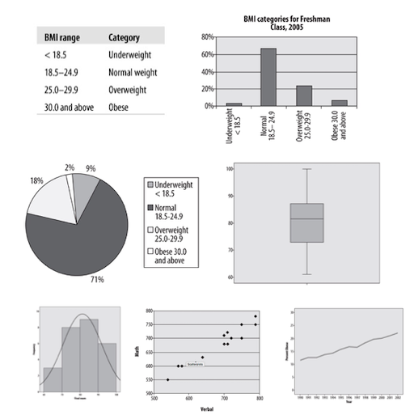  
[[oreilly]](https://www.oreilly.com/library/view/statistics-in-a/9781449361129/ch04.html)

---
## Descriptive Statistics

.center[]
  
[[spiegel]](https://www.spiegel.de/politik/deutschland/rezo-video-die-youtube-angriffe-auf-die-cdu-im-spiegel-faktencheck-a-1268973.html) *Figure by Rezo*

???
.task[COMMENT:]  

* In regard to the question of *wealth through inheritance*, Rezo showed the following figure:

---
## Descriptive Statistics

.center[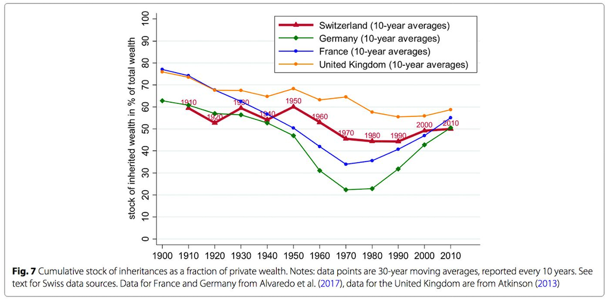]  
[[spiegel]](https://www.spiegel.de/politik/deutschland/rezo-video-die-youtube-angriffe-auf-die-cdu-im-spiegel-faktencheck-a-1268973.html) *Original by Alvaredo et al./ Atkinson/ CC BY 4.0*

???
.task[COMMENT:]  

* Not only did Rezo remove the graphs of the other countries in comparison, he also cut the timeline - the oldest and most evil move in regard to graph manipulations! In this case the manipulated figure implies that the historically exceptionally values between the 1960-90 (as it becomes clear from the original figure) were a normal phase. Spiegel calls this in its article about the fact-checking of Rezo's video *ein absolutes No-Go*. This is especially disappointing, as the Spiegel points out, as there is enough valid data to underline the point Rezo was overall trying to make.

---
.header[Descriptive Statistics]

## Frequency Distributions

*How can the data be summed up and described with a single value?*  

--

A summarizing characteristic is called the *central tendency* and the *centric point* of a distribution. There are a couple of ways to define such a centric point:

.center[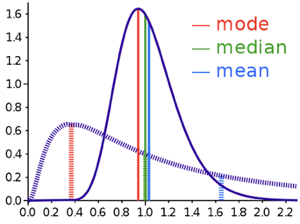[[wiki]](https://en.wikipedia.org/wiki/Mean#/media/File:Comparison_mean_median_mode.svg)]

???
.task[COMMENT:]  

* If data is symmetrically distributed, the mean and median will be close, especially as n increases. If the data is skewed, mean, median and mode can differ greatly. Depending on our question, that might really matter... we will come back to this.

---
.header[Descriptive Statistics | Frequency Distributions]

### Measures of Central Tendency

> When is the mean not representative for a data set and why?

---
.header[Descriptive Statistics | Frequency Distributions]

### Measures of Spread

To describe how data are situated around the central tendency, we use measures of data spread. 

.center[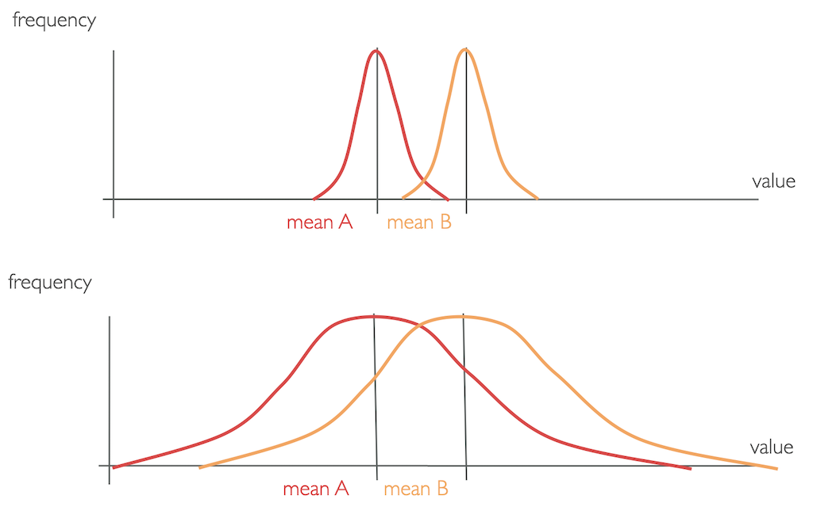]

???
.task[COMMENT:]  

* What makes them different, once again, is the *distribution* of values.

---
.header[Descriptive Statistics | Frequency Distributions]

### Measures of Spread

Mathematically, the variance is exactly the mean squared distance that values have to the mean. The variance of a set of values can be written as

.center[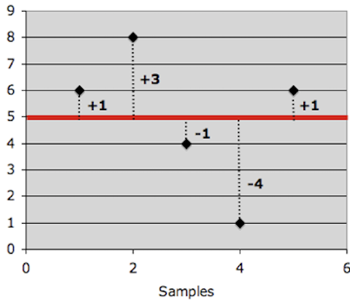]

.center[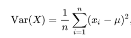]

???
.task[COMMENT:]  

* What is the standard variation?
* As the formula for variance shows, the units of variance are the units of the observation *squared*, *xi2* and in a variance's value can not be directly compared to the value range of the collected data. Hence, to get the metric back into units of the variable, we take the square root of the variance, which is called the *standard deviation σ*.
* A large value means that values are quite different from each other and that the data varies a lot. Hence, the mean is not representative for the data set. A small value means all data points are close to the mean with little variation. Hence, the mean is a valid representation of the data.
* Both *variance* and *standard deviation* measure the accuracy of the mean of data set and the variability of the data. Variance and standard deviation only differ in a scaling factor.

In descriptive statistics we use

* measures of central tendency (mode, median, mean), and
* measures of spread (variance, standard deviation)

to describe and summarize data.

We usually report

* mean and standard deviation values in the accompanying text, and
* a summary of the data as box plots graphically.

---
template:inverse

## Inferential Statistics

---
.header[Inferential Statistics]

### Hypothesis Testing

--

A formalized statistical technique, which results in a likelihood for hypotheses about some parameter value to be true. 

Null hypothesis H0

* Assumes that there is no difference between two conditions
* H0: 𝜇1 = 𝜇2

Alternative hypothesis HA

* Assumes significant differences between the two conditions
* HA: 𝜇1 != 𝜇2 or 𝜇1 > 𝜇1 or 𝜇1 < 𝜇2

We assume the null hypothesis to be true until proven otherwise. The data is the evidence and we can make one of two decisions:

* Reject the null hypothesis (proven by the data)
* Fail to reject the null hypothesis

---
.header[Inferential Statistics]

### P-Value

???
.task[COMMENT:]  

* The first test, we need to have a look into is a test that uses a calculated probability to determine whether there is evidence to reject the null hypothesis, hence ideally showing that we have indeed observed an effect.

--

> The probability of obtaining the results by chance.

It aims to prove statistical significance for a cause and effect!

* A small p-value means that the null hypothesis is very unlikely.
* A large p-value means that the  null hypothesis is very likely.

--

We can reject H0 if the computed p‐value is ≤ α. Typical alpha levels of significance are

* p < .05 (Fisher-Criterion)
* p < .01
* p < .001

Which α to chose also depends on the discipline. This shows that what we accept as *proven effect* also simply depends on somewhat arbitrary standards a research community decided on.

???
.task[COMMENT:]  

* There are two common tests for that, the [Critical Value approach](https://online.stat.psu.edu/statprogram/reviews/statistical-concepts/hypothesis-testing/critical-value-approach) and the [p-value approach](https://online.stat.psu.edu/statprogram/reviews/statistical-concepts/hypothesis-testing/p-value-approach). The p-value approach requires only one computation and most statistical software uses it. So let's have a look into that, starting with an example.
* The Fisher-Criterion is the most commonly chosen one. It is based on the tea party experiment and it means that the probability for the experiment results to happen as they did is smaller than five correct guesses in a row:

| Number of correct guesses | Probability for consecutive correct guessing |
|---------------------------|----------------------------------------------|
| 1x                        | 0.5                                          |
| 2x                        | 0.25                                         |
| 3x                        | 0.125                                        |
| 4x                        | 0.0625                                       |
| 5x                        | 0.03125                                      |

---
.header[Inferential Statistics]

### Parametric Statistics

The factor that we want to investigate is called *parameter* and is some *numerical characteristics* of interest.  

Usually, we want to find out whether there is any difference between conditions or groups and do so by comparing the arithmetic means over their sample collection. 

???
.task[COMMENT:]  
 

Then, the mean μ is the parameter. 

* e.g. patients that took a new drug vs. patients that didn't, etc. 
* Keep in mind that, we don't — or can't — know the real value of a population parameter; we only ever estimate it with applying statistics!

--

For parametric tests to work, we have to assume some underlying statistical distributions in the data:

* Normal distribution
    * [W/S test](http://article.sciencepublishinggroup.com/pdf/10.11648.j.ajtas.s.2017060501.19.pdf)
    * [Jarque-Bera test](https://en.wikipedia.org/wiki/Jarque%E2%80%93Bera_test)
    * [Shapiro-Wilks test](https://en.wikipedia.org/wiki/Shapiro%E2%80%93Wilk_test)
    * [Kolmogorov-Smirnov test](https://en.wikipedia.org/wiki/Kolmogorov%E2%80%93Smirnov_test)
    * [D’Agostino test](https://en.wikipedia.org/wiki/D%27Agostino%27s_K-squared_test)
* Homogeneity of variance
    * [Levene’s test](https://en.wikipedia.org/wiki/Levene%27s_test)

With these test we further show that the mean is representative for the data set.

???
.task[COMMENT:]  

* The dependent variable must follow a normal distribution in the population. A normal distribution is the most important and widely used distribution in statistics. Many mathematical computations only work when the data is roughly shaped as such a *bell curve* or *Gaussian curve*.
* The sampled data is roughly shaped as a bell curve or Gaussian curve. In other words, it is symmetric around its mean, median and mode (which are all equal). The area under the normal curve is equal to 1.0.
* It is important because we have to choose the right significance test and it can only be a parametric tests when the data is normally distributed. The significance test is necessary, so we know wether two or more samples are representative for the population.

---
.header[Inferential Statistics | Parametric Statistics]

### t-Test

The two-sample test analyses two population means 𝜇1 and 𝜇2. It describes the *degree* to which those means differ by chance alone.

--

.center[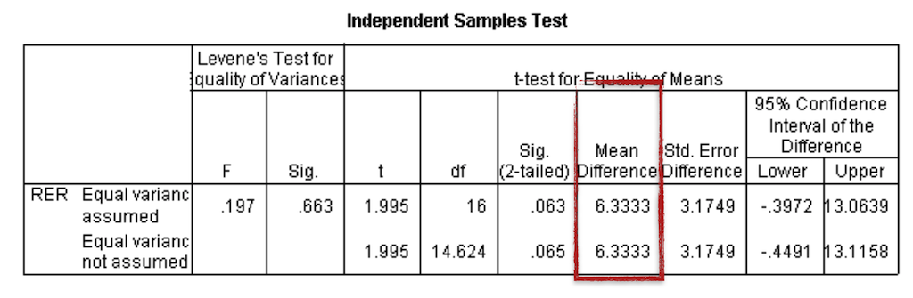][[15]](http://learntech.uwe.ac.uk/da/Default.aspx?pageid=1438)  

???
.task[COMMENT:]  

* If we run an independent-samples t-test using the data set above, we get a value for the difference in means of ~6.4, meaning there is an estimated change of 6.4%.

Statistical software generates a summary table for the results, containing both the t-test results, additional test results that examine the data distribution and a p-value. 

There are two different types of t-tests, the paired and the unpaired t-tests. 

* An unpaired t-test (also known as an independent t-test) compares the averages of two independent or unrelated groups to determine if there is a significant difference between the two. Here, groups can not have a direct relationship, e.g. with an independent measurement grouping for which one group does only test A, another group does only test B.
* A paired t-test (also known as a dependent or correlated t-test) compares the averages and standard deviations of two related groups to determine if there is a significant difference between the two groups. Here, the two groups are paired or connected, e.g. participants before and after a treatment or a repeated-measure grouping, where all participants do all tasks.
* https://askanydifference.com/difference-between-t-test-and-p-value/

>  The unpaired t-test can be used to compare two group means contributed by two independent groups.

* The independent-samples t-test returns a value for the difference in means of the two conditions, t, with larger t values suggesting higher probability of the null hypothesis being false. In other words, the higher the t value, the more likely the two means are different.

--

*But* the p-value is 0.063 and, therefore, the difference between the two means is not statistically significantly different with a 5% level of significance.

???
.task[COMMENT:]  

* In this case, we would need to report as result that even though there is a change of 6.4% observed, it is insufficient evidence (p = 0.063) to generally conclude that caffeine does change the mean RER.

---
.header[Inferential Statistics]

### Parametric Statistics

> When should a one-way ANOVA test be used?

The one way Analysis of Variance (ANOVA) compares more than *two* groups, based on *one* factor. This means that there is only one independent variable.

* The the productivity of three or more employees based on working hours.
    * Factor: the productivity in working hours
    * Groups: three or more employees

???
.task[COMMENT:]  

* Many studies involve three or more conditions that need to be compared. Due to variances in the data, you should not directly compare the means of the multiple conditions and claim that a difference exists as long as the means are different. Instead, you have to use statistical significance tests to evaluate the variances that can be explained by the independent variables and the variances that cannot be explained by them. The significance test will suggest the probability of the observed difference occurring by chance. If the probability that the difference occurs by chance is fairly low (e.g., less than 5%), we can claim with high confidence that the observed difference is due to the difference in the controlled independent variables.

* When three or more groups need to be compared over only one independent variable.
* The measured time needed for solving tasks on different tablets.
    * Factor: time
    * Groups: three VR Systems
* Collected soil uranium concentrations at three locations: Site A, Site B, and Site C.
    * Factor: the uranium concentration
    * Groups: three locations
* The hardness of four blends of paint
    * Factor: the hardness of paint
    * Groups: four blends of paint

---
.header[Inferential Statistics]

## Parametric / Non-Parametric Statistics

... 

---
.header[Inferential Statistics]

## Choosing a Statistical Test

.center[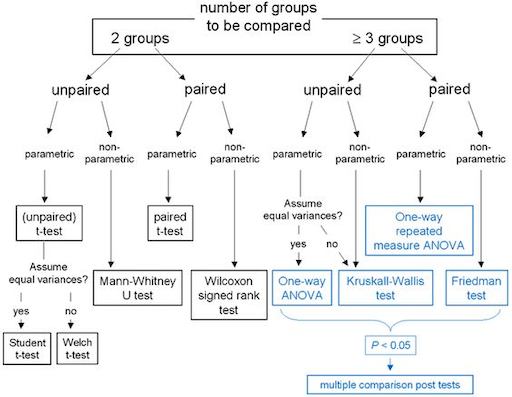]  

---
.header[Inferential Statistics]

### Inferential Statistics

Statistical analysis is a powerful tool: 

* Find interesting patterns and differences in the data 
* Identify relationships between variables
* Make assumptions about a population 
  

???
.task[COMMENT:]  

## Choosing a Statistical Test

Planing the statistical analysis should be an integral part of designing a study!

You should answer the following questions in advance:

* What kind of data?
* How many independent variables? 
* Independent measure or repeated measure design?
* Is the data parametric or non-parametric?

* Depending on what you already know, you can easily find guidelines on which statistical test to chose, such as the following for example.

* Before running significance tests, the data needs to be cleaned up, coded, and appropriately organized to meet the needs of the specific statistical software package. 
* The nature of the data collected and the design of the study determine the appropriate significance test that should be used.  

--

**Do not underestimate the effort you need to put into using methods of inferential statistics!**

???
.task[COMMENT:]  

* If the data is normally distributed, parametric tests, such as a t-test or an ANOVA, are appropriate. When the normal distribution requirements are not met, nonparametric tests should be considered.  
* This section about inferential statistic left you probably with many open questions and you might now feel a bit scared about inferential statistic. Good 🙃... What I mean with this is that you must be aware of the complexity of inferential statistics and that you need to invest time and effort to use it properly. 
* The topic is, however, absolutely worth it, as it might lead to meaningful results. And ultimately, with this chapter as a starting point, giving you all the important keywords, and with a somewhat structured approach, inferential statistic is quite conquerable after all!

> Optional: Do you have any examples of the mis-use of graphs and / or statistics?

---
template:inverse

### Chapter 07

# Qualitative Research

---
layout: false

## Research Methods

The most common methods for qualitative research are

--

* Surveys
* Case Studies
* Diaries
* Interviews
* Ethnographie
  
--
  
These methods are usually analyzed by *coding*.

---
## Research Methods

The most common methods for qualitative research are
  
* **Surveys**
* **Case Studies**
* Diaries
* **Interviews**
* Ethnographie
  
  
These methods are usually analyzed by *coding*.

???
.task[COMMENT:]  

* A **diary** is a document created by an individual who maintains regular recordings about events in their life, at the time that those events occur.
    * These recordings can be anything from a simple record of activities (such as a schedule) to an explanation of those activities to personal reflections on the meaning of those activities. When you are asking people to record information that is fluid and changes over time, such as their mood, or about multiple events that occur within the day, diaries are generally more accurate than other research methods (Alaszewski, 2006).
    * Open in what is recorded, it can be anything from the participants activities, to mood, etc. 
        * For observations that can not easily be measured, such as happiness
    * Appropriate when there little knowledge about a scenario
    * Used to find patterns, motivations, behavior and habits
    * Example - Time Diaries to Study User Frustration
* **Ethnography** is the type of qualitative research that involves immersing yourself in a particular community or organization to observe their behavior and interactions up close. 
    * understanding the context of technology usage. By examining the human, social, and organizational contexts of technology, a deeper understanding of who these users are can be developed. In ethnographic traditions, a better understanding of a group of people and their traditions and processes is itself a noble and worthwhile goal. However, in the HCI community, ethnography is often used as a first step, to understand a group of users, their problems, challenges, norms, and processes, with the eventual goal of building some type of technology for them or with them.
    * The researcher becomes part of the study

---
.header[Qualitative Research Methods]

## Surveys

--

> A survey is a method of gathering information by asking questions to a subset of people, the results of which can be generalized to the wider target population. 

--

* One of the most commonly used research methods, across all fields of research
* Easy to setup, easy to mess up

???
.task[COMMENT:]  

* One of the reasons why surveys may be maligned is that they are often used not because they are the most appropriate method but because they are the easiest method. There are a lot of bad research projects, in which professors or students quickly write a survey, do not do sufficient pilot testing of the survey questions, distribute it to first-year students, and then claim that the survey results can generalize to other populations. Unless the actual focus of the research is university students, then this common research scenario is misguided.

---
.header[Qualitative Research Methods]

## Surveys

Survey research may be the most appropriate methodology for measuring parameters such as

--

* *attitudes*
* *awareness*
* *intent*
* *user experiences*
* *characteristics of users*
* *over-time comparisons*

from a large sample size. The gathered data usually aims to generalize.

--
  
Surveys are less appropriate for precise measurements. 

---
.header[Qualitative Research Methods]

## Surveys

Surveys usually rely on users to complete the survey on their own. Hence a survey design must carefully plan.

--
* Target users and inclusion and/or exclusion criteria
* Giving enough background information
* A well-defined and well-written set of questions
* A balance between length and meaningful data collection

--

A common value for a response rate is 20% (only!).

---
.header[Qualitative Research Methods | Surveys]

## Developing Questions

A survey has two structures

* the *overall structure* of a survey, 
* and the *structure of a single question*.

--
  
The main challenge is to develop precise but easy to understand and non-biased questions. 

???
.task[COMMENT:]  

Think of the overall structure as the *storyline* of the survey.

* Instructions
* Motivation
* Flow of topics
* Grouping of questions
* Demographic questions

You also should think about the visual layout.

* The questions do not exist in a vacuum, rather, they are part of an overall survey structure. Try to create a story-line for the survey so that respondents get a sense of order. Usually a survey, in any format, must begin with instructions. These instructions must make clear how the respondent is to interact with the survey (Babbie, 1990, as cited in [1]). It also helps if you can motivate people to the survey and complete it. Generally, it is a good idea to leave demographic questions until the end of the survey, as these are the least interesting (Babbie, 1990, as cited in [1]). Questions relating to a similar topic or idea should be grouped together (Dillman, 2000, as cited in [1]). You should use sections and a well-balanced layout. This tends to lower the cognitive load on respondents and allows them to think more deeply about the topic, rather than switching gear after every question.

---
.header[Qualitative Research Methods | Surveys]

## Open-Ended Questions

* Give respondents complete flexibility in their answers
* Complex data analysis
* Must be carefully worded for respondents to stay on topic

---
.header[Qualitative Research Methods | Surveys]

## Open-Ended Questions

* *Why did you stop using software X?*

???
.task[COMMENT:]  

* This open-ended question provides no information about the possible causes; instead it requires the respondent to think deeply about what the causes might be (Dillman, 2000, as cited in [1]). The respondent may be too busy to come up with a complete response or may simply say something like "I didn't like the software". It is a very broad question. More specific questions might be:  

Single questions can be categorized in three types: as 

* open-ended questions, 
* closed-ended questions with ordered response categories, or 
* closed-ended questions with unordered response categories 
 

--

* *How did you feel about the usability (ease of use) of software X? Did software X  allow you to complete the tasks that you wanted to complete?*

???
.task[COMMENT:]  

* These questions address more specific topics: ease of use and task completion. The respondents cannot simply answer "I didn't like it,” although they could just answer “yes” or “no” to the second question. Perhaps another way to reword that second question might be as:  

--

* *What barriers did you face in attempting to use software X to complete your tasks?*

???
.task[COMMENT:]  

* In that revision, the respondents could simply say, “none” but the question also invites the respondents to think carefully about the problems that they might have faced.

---
.header[Qualitative Research Methods | Surveys]

## Closed-Ended Questions

A number of choices is given.

--

* E.g. [Likert scale questions](https://en.wikipedia.org/wiki/Likert_scale), which often take the form of a scale of 1 to 5, 7, or 9, ask users to note where they fall on a scale of, for example, *strongly agree* to *strongly disagree*.

.center[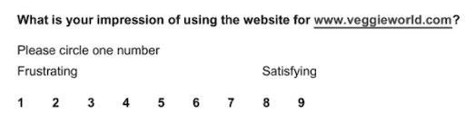]

???
.task[COMMENT:]  

* [[quis]](http://www.lap.umd.edu/quis/) *A closed-ended question with an ordered response.*

--

* Choices that do not have a logical order.

.center[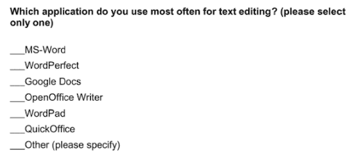]

???
.task[COMMENT:]  

* For instance, asking about types of software applications, hardware items, user tasks, or even simple demographic information such as gender. Closed-ended questions can allow for a single or multiple selections.
* [[1]]() *A closed-ended question with an unordered response.*

---
.header[Qualitative Research Methods | Surveys]

## Questions - Common Problems

--

* Missing precision leads to confusion and random answers (e.g., "Which meaning has astronomy in your life?")

--
* A *double-barreled question* asks two separate, and possibly related questions (e.g., “How long have you used the Word processing software and which advanced features have you used?”). These questions need to be separated.

--
* The use of negative words in questions (e.g., “Do you agree that the e-mail software is not easy to use?”) can cause confusion for the respondents.

--
* Biased wording in questions (such as starting a sentence with “Don't you agree that…”) can lead to biased responses. If a question begins by identifying the position of a well-respected person or organization (e.g., “Angela Merkel [or Rezo] takes the view that…”), this may also lead to a biased response.

--
* *Hot-button words*, such as “left-winged,” “conservative,” “terrorism,” etc. can lead to biased responses.

???
.task[COMMENT:]  

* Researchers should carefully examine their questions to determine if any of these problems are present in their survey questions (Babbie, 1990):

---
.header[Qualitative Research Methods | Surveys]

## Existing Surveys

There are many existing surveys that have already been tested and validated in the research literature in HCI.

For example the website [User Interface Usability Evaluation with Web-Based Questionnaires](https://garyperlman.com/quest/) gives a summary of existing surveys and tools.

???
.task[COMMENT:]  

*  For most research purposes, there will be a need to create a new survey. However, for tasks such as usability testing and evaluation, there are already a number of existing survey tools. Usually, these surveys can be modified in minimal ways.

---
.header[Qualitative Research Methods | Surveys]

## Pilot Testing

After a survey tool is developed, it is very important to do a pilot study to help ensure that the questions are clear and unambiguous.  

A pilot study should focus on

* the questions, and
* interface of the survey.

---
.header[Qualitative Research Methods]

## Case Studies

--

> A case study is an in-depth study of a specific instance (or a small number of instances).  

A case study usually is conducted *within a specific real-life context*, meaning is it context-dependent.

--

They are deep and narrow, focusing on thorough exploration of a small set of samples. They do not aim for generalization.

???
.task[COMMENT:]  

* For experiments, surveys, etc. it is usually the more the merrier in regard to the number of samples. However, for certain research projects and for certain scenarios a large sample is extremely difficult if not impossible. Fortunately, this is not a cause for despair. Case studies, in which researchers study a small number of participants (possibly as few as one) in depth, can be useful tools for information gathering and evaluation.  

---
.header[Qualitative Research Methods | Case Studies]

## Choosing Cases

There are really no rules on what a case can be. You can chose a case as representative as possible, multiple-cases, edgy cases, critical cases and so on.  

--

How you chose your case must be thoroughly described. You could also use a specific method, e.g. a *screening survey* to find your case. 

???
.task[COMMENT:]  

* A carefully constructed survey of potential participants can provide data that informs your selection process. Such surveys might assess both the fit between the participants and your criteria and the willingness of the participants to commit their time and energy to the success of the study.

---
.header[Qualitative Research Methods | Case Studies]

### Examples

* What are the ecological effects of wolf reintroduction? → Case study of wolf reintroduction in Yellowstone National Park.

--
* How do populist politicians use narratives about history to gain support? → Case studies of Hungarian prime minister Viktor Orbán and former US president Donald Trump.

--
* How can teachers implement active learning strategies in mixed-level classroom? → Case study of a local school that promotes active learning.

--
* What are the main advantages and disadvantages of wind farms for rural communities? → Case studies of three rural wind farm development projects in different parts of the country. 

--
* How are marketing strategies changing the relationship between companies and consumers? →  Case study of the iPhone X marketing campaign.

--
* How do experiences of work in the gig economy (temporary, flexible jobs) differ by gender, race and age? → Case studies of Lieferando and Uber drivers in Berlin.

---
.header[Qualitative Research Methods]

## Interviews & Focus Groups

--

> Interviews are targeted discussions with carefully selected respondents.
  
  
???
.task[COMMENT:]  

* Potential users, domain experts and stakeholders as respondents for example can help human-computer interaction researchers understand needs, challenges, reactions to new tools, and uses of tools in practice. Conducting effective interviews requires careful consideration of *who* to involve as participants and *how* the sessions might be structured, with possibilities ranging from completely structured interviews to semi-structured and unstructured interviews.  

--
  
> Focus groups are the interview of multiple participants at once, in a group.

???
.task[COMMENT:]  

* The choice of one-to-one interviews or focus groups involves trade-offs in time, expediency, depth, and difficulty. Focus groups let you hear from many people at once but with less depth from any given individual. You should consider the trade-off between this loss of depth and the potentially fuller understanding that may arise from a conversation between participants having multiple perspectives. Unfortunately, there are no guarantees: this intriguing dynamic conversation might not materialize. As the moderator of a focus group, you have a very important role to play: this is where the difficulty comes in. Skillful moderation can keep conversation focused and inclusive, increasing your chances of getting good data.

--

* Useful for understanding a individual perspectives
* Crucial: *who* to involve and *how* to structure the sessions
* Structured, semi-structured and unstructured

---
template: inverse

# Analyzing Qualitative Data

---
.header[Qualitative Research Methods]

## Analysis

Qualitative methods do not aim to eliminate *subjectivity*. They accept that subjectivity is inherent to process of interpreting qualitative data.   

--

However, they strive to show that interpretations are developed methodically to be consistent with, and representative for the available data.

--

In terms of qualitative research, 

--
* *validity* means that we use well-established and well-documented procedures to increase the accuracy of findings. 

???
.task[COMMENT:]  

* More strictly speaking, validity examines the degree to which an instrument measures what it is intended to measure (Wrench et al., 2013, as cited in [1])

--
* *reliability* refers to the consistency of results. 

???
.task[COMMENT:]  

* If different researchers working on a common data set come to similar conclusions, those conclusions are said to be reliable.If different researchers working on a common data set come to similar conclusions, those conclusions are said to be reliable.

---
.header[Qualitative Research Methods | Analysis]

## Coding

--

The goal is to give the unstructured data, e.g. found in texts, a structure.  
  
> Coding is the process of labeling and organizing your qualitative data to identify different themes and the relationships between them.  

???
.task[COMMENT:]  

* A *reliable* and *valid* method is *coding*, which assigns labels to observations.

* Imagine, you collected feedback about a developed website with open-ended, free-text questions (from reviews, surveys, complaints, chat messages, interviews, case notes, social media posts, etc.) and you end up with hundreds of free-text responses. How can you turn all of that text into applicable information to improve your system? By coding qualitative data.
* When coding e.g. open-ended text answers, you assign labels to words or phrases that represent important (and recurring) themes in each response. 

--

This can also be understood as a *thematic analysis*.

???
.task[COMMENT:]  

   Thematic analysis extracts themes from text by analyzing the word and sentence structure.

.center[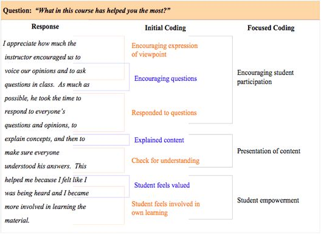[[pinimg]](https://i.pinimg.com/564x/4a/dc/45/4adc4569928cdb623f4ba21f788b7102.jpg)]

--

Once you have established such a coding, you can analyze your data. 

---
.header[Qualitative Research Methods | Analysis | Coding]

## Codes

> A code is a label.

--

Labels are ideally words or phrases.  

???
.task[COMMENT:]  

* https://web.atlasti.com

---
.header[Qualitative Research Methods | Analysis | Coding]

## Codes

--

**Deductive** coding means you start with a *predefined set of codes*, then assign those codes to the new qualitative data.  

???
.task[COMMENT:]  

These codes might come from previous research, or you might already know what themes you’re interested in analyzing.  

Deductive coding is also called concept-driven coding.  

* For example, let’s say you’re conducting a survey on user experience with a web-store. You want to understand the problems that arise from long processing wait times, so you choose to make “processing wait time” one of your codes before you start looking at the data.  

The deductive approach can save time and help guarantee that your areas of interest are coded. But you also need to be careful of bias; when you start with predefined codes, you have a bias as to what the answers will be. Make sure you don’t miss other important themes by focusing too hard on proving your own hypothesis.  

--

**Inductive** coding, also called *open coding*, creates codes based on the qualitative data itself.  

???
.task[COMMENT:]  

* You don’t have a set codebook; all codes arise directly from the survey responses.

* Here’s how inductive coding works:

1. Break your qualitative dataset into smaller samples.
2. Read a sample of the data.
3. Create codes that will cover the sample.
4. Reread the sample and apply the codes.
5. Read a new sample of data, applying the codes you created for the first sample.
6. Note where codes don’t match or where you need additional codes.
7. Create new codes based on the second sample.
8. Go back and recode all responses again.
9. Repeat from step 5 until you’ve coded all of your data.

If you add a new code, split an existing code into two, or change the description of a code, make sure to review how this change will affect the coding of all responses. Otherwise, the same responses at different points in the survey could end up with different codes.

Sounds like a lot of work, right?

Inductive coding is an iterative process, which means it takes longer and is more thorough than deductive coding. But it also gives you a more complete, unbiased look at the themes throughout your data.  

## Coding Frames

When you create your codes, you need to put them into a *coding frame*. 

> A coding frame represents the organizational structure of the themes in your research. 

There are two types of coding frames: flat and hierarchical.

* A flat coding frame assigns the same level of specificity and importance to each code. While this might feel like an easier and faster method for manual coding, it can be difficult to organize and navigate the themes and concepts as you create more and more codes. It also makes it hard to figure out which themes are most important, which can slow down decision making. 
* Hierarchical frames help you organize codes based on how they relate to one another. For example, you can organize the codes based on your customers’ feelings on a certain topic:

### Hierarchical Coding Frame

.center[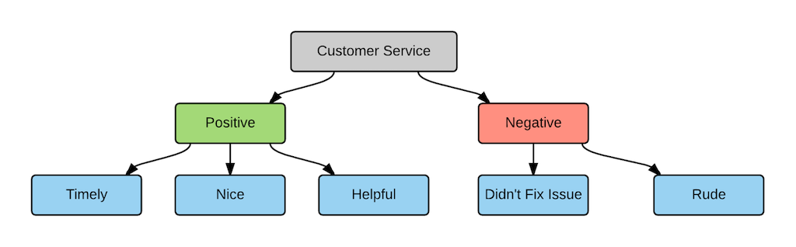[[thematic]](https://getthematic.com/insights/coding-qualitative-data/)]

Hierarchical framing supports a larger code frame and lets you organize codes based on an organizational structure. It also allows for different levels of granularity in your coding.  

In this example:

1. The top-level code describes the topic (customer service).
2. The mid-level code specifies whether the sentiment is positive or negative.
3. The third level details the attribute or specific theme associated with the topic.

* Whether your code frames are hierarchical or flat, your code frames should be flexible. Manually analyzing survey data takes a lot of time and effort; make sure you can use your results in different contexts.

For example, if your survey asks customers about customer service, you might only use codes that capture answers about customer service. Then you realize that the same survey responses have a lot of comments about your company’s products. To learn more about what people say about your products, you may have to code all of the responses from scratch! A flexible coding frame covers different topics and insights, which lets you reuse the results later on.  

---
.header[Qualitative Research Methods | Analysis | Coding]

## Manual Coding

Different researchers have different processes, but manual coding usually looks something like this:

1. Choose whether you’ll use *deductive* or *inductive* coding.
2. Read through your data to get a sense of what it looks like. Assign your first set of *codes*.
3. Go through your data line-by-line to code as much as possible. Your codes should become more detailed at this step. 
4. Categorize your codes and figure out how they fit into your *coding frame*.
5. Identify which themes come up the most — and start your interpretation of them.

???
.task[COMMENT:]  

* https://web.atlasti.com

## Automatic Coding

Automating the analysis is slowly becoming a valuable option due to advances in natural language processing and machine learning.

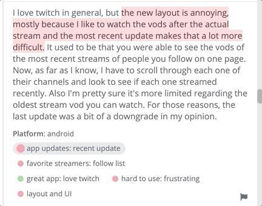  
[[thematic]](https://getthematic.com/insights/coding-qualitative-data/) 

*  Unlike manual analysis, which is prone to bias and doesn’t scale to the amount of qualitative data that is generated today, automating analysis is not only more consistent and therefore can be more accurate, but can also save a ton of time.
*The software Thematic categorizes qualitative data into themes.*

--

Manual human coding is still considered to be more accurate that automatic coding - but potentially more biased.

---
.header[Qualitative Research Methods | Analysis]

## Coding

> In summary, coding is the process of labeling and organizing your qualitative data to identify themes.

--

After you code your qualitative data, you can analyze it just like numerical data.

???
.task[COMMENT:]  

   Inductive coding (without a predefined code frame) is more difficult, but less prone to bias, than deductive coding. Code frames can be flat (easier and faster to use) or hierarchical (more powerful and organized). Your code frames need to be flexible enough that you can make the most of your results and use them in different contexts. When creating codes, make sure they cover several responses, contrast one another, and strike a balance between too much and too little information.  

--

Proper coding is absolutely necessary for a valid and reliable qualitative analysis! 

???
.task[COMMENT:]  

* Establish coding procedures and guidelines and keep an eye out for definitional drift in your qualitative data analysis.  

---
## Homework

--

### Example Research

Come up with a qualitative study design from the field of Creative Technologies.  
  
Describe which method you would chose for the project and why is that the best choice in your opinion? How would you analyze your data, e.g. give a rough overview of the coding.

--

### Your Paper

Which methods with which steps do you want to use in your paper?  

---
template:inverse

# Next

---
# Next

There is one more research method left for us to look at: a literature review!  
  
Also, we will have a brief look into how to work with literature in general, e.g. how to find it, how to manage it, etc.

---
template:inverse

### The End

# 👋🏻
