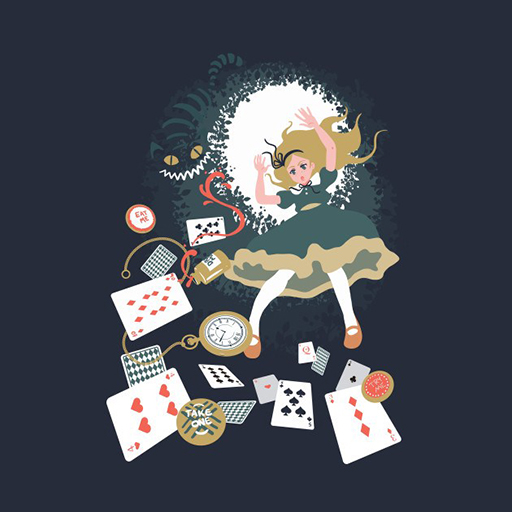
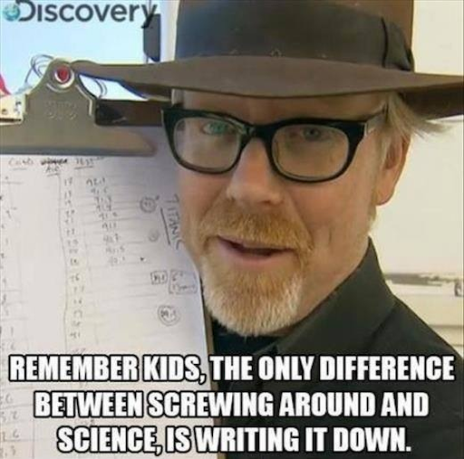
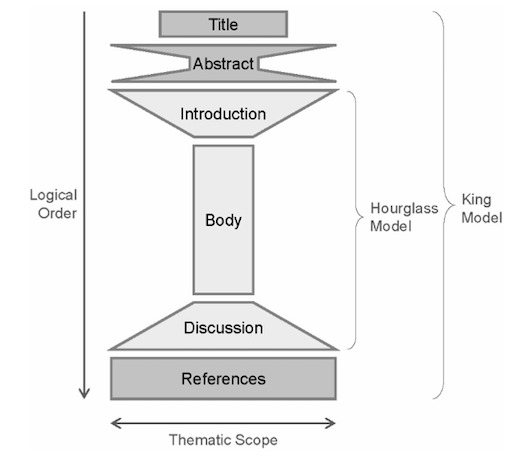
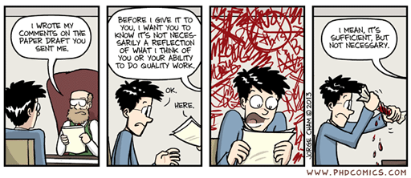

name: inverse
layout: true
class: center, middle, inverse
---

# Academic Methodologies

### Prof. Dr. Lena Gieseke | l.gieseke@filmuniversitaet.de  

#### Film University Babelsberg KONRAD WOLF

---
# Today

---
layout: false

## Today

--
* Your Papers

--
* Working with Literature

---
## Your Paper

Describe the approach you want to present within your paper.

---
template:inverse

# Working with Literature

---
## Working with Literature

--
* Searching
    * Engines
    * Digital Libraries
--
* Strategies
    * Searching
    * Collecting
    * Reading
--
* Management Tools
--

* Literature Surveys

---
.header[Literature]

## Search Engines

* Google Scholar
    * Best in terms of volume and being up-to-date
    * Shows you where to find the document
    * You can follow who cited that entry

--

Search for "alternatives for google scholar", e.g. with Research Gate coming up.

---
.header[Literature]

## Digital Libraries

* ACM Digital Library
    * Association for Computer Machinery
    * Computing society
    * All content is of a certain quality
* IEEE Xplore
    * Institute of Electrical and Electronic Engineers 
    * Technical professional organization dedicated to advancing technology
* Springer Link
    * Multiple disciplines
* Elsevier
    * Multiple disciplines
* Eurographics Digital Library
    * European Association for Computer Graphics

---
.header[Literature]

## Search Strategies

--
* Keywords

--
* Authors

--
* References in papers
    * Follow the citations in the paper
--
* Venues
    * Journals, conferences that fit topic-wise

--
> It is really not an accomplishment to find many papers. Reading the right ones really is!

---
.header[Literature]

## Search Strategies

.center[]
  
[[theshirtlist]](https://www.theshirtlist.com/down-the-rabbit-hole-t-shirt-2/)

---
.header[Literature]

## Collection Strategies

--

* Set yourself a time frame

--
* Decide on the type of search
    * Stay on track of certain keywords, for example
--
* Be disciplined with the type of search

--
* Follow a setup 
    * Which papers to save,
    * How, where and under which name to save papers,
    * How to come back to the paper (assign a prioritization?!)

???
.task[COMMENT:]  

* Set yourself a time frame, otherwise hours over hours might just pass by.
* Decide on the type of serach you want to do: narrow vs. broad. What is it you want to archive with this search? Get an overview? Get specific related work for an algorithm?
* For a more narrow search, be disciplined about staying on track of certain keywords, for example.
* Maybe decide on a number of papers you want to save, which should be connected to the actual time you have to read them.
* Have a setup ready that decides
    * how to decide which papers to save,
    * how (pdf vs. online link?), where and under which name to save papers,
        * E.g. I save paper as `firstauthorlastname_year_firstlettersofthefirstthreewordsofthetitle.pdf`, such as `wong_1998_cgf.pdf`
    * wether to give them directly a prioritization on what to read next, and
    * how to make sure that you come back to these papers and actually read them.

---
.header[Literature]

## Collection Strategies

--
* Read the title,

--
* read the abstract,

--
* look for a list of contributions and if found read them,

--
* look at the figures one by one and read their captions, and

--
* look at additional materials such as a project page or supplemental videos.

--

> The more decisions you make about the paper right away, the more time you save later on.

???
.task[COMMENT:]  

* The more decisions you make about the paper right away (whether to save, read, read first, tags,... ?), the more time you save later on, when you have to once again remember what the paper was about and whether you should read it.

---
.header[Literature]

## Reading Strategies

Ideally, you should have a system, which tells you which paper to read next.  
  
For this also reading lists in a literature management tools can be helpful.

???
.task[COMMENT:]  

* Reading many papers makes you a better researcher
* Also across topics

---
.header[Literature]

## Reading Strategies

Read with intention

--
* *Why are you reading this paper?*

--
* *What is it that you want to know and gain from reading this paper?*

---
.header[Literature]

## Reading Strategies

???
.task[COMMENT:]  

* Homework readings

--

There are several "reading methods" out there, for example the PQ4R method:

--

* **P**review
    * Overview, scanning
* **Q**uestions
    * What do you want to know from the paper?
* **R**ead
* **R**eflect
    * Reflect arguments, are there counter arguments?
* **R**ecite
    * Be able to summarize content in your own words.
* **R**eview
    * Critical questioning of content.

---
.header[Literature]

## Literature Survey

--

A literature survey is a systematic and comprehensive reflection of the present state of a specific research topic. Contributions can be

???
.task[COMMENT:]  

* They investigate what is known and what open questions there still are. They do so on the basis of the currently available literature, e.g. other papers. A STAR is a [meta analysis](https://en.wikipedia.org/wiki/Meta-analysis) of a research topic and you could also consider it a specific type of case study (with the papers as cases). 

--

* Timeline
* Terminology
* Classification(s)
* Taxonomy
* Comparisons

???
.task[COMMENT:]  

* A STAR usually goes far beyond a simple collection and summary of the topic and its related work. The most common contributions of STAR papers are a timeline, the development of a common terminology, a classification (usually as a table), a [taxonomy](https://en.wikipedia.org/wiki/Taxonomy_(general)) (usually as a tree) and a comparison based on certain features. But you will see different approaches. 
* To write a STAR you should start with the topic and some ideas what your contributions should be. Based on these you define a search strategy (rigor, completeness) and a scope (criteria for inclusion and exclusion). Both should be discussed in the paper.

---
template:inverse

# Writing

---
## Writing

.center[  
[[imgur]](https://imgur.com/gallery/ex4PAUZ)]

---
## Writing

There are many different reasons to write.  
  
--
  
Academic writing aims at presenting novel and relevant research **as clearly as possible**.

--
* Text itself is the research (humanities)

--
* Text is reporting the research results (sciences)

---
template:inverse

## How To Start Writing

---
## How To Start Writing

It is tremendously helpful to establish for yourself a routine that gets you into the flow of writing. 

???
.task[COMMENT:]  

* Writing can feel like a daunting task, but if you break it down it will appear more manageable. 

--
Writer’s block can be caused by

--
* Distraction

--
* Too many ideas at the same time

--
* Not knowing what you want to say
* Half-formed ideas
* Missing knowledge

--
* Problem of expressions, not being firm in the language

--
* Not knowing what comes next

--
* Intimidation of the task

--

Most of these causes will vanish with **having a plan**!  

???
.task[COMMENT:]  

* As writing is all about getting into a *flow* of writing it is important to be in the right state of mind. Usually I will start with setting a time for how long I am going to write and with blocking all distractions such as emails for that time period. And with blocking, I mean literally blocking. For that I am using the [Focus app](https://heyfocus.com/?utm_source=focus_about) (there are countless similar tools), which prevents the opening of certain apps and websites for the defined time. This helps me to stick to the task and not to give up with the writing if it doesn't go as planned. Also, I personally like to start with having a quite detailed plan about what I am going to write. I define which part I am going to work on and what I hope to finish in that session. Then I will develop bullet points for each sections, which I try to make as detailed as possible. My goal is here *to separate the task of knowing what to write from the actual writing*! Bullet points are much easier to come up with and to structure than continuous text. 

--

> The goal is to separate the task of knowing what to write from the actual writing.

---
## How To Start Writing

### *Find your process!*

???
.task[COMMENT:]  
* If I am completely stuck and even coming up with structured bullet points feels scary to me, I will start with a e.g. 20 min session to just write down what ever comes to my mind in regard to the tasks, be it text, bullet points, or jibberish. During that session, I try not to go back to anything that I have already written but let it be in which ever form and just continue to get something onto the page. Afterwards I go over everything I wrote and either distill bullet points from it or even already actual text. Of course this approach is quite time intensive. Also, it depends on your way af thinking and writing capabilities. I have met plenty of people that can produce beautiful, coherent text on the first go, starting with an empty page and not doing a detour over bullet points. I am not one of them. But the more I write, the more I am getting there.

The above is just my process and e.g. such an iterative approach might not fit you. I would like to encourage you to figure out your process! You do this ideally before you have to crunch out writings under a tight deadline.

---
## How To Start Writing

In regard to specifically writing a paper, I recommend the following steps:

--
* List your contributions

--
* Define a leitmotif and a story

--
* Prepare an outline of the paper
    * Section and subsection headings
    * A few sentences about each (sub)section
    * (Plan figures, figure placeholders)

???
.task[COMMENT:]  

* Do this very, very early
* This also sets your brain in motion to think about the topics

--
  
Start with the most concrete parts, e.g. what you did, results..

--
  
...end with the more abstract parts, e.g. the discussion, outlook, abstract.

???
.task[COMMENT:]  

* Then start the writing with the most concrete parts about aspects you know well, e.g. your methodology, description of your steps, or your results. 
* These are usually the sections, which are easiest to write because you know exactly what to write. The more abstract parts, such as the discussion, the outlook and the abstract you should write last as with them you generate new content beyond the communication of your practical project.
* Now let's dive into what makes a paper a paper.

---
template:inverse

## The Leitmotif

---
## The Leitmotif

You can understand the leitmotif as guid for building a *narrative flow*.

--
* Here is a problem

--
* It is an interesting problem

--
* It is an unsolved problem

--
* Here is my idea

--
* My idea works

--

You are telling the story about your idea, everything in the paper must serve the storyline.

???
.task[COMMENT:]  

* You want to infect the mind of your reader with your idea and for that you need to come up with *this one shiny idea*, which can be different from the contributions. Make sure the reader knows what the idea is and make the reader care about your idea, e.g. by clearly pointing out that the paper will generate a *reusable insight*, which will be useful to the reader. Try to give the readers something they didn’t have before. 

---
template:inverse

## Paper Sections

---
## Paper Sections

Any academic writing follows overall this structure:

  
[[derntl]](http://dbis.rwth-aachen.de/~derntl/papers/misc/paperwriting.pdf)

---
## Paper Sections

.center[]

---
## Paper Sections

The structure of a paper is as follows:

* Title
* Teaser Image if possible
* Abstract
* Introduction
* Related Work
* Main Content
    * Algorithm, Setup, Study, etc.
    * Results
    * Evaluation
    * Discussion
* Future Work
* Conclusion
* Acknowledgements

???
.task[COMMENT:]  

* In the context of computer science almost all paper follow the same structure, with minor differences in the structure of subsections and in the specific section titles.

---
## Paper Sections

Furthermore, a paper has actually somewhat of a fractal structure:

* The document has an introduction, body, conclusion
    * A section has an introduction, body, conclusion
        * A subsection has an introduction, body, conclusion
            * A paragraph has an introduction, body, conclusion

???
.task[COMMENT:]  

*  (and we do love fractals...). With this I mean that each section, subsection, etc. must follow loosely the above overall structure
* With this fractal structure you make sure that a reader understands your storyline and why that e.g. section is happening. It is a bit like creating a chain, each element must be tried into the previous and the following. To do this gracefully is quite challenging as you also don't want to repeat yourself. But this makes sure that the document flows naturally and is easy to read. As a rule of thumb you can build one paragraph for each thought. Connect paragraphs logically. 

--

Similar to presentations, also add navigation marks to help the reader getting through the whole paper.  
  

--
Explain where ever necessary,

* where did we come from,
* where are we now,
* where are we going?

???
.task[COMMENT:]  

* Example: “In the last section we saw a formal definition of X. In this section we will see some examples of X, in preparation for section 3, which will introduce a special case of X, which we will focus on in the rest of the report.”

--

Once again, every section, paragraph, sentence and word should serve a purpose. If not, throw it out!

---
template:inverse

# Next

---
# Next

Next we will look into each section individually, citations and also into overall language and writing style.

.center[]
[[phdcomics]](http://www.phdcomics.com/comics/archive.php?comicid=1576)

---
template:inverse

### The End

# 👋🏻
