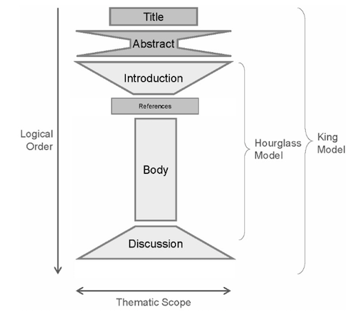
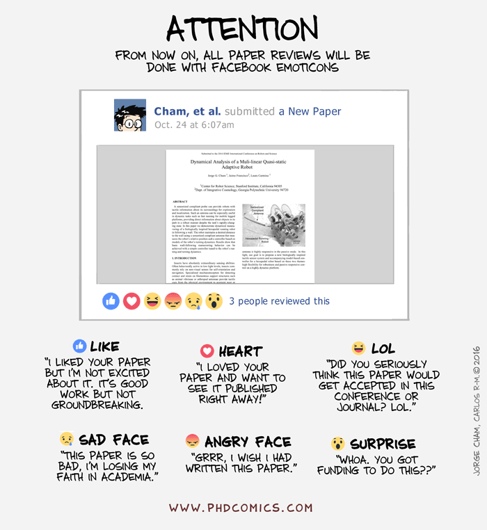

name: inverse
layout: true
class: center, middle, inverse
---

# Academic Methodologies

### Prof. Dr. Lena Gieseke | l.gieseke@filmuniversitaet.de  

#### Film University Babelsberg KONRAD WOLF

---
# Today

---
layout: false

## Today

--
* Anatomy of a Paper

--
* Language & Style

--
* Citations

--
* LaTeX

---
template:inverse

# Writing

---
## How To Start Writing

It is tremendously helpful to establish for yourself a routine that gets you into the flow of writing. 

Writer’s block can be caused by

* Distraction
* Too many ideas at the same time
* Not knowing what you want to say
* Half-formed ideas
* Missing knowledge
* Problem of expressions, not being firm in the language
* Not knowing what comes next
* Intimidation of the task

Most of these causes will vanish with **having a plan**!  

> The goal is to separate the task of knowing what to write from the actual writing.

???
.task[COMMENT:]  

* As writing is all about getting into a *flow* of writing it is important to be in the right state of mind. Usually I will start with setting a time for how long I am going to write and with blocking all distractions such as emails for that time period. And with blocking, I mean literally blocking. For that I am using the [Focus app](https://heyfocus.com/?utm_source=focus_about) (there are countless similar tools), which prevents the opening of certain apps and websites for the defined time. This helps me to stick to the task and not to give up with the writing if it doesn't go as planned. Also, I personally like to start with having a quite detailed plan about what I am going to write. I define which part I am going to work on and what I hope to finish in that session. Then I will develop bullet points for each sections, which I try to make as detailed as possible. My goal is here *to separate the task of knowing what to write from the actual writing*! Bullet points are much easier to come up with and to structure than continuous text. 

---
## How To Start Writing

### *Find your process!*

???
.task[COMMENT:]  

* Any further insights?

---
## How To Start Writing

In regard to specifically writing a paper, I recommend the following steps:

* (List your contributions)
* Define a leitmotif and a story
* Prepare an outline of the paper
    * Section and subsection headings
    * A few sentences about each (sub)section
    * (Plan figures, figure placeholders)
  
Start with the most concrete parts, e.g. what you did, results and end with the more abstract parts, e.g. the discussion, outlook, abstract.

???
.task[COMMENT:]  

* Then start the writing with the most concrete parts about aspects you know well, e.g. your methodology, description of your steps, or your results. 
* These are usually the sections, which are easiest to write because you know exactly what to write. The more abstract parts, such as the discussion, the outlook and the abstract you should write last as with them you generate new content beyond the communication of your practical project.
* Now let's dive into what makes a paper a paper.

---
## The Leitmotif

You can understand the leitmotif as guid for building a *narrative flow*.

* Here is a problem
* It is an interesting problem
* It is an unsolved problem
* Here is my idea
* My idea works

You are telling the story about your idea, everything in the paper must serve the storyline.

???
.task[COMMENT:]  

* You want to infect the mind of your reader with your idea and for that you need to come up with *this one shiny idea*, which can be different from the contributions. Make sure the reader knows what the idea is and make the reader care about your idea, e.g. by clearly pointing out that the paper will generate a *reusable insight*, which will be useful to the reader. Try to give the readers something they didn’t have before. 

---
template:inverse

## Paper Sections

---
## Paper Sections

Any academic writing follows overall this structure:

  
[[derntl]](http://dbis.rwth-aachen.de/~derntl/papers/misc/paperwriting.pdf)

---
## Paper Sections

The structure of a paper is as follows:

* Title ✓
* Teaser Image if possible ✓
* Abstract
* Introduction
* Related Work
* Main Content
    * Algorithm, Setup, Study, etc.
    * Results
    * Evaluation
    * Discussion
* Future Work
* Conclusion
* Acknowledgements

???
.task[COMMENT:]  

* In the context of computer science almost all paper follow the same structure, with minor differences in the structure of subsections and in the specific section titles.

---
.header[Paper Sections]

## The Abstract

--

A good abstract is critically important due to the following reasons:

--
* Makes people decide to read the paper

--
* The only thing that people read from your paper

--
* Makes reviewers decide to review the paper

> Sets the *mood* for the paper!

---
.header[Paper Sections]

## The Abstract

* Typically consist of 150-200 words
* A stand alone description of your work
* Neither a summary nor an outline of the paper but rather a tiny paper in itself

--

.center[]
  
[[derntl]](http://dbis.rwth-aachen.de/~derntl/papers/misc/paperwriting.pdf)

???
.task[COMMENT:]  

* A good abstract is *informative* and

* provides details about the substance,
* let's readers remember the key findings,
* let's reviewers find the claims/contributions, and
* contains all claims and supporting evidence in paragraph form.

A bad abstract is only *descriptive* by simply outlining the topics covered. Ab bad abstract feels like a table of contents in paragraph form.  

Since abstracts will also be used by search engines, ideally use terms that identify your work. For that there are also usually key words and classifications given from the venue that you can set for your paper but these might not offer the terms you want.

---
.header[Paper Sections]

## The Abstract

For coming up with the abstract you can follow these questions by Kent Beck:

--
* State the problem
    * Who is suffering the problem?
    * Connect with your target audience
--
* Why is it a problem and why is it interesting?
    * Your solution and achievements
--
* What achieves your solution
    * Say something catchy
    * Should be falsifiable
--
* What follows from your solution
    * Where or how to use
    * Implications for society, community, other researchers, …

???
.task[COMMENT:]  

* Ideally, the abstract should be the last thing you touch. However, I also always write a first version of the abstract early on as it helps me to structure my thoughts and the paper. However, this first abstract version has usually no resemblance to the final version that I write as last thing 😊

---
.header[Paper Sections]

## The Introduction

--

A chance of making a positive impression: writing style, overall quality, analytical skills, confidence in ideas, dramaturgy.

--

Last chance of making the reader want to read your paper in detail.

---
.header[Paper Sections]

## The Introduction

More details regarding the motivation and problem statement:

--
* From general to specific
    * “Zooming in…”
--
* Supported by concrete examples, questions, mysteries
* Contextualizing the problem
    * Importance of the problem
--
* Overview of proposed approach  
--

* List of contributions
    * You can merge an outline of the paper into this  
  
--
  
The introduction makes claims..  
  
--
  
..the body of the paper provides evidence to support each claim.

---
.header[Paper Sections]

## Related Work

--

When writing about the related work, you have two competing goals:

--
1. Show that you are working on a ‘hot topic’ with a lot of related work.

--
2. Show that, and why you are different to all of them.

--
  
In the sciences the related work comes after the introduction.

---
.header[Paper Sections]

## Related Work

--
* Broad and shallow account of the field

--
* Helps to place the contribution of the paper in context
    * What are the ‘rival’ approaches?
    * What are the drawbacks of each?
    * How have the different approaches progressed?
    * What are the major outstanding problems? 
--
* Section is also often structured based on applied techniques/ideas

--
* Usually 1-2 sentenced for one idea/paper

---
.header[Paper Sections]

## Related Work

--
* Distinguish your work: **How are you different?**

--
* Motivate your work: Why is your extension important?

--
* Comparison of results

--

Never make other people’s work look bad!

???
.task[COMMENT:]  

* With this section you need to clearly distinguish your work and answer the question of how you are different from everybody else. At the same time the related work is not about describing your own work. It is once again a balancing act to compare your work and make it stand out without really getting into the details of your approach.
* The standard within most research communities is to never make other people’s work look bad. You never openly criticize a paper in your related work section even if you might think the other paper is rubbish. Critical discussions usually happen during conferences in person. Equally, it is common practice to be quite generous in your statements. Giving credit to others will not diminish your contributions and it might help to show the relevance of your work. It is common to say something like “In the inspiring paper…”, for example.

---
.header[Paper Sections]

## Related Work

Reviewers carefully check the related work section!

--

* Missing related work is the first step towards rejection
* Claiming something that is not yours is the first step towards unemployment

???
.task[COMMENT:]  

Reviewers carefully check or just know out of the top of their heads as they are chosen as experts in the field, if the related work is complete. Missing related work is the first step towards rejection and claiming something that is not yours is the first step towards unemployment.

---
.header[Paper Sections]

## Related Work

The correct tense can be tricky: algorithms, techniques, etc. are still valid and must be in present tense. But e.g. the topic was introduced or studies are done in the past.

???
.task[COMMENT:]  

* Related work is not just a list of summaries.
    * List not only just what what was done but also why?, why not?, how?, how else? 
 

---
.header[Paper Sections | Related Work]

## Example

> […] None of the work discussed so far integrates artist control on an element and connection level once the pattern is computed. There are procedural techniques that enable low-level control on the results themselves, developed in the context of architectural designs [LWW08], tree modeling [PSK∗12] and the creation of natural scenes [EVC∗15]. The move operator from the latter is similar to ours but their system is optimized for chaotic arrangements, which contrasts to our organized design goals for ornaments. 

---
.header[Paper Sections]

## Main Content

--

The goal is to provide evidence for your claims!  
  

???
.task[COMMENT:]  

* The main content must provide all evidence for your claims. Make sure the overall idea of your project is completely clear before going into details. For the structure of the sections do not recapitulate your personal journey of discovery. The report order is usually different from the order of the investigation. Choose the most direct route to the idea. 

--
  
Do not recapitulate your personal journey of discovery, the order of investigation is usually not a suitable structure.

---
.header[Paper Sections]

## Main Content

The structure of the main content depends on the type of problem and solution.
  
In one form or the other the main content must include:

--
* Theory

???
.task[COMMENT:]  

* Describe the underlying theory of techniques or the system.
* Where appropriate, use a mathematical style of definitions, theorems, …

--
* Specifications

???
.task[COMMENT:]  

* Formally specify techniques that underlie the implementation.
* State the *requirements* of the implementation. Are there any constraints for it to work?
* Describe any assumptions you might make, any needed input data, etc.

--
* Implementation / Method

???
.task[COMMENT:]  

* Consider a figure for the pipeline/method.
* Describe only the final state of the implementation.
* Identify the major design decisions and give their reasons.
* Describe the overall structure of the system and key algorithms in abstract form.
* Illustrate the main algorithms with simple but meaningful examples.

--
* Result

--
* Evaluation

--

Overall treat the main content as if explaining your work with a whiteboard.

???
.task[COMMENT:]  

* Conveying an intuition is primary and once the readers have the intuition, they can follow the details. Of course, you can use formalisms and formulas but don’t hide behind it. Carefully balance between showing that you know stuff and being pompous. Don't forget to introduce notations and terminologies first wherever required.

### Figures

Well understandable papers, no matter the complexity of their work, make extensive use of figures such as diagrams, a system overview and visual explanations (in all sections, not just in the main content). All figures must be tied into the text and must be referenced in the text at least once. For good venues the quality of figures is very high, going as far as research teams hiring professional designers. A good figure has a clean layout and is ideally understandable on its own. If that is not possible (and often it is simply so) it must be understandable with the caption though. Captions are allowed to be a bit longer and need to put the figure into the context of the project and need to give all details needed to understand the figure. Remember, when reading a paper, it is common to make a first pass just by looking at the figures and reading the captions.

If a figure is not by you, you must properly cite it. For publication you must have the correct copyrights for any image you use. The publication venue will make you sign that you have all necessary rights. 

*On a Side Note*: My way of giving credits for the used images in my scripts does not match any academic format but it is my own style 😎. As you are reading the scripts online and I provide links as reference, I think it is still a valid representation. Also, copyrights are overall different in an educational context. But in any more official context than lecture scripts my reference style is incorrect! 

---
.header[Paper Sections | Main Content]

## Results

Collect a broad spectrum of possible results.

--
* Results might have already be referenced when describing the technique

--
* Careful balance result quality
    * An overview of *possible* results not just the best ones

???
.task[COMMENT:]  

* The presentation of your results must collect a broad spectrum of *possible* results not just the best ones. Be careful here to balance result quality. You need to show some convincing drawbacks or issues as nothing is ever perfect but of course you also don't want to unnecessarily highlight issues. It is completely fine to reference the results in a previous section, e.g. when describing the technique.

---
.header[Paper Sections | Main Content]

## Evaluation

Describe your evaluation technique

--
* Reason why it is valid

--
* Try to use as many objective measurements as possible
    * Benchmarks, performance, error count
--
* You can mix approaches, e.g. measurements and a user study

???
.task[COMMENT:]  

* You must in one form or the other evaluate your results. Clearly describe your evaluation technique and give reasons why it is valid. Try to use as many objective measurements as possible such as benchmarks, performance, error count. If you can, compare your work with these with the results of other projects. 
* The evaluation can go as far as conducting a formal study, a survey, interviews, etc. Depending on the scope and size of the evaluation it is common to entitle the evaluation itself as a contribution of the paper.

---
.header[Paper Sections]

## Discussion

--

As detailed and openly as possible, **you should have nothing to hide**.

--
* Don’t state the obvious

--
* Interpret your results
    * Explain/mention everything that is noticeable in your results and evaluations
    * Outliers, strange behaviors, …
--
* Is the evaluation correct?

--
* Anticipate possible questions from the reviewers!

???
.task[COMMENT:]  

* The discussion is usually the hardest to write as you need to generated insights that go beyond the execution of your research project. This might not come naturally and needs a lot of brain power. A good start to discussing your work is to try to anticipate what reviewers/advisors might say and answer to that. Explain or mention everything that is noticeable in your results and evaluations. Are there any outliers, strange behaviors, etc.? Is the evaluation correct?

Reflect on the project as detailed and openly as possible - in regard to both, the good and the bad. Ideally you have nothing to hide. Again, no one expects a perfect project and also some drawbacks can give valuable novel insights.

--

Might already start to zoom out by discussing how the presented work is generalizable, application scenarios, and its impact.

???
.task[COMMENT:]  

* and what its different applications are. Here, you can also describe what overall impact the project might have.

---
.header[Paper Sections]

## Discussion

Might not come naturally, needs a lot of brain power!

---
.header[Paper Sections]

## Future Work / Outlook

Again, try to anticipate what what reviewers might say.

--
* Which improvements are possible?
* How to generalize the work?
  
--
  
Do not state anything you want to write the next paper about.

???
.task[COMMENT:]  

* The future work section is somewhat flexible. You should include it but it can also be integrated into the discussion or even conclusion. Sometimes this section is also called outlook. Again, try to anticipate what reviewers might say, e.g. "why didn't you try/do...?" and here you can brush that of as describing it as next step.
* Overall think about which improvements are possible and how to generalize the work. Do not however state to clearly anything you want to write the next paper about as then other researchers might do it for you...

---
.header[Paper Sections]

## Conclusion

Conclusions are short and bring the story back to the most general level.  

--

Remember, the storyline of the paper goes 

--
* Abstract → Introduction → Details
    * Journey from general to specific
--
* Details → Conclusions
    * Return journey from specific to general

---
.header[Paper Sections]

## Conclusion

--
* Short!

--
* Not a just summary
    * Different from abstract and introduction
    * Represents the moral of the story
    * A high level description of the significance of ideas, what they could further lead to
    * Last chance to highlight importance

--
What the readers should remember after they have forgotten the details.

???
.task[COMMENT:]  

* Conclusions should not just be a summary, and also be different from the abstract and the introduction. Think about it as the *moral of the story*. It is a short, high level description of the significance of the ideas and what they could further lead to. Yes, say it all again… The conclusion is the last chance to highlight the importance of the project. It should emphasize what the readers should remember after they have forgotten the details.

---
.header[Paper Sections]

## Acknowledgements

* Attribute the funding
* Say thank you
    * If reviewers were helpful
    * Artwork
    * Colleagues
    * Again, be generous

---
.header[Paper Sections]

## Writing A Paper - Final Thoughts

Repeat yourself while never repeating text...

--

A common mistake is to repeat the same phrases, sentences etc.  
  
However, you have to bring up your main points over and over again e.g. to lead the reader through your paper. 

---
.header[Paper Sections]

## Writing A Paper - Final Thoughts

In academic writing, everything you say must directly be proofed in some form. 

???
.task[COMMENT:]  

* This is something that students who are new to academic writing often do incorrectly.  

Some problematic examples might look like as follows:

--
* "The problem is difficult."

???
.task[COMMENT:]  

* *Difficult for whom? Believed by you? Believed by others? Proven by someone? Difficult in what sense? Difficult when done blindly? Difficult when done without a brain? Difficult for your cat?*

--
* "The method is fast."

???
.task[COMMENT:]  

*Fast in comparison to what? Faster than a snail? Faster than the speed of light? Faster than your cat?*

--
* "The high quality of the results..."
* "The results look good."

--
* "As it can be seen…", "It has been shown..."  
  
--
  
Question all your statements and see **if the text answers to everything**. 

???
.task[COMMENT:]  

* For this also see the section about citations.

Now, that we know what to write, let's talk about the look, meaning the layout of a paper. As we all know, looks are important - that is just human nature. Unfortunately the world of paper writing is not as progressive as our world is (hopefully) slowly changing to the appreciation of all shapes, sizes and colors, moving away from standards, appreciating diversity and individuality. A beautiful paper, however, very much needs to follow standards. But of course - as in real life - the real beauty of a paper comes from within, and if the content of the paper is rubbish, the layout can not fix that.

---
template:inverse

# Layout

---
## Layout

A paper should have a strong visual structure.  
  
Use section, sub-sections and bullet points. 
  
--
  
>  Good layout gives a reader an intuitive understanding of the paper on first glance.

???
.task[COMMENT:]  

* If in doubt, rather use a subsection to many than to few. Good layout gives a reader an intuitive understanding of the paper on first glance. My thesis advisor said to me for example that he can approximate a rough grade of a thesis, just by looking at its layout. And I think there is some truth to that. Also, I had it happened to me more than once that I thought I had structured my document well and it was given back to me with the comment that it needs more structure in the layout... A strong structure also helps to convey your content if there is a slight change that someone will only skim your text, e.g. for an application or expose where there are many submissions and some people are only superficially involved in the selection process.

I really can not give you any rules here to follow for structuring your text. It just depends on the content and its context. The only rule is: structure your text well with sections, subsections, bullet points and figures.  

--

For most paper submissions the venue will provide a set of rules for the text format and usually also a template for that. 

???
.task[COMMENT:]  

* You must stay within the given format, your paper might otherwise be rejected for just the wrong layout. Minor cheats, or let's call them tweaks, are ok as long as they are not really noticeable.

---
## Layout

Use figures such as drawings, diagrams, tables and graphs excessively.  
  
 Ideally your whole paper is understandable just by going through the figures.

???
.task[COMMENT:]  

* As already mentioned, figures such as drawings, diagrams, tables and graphs are in the context of computer science and with that of course also HCI and CTech, crucially important for academic writing. Use figures excessively. Ideally your whole paper is understandable just by going through the figures. There are a couple of aspects to consider when working with figures:

--

### Figures

* Numbered
* Have a caption and a long description in the paragraph
    * Captions are not easy to write
* If it is not discussed in the text, cut it
* Try to match its position to the flow of the text

???
.task[COMMENT:]  

* They are numbered.
* They have a descriptive caption and a long description in the paragraph, where they are referenced. Keep in mind that good captions are not easy to write.
* If a figure is not discussed in the text, cut it.
* Try to match a figure's position to the flow of the text. The figure should be put close to the text, where it is references. This might be especially tricky in LaTeX (we are coming back to LaTeX).  

Using italics or bold font for emphasis are problematic in academic writing. I am struggling with that a little as I think they help to visually structure a text (and I use italics for emphasis in the scripts for example). But the rule in academic writing is to only use italics once for introducing a new term and to never use bold, except for header and titles and such.

Last but not least, make sure that everything in your paper is readable printed on paper! I always have problems with this because I like to use grays for figures and layout and grays that look super nice on screen oftentimes are not distinguishable printed out. The same problem applies when preparing a presentations and the difference between the slides on your screen and the slides on the projector.

Now that we have reflected on the beauty of the layout, let's think about the beauty of the language itself.

---
template:inverse

# Language

---
template: inverse

## Language

???
.task[COMMENT:]  

* Of course, correct spelling and grammar is a must in academic writing. If you want to improve your grammar (and yes, I know, I myself have still some issues here - did someone say commata?!) there is a universe of resources for that from our friend, the internet. I particularly like to check in with grammar test, such as the [grammar book](http://www.grammarbook.com/interactive_quizzes_exercises.asp).

*What do you think we need to look out for in terms of language?*

---
.header[Language]

## Precision

???
.task[COMMENT:]  

* One of the golden rules for the language of academic writing is - in all disciplines - to be precise. However, what preciseness means differs from discipline to discipline. In our context is means clean, somewhat simple language.

--
* Clean, simple language

???
.task[COMMENT:]  

*  The language must not give a reader any extra thinking to do - the content is difficult enough on its own. The value of the work is in your research project contributions and the language should make those aspects clear, not obscure what you did with complicated language. You will notice for yourself that some writings try to hide weak results, thoughts, etc. behind complex language.

--
* Rule of thumb: use as few words as possible

???
.task[COMMENT:]  

* When working with native English speakers as a native German speaker the aspect of simple language is especially difficult. Simple German is in comparison to simple English still ten times more complex. Whenever I work with native English speakers they still simplify my sentences... 🤬 (the learning never stops...).

The website [daily writing tips](https://www.dailywritingtips.com/) describes the following helpful [techniques for more precise writing](https://www.dailywritingtips.com/10-techniques-for-more-precise-writing/)

---
.header[Language | Precision]

### Use Active Voice  

--

When a sentence includes *be* or any other copulative verb, such as *is* or *are*, recast the sentence to omit the verb.

* Don't: “The meeting was seen by us as a ploy to delay the project.”  
* Do: “We saw the meeting as a ploy to delay the project.”

---
.header[Language | Precision]

### Avoid Vague Nouns  

--

Phrases formed around general nouns such as *aspect*, *degree*, and *situation* clutter sentences.  

* Don't: “She is an expert in the area of international relations.”  
* Do: “She is an expert in international relations.”  

---
.header[Language | Precision]

### Use Words, Not Their Definitions  

--

Replace explanatory phrases with a single word that encapsulates that explanation.  

* Don't: “The crops also needed to be marketable so that families would be able to sell any yields that exceeded what they personally required.”  
* Do: “The crops also needed to be marketable so that families would be able to sell any surplus.”

---
.header[Language | Precision]

### Reduce Verb Phrases to Simple Verbs  

--

Identify the verb buried in a verb phrase and omit the rest of the phrase.  

* Don't: “The results are suggestive of the fact that tampering has occurred.”  
* Do: “The results suggest that tampering has occurred.”

---
.header[Language | Precision]

### Avoid Expletives  

--

Don’t start sentences with “There is,” “There are,” or “It is.”

* Don't: “There are many factors in the product’s failure.”  
* Do: “Many factors contributed to the product’s failure.”

---
.header[Language | Precision]

### Eliminate Prepositional Phrases

--

Replace “(noun1) of the (noun2)” phrasing with “(noun2)’s (noun1)” phrasing.

* Don't: “The decision of the committee is final.”  
* Do: “The committee’s decision is final.”

---
.header[Language]

### Gender-Inclusive Language

--

Gender inclusive language is fully embraced in the academic world.

--

Overall, the best solution is to make the nouns and pronouns plural.  

* Don't: A student who loses too much sleep may have trouble focusing during [his/her] exams.  
* Do: Students who lose too much sleep may have trouble focusing during their exams.

---
template:inverse

# Style

---
## Style

In academic writing you must avoid

* emotional language,
* flowery language, and
* superlatives.

???
.task[COMMENT:]  

* Overall though, writing style simply is subjective. If you give your paper to experienced writers they will be affected by their personal style and will give you many, many corrections. These corrections might not improve errors but might just try to make the text match more the personal writing style of the corrector. Take in the feedback, reflect on it but also stand your ground if your personal writing style is different.

---
## Style

.center[]  
[[phdcomics]](http://www.phdcomics.com/comics/archive.php?comicid=1576)

---
template:inverse

# Citations

???
.task[COMMENT:]  

* For documenting the research goals of novelty and relevance we need to put our work into context. In academia, ideally everything you do must be based on something that has already been published. For that we reference other papers and now we have a look onto the formal style of citing other work.

---
## Citations

* Direct citations
    * Exact words are copied and put into “”
    * Very uncommon in Computer Science, only used with definitions, e.g. 
        * Standard Y defines X as „…“ [5]
--
* Citing the meaning 
    * Summarising, paraphrasing, …
    * It needs to be clear where the citation starts and stops
    * This basically means that you re-write the content
        * Smith et al. [2] found …
--
* Short reference
    * List of related work and/or used techniques
        * We applied approach X [2] to …

---
.header[Citations]

## Citation Style

--

A citation style defines

* which information is necessary for a citation,
* how to order the information, 
* punctuation and formatting.
  

???
.task[COMMENT:]  

* Citation styles make reference lists and bibliographies consistent and easy to read across different papers.
  
--
  
Correct and clean citations are a must-have in academia. The golden rule here is *consistency* and not so much which style to use. 

---
.header[Citations]

## Citation Style

### MLA

Frank, H. "Wolves, Dogs, Rearing and Reinforcement: Complex Interactions Underlying Species Differences in Training and Problem-Solving Performance." Behavior Genetics 41.6 (2011): 830-39. Print.
  

### Chicago

Frank, H. 2011. "Wolves, Dogs, Rearing and Reinforcement: Complex Interactions Underlying Species Differences in Training and Problem-Solving Performance."  Behavior Genetics 41 (6):830-839. 

### APA

Frank, H. (2011). Wolves, Dogs, Rearing and Reinforcement: Complex Interactions Underlying Species Differences in Training and Problem-Solving Performance. Behavior Genetics, 41(6), 830-839. 

???
.task[COMMENT:]  

* (I personally don't care which style you use as long as you follow one)
* Which citation style to prefer highly depends on the academic discipline:
    * [MLA (Modern Language Association)](https://www.mla.org/MLA-Style)
        * Most popular
        * English, Humanities
    * [APA (American Psychological Association)](https://apastyle.apa.org/)
        * Education, Psychology, and Sciences
    * [Harvard](https://en.wikipedia.org/wiki/Parenthetical_referencing) 
        * Similar to APA
        * More common in the UK and Australia
    * [Vancouver](https://en.wikipedia.org/wiki/Vancouver_system)
        * Medicine and sciences
    * [Chicago/Turabian](https://www.chicagomanualofstyle.org/tools_citationguide.html)
        * Economics, History, and the Fine Arts

---
.header[Citations]

## Citation Style

It is up to you to decide where in the text to spell out authors names as reference as in-text citation and where to use shorter citation tags:

* Smith et al. [SJT12] demonstrate in their work about...
* ... developed in the context of architectural designs [LWW08], tree modeling [PSK∗12] and the creation of natural scenes [EVC∗15].

???
.task[COMMENT:]  

* For in text citations and author-based references, the list of authors is shortened:

* ‘Smith and Jones’ for up to two authors
* ‘et al.’ for ‘and others’ for more
    * Smith and Jones [SJ12]
    * Smith et al. [SJT12], [SJT*12] (for more than three authors)

You will often see a DOI included in a references auch as `DOI: 10.1002/asi.20801`. The DOI (Digital Object Identifier) is a unique number used to identify a specific article.

It takes a lot of time to clean the information for a reference so that it shows up correctly. Different document types need different information. Sometimes your will need to collect the required information manually. I find the [tool](http://www.citethisforme.com) and the information on [cite this for me](http://www.citethisforme.com/guides) helpful.

If you are using a LaTeX template given out by the publication venue, the style comes with the template as `\bibliographystyle{style_name}`. You still need to setup your references accordingly, meaning the bibtex entries must be correct and complete.

---
template:inverse

# Next

---
# Next

Assuming now that we have completed our research project and have written a shiny paper, we are looking next into submitting and publishing a paper.

.center[] [[phdcomics]](http://phdcomics.com/comics/archive.php?comicid=538)

---
template:inverse

### The End

# 👋🏻
