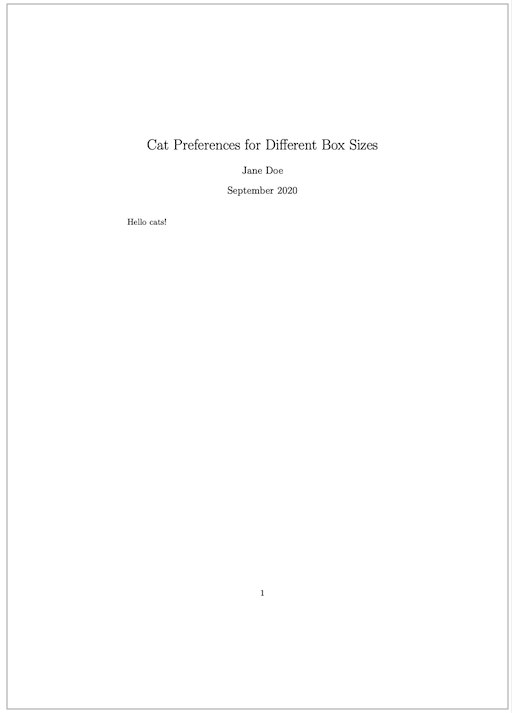
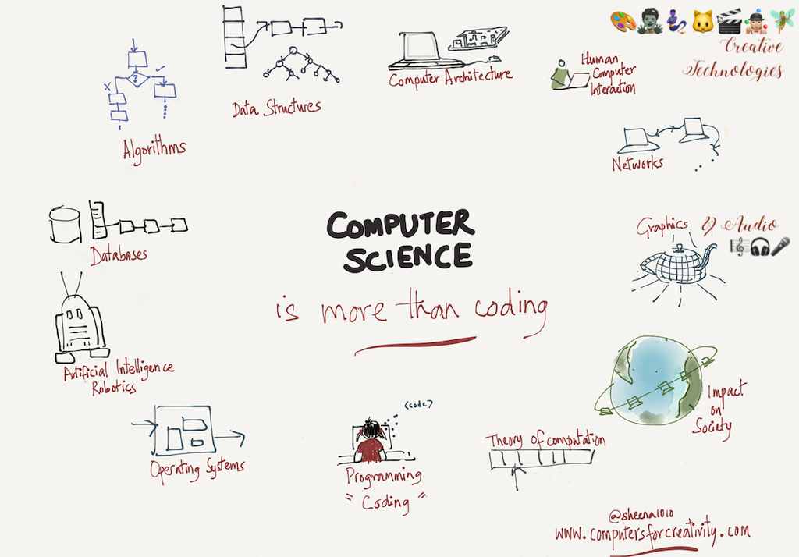
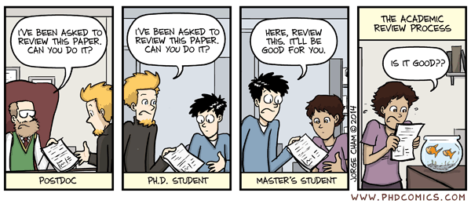

name: inverse
layout: true
class: center, middle, inverse
---


# Academic Methodologies

### Prof. Dr. Lena Gieseke | l.gieseke@filmuniversitaet.de  

#### Film University Babelsberg KONRAD WOLF


---
# Today

---
layout: false

## Today

--
* Re-Cap

--
* LaTeX

--
* Publishing

--
* Academic Careers

--
* Wrap-Up


---
## Paper Sections

The structure of a paper is as follows:

* Title 
* Teaser Image if possible 
* Abstract
* Introduction
* Related Work
* Main Content
    * Algorithm, Setup, Study, etc.
    * Results
    * Evaluation
    * Discussion
* Future Work
* Conclusion
* Acknowledgements


???
.task[COMMENT:]  

* In the context of computer science almost all paper follow the same structure, with minor differences in the structure of subsections and in the specific section titles.


---
.header[Paper Sections]

## Writing A Paper - Final Thoughts

> Repeat yourself while never repeating text...

--

A common mistake is to repeat the same phrases, sentences etc.  
  
However, you have to bring up your main points over and over again e.g. to lead the reader through your paper. 


---
.header[Paper Sections]

## Writing A Paper - Final Thoughts

> In academic writing, everything you say must directly be proofed in some form. 

--

* "The problem is difficult."
* "The method is fast."
* "The high quality of the results..."
* "The results look good."
* "As it can be seen…", "It has been shown..."  
  

Question all your statements and see **if the text answers to everything**. 

???
.task[COMMENT:]  

* For this also see the section about citations.


Now, that we know what to write, let's talk about the look, meaning the layout of a paper. As we all know, looks are important - that is just human nature. Unfortunately the world of paper writing is not as progressive as our world is (hopefully) slowly changing to the appreciation of all shapes, sizes and colors, moving away from standards, appreciating diversity and individuality. A beautiful paper, however, very much needs to follow standards. But of course - as in real life - the real beauty of a paper comes from within, and if the content of the paper is rubbish, the layout can not fix that.


---
template:inverse

# Layout

---
## Layout

A paper should have a strong visual structure.  
  
Use section, sub-sections and bullet points. 
  
>  Good layout gives a reader an intuitive understanding of the paper on first glance.

For most paper submissions the venue will provide a set of rules for the text format and usually also a template for that. 


???
.task[COMMENT:]  

* If in doubt, rather use a subsection to many than to few. Good layout gives a reader an intuitive understanding of the paper on first glance. My thesis advisor said to me for example that he can approximate a rough grade of a thesis, just by looking at its layout. And I think there is some truth to that. Also, I had it happened to me more than once that I thought I had structured my document well and it was given back to me with the comment that it needs more structure in the layout... A strong structure also helps to convey your content if there is a slight change that someone will only skim your text, e.g. for an application or expose where there are many submissions and some people are only superficially involved in the selection process.

I really can not give you any rules here to follow for structuring your text. It just depends on the content and its context. The only rule is: structure your text well with sections, subsections, bullet points and figures.  

* You must stay within the given format, your paper might otherwise be rejected for just the wrong layout. Minor cheats, or let's call them tweaks, are ok as long as they are not really noticeable.


---
template: inverse

# Language


???
.task[COMMENT:]  

* Of course, correct spelling and grammar is a must in academic writing. If you want to improve your grammar (and yes, I know, I myself have still some issues here - did someone say commata?!) there is a universe of resources for that from our friend, the internet. I particularly like to check in with grammar test, such as the [grammar book](http://www.grammarbook.com/interactive_quizzes_exercises.asp).

*What do you think we need to look out for in terms of language?*

---
.header[Language]

## Precision

* Clean, simple language
* Rule of thumb: use as few words as possible

???
.task[COMMENT:]  

* One of the golden rules for the language of academic writing is - in all disciplines - to be precise. However, what preciseness means differs from discipline to discipline. In our context is means clean, somewhat simple language.


*  The language must not give a reader any extra thinking to do - the content is difficult enough on its own. The value of the work is in your research project contributions and the language should make those aspects clear, not obscure what you did with complicated language. You will notice for yourself that some writings try to hide weak results, thoughts, etc. behind complex language.


* When working with native English speakers as a native German speaker the aspect of simple language is especially difficult. Simple German is in comparison to simple English still ten times more complex. Whenever I work with native English speakers they still simplify my sentences... 🤬 (the learning never stops...).

The website [daily writing tips](https://www.dailywritingtips.com/) describes the following helpful [techniques for more precise writing](https://www.dailywritingtips.com/10-techniques-for-more-precise-writing/)


---
template:inverse

# Style

---
## Style

In academic writing you must avoid

* emotional language,
* flowery language,
* exaggerations and superlatives.


???
.task[COMMENT:]  

* Overall though, writing style simply is subjective. If you give your paper to experienced writers they will be affected by their personal style and will give you many, many corrections. These corrections might not improve errors but might just try to make the text match more the personal writing style of the corrector. Take in the feedback, reflect on it but also stand your ground if your personal writing style is different.

---
## Style

.center[]  
[[phdcomics]](http://www.phdcomics.com/comics/archive.php?comicid=1576)


---
template:inverse

# Citations


???
.task[COMMENT:]  

* For documenting the research goals of novelty and relevance we need to put our work into context. In academia, ideally everything you do must be based on something that has already been published. For that we reference other papers and now we have a look onto the formal style of citing other work.

---
## Citations

* Direct citations
    * Exact words are copied and put into “”
    * Very uncommon in Computer Science, only used with definitions, e.g. 
        * Standard Y defines X as „…“ [5]
* **Citing the meaning **
    * Summarizing, paraphrasing, …
    * It needs to be clear where the citation starts and stops
    * This basically means that you re-write the content
        * Smith et al. [2] found …
* Short reference
    * List of related work and/or used techniques
        * We applied approach X [2] to …

---
.header[Citations]

## Citation Style

--

A citation style defines

* which information is necessary for a citation,
* how to order the information, 
* punctuation and formatting.

Correct and clean citations are a must-have in academia. The golden rule here is *consistency* and not so much which style to use. 
  

???
.task[COMMENT:]  

* Citation styles make reference lists and bibliographies consistent and easy to read across different papers.
  


---
.header[Citations]

## Citation Style

### MLA

Frank, H. "Wolves, Dogs, Rearing and Reinforcement: Complex Interactions Underlying Species Differences in Training and Problem-Solving Performance." Behavior Genetics 41.6 (2011): 830-39. Print.
  

### Chicago

Frank, H. 2011. "Wolves, Dogs, Rearing and Reinforcement: Complex Interactions Underlying Species Differences in Training and Problem-Solving Performance."  Behavior Genetics 41 (6):830-839. 

### APA

Frank, H. (2011). Wolves, Dogs, Rearing and Reinforcement: Complex Interactions Underlying Species Differences in Training and Problem-Solving Performance. Behavior Genetics, 41(6), 830-839. 

???
.task[COMMENT:]  

* (I personally don't care which style you use as long as you follow one)
* Which citation style to prefer highly depends on the academic discipline:
    * [MLA (Modern Language Association)](https://www.mla.org/MLA-Style)
        * Most popular
        * English, Humanities
    * [APA (American Psychological Association)](https://apastyle.apa.org/)
        * Education, Psychology, and Sciences
    * [Harvard](https://en.wikipedia.org/wiki/Parenthetical_referencing) 
        * Similar to APA
        * More common in the UK and Australia
    * [Vancouver](https://en.wikipedia.org/wiki/Vancouver_system)
        * Medicine and sciences
    * [Chicago/Turabian](https://www.chicagomanualofstyle.org/tools_citationguide.html)
        * Economics, History, and the Fine Arts

---
.header[Citations]

## Citation Style

It is up to you to decide where in the text to spell out authors names as reference as in-text citation and where to use shorter citation tags:

* Smith et al. [SJT12] demonstrate in their work about...
* ... developed in the context of architectural designs [LWW08], tree modeling [PSK∗12] and the creation of natural scenes [EVC∗15].


???
.task[COMMENT:]  

* For in text citations and author-based references, the list of authors is shortened:

* ‘Smith and Jones’ for up to two authors
* ‘et al.’ for ‘and others’ for more
    * Smith and Jones [SJ12]
    * Smith et al. [SJT12], [SJT*12] (for more than three authors)


You will often see a DOI included in a references auch as `DOI: 10.1002/asi.20801`. The DOI (Digital Object Identifier) is a unique number used to identify a specific article.

It takes a lot of time to clean the information for a reference so that it shows up correctly. Different document types need different information. Sometimes your will need to collect the required information manually. I find the [tool](http://www.citethisforme.com) and the information on [cite this for me](http://www.citethisforme.com/guides) helpful.

If you are using a LaTeX template given out by the publication venue, the style comes with the template as `\bibliographystyle{style_name}`. You still need to setup your references accordingly, meaning the bibtex entries must be correct and complete.

---
template:inverse

# LaTeX

---
## LaTeX

.center[]
[[inzaneresearch]](https://inzaneresearch.com/2018/07/06/grad-school-tools-latex-basics/)

--

> LaTeX follows the principles of separating presentation from content.


???
.task[COMMENT:]  

* LaTeX, which is pronounced "Lah-tech" or "Lay-tech" (to rhyme with «blech» or «Bertolt Brecht» as the X is the greek letter chi), is a document preparation system for high-quality typesetting. It is most often used for medium-to-large technical or scientific documents but it can be used for almost any form of publishing.

LaTeX is not a word processor! Instead, LaTeX encourages authors not to worry too much about the appearance of their documents but to concentrate on getting the right content.

---
## LaTeX

.left-even[
```latex
\documentclass{article}
\title{Cat Preferences for Different Box Sizes}
\author{Jane Doe}
\date{September 2020}
\begin{document}
   \maketitle
   Hello cats!
\end{document}
```
]


???
.task[COMMENT:]  

* LaTeX is based on the idea that it is better to leave document design to document designers, and to let authors get on with writing documents. So, in LaTeX you would input this document as:
* Or, in English:
    * This document is an article.
    * Its title is Cat Preferences for Different Box Sizes.
    * Its author is Jane Doe.
    * It was written in September 2020.
    * The document consists of a title followed by the text Hello world!

The output looks like:

--
.right-even[]
  


???
.task[COMMENT:]  

* The underlying TEX computer program, created by Donald E. Knuth, is aimed at typesetting text and mathematical formulae. TEX as we use it today is still pretty much the same as the release version in 1982, with some slight enhancements added in 1989 to better support 8-bit characters and multiple languages. TEX is renowned for being extremely stable, for running on many different kinds of computers, and for being virtually bug free. The version number of TEX is converging to π and is now at 3.141592653.
* LaTeX uses TeX as its formatting engine and enables authors to typeset and print their work with high typographical quality, using a predefined layout. In a LaTeX environment, LaTeX takes the role of the book designer and uses TEX as its typesetter. But LaTeX is only a program and the author has to provide additional information to describe the logical structure of the work. This information is written into the text as LaTeX commands.
* Hence, LaTeX is a markup language and not WYSIWYG (what you see is what you get). You need to compile the pdf. Tags define the general structure of a document (such as article, book, and letter), to stylize text throughout a document (such as bold and italic), and to add citations and cross-references.

---
## LaTeX


[wikipedia](https://en.wikipedia.org/wiki/LaTeX)


---
.header[LaTex]

## BibTeX

With LaTeX comes BibTeX. BibTeX is a reference management software for formatting lists of references. 
  
???
.task[COMMENT:]  

* A BibTeX database of references is stored as a `.bib` file, which you write as plain text file. References and citations are then automatically created and formatted based on the `.bib` file. Most literature management tools import/export BibTeX entries.

--

```bibtex
@article{togelius_2011_sbp, 
    author={J. Togelius and G. N. Yannakakis and K. O. Stanley and C. Browne}, 
    journal={IEEE Transactions on Computational Intelligence and AI in Games}, 
    title={Search-Based Procedural Content Generation: A Taxonomy and Survey}, 
    year={2011}, 
    volume={3}, 
    number={3}, 
    pages={172-186},
}
```

--
```latex
\cite{togelius_2011_sbp}
```


---
.header[LaTex]

## BibTeX

.center[]


???
.task[COMMENT:]  

*On the left you see the .bib file and on the right the automatically produced reference list.*
* Once again, you still have to take care of the bib entries in the `.bib` file yourself. To create a consistent and complete BibTeX list of references for a paper takes forever… be aware!
* LaTeX and BibTeX files have the advantage that they are simple text files, which fit well to version control systems such as GitHub. In comparison, such version control system often have problems with the tracking of changes in `.docx` files, for example. As with other coding projects, you only commit the source files not their build.

---
.header[LaTeX]

## Environments

* VSCode with extensions, e.g., [LaTeX Workshop](https://marketplace.visualstudio.com/items?itemName=James-Yu.latex-workshop)
* [Overleaf](https://www.overleaf.com/)

---
## LaTeX

.center[]  
[[github]](https://github.com/captn3m0/awesome-vcs)  


---
template: inverse

# Academic Publishing

---
layout: false

## Academic Publishing

   


[[wiki]](https://en.wikipedia.org/wiki/Academic_publishing)


???
.task[COMMENT:]  

* left: Journal des sçavans: Established in 1665 by Denis de Sallo
* Philosophical Transactions of the Royal Society, Established in 1665, Scientific journal


---
layout: false

## Academic Publishing

The main motivations for academic publishing are

--
* Documentation of research results

--
* Quality Assessment

--
* Reproducibility

--
* Contextual integration


--
Publications are required for

--
* Scholarships
* Grants
* Jobs in academia
* Research positions
* ...


???
.task[COMMENT:]  

* Bibliometrics is the use of statistical methods for quality measures to to analyse


* What is one of the main methods for quality assessment?


---
.header[Academic Publishing]

## Quality Assessment


???
.task[COMMENT:]  

* What is the common scientific approach to a quality assessment?
* 
--

Peer review is based on the technique that people from the same research community with similar competencies and expertise evaluate the work of a peer.  

--

It functions as a form of self-regulation by qualified members of the community.

???
.task[COMMENT:]  

* https://github.com/ctechfilmuniversity/conference_acsfub.github.io/blob/master/review_template_preview.txt

---
.header[Academic Publishing | Quality Assessment]

## Peer Review

* Summary
* Originality, Novelty
* Clarity of presentation
* Technical soundness
* Importance, utility
* Could this approach be implemented by a graduate student?
* Completeness of References
* Best paper award?
* Additional comments for the authors
* Confidential comments
* Minor revisions required?

---
.header[Academic Publishing | Quality Assessment]

## Peer Review

.center[]

---
.header[Academic Publishing | Quality Assessment]

## Peer Review

Some excerpts of the reviews I got over time... Ouch! 😔 

* I was completely **disappointed by** […]
* The results of this paper are **not reasonable**.
* This paper is disappointing as it **lacks novelty**.
* […] the paper describes a longer list of minor changes to an existing algorithm. […] reuses a lot of established concepts […] **does not seem to lead to fundamental new insights** or **significant technical challenges**.
* This paper does not seem to advance the state-of-the-art in any way. 
*  […] would **not** consider the paper **a major practical break-through**.
* I'm not very enthusiastic about the paper […]
* […] make the results **hardly meaningful**.
* I am **skeptical of the value** of the presented studies.
The problem addressed in the paper **does not seem very new** and the proposed algorithms also **do not offer any particular insights**. Therefore, I think this paper **is not significant enough**.
* The manuscript also fails to present the (rather simple) technique in a concise (and correct) way. 
* […] **makes no sense**.


---
.header[Academic Publishing]

## Publications Types


???
.task[COMMENT:]  

* Which different publication types do you remember with which properties

--

.center[]


---
.header[Academic Publishing]

## Bibliometrics


???
.task[COMMENT:]  

* What are Bibliometrics?

--

Bibliometrics is the use of statistical methods for quality measures to analyse  

* Journals
* Conferences
* Authors


--
Makes research comparable

* What to read?
* Where to publish?
* Whom to hire?

---
.header[Academic Publishing]

## Bibliometrics

### Short Story: Citations count!

--

There are several "standards" that count citations, e.g., the impact factor (IF), h-index, i10,index, etc.


???
.task[COMMENT:]  

* $IF_y = \frac{Citations_{y-1} + Citations_{y-2}}{Publications_{y-1} + Publications_{y-2}}$
* Impact factor (*influence of a venue*): Average citation count for an article over two years

* The impact factor (IF) or journal impact factor is an index that reflects the yearly average number of citations that articles published in the last two years in a given journal received. 
* The h-index is an author-level metric that attempts to measure both the productivity and citation impact of the publications of a scientist or scholar. 

https://scholar.google.com/citations?view_op=metrics_intro&hl=en
  
https://www.scimagojr.com/journalrank.php?area=1700  

https://research.com/journals-rankings/computer-science
  


--
Problems
* Research, especially basic and fundamental work, often needs more time to be cited
* Journals are edited
* Journal subscription should sell

[How important is a journal’s impact factor? →](https://www.nobelprizeii.org/videos/important-journals-impact-factor/)

---
.header[Academic Publishing | Bibliometrics]
## Conference Quality Assessment

--

Acceptance rates

* A-Conferences: 10–25%
* B-Conferences: 25–35%
* C-Conferences/Workshops: > 35%

--

Factors
* Proceedings go into journal
* The best articles are invited to submit an extended version to the journal and are reviewed on a fast-track
* Which database lists the proceedings (ACM, IEEE, Springer…)
* Depends on the community

---
.header[Academic Publishing]
## Where To Publish

* Top-level conference or journal?
    * Require about the same level of scientific content and polishing
    * There is a page limit in conferences, usually not as strict in journals
    * Conference have fixed deadlines, journals don't
--
* Submission first to top-level and then progressively downgrade

--
* If time matters chose a mid-level conference

---
.header[Academic Publishing | Bibliometrics]
## Researcher Quality Assessment

> Publish or perish!

--

* Publication count 
    * First/co-author?
    * Count scaled with impact factors
* Citation count 
    * Absolute/per paper
* H-Index, i10 index
* Consider the ‘academic age’
    * When was the Phd?
    * Children, industry,…


???
.task[COMMENT:]  

* https://scholar.google.com/citations?user=RzEnQmgAAAAJ&hl=en&oi=ao

---
.header[Academic Publishing]

## Problems With The Current System


* Accessibility
    * Free labor from universities / large margin for private publishing houses
    * Access fees are high
    * Alternative: open access strategies
--
* Quality
    * Review results might potentially be close to random
    * Only positive results are publishable


???
.task[COMMENT:]  

* A possible solution are so called *open access* venues. The general idea is that the authors themselves pay for publications and to access those papers is free. 

---
.header[Academic Publishing | Problems With The Current System]

## Only Positive Results Are Publishable

.center[[[The Economist]]()]

---
.header[Academic Publishing]

## Open Access

* Authors pay for publications
* Access is free
* Challenge
    * Ensure quality for unlimited publications venues
    * Money comes from many articles not from quality


???
.task[COMMENT:]  

* Study
    * Cancer research
    * Article with obvious errors
    * Submission to 304 Open Access Journals
    * After 10 month: 255 were still taken seriously
    * Result
        * 62% accepted
        * 60% no peer review


---
.header[Academic Publishing]

## Cultural Change Needed?

* More elaborate reviews
    * More reviewers
    * Reviewer ratings
    * More reviewing cycles
--
* Accept the randomness of the process
    * Less emphasis on publication metrics


---
.header[Academic Publishing]

## Higher Standards

* Statistical Standards
    * Publish hypotheses before the experiment
    * Stronger statistical criteria
* Publication of failed experiments/negative results
* Reproducibility
    * Repeat experiments, run code, etc.
    * Make reproduction valuable 
        * Currently you get nothing for checking someone else’s work
* Focus on quality, not quantity


---
template: inverse

# Academic Careers

---
.header[Academic Careers]
## Is a Phd For You?

--

> Did you enjoy working on your bachelor / master thesis?  
  
--

* Teaching
* Self-organization
* (Loose working times)

--

Soft skills are as important as research skills...

--

* Endurance
* Adaptation
* Self-organization
* Handling of pressure

---
.header[Academic Careers]
## Is a Phd For You?

My PhD had the following, mediocre but quite normal, submission history:

* SG 2013 - CANCELLED
* PG 2013 - REJECT
* EG 2014 - REJECT
* EGSR 2014 - ACCEPT
* CVMP 2014 (short) - ACCEPT
* BIG DATA 2014  (short) - ACCEPT
* DFG Sachbeihilfeantrag 2014 - ACCEPT
* CA 2015 (short) - ACCEPT
* SG 2016 - REJECT
* UIST 2016 - REJECT
* PATENT  P6060-US - ACCEPT
* EG 2017 - REJECT
* CA 2017 - ACCEPT


---
.header[Academic Careers]
## Financing a Phd

--
* Mitarbeiter*innen Stellen
    * Include other tasks such as teaching and administration
    * Not always full-time
    * Only very sparsely available
    * Usually very open topic-wise
--
* "Kolleg" scholarships
    * Focus on research
    * 1000-1500 Euro a month, but no taxes
    * Usually quite open under a main topic
--
* Institutional scholarships
    * Political
    * Religion
    * Social
    * Topic-based


???
.task[COMMENT:]  

* https://www.filmuniversitaet.de/fileadmin/user_upload/pdfs/promotion/Links_zu_Stipendien_Sep_17__1_.pdf

---
.header[Academic Careers]
## Phd Topics

--

* The topic and research area should play to your strength in terms of methodology
* You must *really, really* like you topic

--

But

> Any topic becomes interesting when you get into the details...

---
.header[Academic Careers]
## Phds at Filmuni

Currently available
  
* Academic 
    * Media Studies
    * Doctor of Philosophy (Dr. phil. )
* Academic-artistic 
    * Screenwriting/Dramaturgy
    * Film Culture Heritage
    * Production
    * Doctor philosophiae in artibus (Dr. phil. in art.)

--

Planned
* Academic 
    * Computer Science / Creative Technologies
    * Doctor of Engineering (Dr.-Ing.)
* Academic-artistic Creative Technologies


???
.task[COMMENT:]  

* Dr != Ph.D.

---
.header[Academic Careers]
## After a Phd

--

Industry 

* The PhD as further qualification
* Research

--

Academia

* Post-doc
    * Writing grants and research proposals
    * Guide Phd students
    * Project / group leader
    * 3 stops in 2 countries
    * Max. 6 years
* Junior prof
    * Tenure-track vs. non tenure-track
* Prof

---
template:inverse

# Wrap-Up

---
## Research

.center[[[tes]](https://www.tes.com/lessons/t7r8HisPgaaW0A/flying-pigs)]

---
## Research

[[tes]](https://www.tes.com/lessons/t7r8HisPgaaW0A/flying-pigs

* Understand some underlying principles of research
* Understand common terminology
* Differentiate research types
* Understand the difference and necessity of research methodologies and methods


???
.task[COMMENT:]  

 Research
    * Goals
    * Terminology
    * Types and Disciplines  
    * Problem Solving        
    * Methodology vs. Method 

---
## Reasoning

 
  
Francisco Goya - *The sleep of reason produces monsters*, 1799.

---
## Reasoning

 
  
* Understand common terminology within the context of knowledge generation.
* Understand the main movements of research philosophies and how they build the fundaments of modern research methodologies.
* Understand different approaches to reasoning.

???
.task[COMMENT:]  

* Reasoning
    * Inductive
    * Deductive
    * Falsification
    * The Scientific Method  
    * Qualitative
    * Quantitative 

* Understand the difference between inductive and deductive reasoning.
* Be able to apply inductive and deductive reasoning.
* Be able to formulate a falsifiable hypothesis.
* Understand the difference between quantitative and qualitative research methodologies.
* Be able to formulate research questions for quantitative and qualitative research.


---
## HCI & Research Questions

.center[]

---
## HCI & Research Questions


* Understand what HCI is about and why it is of interest to us.
* Gain a better intuition for selecting a methodology and ultimately specific methods.
* Know what makes a research question strong and come up with one.

---
## Experiments


.center[[[flowingdata]](https://flowingdata.com/2014/05/09/type-i-and-ii-errors-simplified/)]

---
## Experiments


.center[[[flowingdata]](https://flowingdata.com/2014/05/09/type-i-and-ii-errors-simplified/)]

* Understand the components of experimental studies and what such studies can achieve.
* Know how to put together an experiment and know which design decisions have which implications.
* Know how to execute an experimental study.
* Know the specifics of doing an experimental study with human participants.


---
## Statistics


.center[[[horace]](https://www.horace.org/blog/wp-content/uploads/2012/05/How-to-Lie-With-Statistics-1954-Huff.pdf)]

---
## Statistics


 [[horace]](https://www.horace.org/blog/wp-content/uploads/2012/05/How-to-Lie-With-Statistics-1954-Huff.pdf)

* Understand the capabilities of the different statistical methods and results.
* Know what to investigate and to look out for in case a statistical evaluation is needed.
* Know the challenge!


???
.task[COMMENT:]  


* Statistics
    * Descriptive
    * Inferential

---
## Qualitative Research  

.center[[[Dave Yeats]](https://medium.com/indeed-engineering/qualitative-before-quantitative-how-qualitative-methods-support-better-data-science-d2b01d0c4e64)]

---
## Qualitative Research  

.center[  
[[Dave Yeats]](https://medium.com/indeed-engineering/qualitative-before-quantitative-how-qualitative-methods-support-better-data-science-d2b01d0c4e64)]


* An overall and intuitive understanding of qualitative research methods,
* An overview of the different, most commonly used qualitative methods in HCI, and
* An understanding of the basic principle of coding as analysis method for qualitative research data.


???
.task[COMMENT:]  

* Qualitative Research  
    * Surveys  
    * Case Studies
    * Interviews             
    * Evaluation             

---
## Literature

.center[[[phdcomics]](http://phdcomics.com/comics.php?f=1821)]

--

* An understanding of how to work with literature in general.
* Knowledge of where to find related work, search- and collection strategies.
* Knowledge of what a management tool should do and specific options for that.
* An understanding of how to write a literature survey.

---
## Academic Writing

.center[[[imgur]](https://imgur.com/gallery/ex4PAUZ)]

---
## Academic Writing

.center[[[imgur]](https://imgur.com/gallery/ex4PAUZ)]

* Know how an academic paper in computer science, and with that in HCI and CTech, is structured.
* Have an understanding about how to write a very good paper.
* Understand the requirements for layout, language and style in academic writing.
* Know how to proper cite references.
* Understand what LaTeX is.


???
.task[COMMENT:]  

* Academic Writing      
    * Anatomy of a Paper     
    * Language 
    * Style    
    * Citations
    * LaTeX    


---
##  Academic Publishing


.center[[[phdcomics]](http://phdcomics.com/comics/archive.php?comicid=1760)]

* Understand the process of publishing a paper at an academic venue
* Know what a peer review is
* Have an understanding of bibliometrics
* Have an understanding of the problems with the current publication system


???
.task[COMMENT:]  


* Academic Publishing   
    * Quality Assessments 
    * Review   
    * Bibliometrics      

---
## Academic Careers

.center[[[phdcomics]](https://phdcomics.com/comics/archive.php?comicid=1296)]


---
template:inverse

# Conference Simulation


---
template:inverse

### The End

# 👋🏻
