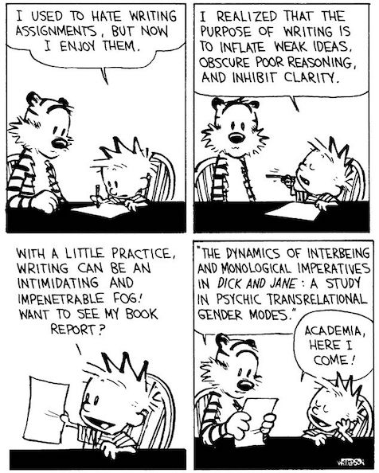

# Academic Methodologies

Prof. Dr. Lena Gieseke \| l.gieseke@filmuniversitaet.de \| Film University Babelsberg KONRAD WOLF

---

# Syllabus

* [Academic Methodologies](#academic-methodologies)
* [Syllabus](#syllabus)
    * [Learning Objectives](#learning-objectives)
    * [Time and Place](#time-and-place)
    * [Method of Instruction](#method-of-instruction)
    * [Topics](#topics)
    * [Materials](#materials)
        * [Structure](#structure)
    * [Evaluation](#evaluation)
    * [Grading](#grading)
        * [Criteria](#criteria)

<!--
ASK: Method vs. Methodology
Method
* Various procedures, schemes, algorithms, etc.
* Planned, scientific and value-neutral

Methodology
* A science of studying how research is to be carried out
* Study of methods by which knowledge is gained.
* Its aim is to give the work plan of research.
    * Systematic way to solve a problem
-->

This course enables the participants to understand and to conduct academic research. Academic methodologies are taught by the example of computer science research. Topics include basic principles of scientific research in general, how to conduct certain research tasks in particular and the processes of writing about and publishing work.

As exercise a full conference will be simulated in all its parts, from submitting a paper over reviewing other work to giving a presentation.

## Learning Objectives

* An academic and systematic approach to solve complex problems.
* The presentation of concepts, procedures and results in writing.
* Practical experience in conducting research and publishing a paper.

## Time and Place

* Thursdays, 13.30-15.30, room 6119
    * 9 sessions in total
* 2 SWS, 3 ECTS
    * 1.5 SWS, 1.5 ECTS lectures
    * 0.5 SWS, 1.5 ECTS conference
* The time and place of the conference simulation will be announced shortly.

## Method of Instruction

The class is conducted as lectures. Attendance is not mandatory. Lecture use in parts flipped classroom techniques. This means, you read a script before I present that topic in class. In class, I will then ask questions regarding the script and go over certain topics one more time together.
  
The paper, the reviews and exercises are homework.  
  
## Topics

| Chapter | Title                 | Topics                 |
|---------|-----------------------|------------------------|
| **1**   | Conference Simulation |                        |
| **2**   | Research              | Goals                  |
|         |                       | Terminology            |
|         |                       | Types and Disciplines  |
|         |                       | Problem Solving        |
|         |                       | Methodology vs. Method |
| **3**   | Reasoning             | Inductive              |
|         |                       | Deductive              |
|         |                       | The Scientific Method  |
|         |                       | Qualitative            |
|         |                       | Quantitative           |
| **4**   | HCI                   |                        |
| **5**   | Experiments           |                        |
| **6**   | Statistics            | Descriptive            |
|         |                       | Inferential            |
| **7**   | Qualitative Research  | Surveys                |
|         |                       | Case Studies           |
|         |                       | Interviews             |
|         |                       | Evaluation             |
| **8**   | Literature            |                        |
| **9**   | Academic Writing      | Anatomy of a Paper     |
|         |                       | Language               |
|         |                       | Style                  |
|         |                       | Citations              |
|         |                       | LaTeX                  |
| **10**  | Academic Publishing   | Journals               |
|         |                       | Review                 |
|         |                       | Bibliometrics          |
|         | Academic Careers      | Phd                    |

Please note that the chapters and their order are subject to change!

## Materials

* On Thursday all session materials are published for the following week.
* Usually, we will discuss the results of the assignments the following week.
* You hand in all materials through GitHub.

### Structure

Materials are structured as follows:

* In [`Sessions`](01_sessions) you find a [folder](01_sessions/01_research/) with an index for each week (session = week).
    * The [README.md](01_sessions/01_research/README.md) in each session folder gives you an overview of all the readings, assignments, practical exercises, etc. that you have to do for that week - it is your todo list! I recommend to start your work with going through that file.
* In [`Scripts`](02_scripts) you find all scripts.
* In [`Slides`](03_slides) you find all slides.
* In `assignments` you submit your work each week to the folder with your last name and a folder with the session index. You will submit all assignments to the same folder (the one with your last name).

## Evaluation

The requirements to pass the course are

* \>= 50% completed homework assignments,
* a written paper,
* reviews of the assigned papers,
* a conference presentation, and
* participation at the conference discussions.

You can hand in homework results up until July 31st to make them count (this is a hard deadline).   
However, if you hand in an exercise after the deadline that is given in a session, **15% of the total points will reduced** (e.g. for 10 points 1.5 points are reduced).

## Grading

There will be a grade. The grade is computed as follows:

* 10% for participation in class and homework assignments
* 65% for the paper
* 15% for the presentation
* 10% for the reviews

### Criteria

The grading criteria for class participation are quality and quantity.
  
The grading criteria for the paper are based on

* the research idea,
* coherence to an academic format, and
* the form of presentation.

The grading criteria for the review are based on

* suitability and quality of the comments, and
* a reasonable quantity.

The grading criteria for the presentation are based on

* the communication of the research idea,
* a coherence to an academic format, and
* the form of presentation.

